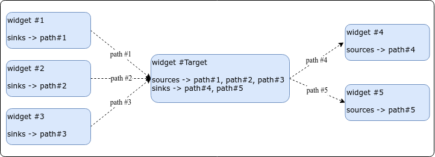
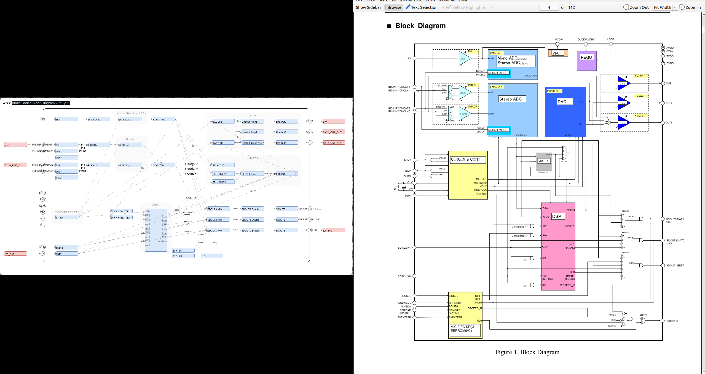

 ALSA
=====

> ALSA 모듈에 대한 문서


# 1. DAPM 

## 1.1 DAPM 이란?

 - Linux Device Audio subsystem을 이용할 때 최소한의 power로 사용하기 위해 설계된 메커니즘.
 - Linux Kernel 의 PM(Power Management)과는 관련 없음.
 - User space application에서 DAPM을 제어할 수 없으나, User space application의 동작(control command, play, capture)으로 자기가 판단하여 Audio subsystem 의 power를 On/Off 한다.
 - DAPM은 Machine에 연결되는 Audio Codec(device) 내부의 power block과 Machine level의 power을 다룰 수 있다.
 - Power 를 On/Off 하는 결정은 widget과 route(path)의 연결 상태에 보고 판단.
 - DAPM이 자동적으로 동작하기 위해서는 Audio Codec에 대한 이해가 깊은 엔지니어가(Codec company's engineer) ALSA에서 제공하는 DAPM macro를 이용하여 widget 및 control을 등록하고 path에 대한 설정을 모두 정적으로 코딩해야 한다.

## 1.2 DAPM Power domain

 - Guide 문서에 따르면 4개의 power domain이 있다. (=widget의 종류)
   * *Codec domain*  
	   VREF, VMID 와 같은 Audio Codec Power.  
	   kernel codec device driver 중, probe/remove/suspend/resume 시 제어된다.  
   * *Platform / Machine domain*  
	   Target에 물리적으로 연결된 input, output 단자.  
	   User 가 HP를 삽입하면 인지하여 자동으로 Audio codec 내부의 power 를 on/off 한다.  
   * *Path domain*  
	   Audio Codec 내부의 signal path들이다.  
	   User space application에서 mixer나 mux를 setting하게 되면 DAPM이 구동되어 Audio codec 내부의 power를 on/off한다.  
   * *Stream domain*  
	   Audio Codec 내부의 DAC, ADC 이다.  
	   Play 나 Record 시, enable, disable 된다.  

## 1.3 DAPM 간단 정리

 - Audio Codec 내에서 Power 를 소모하는 Block 들을 Play, Record 시 모든 Block 에 Power를 On 하지 않고, 동작을 수행하기 위해 필요한 Block만 On시키고 그 외 나머지 Block 은 Off하는 것을 자동적으로 관리하는 방법을 말한다.


	

 - 특정 Audio Codec Block diabram이다.
 - OUT #1에 연결된 Speaker 를 통해 소리가 출력되고 있다고 가정 시, DAPM을 통해서 꼭 필요한 Power Block(widget)만 Power ON한다.
 - 모든 Power Block(widget)이 모두 ON 될 필요가 없다.

<br />
<br />
<br />
<br />
<br />

-----

# 2. Kcontrol

## 2.1 Kcontrol 이란?

 - audio codec의 기능(register)을 user space application에서 제어할 수 있도록 ALSA kernel driver 에서 제공하는 인터페이스 중 핵심이 되는 중요 요소.

> user space application은 audio codec을 문자열을 통하여 제어한다. 

 ex>
```bash
Mixer name: 'rockchip,ak7755'
Number of controls: 76
ctl     type    num     name                                     value

0       INT     1       MIC Input Volume L                       0
1       INT     1       MIC Input Volume R                       0
2       INT     1       Line Out Volume 1                        15
3       INT     1       Line Out Volume 2                        15
4       INT     1       Line Out Volume 3                        15
5       ENUM    1       Line Input Volume                        0dB
6       INT     1       ADC Digital Volume L                     207
7       INT     1       ADC Digital Volume R                     207
8       INT     1       ADC2 Digital Volume L                    207
9       INT     1       ADC2 Digital Volume R                    207
10      INT     1       DAC Digital Volume L                     231
11      INT     1       DAC Digital Volume R                     231
12      BOOL    1       ADC Mute                                 Off
13      BOOL    1       ADC2 Mute                                Off
14      BOOL    1       DAC Mute                                 On
15      BOOL    1       Analog DRC Lch                           Off
16      BOOL    1       Analog DRC Rch                           Off
17      BOOL    1       MICGAIN Lch Zero-cross                   Off
18      BOOL    1       MICGAIN Rch Zero-cross                   Off
19      ENUM    1       DAC De-emphasis                          Off
20      BOOL    1       JX0 Enable                               Off
21      BOOL    1       JX1 Enable                               Off
22      BOOL    1       JX2 Enable                               Off
23      BOOL    1       JX3 Enable                               Off
24      ENUM    1       DLRAM Mode(Bank1:Bank0)                  0:8192
25      ENUM    1       DRAM Size(Bank1:Bank0)                   512:1536
26      ENUM    1       DRAM Addressing Mode(Bank1:Bank0)        Ring:Ring
27      ENUM    1       POMODE DLRAM Pointer 0                   DBUS Immediate
28      ENUM    1       CRAM Memory Assignment                   33 word
29      ENUM    1       FIRMODE1 Accelerator Ch1                 Adaptive Filter
30      ENUM    1       FIRMODE2 Accelerator Ch2                 Adaptive Filter
31      ENUM    1       SUBMODE1 Accelerator Ch1                 Fullband
32      ENUM    1       SUBMODE2 Accelerator Ch2                 Fullband
33      ENUM    1       Accelerator Memory(ch1:ch2)              2048:-
34      ENUM    1       CLKO pin                                 CLKO=L
35      ENUM    1       CLKO Output Clock                        XTI or BICK
36      ENUM    1       BICK fs                                  48fs
37      ENUM    1       DSP Firmware PRAM                        basic
38      ENUM    1       DSP Firmware CRAM                        basic
39      ENUM    1       DSP Firmware OFREG                       basic
40      ENUM    1       DSP Firmware ACRAM                       basic
41      ENUM    1       Set CRAM Address H                       00
42      ENUM    1       Set CRAM Address L                       00
43      ENUM    1       Set CRAM Data H                          00
44      ENUM    1       Set CRAM Data M                          00
45      ENUM    1       Set CRAM Data L                          00
46      INT     1       Read MIR                                 0
47      ENUM    1       CRAM EQ1 Level                           0dB
48      ENUM    1       CRAM EQ2 Level                           0dB
49      ENUM    1       CRAM EQ3 Level                           0dB
50      ENUM    1       CRAM EQ4 Level                           0dB
51      ENUM    1       CRAM EQ5 Level                           0dB
52      ENUM    1       CRAM HPF1 fc                             Off
53      ENUM    1       CRAM HPF2 fc                             Off
54      ENUM    1       CRAM Limiter Release Time                128ms
55      ENUM    1       CRAM Limiter Volume                      Off
56      ENUM    1       SELMIX2-0                                SDOUTAD
57      BOOL    1       LineOut Amp3 Mixer LOSW1                 Off
58      BOOL    1       LineOut Amp3 Mixer LOSW2                 Off
59      BOOL    1       LineOut Amp3 Mixer LOSW3                 Off
60      ENUM    1       LineOut Amp2                             Off
61      ENUM    1       LineOut Amp1                             Off
62      ENUM    1       RIN MUX                                  IN3
63      ENUM    1       LIN MUX                                  IN1
64      ENUM    1       DSPIN SDOUTAD2                           Off
65      ENUM    1       DSPIN SDOUTAD                            Off
66      BOOL    1       SDOUT3 Enable Switch                     Off
67      BOOL    1       SDOUT2 Enable Switch                     Off
68      BOOL    1       SDOUT1 Enable Switch                     Off
69      ENUM    1       SDOUT3 MUX                               DSP DOUT3
70      ENUM    1       SDOUT2 MUX                               DSP
71      ENUM    1       SDOUT1 MUX                               DSP
72      ENUM    1       DAC MUX                                  DSP
73      ENUM    1       SELMIX DSP                               Off
74      ENUM    1       SELMIX AD2                               Off
75      ENUM    1       SELMIX AD                                Off

rk3568_poc:/ # tinymix  35
CLKO Output Clock: 12.288MHz 6.144MHz 3.072MHz 8.192MHz 4.096MHz 2.048MHz 256fs >XTI or BICK
```
 - widget 이나 path 에 독립적인 kcontrol 도 있으며, widget과 path 와 깊이 연관된 kcontrol도 있다.

 - kcontrol 은 구조체 이름을 말하며 종류가 두가지 있다.
 > snd_kcontrol_new 구조체와 snd_kcontrol 구조체가 있다.
   * ***snd_kcontrol_new*** 구조체 : 선언 및 kcontrol 등록 함수에 매개 변수로 사용되는 구조체.
   * ***snd_kcontrol*** 구조체 : 운용되기 위해 사용되는 구조체.
   > snd_soc_add_controls 함수에서 snd_kcontrol_new 가 snd_kcontrol로 변환되어 등록 됨.


## 2.2 Kcontrol 구조체

 - snd_kcontrol_new 구조체와 snd_kcontrol 구조체. 

```c
struct snd_kcontrol_new {
	snd_ctl_elem_iface_t iface;	/* interface identifier */
	// kcontrol 의 interface 종류를 나타낸다. 명시적인 것이라 제어에 영향을 미치지 않는다
	unsigned int device;		/* device/client number */
	// 사용하지 않는다.(미확인)
	unsigned int subdevice;		/* subdevice (substream) number */
	// 사용하지 않는다.(미확인)
	const unsigned char *name;	/* ASCII name of item */
	// kcontrol 의 이름
	unsigned int index;		/* index of item */
	// 사용처 없음(확인 필요)
	unsigned int access;		/* access rights */
	// kcontrol 접근 권한에 대해 설정한다.(RW)
	unsigned int count;		/* count of same elements */
	// 사용처 없음 (확인 필요), 대부분 0 이기 때문에 1로 세팅 된다.
	snd_kcontrol_info_t *info;
	// User Space 에서 Kcontrol 에 대한 정보 요청시 수행 할 함수 포인터
	snd_kcontrol_get_t *get;
	// User Space 에서 Kcontrol 에 대한 현재 값 요청시 수행 할 함수 포인터
	snd_kcontrol_put_t *put;
	// User Space 에서 Kcontrol 에 대한 값 수정시 수행 할 함수 포인터
	union {
		snd_kcontrol_tlv_rw_t *c;
		// 사용처 없음 (확인 필요)
		const unsigned int *p;
		// 종류에 따라 soc_enum 구조체의 첫 주소나, dB 범위를 지정한 int 형 배열의 첫 주소가 들어 간다.
	} tlv;
	unsigned long private_value;
	// 대부분 soc_mixer_control 구조체의 첫 주소가 들어간다.
};

struct snd_kcontrol_volatile {
	struct snd_ctl_file *owner;	/* locked */
	unsigned int access;	/* access rights */
};

struct snd_kcontrol {
	struct list_head list;		/* list of controls */
	struct snd_ctl_elem_id id;
	unsigned int count;		/* count of same elements */
	snd_kcontrol_info_t *info;
	snd_kcontrol_get_t *get;
	snd_kcontrol_put_t *put;
	union {
		snd_kcontrol_tlv_rw_t *c;
		const unsigned int *p;
	} tlv;
	unsigned long private_value;
	void *private_data;
	void (*private_free)(struct snd_kcontrol *kcontrol);
	struct snd_kcontrol_volatile vd[0];	/* volatile data */
};
```

## 2.3 Kcontrol 선언

 - ALSA driver 에서는 kcontrol 을 쉽게 선언하기 위해서 MACRO를 제공한다.  
 - MACRO를 통하여 snd_kcontrol_new을 생성한다.

```c
#define AK7755_C1_CLOCK_SETTING2			0xC1

static const char *ak7755_bank_select_texts[] = 
		{"0:8192", "1024:7168","2048:6144","3072:5120","4096:4096",
			"5120:3072","6144:2048","7168:1024","8192:0"};
static const char *ak7755_drms_select_texts[] = 
		{"512:1536", "1024:1024", "1536:512"};
static const char *ak7755_dram_select_texts[] = 
		{"Ring:Ring", "Ring:Linear", "Linear:Ring", "Linear:Linear"};
static const char *ak7755_pomode_select_texts[] = {"DBUS Immediate", "OFREG"};
static const char *ak7755_wavp_select_texts[] = 
		{"33 word", "65 word", "129 word", "257 word"};
static const char *ak7755_filmode1_select_texts[] = {"Adaptive Filter", "FIR Filter"};
static const char *ak7755_filmode2_select_texts[] = {"Adaptive Filter", "FIR Filter"};
static const char *ak7755_submode1_select_texts[] = {"Fullband", "Subband"};
static const char *ak7755_submode2_select_texts[] = {"Fullband", "Subband"};
static const char *ak7755_memdiv_select_texts[] = 
		{"2048:-", "1792:256", "1536:512", "1024:1024"};
static const char *ak7755_dem_select_texts[] = {"Off", "48kHz", "44.1kHz", "32kHz"};
static const char *ak7755_clkoe_select_texts[] = {"CLKO=L", "CLKO Out Enable"};
static const char *ak7755_clks_select_texts[] = 			// CLKO Output Clock
		{"12.288MHz", "6.144MHz", "3.072MHz", "8.192MHz",
			"4.096MHz", "2.048MHz", "256fs", "XTI or BICK"};

static const struct soc_enum ak7755_set_enum[] = {
	SOC_ENUM_SINGLE(AK7755_C3_DELAY_RAM_DSP_IO, 0,
			ARRAY_SIZE(ak7755_bank_select_texts), ak7755_bank_select_texts),
	SOC_ENUM_SINGLE(AK7755_C4_DATARAM_CRAM_SETTING, 6,
			ARRAY_SIZE(ak7755_drms_select_texts), ak7755_drms_select_texts),
	SOC_ENUM_SINGLE(AK7755_C4_DATARAM_CRAM_SETTING, 4,
			ARRAY_SIZE(ak7755_dram_select_texts), ak7755_dram_select_texts),
	SOC_ENUM_SINGLE(AK7755_C4_DATARAM_CRAM_SETTING, 3,
			ARRAY_SIZE(ak7755_pomode_select_texts), ak7755_pomode_select_texts),
	SOC_ENUM_SINGLE(AK7755_C4_DATARAM_CRAM_SETTING, 0,
			ARRAY_SIZE(ak7755_wavp_select_texts), ak7755_wavp_select_texts),
	SOC_ENUM_SINGLE(AK7755_C5_ACCELARETOR_SETTING, 5,
			ARRAY_SIZE(ak7755_filmode1_select_texts), ak7755_filmode1_select_texts),
	SOC_ENUM_SINGLE(AK7755_C5_ACCELARETOR_SETTING, 4,
			ARRAY_SIZE(ak7755_filmode2_select_texts), ak7755_filmode2_select_texts),
	SOC_ENUM_SINGLE(AK7755_C5_ACCELARETOR_SETTING, 3,
			ARRAY_SIZE(ak7755_submode1_select_texts), ak7755_submode1_select_texts),
	SOC_ENUM_SINGLE(AK7755_C5_ACCELARETOR_SETTING, 2,
			ARRAY_SIZE(ak7755_submode2_select_texts), ak7755_submode2_select_texts),
	SOC_ENUM_SINGLE(AK7755_C5_ACCELARETOR_SETTING, 0,
			ARRAY_SIZE(ak7755_memdiv_select_texts), ak7755_memdiv_select_texts),
	SOC_ENUM_SINGLE(AK7755_C6_DAC_DEM_SETTING, 6,
			ARRAY_SIZE(ak7755_dem_select_texts), ak7755_dem_select_texts),
	SOC_ENUM_SINGLE(AK7755_CA_CLK_SDOUT_SETTING, 7,
			ARRAY_SIZE(ak7755_clkoe_select_texts), ak7755_clkoe_select_texts),
	SOC_ENUM_SINGLE(AK7755_C1_CLOCK_SETTING2, 1,			// CLKO Output Clock
			ARRAY_SIZE(ak7755_clks_select_texts), ak7755_clks_select_texts),
};

#define SOC_ENUM(xname, xenum) \
{	.iface = SNDRV_CTL_ELEM_IFACE_MIXER, .name = xname,\
	.info = snd_soc_info_enum_double, \
	.get = snd_soc_get_enum_double, .put = snd_soc_put_enum_double, \
	.private_value = (unsigned long)&(struct soc_mixer_control)
									{
										.reg = reg_left, 
										.rreg = reg_right, 
										.shift = xshift,
										.max = xmax,
										.platform_max = xmax,
										.invert = xinvert
									}

static const struct snd_kcontrol_new ak7755_snd_controls[] = {
	(...)
	SOC_ENUM("CLKO Output Clock", ak7755_set_enum[12]), 
	(...)
}	

```

 - MACRO를 모두 해석하면 아래와 같은 snd_kcontrol_new 구조체가 나온다.

```c
static const struct snd_kcontrol_new ak7755_snd_controls[] = {
	.iface = SNDRV_CTL_ELEM_IFACE_MIXER,
	.device = 0,
	.subdevice = 0,
	.name = "CLKO Output Clock",
	.index = 0,
	.access = SNDRV_CTL_ELEM_ACCESS_TLV_READ | SNDRV_CTL_ELEM_ACCESS_READWRITE,
	.count = 0,
	.info = snd_soc_info_enum_double,
	.get = snd_soc_get_enum_double, 
	.put = snd_soc_put_enum_double, 
	.tlv.p , 
	.private_value = (unsigned long)&(struct soc_mixer_control)
						{
							.reg = AK7755_C1_CLOCK_SETTING2, 
							.items = 8, 
							.texts =  {"12.288MHz", "6.144MHz", "3.072MHz", "8.192MHz",
							"4.096MHz", "2.048MHz", "256fs", "XTI or BICK"};
						}
};
```


 - User Space 에서 "CLKO Output Clock" 대한 값을 요청 했을 경우, 수행되는 함수.  
 "CLKO Output Clock" snd_kcontrol_new  선언 시, 멤버 변수 get 포인트 함수를 수행하여 읽어온다.  
   * get 에는 snd_soc_get_enum_double 이 연결되어 있다.   
   * put 에는 snd_soc_put_enum_double 이 연결되어 있다.  

```c
int snd_soc_get_enum_double(struct snd_kcontrol *kcontrol,
	struct snd_ctl_elem_value *ucontrol)
{
	struct snd_soc_component *component = snd_kcontrol_chip(kcontrol);
	struct soc_enum *e = (struct soc_enum *)kcontrol->private_value;
	unsigned int val, item;
	unsigned int reg_val;
	int ret;

	ret = snd_soc_component_read(component, e->reg, &reg_val);
	if (ret)
		return ret;
	val = (reg_val >> e->shift_l) & e->mask;
	item = snd_soc_enum_val_to_item(e, val);
	ucontrol->value.enumerated.item[0] = item;
	if (e->shift_l != e->shift_r) {
		val = (reg_val >> e->shift_r) & e->mask;
		item = snd_soc_enum_val_to_item(e, val);
		ucontrol->value.enumerated.item[1] = item;
	}

	return 0;
}
```


 - Linux kernel source의 audio codec device drier 의 source code안에 MACRO를 통하여 많은 snd_kcontrol_new가 선언되어 있다.

```c
static const struct snd_kcontrol_new ak7755_snd_controls[] = {
	SOC_SINGLE_TLV("MIC Input Volume L",
			AK7755_D2_MIC_GAIN_SETTING, 0, 0x0F, 0, mgnl_tlv),
	SOC_SINGLE_TLV("MIC Input Volume R",
			AK7755_D2_MIC_GAIN_SETTING, 4, 0x0F, 0, mgnr_tlv),
	SOC_SINGLE_TLV("Line Out Volume 1",
			AK7755_D4_LO1_LO2_VOLUME_SETTING, 0, 0x0F, 0, lovol1_tlv),
	SOC_SINGLE_TLV("Line Out Volume 2",
			AK7755_D4_LO1_LO2_VOLUME_SETTING, 4, 0x0F, 0, lovol2_tlv),
	SOC_SINGLE_TLV("Line Out Volume 3",
			AK7755_D3_LIN_LO3_VOLUME_SETTING, 0, 0x0F, 0, lovol3_tlv),
	SOC_ENUM_EXT("Line Input Volume", ak7755_linein_enum, get_linein, set_linein),  // 16/03/25 ak7755_linein_enum[0] => ak7755_linein_enum
	SOC_SINGLE_TLV("ADC Digital Volume L",
			AK7755_D5_ADC_DVOLUME_SETTING1, 0, 0xFF, 1, voladl_tlv),
	SOC_SINGLE_TLV("ADC Digital Volume R",
			AK7755_D6_ADC_DVOLUME_SETTING2, 0, 0xFF, 1, voladr_tlv),
	SOC_SINGLE_TLV("ADC2 Digital Volume L",
			AK7755_D7_ADC2_DVOLUME_SETTING1, 0, 0xFF, 1, volad2l_tlv),
	SOC_SINGLE_TLV("ADC2 Digital Volume R",
			AK7755_DD_ADC2_DVOLUME_SETTING2, 0, 0xFF, 1, volad2r_tlv),
	SOC_SINGLE_TLV("DAC Digital Volume L",
			AK7755_D8_DAC_DVOLUME_SETTING1, 0, 0xFF, 1, voldal_tlv),
	SOC_SINGLE_TLV("DAC Digital Volume R",
			AK7755_D9_DAC_DVOLUME_SETTING2, 0, 0xFF, 1, voldar_tlv),

	SOC_SINGLE("ADC Mute", AK7755_DA_MUTE_ADRC_ZEROCROSS_SET, 7, 1, 0),
	SOC_SINGLE("ADC2 Mute", AK7755_DA_MUTE_ADRC_ZEROCROSS_SET, 6, 1, 0), 
	SOC_SINGLE("DAC Mute", AK7755_DA_MUTE_ADRC_ZEROCROSS_SET, 5, 1, 0), 
	SOC_SINGLE("Analog DRC Lch", AK7755_DA_MUTE_ADRC_ZEROCROSS_SET, 2, 1, 0), 
	SOC_SINGLE("Analog DRC Rch", AK7755_DA_MUTE_ADRC_ZEROCROSS_SET, 3, 1, 0), 
	SOC_SINGLE("MICGAIN Lch Zero-cross", AK7755_DA_MUTE_ADRC_ZEROCROSS_SET, 0, 1, 0), 
	SOC_SINGLE("MICGAIN Rch Zero-cross", AK7755_DA_MUTE_ADRC_ZEROCROSS_SET, 1, 1, 0), 

	SOC_ENUM("DAC De-emphasis", ak7755_set_enum[10]), 

	SOC_SINGLE("JX0 Enable", AK7755_C2_SERIAL_DATA_FORMAT, 0, 1, 0),
	SOC_SINGLE("JX1 Enable", AK7755_C2_SERIAL_DATA_FORMAT, 1, 1, 0),
	SOC_SINGLE("JX2 Enable", AK7755_C1_CLOCK_SETTING2, 7, 1, 0),
	SOC_SINGLE("JX3 Enable", AK7755_C5_ACCELARETOR_SETTING, 6, 1, 0),

	SOC_ENUM("DLRAM Mode(Bank1:Bank0)", ak7755_set_enum[0]), 
	SOC_ENUM("DRAM Size(Bank1:Bank0)", ak7755_set_enum[1]), 
	SOC_ENUM("DRAM Addressing Mode(Bank1:Bank0)", ak7755_set_enum[2]), 
	SOC_ENUM("POMODE DLRAM Pointer 0", ak7755_set_enum[3]), 
	SOC_ENUM("CRAM Memory Assignment", ak7755_set_enum[4]), 
	SOC_ENUM("FIRMODE1 Accelerator Ch1", ak7755_set_enum[5]), 
	SOC_ENUM("FIRMODE2 Accelerator Ch2", ak7755_set_enum[6]), 
	SOC_ENUM("SUBMODE1 Accelerator Ch1", ak7755_set_enum[7]), 
	SOC_ENUM("SUBMODE2 Accelerator Ch2", ak7755_set_enum[8]), 
	SOC_ENUM("Accelerator Memory(ch1:ch2)", ak7755_set_enum[9]), 
	SOC_ENUM("CLKO pin", ak7755_set_enum[11]), 
	SOC_ENUM("CLKO Output Clock", ak7755_set_enum[12]), 
```

## 2.4 Kcontrol 등록 

 - 대부분 같은 audio codec device driver 안에서 MACRO를 통해 선언된 snd_kcontrol_new가 snd_soc_add_controls 함수를 통하여 snd_kcontrol 구조체로 변환되어 snd_card의 controls에 연결된다.
   * snd_soc_cnew 함수를 통해 snd_kcontrol_new 구조체가 snd_kcontrol 구조체로 변환.
   * snd_ctl_add 함수는 snd_card의 controls에 snd_kcontrol을 Numbering하며 링크드 리스트로 연결하고, kcontrol 총 개수를 관리.

```c

static int snd_soc_add_controls(struct snd_card *card, struct device *dev,
	const struct snd_kcontrol_new *controls, int num_controls,
	const char *prefix, void *data)
{
	int err, i;

	for (i = 0; i < num_controls; i++) {
		const struct snd_kcontrol_new *control = &controls[i];
		err = snd_ctl_add(card, snd_soc_cnew(control, data,
						     control->name, prefix));
		if (err < 0) {
			dev_err(dev, "ASoC: Failed to add %s: %d\n",
				control->name, err);
			return err;
		}
	}

	return 0;
}
```

 - kcontrol이 등록되면 snd_card 구조체의 controls에 다음과 같이 연결된다.


## 2.5 Kcontrol 운용

 - user space application에서는 ALSA Library를 이용하여 Kcontrol들을 access 접근 제한(대부분R/W)에 따라 제어할수 있다.
 - ALSA Library를 이용한 amixer(not alsamixer!)라는 program으로 console command 형식으로 사용 가능하다. 
 > amixer는 ALSA project(http://www.alsa-project.org)에서 alsa-utils packages를 통해 제공
 - Android platform의 경우는 tinyalsa 패키지를 통해 ALSA Library를 이용한다.
    * 아래와 같이 tinymix 명령을 내려 현재 sound card의 모든 kcontrol을 확인 할 수 있다.

```bash
# tinymix
```

## 2.6 Kcontrol 정리
 - tinymix는 test 용으로 사용하는 것이며, User space application(HAL) 작성 시에는 ALSA Library를 이용한다. 
 - amixer를 보면 scontrol(mixer controls) 및 scontents(mixer controls with contents)도 있다. 
   * 이 scontrol은 비슷한 kcontrol을 묶어서 ALSA Library에서 제공하는 것이다.   
   (ex> DAC1 Switch 와 DAC1 Volume 를 묶어서 DAC1 으로 제공)


<br />
<br />
<br />
<br />
<br />

-----

# 3. Widget

## 3.1 Widget 이란?

 - Audio Codec 내부의 DAC, ADC, Mixer, Mux 등을 각각 하나의 가상 장치로 표현 한 것이며 종류는 다음과 같다.


	| No 	| Widget    	| Mean                                                        	|
	|----	|-----------	|-------------------------------------------------------------	|
	| 1  	| Mixer     	| - Mixes several analog signals into a single analog signal. 	|
	| 2  	| Mux       	| - An analog switch that outputs only one of many inputs.    	|
	| 3  	| PGA       	| - A programmable gain amplifier or attenuation widget.      	|
	| 4  	| ADC       	| - Analog to Digital Converter                               	|
	| 5  	| DAC       	| - Digital to Analog Converter                               	|
	| 6  	| Switch    	| - An analog switch                                          	|
	| 7  	| Input     	| - A codec input pin                                         	|
	| 8  	| Output    	| - A codec output pin                                        	|
	| 9  	| Headphone 	| - Headphone (and optional Jack)                             	|
	| 10 	| Mic       	| - Mic (and optional Jack)                                   	|
	| 11 	| Line      	| - Line Input/Output (and optional Jack)                     	|
	| 12 	| Speaker   	| - Speaker                                                   	|
	| 13 	| Supply    	| - Power or clock supply widget used by other widgets.       	|
	| 14 	| Pre       	| - Special PRE widget (exec before all others)               	|
	| 15 	| Post      	| - Special POST widget (exec after all others)               	|


 - 프로그래머가 직접 작성하여 등록하는 것이며, codec driver와 machine driver에서 등록된다.
 - widget은 이름을 필수로 가져야 한다. 몇몇 widget은 register, kcontrol을 가진다.
 - user space application은 전혀 신경을 쓰지 않아도 되는 부분이다.
  
 - 실제 audio codec의 block diagram을 가상의 장치로 표현한 것이라 볼 수 있다.
	


## 3.2 Widget 구조체

 - struct snd_soc_dapm_widget 구조체

```c
/* dapm widget */
struct snd_soc_dapm_widget {
	enum snd_soc_dapm_type id;
	const char *name;		/* widget name */
	const char *sname;	/* stream name */
	struct list_head list;
	struct snd_soc_dapm_context *dapm;

	void *priv;				/* widget specific data */
	struct regulator *regulator;		/* attached regulator */
	struct pinctrl *pinctrl;		/* attached pinctrl */
	const struct snd_soc_pcm_stream *params; /* params for dai links */
	unsigned int num_params; /* number of params for dai links */
	unsigned int params_select; /* currently selected param for dai link */

	/* dapm control */
	int reg;				/* negative reg = no direct dapm */
	unsigned char shift;			/* bits to shift */
	unsigned int mask;			/* non-shifted mask */
	unsigned int on_val;			/* on state value */
	unsigned int off_val;			/* off state value */
	unsigned char power:1;			/* block power status */
	unsigned char active:1;			/* active stream on DAC, ADC's */
	unsigned char connected:1;		/* connected codec pin */
	unsigned char new:1;			/* cnew complete */
	unsigned char force:1;			/* force state */
	unsigned char ignore_suspend:1;         /* kept enabled over suspend */
	unsigned char new_power:1;		/* power from this run */
	unsigned char power_checked:1;		/* power checked this run */
	unsigned char is_supply:1;		/* Widget is a supply type widget */
	unsigned char is_ep:2;			/* Widget is a endpoint type widget */
	int subseq;				/* sort within widget type */

	int (*power_check)(struct snd_soc_dapm_widget *w);

	/* external events */
	unsigned short event_flags;		/* flags to specify event types */
	int (*event)(struct snd_soc_dapm_widget*, struct snd_kcontrol *, int);

	/* kcontrols that relate to this widget */
	int num_kcontrols;
	const struct snd_kcontrol_new *kcontrol_news;
	struct snd_kcontrol **kcontrols;
	struct snd_soc_dobj dobj;

	/* widget input and output edges */
	struct list_head edges[2];

	/* used during DAPM updates */
	struct list_head work_list;
	struct list_head power_list;
	struct list_head dirty;
	int endpoints[2];

	struct clk *clk;
};

/* dapm widget types */
enum snd_soc_dapm_type {
	snd_soc_dapm_input = 0,		/* input pin */
	snd_soc_dapm_output,		/* output pin */
	snd_soc_dapm_mux,			/* selects 1 analog signal from many inputs */
	snd_soc_dapm_demux,			/* connects the input to one of multiple outputs */
	snd_soc_dapm_mixer,			/* mixes several analog signals together */
	snd_soc_dapm_mixer_named_ctl,		/* mixer with named controls */
	snd_soc_dapm_pga,			/* programmable gain/attenuation (volume) */
	snd_soc_dapm_out_drv,			/* output driver */
	snd_soc_dapm_adc,			/* analog to digital converter */
	snd_soc_dapm_dac,			/* digital to analog converter */
	snd_soc_dapm_micbias,		/* microphone bias (power) - DEPRECATED: use snd_soc_dapm_supply */
	snd_soc_dapm_mic,			/* microphone */
	snd_soc_dapm_hp,			/* headphones */
	snd_soc_dapm_spk,			/* speaker */
	snd_soc_dapm_line,			/* line input/output */
	snd_soc_dapm_switch,		/* analog switch */
	snd_soc_dapm_vmid,			/* codec bias/vmid - to minimise pops */
	snd_soc_dapm_pre,			/* machine specific pre widget - exec first */
	snd_soc_dapm_post,			/* machine specific post widget - exec last */
	snd_soc_dapm_supply,		/* power/clock supply */
	snd_soc_dapm_pinctrl,		/* pinctrl */
	snd_soc_dapm_regulator_supply,	/* external regulator */
	snd_soc_dapm_clock_supply,	/* external clock */
	snd_soc_dapm_aif_in,		/* audio interface input */
	snd_soc_dapm_aif_out,		/* audio interface output */
	snd_soc_dapm_siggen,		/* signal generator */
	snd_soc_dapm_sink,
	snd_soc_dapm_dai_in,		/* link to DAI structure */
	snd_soc_dapm_dai_out,
	snd_soc_dapm_dai_link,		/* link between two DAI structures */
	snd_soc_dapm_kcontrol,		/* Auto-disabled kcontrol */
	snd_soc_dapm_buffer,		/* DSP/CODEC internal buffer */
	snd_soc_dapm_scheduler,		/* DSP/CODEC internal scheduler */
	snd_soc_dapm_effect,		/* DSP/CODEC effect component */
	snd_soc_dapm_src,		/* DSP/CODEC SRC component */
	snd_soc_dapm_asrc,		/* DSP/CODEC ASRC component */
	snd_soc_dapm_encoder,		/* FW/SW audio encoder component */
	snd_soc_dapm_decoder,		/* FW/SW audio decoder component */
};
```

 - snd_soc_dapm_widget의 중요 멤버 변수 설명

```c
struct snd_soc_dapm_widget {
	enum snd_soc_dapm_type id;		// 현재 widget 의 type 을 나타 낸다.
	char *name;				// widget name
	char *sname;				// play 나 capture 시 비교 된다. 이름이 같을 경우 power check한다.
	struct snd_soc_codec *codec;		// widget 이 소속된 codec 을 가르킨다.
	struct list_head list;			// snd_soc_card 의 widgets 에 연결 되는 point

	short reg;				// widget 도 Audio Codec 의 Reg 정보를 가진다. 대부분 Power 관련 된 Register 이다.
	unsigned char shift;			// Register 의 몇 번째 bit 에 해당하는지 나타낸다.
	unsigned char power:1;			// widget 의 power status이다. 1이면 ON 0이면 OFF,
	unsigned char active:1;			// DAC, ADC, AIFIN, AIFOUT widget 만 해당 되며 Power Check 시 중요한 flag 이다.
						// Play나 Capture 시 sname, stream_name 비교 후 set 된다.
	unsigned char connected:1; 		// widget 생성 될 때 무조건 1로 set 된다. snd_soc_dapm_enable_pin, snd_soc_dapm_disable_pin 함수를
						// 통하여 set, clear 된다. 대부분 외부 단자 widget ( input , output ,mic ,line , hp, spk ) 에 enable,
						// disable 시켜서 DAPM power 를 제어 하도록 한다.
	unsigned char ext:1;			// Audio codec 외부에 붙는 widget 에 연결 되었는지 설정 한다.
						// output widget 에 hp,spk widget 이 연결 되면 ouput widget 의 ext 가 1로 set
						// input widget 에 mic widget 이 연결 되었다면 input widget 의 ext 는 1로 set
	unsigned char force:1;			// widget 의 power 를 강제로 ON 하는 flag.

	int (*power_check)(struct snd_soc_dapm_widget *w); // widget 의 power check 함수 포인터
	
	int num_kcontrols;			// widget 에 연결 된 kcontrol 개수
	const struct snd_kcontrol_new *kcontrol_news; // widget 에 연결 할 정적으로 작성된 kcontrol 주소를 가르킨다.
	struct snd_kcontrol **kcontrols;// widget 에 연결 된 kcontrol 가르키는 포인터
	struct list_head sources; 		// widget 에 연결된 path 중 widget 을 sink(목적지)로 하고 있는 path list
	struct list_head sinks;			// widget 에 연결된 path 중 widget 에서 sources(출발지)로 하고 있는 path list
}

```

 - snd_soc_dapm_widget 의 중요 멤버 변수 중 *sources*와 *sinks* 개념. 
   * 향후 route(path)에 대해서 나오는데 widget을 중심으로 연결된 path들의 링크드 리스트이다.
   * widget을 중심으로 widget을 목적지로 하고 있는 path들은 sources에 연결되고 
   * widget을 중심으로 widget에서 출발하는 path들은 sinks에 연결된다. 

	
	 

## 3.3 Widget 선언

 - widget 역시 kcontrol과 마찬가지로 MACRO를 통해 선언한다.
 - 많은 widget들이 MACRO를 통해서 선언된다.

```c
#define AK7755_CE_POWER_MANAGEMENT			0xCE

#define SND_SOC_DAPM_MIXER(wname, wreg, wshift, winvert, \
	 wcontrols, wncontrols)\
 {	.id = snd_soc_dapm_mixer, .name = wname, \
	 SND_SOC_DAPM_INIT_REG_VAL(wreg, wshift, winvert), \
	 .kcontrol_news = wcontrols, .num_kcontrols = wncontrols}

static const struct snd_kcontrol_new ak7755_lo3sw_mixer_controls[] = {
	SOC_DAPM_SINGLE("LOSW1", AK7755_C9_ANALOG_IO_SETTING, 1, 1, 0), 
	SOC_DAPM_SINGLE("LOSW2", AK7755_C9_ANALOG_IO_SETTING, 2, 1, 0), 
};

/* ak7755 dapm widgets */
static const struct snd_soc_dapm_widget ak7755_dapm_widgets[] = {

// ADC, DAC
	SND_SOC_DAPM_ADC_E("ADC Left", NULL, AK7755_CE_POWER_MANAGEMENT, 6, 0,
		ak7755_clkset_event, SND_SOC_DAPM_POST_PMU ),
	SND_SOC_DAPM_ADC_E("ADC Right", NULL, AK7755_CE_POWER_MANAGEMENT, 7, 0,
		ak7755_clkset_event, SND_SOC_DAPM_POST_PMU ),
	SND_SOC_DAPM_ADC_E("ADC2 Left", NULL, AK7755_CE_POWER_MANAGEMENT, 5, 0,
		ak7755_clkset_event, SND_SOC_DAPM_POST_PMU ),
	SND_SOC_DAPM_DAC_E("DAC Left", NULL, SND_SOC_NOPM, 0, 0,
		ak7755_clkset_event, SND_SOC_DAPM_POST_PMU ),
	SND_SOC_DAPM_DAC_E("DAC Right", NULL, SND_SOC_NOPM, 0, 0,
		ak7755_clkset_event, SND_SOC_DAPM_POST_PMU ),
	SND_SOC_DAPM_SUPPLY("CLOCK", AK7755_C1_CLOCK_SETTING2, 0, 0,
		ak7755_clock_event, SND_SOC_DAPM_POST_PMU | SND_SOC_DAPM_PRE_PMD),

// Analog Output
	SND_SOC_DAPM_OUTPUT("Line Out1"),
	SND_SOC_DAPM_OUTPUT("Line Out2"),
	SND_SOC_DAPM_OUTPUT("Line Out3"),

	SND_SOC_DAPM_MIXER("LineOut Amp3 Mixer", AK7755_CE_POWER_MANAGEMENT, 4, 0, 
			&ak7755_lo3sw_mixer_controls[0], ARRAY_SIZE(ak7755_lo3sw_mixer_controls)),
	SND_SOC_DAPM_MUX("LineOut Amp2", AK7755_CE_POWER_MANAGEMENT, 3, 0, &ak7755_pmlo2_mux_control),
	SND_SOC_DAPM_MUX("LineOut Amp1", AK7755_CE_POWER_MANAGEMENT, 2, 0, &ak7755_pmlo1_mux_control),

// Analog Input
	SND_SOC_DAPM_INPUT("LIN"),
	SND_SOC_DAPM_INPUT("IN1"),
	SND_SOC_DAPM_INPUT("IN2"),
	SND_SOC_DAPM_INPUT("IN3"),
	SND_SOC_DAPM_INPUT("IN4"),
	SND_SOC_DAPM_INPUT("INPN1"),
	SND_SOC_DAPM_INPUT("INPN2"),

	SND_SOC_DAPM_PGA("LineIn Amp", AK7755_CF_RESET_POWER_SETTING, 5, 0, NULL, 0),
	SND_SOC_DAPM_MUX("RIN MUX", SND_SOC_NOPM, 0, 0,	&ak7755_rin_mux_control),
	SND_SOC_DAPM_MUX("LIN MUX", SND_SOC_NOPM, 0, 0,	&ak7755_lin_mux_control),

	SND_SOC_DAPM_MUX("DSPIN SDOUTAD2", SND_SOC_NOPM, 0, 0, &ak7755_dspinad2_control),
	SND_SOC_DAPM_MUX("DSPIN SDOUTAD", SND_SOC_NOPM, 0, 0, &ak7755_dspinad_control),

// Multiplexer (selects 1 analog signal from many inputs) & Mixer
	SND_SOC_DAPM_MUX("SDOUT3 MUX", SND_SOC_NOPM, 0, 0, &ak7755_seldo3_mux_control),
	SND_SOC_DAPM_MUX("SDOUT2 MUX", SND_SOC_NOPM, 0, 0, &ak7755_seldo2_mux_control),
	SND_SOC_DAPM_MUX("SDOUT1 MUX", SND_SOC_NOPM, 0, 0, &ak7755_seldo1_mux_control),
	SND_SOC_DAPM_MUX("DAC MUX", SND_SOC_NOPM, 0, 0, &ak7755_seldai_mux_control),

	SND_SOC_DAPM_MUX("SELMIX DSP", SND_SOC_NOPM, 0, 0, &ak7755_dsp_selmix_control),
	SND_SOC_DAPM_MUX("SELMIX AD2", SND_SOC_NOPM, 0, 0, &ak7755_sdoutad2_selmix_control),
	SND_SOC_DAPM_MUX("SELMIX AD", SND_SOC_NOPM, 0, 0, &ak7755_sdoutad_selmix_control),

	SND_SOC_DAPM_PGA("SELMIX Mixer", SND_SOC_NOPM, 0, 0, NULL, 0),
};
```

 - MACRO를 snd_soc_dapm_widget 구조체로 풀어서 보면 다음과 같다.

```c  
static const struct snd_soc_dapm_widget ak7755_dapm_widgets[] = {
	{
	.id = snd_soc_dapm_adc,
	.name = "ADC Left",
	.reg = AK7755_CE_POWER_MANAGEMENT,
	.shift = 6, 
	.invert = 0,
	.event = ak7755_clkset_event,
	.wflags = SND_SOC_DAPM_POST_PMU
	},
	{
	.id = snd_soc_dapm_adc,
	.name = "ADC Right",
	.reg = AK7755_CE_POWER_MANAGEMENT,
	.shift = 7, 
	.invert = 0,
	.event = ak7755_clkset_event,
	.wflags = SND_SOC_DAPM_POST_PMU

	},
	{
	.id = snd_soc_dapm_adc,
	.name = "ADC2 Left",
	.reg = AK7755_CE_POWER_MANAGEMENT,
	.shift = 5, 
	.invert = 0,
	.event = ak7755_clkset_event,
	.wflags = SND_SOC_DAPM_POST_PMU

	},
	{
	.id = snd_soc_dapm_mixer,
	.name = "LineOut Amp3 Mixer",
	.reg = AK7755_CE_POWER_MANAGEMENT,
	.shift = 4, 
	.invert = 0,
	.kcontrol_news = ak7755_lo3sw_mixer_controls,
	.num_kcontrols = ARRAY_SIZE(ak7755_lo3sw_mixer_controls)
	},

};
```    
    

	 

 

## 3.4 Widget 등록

 - DAPM MACRO를 이용하여 배열로 작성된 widget들은 snd_soc_dapm_new_controls 함수를 통하여 모두 등록된다.
 - snd_soc_dapm_new_controls 함수 안에서 snd_soc_dapm_new_control 호출하여 snd_soc_card 의 멤버변수 widgets에 모두 연결 된다.

<br />
<br />
<br />
<br />
<br />

-----

# 4. Route(path)

## 4.1 Route(path)란 ?

 - widget과 widget 사이를 연결하는 추상화된 Line이다.
 - 실제 Audio codec에서 block 과 block을 연결하는 Line과 일치하도록 작성되어 있다.

## 4.2 Route(path) 구조체
 - snd_soc_dapm_route 구조체는 연결 선언 시 사용되는 구조체이며, 
 - snd_soc_dapm_path 구조체는 widget과 widget을 연결하는 자료 구조이다. 

```c
/*
 * DAPM audio route definition.
 *
 * Defines an audio route originating at source via control and finishing
 * at sink.
 */
struct snd_soc_dapm_route {
	const char *sink;
	const char *control;
	const char *source;

	/* Note: currently only supported for links where source is a supply */
	int (*connected)(struct snd_soc_dapm_widget *source,
			 struct snd_soc_dapm_widget *sink);
};


/* dapm audio path between two widgets */
struct snd_soc_dapm_path {
	const char *name;				// path의 이름이다. 없을수도 있으며, 없는 path를 static path라 부른다.
									// 대부분 mixer widget을 목적지(sink)로 가지는 path에 long_name이 붙는다.
									// "sink widget name + contol name"

	/*
	 * source (input) and sink (output) widgets
	 * The union is for convience, since it is a lot nicer to type
	 * p->source, rather than p->node[SND_SOC_DAPM_DIR_IN]
	 */
	union {
		struct {
			struct snd_soc_dapm_widget *source;	// path의 source widget의 주소가 들어간다.
			struct snd_soc_dapm_widget *sink;	// path의 sink widget의 주소가 들어간다.
		};
		struct snd_soc_dapm_widget *node[2];
	};

	/* status */
	u32 connect:1;	/* source and sink widgets are connected */
	u32 walking:1;  /* path is in the process of being walked */	// path를 따라 power check중일 때 flag set.
	u32 weak:1;	/* path ignored for power management */
	u32 is_supply:1;	/* At least one of the connected widgets is a supply */

	int (*connected)(struct snd_soc_dapm_widget *source,
			 struct snd_soc_dapm_widget *sink);

	struct list_head list_node[2];	// source widget의 sink, sink widget의 sources에 연결될 list point 
	struct list_head list_kcontrol;	// kcontrol 에  연결될 list point
	struct list_head list;			// snd_soc_card의 path에 연결될 list point
};

```


## 4.3 Route(path) 선언

 - snd_soc_dapm_route 구조체는 route(path) 선언 시 사용되는 구조체로 목적지(sink) widget과 출발지(source) widget을 문자열로 적어준다.

```c
static const struct snd_soc_dapm_route ak7755_intercon[] = 
{

#ifdef DIGITAL_MIC
	{"DMIC1 Left", NULL, "CLOCK"},
	{"DMIC1 Right", NULL, "CLOCK"},
	{"DMIC2 Left", NULL, "CLOCK"},
	{"DMIC2 Right", NULL, "CLOCK"},

	{"DMICIN1", NULL, "DMIC1 CLK"},
	{"DMICIN2", NULL, "DMIC2 CLK"},
	{"DMIC1 Left", NULL, "DMICIN1"},
	{"DMIC1 Right", NULL, "DMICIN1"},
	{"DMIC2 Left", NULL, "DMICIN2"},
	{"DMIC2 Right", NULL, "DMICIN2"},
	{"SDOUTAD", NULL, "DMIC1 Left"},
	{"SDOUTAD", NULL, "DMIC1 Right"},
	{"SDOUTAD2", NULL, "DMIC2 Left"},
	{"SDOUTAD2", NULL, "DMIC2 Right"},
#else	
	{"ADC Left", NULL, "CLOCK"},
	{"ADC Right", NULL, "CLOCK"},
	{"ADC2 Left", NULL, "CLOCK"},

	{"LineIn Amp", NULL, "LIN"},
	{"ADC2 Left", NULL, "LineIn Amp"},
	{"SDOUTAD2", NULL, "ADC2 Left"},

	{"LIN MUX", "IN1", "IN1"},
	{"LIN MUX", "IN2", "IN2"},
	{"LIN MUX", "INPN1", "INPN1"},
	{"RIN MUX", "IN3", "IN3"},
	{"RIN MUX", "IN4", "IN4"},
	{"RIN MUX", "INPN2", "INPN2"},
	{"ADC Left", NULL, "LIN MUX"},
	{"ADC Right", NULL, "RIN MUX"},
	{"SDOUTAD", NULL, "ADC Left"},
	{"SDOUTAD", NULL, "ADC Right"},
#endif
	
	{"DAC Left", NULL, "CLOCK"},
	{"DAC Right", NULL, "CLOCK"},
	{"DSP", NULL, "CLOCK"},

	{"DSP", NULL, "SDIN1"},
	{"DSP", NULL, "SDIN2"},

	{"DSPIN SDOUTAD", "On", "SDOUTAD"},
	{"DSPIN SDOUTAD2", "On", "SDOUTAD2"},
	{"DSP", NULL, "DSPIN SDOUTAD"},
	{"DSP", NULL, "DSPIN SDOUTAD2"},

	{"SELMIX AD", "On", "SDOUTAD"},
	{"SELMIX AD2", "On", "SDOUTAD2"},
	{"SELMIX DSP", "On", "DSP"},
	{"SELMIX Mixer", NULL, "SELMIX AD"},
	{"SELMIX Mixer", NULL, "SELMIX AD2"},
	{"SELMIX Mixer", NULL, "SELMIX DSP"},
	{"DAC MUX", "MIXOUT", "SELMIX Mixer"},
	{"DAC MUX", "DSP", "DSP"},
	{"DAC MUX", "SDIN2", "SDIN2"},
	{"DAC MUX", "SDIN1", "SDIN1"},

	{"DAC Left", NULL, "DAC MUX"},
	{"DAC Right", NULL, "DAC MUX"},

	{"LineOut Amp1", "On", "DAC Left"},
	{"LineOut Amp2", "On", "DAC Right"},
	{"Line Out1", NULL, "LineOut Amp1"},
	{"Line Out2", NULL, "LineOut Amp2"},
	{"LineOut Amp3 Mixer", "LOSW1", "DAC Left"},
	{"LineOut Amp3 Mixer", "LOSW2", "DAC Right"},
#ifndef DIGITAL_MIC		//LOSW3 used only Analog MIC
	{"LineOut Amp3 Mixer", "LOSW3", "LineIn Amp"},
#endif
	{"Line Out3", NULL, "LineOut Amp3 Mixer"},

	{"SDOUT1 MUX", "DSP", "DSP"},
	{"SDOUT1 MUX", "DSP GP0", "DSP GP0"},
	{"SDOUT1 MUX", "SDIN1", "SDIN1"},
	{"SDOUT1 MUX", "SDOUTAD", "SDOUTAD"},
	{"SDOUT1 MUX", "EEST", "EEST"},
	{"SDOUT1 MUX", "SDOUTAD2", "SDOUTAD2"},

	{"SDOUT2 MUX", "DSP", "DSP"},
	{"SDOUT2 MUX", "DSP GP1", "DSP GP1"},
	{"SDOUT2 MUX", "SDIN2", "SDIN2"},
	{"SDOUT2 MUX", "SDOUTAD2", "SDOUTAD2"},

	{"SDOUT3 MUX", "DSP DOUT3", "DSP"},
	{"SDOUT3 MUX", "MIXOUT", "DAC MUX"},
	{"SDOUT3 MUX", "DSP DOUT4", "DSP"},
	{"SDOUT3 MUX", "SDOUTAD2", "SDOUTAD2"},

	{"SDOUT1 Enable", "Switch", "SDOUT1 MUX"},
	{"SDOUT2 Enable", "Switch", "SDOUT2 MUX"},
	{"SDOUT3 Enable", "Switch", "SDOUT3 MUX"},

	{"SDOUT1", NULL, "SDOUT1 Enable"},
	{"SDOUT2", NULL, "SDOUT2 Enable"},
	{"SDOUT3", NULL, "SDOUT3 Enable"},

};
```

 - 의미는 {"목적지(sink)", "컨트롤(sink's control)", "출발지(source"} 이다.
 - sink와 source 에 해당하는 문자열은 동일한 이름으로 된 widget이 존재해야 한다.
 - 컨트롤은 sink widget이 가지고 있는 kcontrol_new들에 같은 이름으로 된 kcontrol_new가 있어야 한다.

 - 위의 route(path)를 도식화 한 그림이다. path위의 이름은 kcontrol이름이다.

	

 - 실제 Audio codec block diagram의 일정 부분이 동일한 것으로 확인할 수있다.

	

 - 결과적으로 보면 widget과 route(path)는 Audio Codec Block Diagram을 자료구조로 표현 한 것이다. 
 - kcontrol은 자료구조 안에서 Audio codec을 제어하기 위한 존재한다.
 - PMADL, PMADR의 Power onoff는 LIN MUX, RIN MUX widget이 담당하고, IN1, IN2, INPN1 kcontrol들과, IN3, IN4, INPN2 kcontrol 들은 어떤 Input 을 mute/unmute할 것인지 담당한다.


## Route(path) 등록

 - snd_soc_dapm_route 구조체 배열을 snd_soc_dapm_add_routes 함수의 매개 변수로 넘겨 같은 이름으로 된 widget을 찾은 후 snd_soc_dapm_path 구조체를 생성 한 뒤 snd_soc_card의 paths에 링크드 리스트로 연결된다.

```c
/**
 * snd_soc_dapm_add_routes - Add routes between DAPM widgets
 * @dapm: DAPM context
 * @route: audio routes
 * @num: number of routes
 *
 * Connects 2 dapm widgets together via a named audio path. The sink is
 * the widget receiving the audio signal, whilst the source is the sender
 * of the audio signal.
 *
 * Returns 0 for success else error. On error all resources can be freed
 * with a call to snd_soc_card_free().
 */
int snd_soc_dapm_add_routes(struct snd_soc_dapm_context *dapm,
			    const struct snd_soc_dapm_route *route, int num)
{
	int i, r, ret = 0;

	mutex_lock_nested(&dapm->card->dapm_mutex, SND_SOC_DAPM_CLASS_RUNTIME);
	for (i = 0; i < num; i++) {
		r = snd_soc_dapm_add_route(dapm, route);
		if (r < 0) {
			dev_err(dapm->dev, "ASoC: Failed to add route %s -> %s -> %s\n",
				route->source,
				route->control ? route->control : "direct",
				route->sink);
			ret = r;
		}
		route++;
	}
	mutex_unlock(&dapm->card->dapm_mutex);

	return ret;
}
EXPORT_SYMBOL_GPL(snd_soc_dapm_add_routes);

```

<br />
<br />
<br />
<br />
<br />

-----

# 5. DAPM Operation

## 5.1 dapm_power_widgets 함수

 - dapm_power_widgets 함수 안에서 DAPM 운영이 모두 이루어 진다.
 - dapm_power_widgets 함수는 widget 을 모두 검색하여 widget power가 on/off 되어야 하는지 살펴보고 on/off할 필요가 있다면 on/off시키는 함수.
 - dapm_power_widgets 함수를 호출해야 하는 경우는 다음과 같다.
   * 모든 widget과 path가 연결되고 난 뒤, 
   * snd_soc_dapm_sync 함수 호출 시, 
   * jack insert시 (snd_soc_dapm_sync함수를 호출)
   * user space application에서 path switch 관련한 control을 on/off  했을 경우, (kcontrol's put function)
   * snd_soc_dapm_stream_event 함수가 호출 될 때(playback / capture start, stop)
 - 중요한 부분은 widget power가 on/off 되어야 하는지 판단하는 부분이 제일 중요하다.
   그 판단 하는 부분에 대해서 핵심적으로 짚고 넘어 간다.


## 5.2 widget's power check function

 - dapm_power_widgets 함수 안에서 모든 widget을 순회하면서 power_check 포인터 함수 값이 NULL인지 살피고 NULL이 아니라면 power_check 포인터 함수를 호출한다.
 - power_check 포인터 함수의 연결은 앞 챕터 route(path) 등록 부분에서 설명한 snd_soc_dapm_new_control_unlocked 함수 안에서 이루어 진다.
	
```c
	switch (w->id) {
	case snd_soc_dapm_mic:
		w->is_ep = SND_SOC_DAPM_EP_SOURCE;
		w->power_check = dapm_generic_check_power;
		break;
	case snd_soc_dapm_input:
		if (!dapm->card->fully_routed)
			w->is_ep = SND_SOC_DAPM_EP_SOURCE;
		w->power_check = dapm_generic_check_power;
		break;
	case snd_soc_dapm_spk:
	case snd_soc_dapm_hp:
		w->is_ep = SND_SOC_DAPM_EP_SINK;
		w->power_check = dapm_generic_check_power;
		break;
	case snd_soc_dapm_output:
		if (!dapm->card->fully_routed)
			w->is_ep = SND_SOC_DAPM_EP_SINK;
		w->power_check = dapm_generic_check_power;
		break;
	case snd_soc_dapm_vmid:
	case snd_soc_dapm_siggen:
		w->is_ep = SND_SOC_DAPM_EP_SOURCE;
		w->power_check = dapm_always_on_check_power;
		break;
	case snd_soc_dapm_sink:
		w->is_ep = SND_SOC_DAPM_EP_SINK;
		w->power_check = dapm_always_on_check_power;
```
 - widget ID에 따라 check_power 함수가 연결된다.
 	* dapm_generic_check_power
	* dapm_supply_check_power
	* dapm_always_on_check_power
 - dapm_generic_check_power 함수만 살펴보면 check_power 함수 원리를 이해할 수 있다.

## 5.3 dapm_generic_check_power(is_connected_input_ep)

 - dapm_generic_check_power 함수 안에 내용은 다음과 같다.
 * in 변수를 선언한 뒤 in 변수에 is_connected_input_ep 함수의 결과를 return한다. 
 * 쉽게 말하면 현재 widget 중심에서 input 족으로 path가 열려있는지 질의한다. 
 * out 변수는 is_connected_output_ep함수를 호출하는데, 현재 widget중심으로 output쪽으로 path가 열려 있는지 질의한다.
 * 최종 결과 in 과 out 이 0 이 아니라면 1(true)을 리턴하게 된다.
 * 의미는 현재 widget을 중심으로 input, output 쪽이 모든 path의 연결 유무 결과를 리턴한다.

```c

/* Generic check to see if a widget should be powered. */
static int dapm_generic_check_power(struct snd_soc_dapm_widget *w)
{
	int in, out;

	DAPM_UPDATE_STAT(w, power_checks);

	in = is_connected_input_ep(w, NULL, NULL);
	out = is_connected_output_ep(w, NULL, NULL);
	return out != 0 && in != 0;
}
```

## 5.4 dapm_power_widgets 함수 내용


## 5.5 정리

-----


* reference : furmuwon@gmail.com
