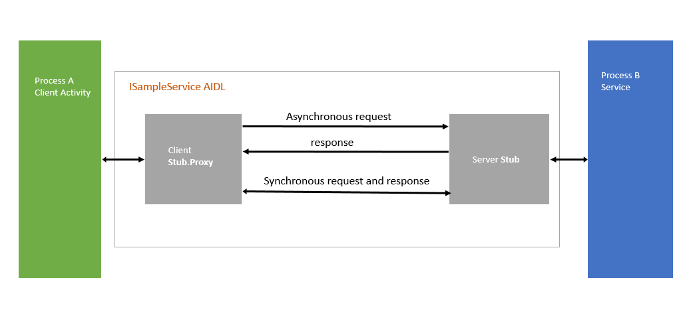

 Android Hal
=====

# Note

 - *RefBase* 클래스
 : RefBase 클래스를 상속받고 있는 클래스는 모두 스마트 포인터로 가리킬수 있다.

 - *Stub*
 : 'Stub' 는 remote interface를 local interface 처럼 사용할 수 있도록 구현한 class입니다. 
   data marashalling / unmarshalling 및 remote service와의 sending / receiving 을 처리합니다.
   'Stub'라는 용어는 일반적으로 다른 RPC methods(COM, java remoting, etc)에서 functionally를
   설명하는데 사용된다.

 - *IDL*
  : IDL(Interface Definition Language)는 일반적으로 language에 독립적입니다. 
    AIDL 파일에서 remote service의 method signatures으로 interface 를 정의 할 수 있습니다. 
	AIDL parser는 interface 로 부터 Java class를 생성하고, 생성된 Java class는 2개의 다른 목적에 사용 될 수 있다.

		1. client가 service 에 access할 수 있도록 proxy class를 생성합니다.

		2. remote methods 구현을 통해서 anonymous class 로 확장하기 위해, abstract Stub class를 생성합니다.

	;

	* AIDL android project가 컴파일 되면, ISampleService.aidl file에 대해 JAVA class ISampleSevice.java가 생성됩니다.
	* abstract Stub class와 Proxy class 를 갖습니다.
	* remote service 는 Stub class object를 생성해야 하며, client가 bindService()를 호출할 때 동일한 객체가 client에 return되어야 합니다.
	* remote service의 onBind() 는 Stub class object를 반환해야 합니다.
	* client의 onServiceConnected()에서 user는 remote service에 정의된 Stub의 proxy object를 가져올 수 있다.
		(ISamplesERVICE.sTUB.ASiNTERFACE() 는 proxy class를 반환함)
	* proxy object는 service process에서 Stub class implementation의 Stub class remote methods 를 호출하는데 사용할 수 있습니다.
	
	ref : https://developer.android.com/guide/components/aidl.html
