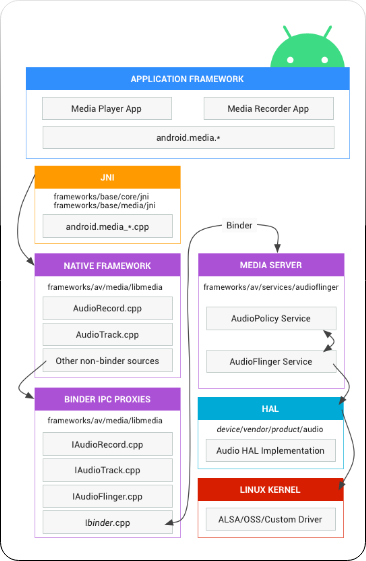
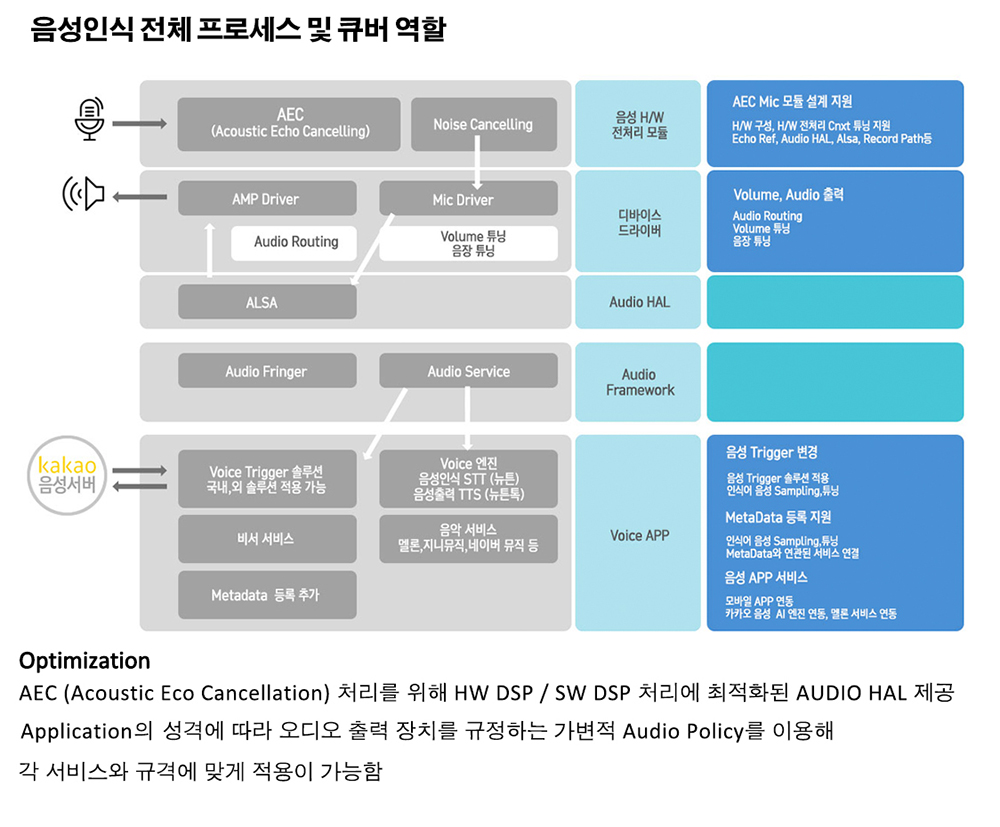
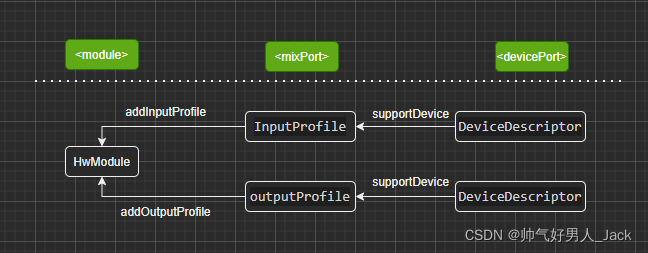

ANDROID AUDIO  
=====  
> Android의 Audio Framework에 대한 문서.  
  
[Overview](#overview)    
[Implementation](#implementation)    
 - [Policy Configuration](#policy-configuration)     
   - [Advantatges of the XML format](#advantages-of-the-xml-format)    
   - [File format and location](#file-format-and-location)    
   - [File inclustions](#file-inclustions)    
   - [Audio policy code organization](#audio-policy-code-organization)    
   - [Configuration using Parameter Framework](#configuration-using-parameter-framework)    
   - [Audio policy routing APIs](#audio-policy-routing-apis)    
    
 - [Android Audio device](#android-audio-device)    
    
[Audio on Android](#audio-on-android)    
 - [Mixer configuration](#mixer-configuration)    
 - [Format of mixer_paths.xml](#format-of-mixer-paths-xml)    
    
[Audio HAL Code](#audio-hal-code)    
 - [Analysis of important interface files](#analysis-of-important-interface-files)    
 - [HAL Initialization](#hal-initialization)    
  
[Audio Framework](#audio-framework)    
 - [Audio Policy Configurations](#audio-policy-configurations)    
 - [Audio Patch](#audio-patch)    
 - [Audio Focus](#audio-focus)    
  
[Audio Volume](#audio-volume)    
 - [Related file](#related-file)    
  
  
<br/>  
<br/>  
<br/>  
<br/>  
<hr>  
  
  
# Overview  
  
   
  
 - **APPLICATION FRAMEWORK** : android.media API를 사용하여 오디오 하드웨어와 상호작용하는 앱 코드가 존재.    
 - **JNI** : android.media와 연결된 JNI코드는 오디오 하드웨어에 액세스 하기 위해 하위 수준의 기본 코드를 호출.    
     JNI는 frameworks/base/core/jni/ 및 framewworks/base/media/jni 에 존재.    
 - **NATIVE FRAMEWORK** : 기본 프레임워크는 android.media 패키지와 동일한 기본 기능을 제공하며,     
     바인더 IPC 프록시를 호출하여 미디어 서버의 오디오 관련 서비스에 액세스한다.    
     기본 프레임워크 코드는 frameworks/av/media/libmedia에 존재.    
 - **BINDER IPC** : 바인더 IPC 프록시는 프로세스 경계를 통한 통신을 용이하게 한다.    
     frameworks/av/media/libmedia에 존재하며 I로 시작한다.    
 - **MEDIA SERVER** : 미디어 서버는 HAL 구현과 상호작용하는 실제 코드인 오디오 서비스가 포함되어 있다.    
     frameworks/av/services/audioflinger에 존재    
 - **HAL** : HAL은 오디오 서비스가 호출하고 오디오 하드웨어가 올바르게 작동하기 위해 구현해야 하는 표준 인터페이스를 정의    
  [audio HAL interface](https://android.googlesource.com/platform/hardware/interfaces/+/refs/heads/master/audio/)   
 - **LINUX KERNEL** : 오디오 드라이버는 하드웨어 및 HAL 구현과 상호 작용한다.    
    ALSA, OSS 또는 사용자 지정 드라이버를 사용할 수 있다.  
  
<br/>  
<br/>  
<br/>  
<br/>  
<hr>  
  
# Implementation  
  
<br/>  
<br/>  
<br/>  
<hr>  
  
## Policy Configuration  
  
Android 7.0 버전에서 audio topology 를 기술하기 위해 audio policy configuration file format(XML)이 도입.    
이전의 Android 버전에서는 device/\<company\>/\<device\>/audio/audio_policy.conf 파일을 사용하여 제품의 오디오 장치를 선언해 사    
  
> 예> Galaxy Nexus 오디오 하드웨어에 대한 예제는 device/samsung/tuna/audio/audio_policy.conf   
  
 audio_policy.conf 파일은 TV, automobiles와 같은 복잡한 topology를 기술하기에는 제한 있음    
 Android 7.0은 audio_policy.conf를 사용하지 않으며, audio topology를 더 쉽고 광범위하게 적용할 수 있는 XML 파일 형식 도입    
 Android 7.0은 USE_XML_AUDIO_POLICY_CONF build flag를 사용하여 configuration file의 XML 형식을 선택    
  
> Android 10 부터 conf 형식은 제거되고, USE_XML_AUDIO_POLICY_CONF 빌드 플래그를 지원  
> rockchip platform  :  device/rockchip/common/device.mk USE_XML_AUDIO_POLICY_CONF := 1  
  
<br/>  
<br/>  
<hr>  
  
### Advantages of the XML format  
   
 conf 파일에서와 마찬가지로 XML파일을 사용하면 output 및 input stream profiles 의 갯수와 유형, play, capture에서 사용할 수 있는 device, audio attributes 정의     
   
 XML파일은 아래와 같은 향상된 기능을 제공  
  
 - 동시에 멀티 recording app 동작을 지원     
 - client는 무음 오디오 샘플 지원     
 - Audio format에 따라서 각 각 서로 다른 sampling rate/ channel 사용    
 - device와 streams간  연결 가능한 모든 연결에 대해 정의 (controlling connections requested with audio patch APIs)    
     XML 파일을 통해 topology 에 대해 기술    
 - include에 대한 지원은 표준 A2DP, USB 또는 reroute 제출 정의의 반복 방지    
 - 볼륨 곡선은 사용자 정의 함. 이전에는 볼륨 테이블이 하드코딩 되어 사용. XML 형식으로 볼륨 테이블이 설명되고 사용자 정의    
 - template 은 frameworks/av/services/audiopolicy/config/audio_policy_configuration.xml 에 정의 됨    
  
<br/>  
<br/>  
<hr>  
  
### File format and location  
    
 새로운 audio policy configuration file은 *audio_policy_configuration.xml*파일이며, /vendor/etc/ 존재.    
 아래 샘플 Android12 버전에서 XML 파일 형식의 간단한 audio policy configuration 파일  
  
 ```xml  
<?xml version="1.0" encoding="UTF-8" standalone="yes"?>  
<audioPolicyConfiguration version="7.0" xmlns:xi="http://www.w3.org/2001/XInclude">  
    <globalConfiguration speaker_drc_enabled="true"/>  
    <modules>  
        <module name="primary" halVersion="3.0">  
            <attachedDevices>  
                <item>Speaker</item>  
                <item>Earpiece</item>  
                <item>Built-In Mic</item>  
            </attachedDevices>  
            <defaultOutputDevice>Speaker</defaultOutputDevice>  
            <mixPorts>  
                <mixPort name="primary output" role="source" flags="AUDIO_OUTPUT_FLAG_PRIMARY">  
                    <profile name="" format="AUDIO_FORMAT_PCM_16_BIT"  
                             samplingRates="48000" channelMasks="AUDIO_CHANNEL_OUT_STEREO"/>  
                </mixPort>  
                <mixPort name="primary input" role="sink">  
                    <profile name="" format="AUDIO_FORMAT_PCM_16_BIT"  
                             samplingRates="8000 16000 48000"  
                             channelMasks="AUDIO_CHANNEL_IN_MONO"/>  
                </mixPort>  
            </mixPorts>  
            <devicePorts>  
                <devicePort tagName="Earpiece" type="AUDIO_DEVICE_OUT_EARPIECE" role="sink">  
                   <profile name="" format="AUDIO_FORMAT_PCM_16_BIT"  
                            samplingRates="48000" channelMasks="AUDIO_CHANNEL_IN_MONO"/>  
                </devicePort>  
                <devicePort tagName="Speaker" role="sink" type="AUDIO_DEVICE_OUT_SPEAKER" address="">  
                    <profile name="" format="AUDIO_FORMAT_PCM_16_BIT"  
                             samplingRates="48000" channelMasks="AUDIO_CHANNEL_OUT_STEREO"/>  
                </devicePort>  
                <devicePort tagName="Wired Headset" type="AUDIO_DEVICE_OUT_WIRED_HEADSET" role="sink">  
                    <profile name="" format="AUDIO_FORMAT_PCM_16_BIT"  
                             samplingRates="48000" channelMasks="AUDIO_CHANNEL_OUT_STEREO"/>  
                </devicePort>  
                <devicePort tagName="Built-In Mic" type="AUDIO_DEVICE_IN_BUILTIN_MIC" role="source">  
                    <profile name="" format="AUDIO_FORMAT_PCM_16_BIT"  
                             samplingRates="8000 16000 48000"  
                             channelMasks="AUDIO_CHANNEL_IN_MONO"/>  
                </devicePort>  
                <devicePort tagName="Wired Headset Mic" type="AUDIO_DEVICE_IN_WIRED_HEADSET" role="source">  
                    <profile name="" format="AUDIO_FORMAT_PCM_16_BIT"  
                             samplingRates="8000 16000 48000"  
                             channelMasks="AUDIO_CHANNEL_IN_MONO"/>  
                </devicePort>  
            </devicePorts>  
            <routes>  
                <route type="mix" sink="Earpiece" sources="primary output"/>  
                <route type="mix" sink="Speaker" sources="primary output"/>  
                <route type="mix" sink="Wired Headset" sources="primary output"/>  
                <route type="mix" sink="primary input" sources="Built-In Mic,Wired Headset Mic"/>  
            </routes>  
        </module>  
        <xi:include href="a2dp_audio_policy_configuration.xml"/>  
    </modules>  
  
    <xi:include href="audio_policy_volumes.xml"/>  
    <xi:include href="default_volume_tables.xml"/>  
</audioPolicyConfiguration>  
  
 ```  
  
 top-level structure 는 각 audio HAL hardware module에 해당하는 module 이 포함되어 있으며,     
 각 module은 **mixPorts**, **devicePort**, **routes** 가 포함되어 있음.     
  
 - **mixPorts** :     
   Mix ports는 play, capture를 위해 Audio HAL에서 열수 있는 stream의 가능한 config profiles을 기술한다.     
   audio HAL이 제공하는 모든 output streams, input streams list 를 기술. 각 mixPort instance는 Android AudioService에 전달되는 물리적 오디오 스트림으로 생각할 수 있다.       
  
 - **devicePorts** :     
   Device ports는 연결할 수 있는 type 을 기술한다.    
   해당 module에서 access 할수 있는 모든 input, output에 대한 device list 를 기술.    
  
 - **routes** :    
   Routes는 device에서 device로 또는 stream 에서 device 의 route 를 기술한다.    
   input device와 output device 사이 또는 audio stream과 device 사이에 가능한 연결 list 를 정의.    
  
 mixPorts와 devicePorts의 차이점.   
    
  - devicePorts에는 실제 연결되는 physical device 가 기술 되어 있다.     
  AUDIO_DEVICE_OUT_SPEAKER, AUDIO_DEVICE_IN_HDMI, AUDIO_DEVICE_OUT_BLUETOOTH_A2DP 등과 같은 Device Type이 정이 되어 있다.    
  
  - mixPorts 는 ligical audio stream 정보이다.     
  
  
 Volume table은 UI 인덱스에서 volume(dB)로 변환하는데 사용되는 curve 을 정의하는 간단한 리스트 이다.    
  
 volume table sample  
 ```  
 <?xml version="1.0" encoding="UTF-8"?>  
<volumes>  
    <reference name="FULL_SCALE_VOLUME_CURVE">  
        <point>0,0</point>  
        <point>100,0</point>  
    </reference>  
    <reference name="SILENT_VOLUME_CURVE">  
        <point>0,-9600</point>  
        <point>100,-9600</point>  
    </reference>  
    <reference name="DEFAULT_VOLUME_CURVE">  
        <point>1,-4950</point>  
        <point>33,-3350</point>  
        <point>66,-1700</point>  
        <point>100,0</point>  
    </reference>  
</volumes>  
 ```  
  
<br/>  
<br/>  
<hr>  
  
 ### File inclusions  
  
 XML include(XINclude) method는 다른 XML 파일에 있는 audio policy configuration information을 include할 수 있다.   
 include 된 XML파일은 위에 설명된 구조를 따라야 하며 아래 제한 사항이 적용 된다.  
  
 - File에는 최상위 요소만 포함될 수 있다.  
 - File은 XInclude 요소를 포함할 수 없다.  
  
<br/>  
<br/>  
<hr>  
  
 ### Audio policy code organization  
  
 AudioPolicyManager.cpp는 유지 관리 및 configure을 쉽게 하기 위해 여러 module로 분할한다.  
 frameworks/av/services/audiopolicy의 구성에는 다음 모듈이 포함된다.  
  
 - /managerdefault  
 - /common  
 - /engine  
 - /engineconfigurable  
 - /enginedefault  
 - /service  
  
<br/>  
<br/>  
<hr>  
  
 ### Configuration using Parameter Framework  
  
 Audio policy code는 configuration files에 의해 정의된 audio policy 를 지원하면서 쉽게 이해하고 유지 할 수 있도록 구성된다.     
 organization and audio policy 설계는 Intel's Parameter Framework 베이스로 한다.    
  
<br/>  
<br/>  
<hr>  
  
 ### Audio policy routing APIs  
  
 Android 6.0 버전에서는 Audio patch/audio port infra 상위에 있는 public Enumeration 과 Selection API를 통해,    
 App 개발자가 연결된 audio records 또는 tracks에 대한 특정 device output or input에 대한 설정을 나타냈다.     
   
 Android 7.0에서 Enumeration and Selection API는 CTS 테스트를 통해 확인되었으며 네이티브 C/C++(OpenSL ES) 오디오 스트림에 대한 라우팅을 포함하도록 확장되었습니다.    
 네이티브 스트림의 라우팅은 AudioTrack 및 AudioRecord 클래스에 고유한 명시적 라우팅 메서드를 대체, 결합 및 폐기하는 AudioRouting 인터페이스를 추가하여 Java에서 계속 수행됩니다.    
 Enumeration and Selection API에 대한 자세한 내용은 Android 구성 인터페이스 및 OpenSLES_AndroidConfiguration.h를 참조하세요.    
 오디오 라우팅에 대한 자세한 내용은 AudioRouting을 참조하십시오.    
  
<br/>  
<br/>  
<br/>  
<hr>  
  
## Android Audio device  
  
 Android 에는 많은 Audio device를 정의.  
```java  
// frameworks/base/media/java/android/media/AudioSystem.java file  
  
 (...)  
    /*  
     * AudioPolicyService methods  
     */  
  
    //  
    // audio device definitions: must be kept in sync with values in system/core/audio.h  
    //  
    /** @hide */  
    public static final int DEVICE_NONE = 0x0;  
    // reserved bits  
    /** @hide */  
    public static final int DEVICE_BIT_IN = 0x80000000;  
    /** @hide */  
    public static final int DEVICE_BIT_DEFAULT = 0x40000000;  
    // output devices, be sure to update AudioManager.java also  
    /** @hide */  
    @UnsupportedAppUsage  
    public static final int DEVICE_OUT_EARPIECE = 0x1;  
    /** @hide */  
    @UnsupportedAppUsage  
    public static final int DEVICE_OUT_SPEAKER = 0x2;  
    /** @hide */  
    @UnsupportedAppUsage  
    public static final int DEVICE_OUT_WIRED_HEADSET = 0x4;  
    /** @hide */  
    @UnsupportedAppUsage  
    public static final int DEVICE_OUT_WIRED_HEADPHONE = 0x8;  
    /** @hide */  
    @UnsupportedAppUsage  
    public static final int DEVICE_OUT_BLUETOOTH_SCO = 0x10;  
    /** @hide */  
    @UnsupportedAppUsage  
    public static final int DEVICE_OUT_BLUETOOTH_SCO_HEADSET = 0x20;  
    /** @hide */  
    @UnsupportedAppUsage  
    public static final int DEVICE_OUT_BLUETOOTH_SCO_CARKIT = 0x40;  
    /** @hide */  
    @UnsupportedAppUsage  
    public static final int DEVICE_OUT_BLUETOOTH_A2DP = 0x80;  
    /** @hide */  
    @UnsupportedAppUsage  
    public static final int DEVICE_OUT_BLUETOOTH_A2DP_HEADPHONES = 0x100;  
    /** @hide */  
    @UnsupportedAppUsage  
    public static final int DEVICE_OUT_BLUETOOTH_A2DP_SPEAKER = 0x200;  
    /** @hide */  
    @UnsupportedAppUsage  
    public static final int DEVICE_OUT_AUX_DIGITAL = 0x400;  
    /** @hide */  
    public static final int DEVICE_OUT_HDMI = DEVICE_OUT_AUX_DIGITAL;  
    /** @hide */  
    @UnsupportedAppUsage  
    public static final int DEVICE_OUT_ANLG_DOCK_HEADSET = 0x800;  
    /** @hide */  
    @UnsupportedAppUsage  
    public static final int DEVICE_OUT_DGTL_DOCK_HEADSET = 0x1000;  
    /** @hide */  
    @UnsupportedAppUsage  
    public static final int DEVICE_OUT_USB_ACCESSORY = 0x2000;  
    /** @hide */  
    @UnsupportedAppUsage  
    public static final int DEVICE_OUT_USB_DEVICE = 0x4000;  
 (...)  
```  
  
hardware/rockchip/audio/tinyalsa_hal/alsa_route.c 에서 위의 정의된 값을 route_set_control(route)의 get_route_config(int route)를 통해서 codec_config의 xxx.h 구성파일로 변환 한다.  
  
```c  
// hardware/rockchip/audio/tinyalsa_hal/alsa_route.c  
const struct config_route *get_route_config(unsigned route)  
{  
    ALOGV("get_route_config() route %d", route);  
  
    if (!route_table) {  
        ALOGE("get_route_config() route_table is NULL!");  
        return NULL;  
    }  
    switch (route) {  
    case SPEAKER_NORMAL_ROUTE:  
        return &(route_table->speaker_normal);  
    case SPEAKER_INCALL_ROUTE:  
        return &(route_table->speaker_incall);  
    case SPEAKER_RINGTONE_ROUTE:  
        return &(route_table->speaker_ringtone);  
    case SPEAKER_VOIP_ROUTE:  
        return &(route_table->speaker_voip);  
```  
  
HAL 레이어는 sound card의 이름에 따라서 사용할 테이블을 선택한다.   
일치하는 항목이 없으면 default_config.h가 기본적으로 사용됨.  
  
```cpp  
int route_init(void)  
{  
    char soundCardID[20] = "";  
    static FILE * fp;  
    unsigned i, config_count = sizeof(sound_card_config_list) / sizeof(struct alsa_sound_card_config);  
    size_t read_size;  
  
    ALOGV("route_init()");  
  
    fp = fopen("/proc/asound/card0/id", "rt");  
    if (!fp) {  
        ALOGE("Open sound card0 id error!");  
    } else {  
        read_size = fread(soundCardID, sizeof(char), sizeof(soundCardID), fp);  
        fclose(fp);  
  
        if (soundCardID[read_size - 1] == '\n') {  
            read_size--;  
            soundCardID[read_size] = '\0';  
        }  
```  
  
HAL layer 사운드 카드 이름과 구성 테이블 목록 테이블의 사운드카드의 이름은 선언은 tinyalsa_hal/codec_config/config_list.h 파일에 있다.   
오디오는 config_route_table을 가져오고 사운드 카드0 및 sound_card_name의 이름을 기반으로 경로를 설정한다.  
  
```bash  
cat /proc/asound/card0/id  
rockchipak7755  
```  
  
```cpp  
#include "ak7755_config.h"  
  
 (...)  
   
struct alsa_sound_card_config sound_card_config_list[] = {  
 (...)  
    {  
        .sound_card_name = "rockchipak7755",  
        .route_table = &ak7755_config_table,  
    },  
```  
  
.route_table의 참조는 ak7755_config.h 파일에 정의되어 있다.   
예를 들어 .route_table = &ak7755_config_table은 ak7755_config.h에 정의.  
  
```c  
const struct config_route_table ak7755_config_table = {  
    //speaker  
    .speaker_normal = {  
        .sound_card = 0,  
        .devices = DEVICES_0,  
        .controls = ak7755_speaker_normal_controls,  
        .controls_count = sizeof(ak7755_speaker_normal_controls) / sizeof(struct config_control),  
    },  
    .speaker_incall = {  
        .sound_card = 0,  
        .devices = DEVICES_0,  
        .controls = ak7755_speaker_incall_controls,  
        .controls_count = sizeof(ak7755_speaker_incall_controls) / sizeof(struct config_control),  
    },  
    .speaker_ringtone = {  
        .sound_card = 0,  
        .devices = DEVICES_0,  
        .controls = ak7755_speaker_ringtone_controls,  
        .controls_count = sizeof(ak7755_speaker_ringtone_controls) / sizeof(struct config_control),  
    },  
    .speaker_voip = {  
        .sound_card = 0,  
        .devices = DEVICES_0,  
        .controls = ak7755_speaker_voip_controls,  
        .controls_count = sizeof(ak7755_speaker_voip_controls) / sizeof(struct config_control),  
    },  
```  
  
그런 다음 ak7755_speaker_normal_controls 설정과 같이 .controls에서 ctl_name 및 .str_val, .int_val을 구성하여 kernel layer 과 통신한다.  
  
```c  
const struct config_control ak7755_speaker_normal_controls[] = {  
    {  
        .ctl_name = "DSP Firmware PRAM",  
        .str_val = "basic",  
    },  
    {  
        .ctl_name = "DSP Firmware CRAM",  
        .str_val = "basic",  
    },  
    {  
        .ctl_name = "DAC MUX",  
        .str_val = "DSP",  
    },  
    {  
        .ctl_name = "Line Out Volume 1",  
        .int_val = {10},  
    },  
    {  
        .ctl_name = "LineOut Amp1",  
        .int_val = {on},  
    },  
    {  
        .ctl_name = "DAC Mute",  
        .int_val = {off},  
    },  
};  
```  
  
<br/>  
<br/>  
<br/>  
<br/>  
<hr>  
  
# Audio on Android  
  
<br/>  
<br/>  
<br/>  
<hr>  
  
## Mixer configuration  
 > Android Audio HAL이 ALSA mixer 를 configuration하는 방법에 대해 설명.  
  
 Android 기기에는 headphone, speaker, mic 와 같은 다양한 mixer configuration이 있다.    
 audio route configuration은 mixer_paths.xml에 정의되어 있다.     
    
 Android audio HAL은 [tinyalsa](https://android.googlesource.com/platform/external/tinyalsa) 및 [audio_route](https://android.googlesource.com/platform/system/media/+/kitkat-release/audio_route) 를 사용한다.      
    
 tinyalsa는 linux 커널에서 ALSA와 interface하는 standalone library이다.     
 audio HAL은 XML에서 audio path를 load하고, tinyalsa를 통해 mixer를 제어하는 audio_route library를 호출한다.     
    
<br/>  
<br/>  
<br/>  
<hr>  
  
## Format of mixer_paths.xml  
 - ALSA 제어는 *ctl* elements로 정의한다.  
 - Audio route는 *path* elements로 정의한다.  
   *path* element에는 *ctl* elements와 other *path* elements 를 포함한다.  
 - path *name* attribute 는 audio route를 선택하는데 사용된다.  
  
  경로 요소에는 ctl 요소와 기타 경로 요소의 컬렉션이 포함됩니다.  
  
<br/>  
<br/>  
<br/>  
<br/>  
<hr>  
  
# Audio HAL Code  
  
<br/>  
<br/>  
<br/>  
<hr>  
  
## Analysis of important interface files  
    
> HAL 인터페이스 파일을 통하여 HAL Layer  분석.     
    
*DeviceHalInterface.h* (frameworks/av/media/libaudiohal/include/media/audiohal/DeviceHalInterface.h)    
*AudioHwDevice.h* (frameworks/av/services/audioflinger/AudioHwDevice.h)    
    
DeviceHalInterface.h는 HAL layer를 연결하는 Interface 이고,     
AudioHwDevice.h 는 hw Dev의 packaging 입니다.    
      
 ✅ 이 두 인터페이스 파일에서 관련 메서드의 기능을 분석.      
       
  
  
 [-> *frameworks/av/media/libaudiohal/include/media/audiohal/DeviceHalInterface.h* ]    
```cpp  
namespace android {  
//// Input stream HAL 인터페이스  
class StreamInHalInterface;  
//// Output stream HAL 인터페이스  
class StreamOutHalInterface;  
//// Device operation 인터페이스  
class DeviceHalInterface : public RefBase  
{  
  public:  
    // Sets the value of 'devices' to a bitmask of 1 or more values of audio_devices_t.  
    virtual status_t getSupportedDevices(uint32_t *devices) = 0;  
  
    // Check to see if the audio hardware interface has been initialized.  
    virtual status_t initCheck() = 0;  
  
    //// Set call volume, range 0-1.0   
    // Set the audio volume of a voice call. Range is between 0.0 and 1.0.  
    virtual status_t setVoiceVolume(float volume) = 0;  
  
    //// Set the volume of all audio stream types except call volume, range 0-1.0,   
    //// if the hardware does not support this function, the function is completed by the mixer of the software layer  
    // Set the audio volume for all audio activities other than voice call.  
    virtual status_t setMasterVolume(float volume) = 0;  
  
    // Get the current master volume value for the HAL.  
    virtual status_t getMasterVolume(float *volume) = 0;  
  
    //// Setting mode, NORMAL state is normal mode, RINGTONE means incoming call mode  
    //// (the sound heard at this time is the ringtone of the incoming call)   
    //// IN_CALL means call mode (the sound heard at this time is the voice during the phone call)  
    // Called when the audio mode changes.  
    virtual status_t setMode(audio_mode_t mode) = 0;  
  
    //// Microphone switch control  
    // Muting control.  
    virtual status_t setMicMute(bool state) = 0;  
    virtual status_t getMicMute(bool *state) = 0;  
    virtual status_t setMasterMute(bool state) = 0;  
    virtual status_t getMasterMute(bool *state) = 0;  
  
    //// Set the global audio parameters in the form of key/value organization  
    // Set global audio parameters.  
    virtual status_t setParameters(const String8& kvPairs) = 0;  
  
    // Get global audio parameters.  
    virtual status_t getParameters(const String8& keys, String8 *values) = 0;  
  
    // Returns audio input buffer size according to parameters passed.  
    virtual status_t getInputBufferSize(const struct audio_config *config,  
            size_t *size) = 0;  
  
    //// Create an audio output stream object (equivalent to opening an audio output device) AF writes data through write,   
    //// and the pointer type will return the type, number of channels, and sampling rate supported by the audio output stream  
    // Creates and opens the audio hardware output stream. The stream is closed  
    // by releasing all references to the returned object.  
    virtual status_t openOutputStream(  
            audio_io_handle_t handle,  
            audio_devices_t deviceType,  
            audio_output_flags_t flags,  
            struct audio_config *config,  
            const char *address,  
            sp<StreamOutHalInterface> *outStream) = 0;  
  
    //// Create an audio input stream object (equivalent to opening an audio input device) AF can read data  
    // Creates and opens the audio hardware input stream. The stream is closed  
    // by releasing all references to the returned object.  
    virtual status_t openInputStream(  
            audio_io_handle_t handle,  
            audio_devices_t devices,  
            struct audio_config *config,  
            audio_input_flags_t flags,  
            const char *address,  
            audio_source_t source,  
            audio_devices_t outputDevice,  
            const char *outputDeviceAddress,  
            sp<StreamInHalInterface> *inStream) = 0;  
  
    // Returns whether createAudioPatch and releaseAudioPatch operations are supported.  
    virtual status_t supportsAudioPatches(bool *supportsPatches) = 0;  
  
    //// The AudioPatch concept is used to represent the end-to-end connecton relationship in audio,   
    //// such as connecting source and sink, which can be a real audio input device, such as MIC,   
    //// or the audio stream after mixing in the bottom layer; here Sink represents the output device, such as speakers, headphones, etc.  
    // Creates an audio patch between several source and sink ports.  
    virtual status_t createAudioPatch(  
            unsigned int num_sources,  
            const struct audio_port_config *sources,  
            unsigned int num_sinks,  
            const struct audio_port_config *sinks,  
            audio_patch_handle_t *patch) = 0;  
  
    // Releases an audio patch.  
    virtual status_t releaseAudioPatch(audio_patch_handle_t patch) = 0;  
  
    // Fills the list of supported attributes for a given audio port.  
    virtual status_t getAudioPort(struct audio_port *port) = 0;  
  
    // Fills the list of supported attributes for a given audio port.  
    virtual status_t getAudioPort(struct audio_port_v7 *port) = 0;  
  
    // Set audio port configuration.  
    virtual status_t setAudioPortConfig(const struct audio_port_config *config) = 0;  
  
    // List microphones  
    virtual status_t getMicrophones(std::vector<media::MicrophoneInfo> *microphones) = 0;  
  
    virtual status_t addDeviceEffect(  
            audio_port_handle_t device, sp<EffectHalInterface> effect) = 0;  
    virtual status_t removeDeviceEffect(  
            audio_port_handle_t device, sp<EffectHalInterface> effect) = 0;  
  
    virtual status_t dump(int fd, const Vector<String16>& args) = 0;  
  
  protected:  
    // Subclasses can not be constructed directly by clients.  
    DeviceHalInterface() {}  
  
    // The destructor automatically closes the device.  
    virtual ~DeviceHalInterface() {}  
};  
  
} // namespace android  
```  
  
 [-> *frameworks/av/services/audioflinger/AudioHwDevice.h* ]  
```cpp  
//// Audio output stream  
class AudioStreamOut;  
  
class AudioHwDevice {  
public:  
    enum Flags {  
        AHWD_CAN_SET_MASTER_VOLUME  = 0x1,  
        AHWD_CAN_SET_MASTER_MUTE    = 0x2,  
        // Means that this isn't a terminal module, and software patches  
        // are used to transport audio data further.  
        AHWD_IS_INSERT              = 0x4,  
    };  
  
    AudioHwDevice(audio_module_handle_t handle,  
                  const char *moduleName,  
                  sp<DeviceHalInterface> hwDevice,  
                  Flags flags)  
        : mHandle(handle)  
        , mModuleName(strdup(moduleName))  
        , mHwDevice(hwDevice)  
        , mFlags(flags) { }  
    virtual ~AudioHwDevice() { free((void *)mModuleName); }  
  
    bool canSetMasterVolume() const {  
        return (0 != (mFlags & AHWD_CAN_SET_MASTER_VOLUME));  
    }  
  
    bool canSetMasterMute() const {  
        return (0 != (mFlags & AHWD_CAN_SET_MASTER_MUTE));  
    }  
  
    bool isInsert() const {  
        return (0 != (mFlags & AHWD_IS_INSERT));  
    }  
  
    audio_module_handle_t handle() const { return mHandle; }  
    const char *moduleName() const { return mModuleName; }  
    sp<DeviceHalInterface> hwDevice() const { return mHwDevice; }  
  
    /** This method creates and opens the audio hardware output stream.  
     * The "address" parameter qualifies the "devices" audio device type if needed.  
     * The format format depends on the device type:  
     * - Bluetooth devices use the MAC address of the device in the form "00:11:22:AA:BB:CC"  
     * - USB devices use the ALSA card and device numbers in the form  "card=X;device=Y"  
     * - Other devices may use a number or any other string.  
     */  
    status_t openOutputStream(  
            AudioStreamOut **ppStreamOut,  
            audio_io_handle_t handle,  
            audio_devices_t deviceType,  
            audio_output_flags_t flags,  
            struct audio_config *config,  
            const char *address);  
  
    bool supportsAudioPatches() const;  
  
    status_t getAudioPort(struct audio_port_v7 *port) const;  
  
private:  
    const audio_module_handle_t mHandle;  
    const char * const          mModuleName;  
    sp<DeviceHalInterface>      mHwDevice;  
    const Flags                 mFlags;  
};  
```  
  
<br/>  
<br/>  
<br/>  
<hr>  
  
## HAL Initialization  
  
 HAL layer 초기화는 AF 초기화 진행 중에 수행됩니다.  
 AudioFlinger -> HAL  
 AF가 초기화되면 *DevicesFactoryHalInterface* static method를 사용하여 HAL factory object를 생성합니다.  
  
 [-> *frameworks/av/services/audioflinger/AudioFlinger.cpp* ]  
```cpp  
AudioFlinger::AudioFlinger()    {  
    (...)  
    mDevicesFactoryHal = DevicesFactoryHalInterface::create();  
    (...)  
}  
```  
  
 [-> *frameworks/av/media/libaudiohal/t DevicesFactoryHalInterface.cpp* ]  
```cpp  
// static  
sp<DevicesFactoryHalInterface> DevicesFactoryHalInterface::create() {  
    return createPreferredImpl<DevicesFactoryHalInterface>(  
            "android.hardware.audio", "IDevicesFactory");  
}  
```  
  
 [-> *hardware/interfaces/audio/common/all-versions/default/service/Android.bp* ]  
```bp  
package {  
    // See: http://go/android-license-faq  
    // A large-scale-change added 'default_applicable_licenses' to import  
    // all of the 'license_kinds' from "hardware_interfaces_license"  
    // to get the below license kinds:  
    //   SPDX-license-identifier-Apache-2.0  
    default_applicable_licenses: ["hardware_interfaces_license"],  
}  
  
cc_binary {  
    name: "android.hardware.audio.service",  
  
    init_rc: ["android.hardware.audio.service.rc"],  
    relative_install_path: "hw",  
    vendor: true,  
    // Prefer 32 bit as the binary must always be installed at the same  
    // location for init to start it and the build system does not support  
    // having two binaries installable to the same location even if they are  
    // not installed in the same build.  
    compile_multilib: "prefer32",  
    srcs: ["service.cpp"],  
  
    cflags: [  
        "-Wall",  
        "-Wextra",  
        "-Werror",  
    ],  
  
    shared_libs: [  
        "libcutils",  
        "libbinder",  
        "libhidlbase",  
        "liblog",  
        "libutils",  
        "libhardware",  
    ],  
}  
  
// Legacy service name, use android.hardware.audio.service instead  
phony {  
    name: "android.hardware.audio@2.0-service",  
    required: ["android.hardware.audio.service"],  
}  
  
```  
  
 [-> *hardware/interfaces/audio/common/all-versions/default/service/android.hardware.audio.service.rc* ]  
```bash  
service vendor.audio-hal /vendor/bin/hw/android.hardware.audio.service  
    class hal  
    user audioserver  
    # media gid needed for /dev/fm (radio) and for /data/misc/media (tee)  
    group audio camera drmrpc inet media mediadrm net_bt net_bt_admin net_bw_acct wakelock context_hub  
    capabilities BLOCK_SUSPEND  
    ioprio rt 4  
    task_profiles ProcessCapacityHigh HighPerformance  
    onrestart restart audioserver  
  
```  
  
<br/>  
<br/>  
<br/>  
<br/>  
<hr>  
  
# reference   
  
<br/>  
<br/>  
<br/>  
<hr>  
  
## site   
 - AOSP : https://source.android.com/docs/core/audio  
  
 - ref QUBER company :   
      
  
<br/>  
<br/>  
<br/>  
<br/>  
<hr>  
  
# Audio Framework  
  
<br/>  
<br/>  
<br/>  
<hr>  
  
## Audio Policy Configuration  
   
 *AudioPolicyManager*가 초기화 될 때, *deseralizeAudioPolicyXmlConfig* 함수에서 audio_policy_configuration.xml 분석 및 반환 된다.   
  
 - **module** tag    
    Module tag는 hal 에 해당한다. hal의 소스 코드 구현은 primary, usb, a2dp, submix, bluetooth hearing aid등과 같이 나눠져 있다.    
    
 - **MixPort** label    
    MixPort lable은 type, samplingRates, Masks, output, input stream을 구성한다.    
     - *AudioProfile class*    
  
 - **DevicePort** label    
     DevicePort tag는 device 로 이해할 수 있으며 device도 output, input이 구분되지만 MixPort와 깥은 역할로 구분되지 않고 다음과 같이 type에서 "IN", "OUT"으로 구분된다.    
    - *DeviceDescriptor class*    
  
```xml  
<devicePort tagName="BT A2DP Headphones" types="AUDIO_DEVICE_OUT_BLUETOOTH_A2DP_HEADPHONES" role="sink"  
        encodedFormats="AUDIO_FORMAT_LDAC AUDIO_FORMAT_APTX AUDIO_FORMAT_APTX_HD AUDIO_FORMAT_AAC AUDIO_FORMAT_SBC">  
    <profile name="" format="AUDIO_FORMAT_PCM_16_BIT"  
        samplingRates="44100,48000,88200,96000" channelMasks="AUDIO_CHANNEL_OUT_STEREO"/>  
</devicePort>  
```    
    
 - **Route** label    
 Route 는 *deviceport*와 *mixport*를 연결하는 route이며, 데이터는 하나의 stream에서 다른 device로, 또는 한 device에서 다른 stream으로 출력된다.    
    - *AudioRoute class*  
  
  
 HAL 제공업체는 HAL에 대한 name 및 여러 configuration 정보를 지닌 config file을 정의한다.    
 ex. ./device/google/crosshatch/audio_policy_configuration.xml  
```xml  
    <module name="primary" halVersion="2.0">  
    <module name="usb" halVersion="2.0">  
  
    <xi:include href="r_submix_audio_policy_configuration.xml"/>  
    <xi:include href="bluetooth_hearing_aid_audio_policy_configuration.xml"/>  
```  
    총 4 가지 HAL을 loading     
        primary     
        usb    
        submix    
        bluetooth hearing aid    
        
    제조사는 HAL service를 통해 설정에 있는 name 별로의 HAL을 생성해 줘야함    
  
<br/>  
<hr>  
  
#### route를 통해 devicePort와 mixPort를 연결하는 방법    
  
 route는 mixport stream data를 devicPort장치로 전송할 수 있는지 결정하고, 둘 사이의 연결 관계를 설정한다.  
 [ -> *frameworks/av/services/audiopolicy/common/managerdefinitions/src/HwModule.cpp* ]  
  
  
  
<br/>  
<hr>  
  
#### MixPort의 플래그  
  
| **AUDIO_OUTPUT_FLAG**                  | **설명**                                                                                                                                         |  
|------------------------------------    |----------------------------------------------------------------------------------------------------------------------------------------------    |  
| AUDIO_OUTPUT_FLAG_PRIMARY              | 일반적으로 벨소리에 사용되는 기본 출력 장치로 오디오 스트림을 출력해야 함을 나타냅니다.                                                          |  
| AUDIO_OUTPUT_FLAG_DIRECT               | 오디오 스트림이 소프트웨어 믹싱 없이 오디오 장치로 직접 출력됨을 나타내며 일반적으로 HDMI 장치의 사운드 출력에 사용됩니다.                       |  
| AUDIO_OUTPUT_FLAG_FAST                 | 오디오 스트림을 오디오 장치로 빠르게 출력해야 함을 나타내며 일반적으로 버튼 소리 및 게임 배경음과 같이 대기 시간이 긴 장면에서 사용됩니다.       |  
| AUDIO_OUTPUT_FLAG_DEEP_BUFFER          | 오디오 스트림 출력이 일반적으로 높은 지연이 필요하지 않은 음악, 비디오 재생 및 기타 장면에서 사용되는 큰 지연을 허용할 수 있음을 나타냅니다.     |  
| AUDIO_OUTPUT_FLAG_COMPRESS_OFFLOAD     | 오디오 스트림이 소프트웨어에 의해 디코딩되지 않았으며 하드웨어 디코더에 의한 디코딩을 위해 하드웨어 디코더로 출력되어야 함을 나타냅니다.         |  
  
 이외에도 AUDIO_OUTPUT_FLAG_NOW_BLOCKING, AUDIO_OUTPUT_FLAG_HW_AV_SYNC, AUDIO_OUTPUT_FLAG_TTS, AUDIO_OUTPUT_FLAG_RAW, AUDIO_OUTPUT_FLAG_SYNC, AUDIO_OUTPUT_FLAG_IEC958_MONAUDIO, AUDIO_OUTPUT_FLAG_DIRECT_PCM, AUDIO_OUTPUT_FLAG_MMAP_NOIRQ, AUDIO_OUTPUT_VOIP_RX, AUDIO_OUTPUT_FLAG_INCALL_MUSIC  
  
<br/>  
<br/>  
<hr>  
  
###  Audio Patch  
  
 audio patch는 하나 이상의 source port 와 하나 이상의 sink port 간 연결을 나타낸다.    
 patch는 framework api를 통해 audio policy manager 또는 application에서 framework API를 통해 연결 및 연결 해제 가능하다.    
 각 patch는 해당 patch를 만드는데 사용되는 interface의 handle로 식별됨. (예, audio hal에 의해 patch가 생성되면 hal은 patch를 할당하고 handle을 반환한다.)    
  
 [ -> *system/media/audio/include/system/audio.h* ]  
```cpp  
// audio patch 구조  
#define AUDIO_PATCH_PORTS_MAX   16  
  
struct audio_patch {  
    audio_patch_handle_t id;            /* patch unique ID */  
    /* audio input(source) 갯수 */  
    unsigned int      num_sources;      /* number of sources in following array */  
    struct audio_port_config sources[AUDIO_PATCH_PORTS_MAX];  
    /* audio output(sinks) 갯수 */  
    unsigned int      num_sinks;        /* number of sinks in following array */  
    struct audio_port_config sinks[AUDIO_PATCH_PORTS_MAX];  
};  
  
// audio_port_config 구조 (아래와 같은 포트의 모든 정보가 포함되어져 있음)  
struct audio_port_config {  
    audio_port_handle_t      id;           /* port unique ID */  
    audio_port_role_t        role;         /* sink or source */  
    audio_port_type_t        type;         /* device, mix ... */  
    unsigned int             config_mask;  /* e.g AUDIO_PORT_CONFIG_ALL */  
    unsigned int             sample_rate;  /* sampling rate in Hz */  
    audio_channel_mask_t     channel_mask; /* channel mask if applicable */  
    audio_format_t           format;       /* format if applicable */  
    struct audio_gain_config gain;         /* gain to apply if applicable */  
#ifndef AUDIO_NO_SYSTEM_DECLARATIONS  
    union audio_io_flags     flags;        /* framework only: HW_AV_SYNC, DIRECT, ... */  
#endif  
    union {  
        struct audio_port_config_device_ext  device;  /* device specific info */  
        struct audio_port_config_mix_ext     mix;     /* mix specific info */  
        struct audio_port_config_session_ext session; /* session specific info */  
    } ext;  
};  
```  
  
<br/>  
<br/>  
<hr>  
  
### Audio Focus  
  
 한번에 하나의 앱만 Audio Focus를 유지 할수 있도록 하는 기능 입니다.    
 앱이 오디오를 출력해야 하는 경우, Audio Focus를 요청해야 합니다. Focus가 있는 앱은 사운드를 재생할 수 있습니다.     
  
<br/>  
<br/>  
<br/>  
<br/>  
<hr>  
  
# Develop  
  
 - ServiceManager에 의해 실행되는 AudioFlinger, AudioPolicy  
  
> Context Manager에 등록된 시스템 서비스 확인.    
  
```bash  
# service list  | grep audio  
32      audio: [android.media.IAudioService]  
105     media.audio_flinger: [android.media.IAudioFlingerService]  
106     media.audio_policy: [android.media.IAudioPolicyService]  
```  
  
 AudioFlinger의 경우, 서비스 리스트에 105번째로 AudioPolicy는 106번째로 등록되었으며,   
 서비스 이름은 각각 media.audio_flinger, media.audio_policy이며,   
 Interface는 "android.media.IAudioFlingerService", "android.media.IAudioPolicyService" 이다.  
  
 - audio 관련 실행 process  
  
```bash  
  
# ps -e | grep audio  
audioserver    279     1   36256   8940 binder_thread_read  0 S android.hardware.audio.service  
audioserver    315     1 11435992 28864 binder_thread_read  0 S audioserver  
  
```  
  
 - interfaces audio  
   * android.hardware.audio@7.0  
  
```bp  
filegroup {  
    name: "android.hardware.audio-impl_srcs",  
    srcs: [  
        "Device.cpp",  
        "DevicesFactory.cpp",  
        "ParametersUtil.cpp",  
        "PrimaryDevice.cpp",  
        "Stream.cpp",  
        "StreamIn.cpp",  
        "StreamOut.cpp",  
    ],  
}  
```  
  
// code  
```bash  
hardware/interfaces/audio$ tree  core/all-versions/default/  
core/all-versions/default/  
├── Android.bp  
├── Device.cpp  
├── DevicesFactory.cpp  
├── include  
│   └── core  
│       └── default  
│           ├── Device.h  
│           ├── DevicesFactory.h  
│           ├── ParametersUtil.h  
│           ├── PrimaryDevice.h  
│           ├── Stream.h  
│           ├── StreamIn.h  
│           ├── StreamOut.h  
│           └── Util.h  
├── ParametersUtil.cpp  
├── PrimaryDevice.cpp  
├── Stream.cpp  
├── StreamIn.cpp  
├── StreamOut.cpp  
├── TEST_MAPPING  
└── util  
    ├── Android.bp  
        ├── CoreUtils.cpp  
            ├── include  
                │   └── util  
                    │       └── CoreUtils.h  
                        └── tests  
                                └── coreutils_tests.cpp  
  
                                7 directories, 21 files  
  
```  
 - mixer_paths.xml 분석  
  
 - audio_policy_configuration.xml 분석  
   
   * audio-hal-enums.h   
> /system/media/audio/include/system/audio-hal-enums.h   
     audio-hal-enums.h 헤더 파일은 system <-> vendor(framework <-> hal) 간 데이터 enum파일이 정의된 헤더파일.  
     정의된 enum데이터들은 AUDIO HAL 에서 지원하는 *audio format*, *channel masks*, *input flags* 을 나타내는데 사용.  
  
<br/>  
<br/>  
<br/>  
<br/>  
<hr>  
  
# Audio Volume  
  
  
## Related file  
  
 - /vendor/etc/audio_policy_configuration.xml:  
    이 파일은 Android 7.0부터 도입된 audio policy configuration 파일.  
    기기의 오디오 토폴로지를 설명하고 오디오 기기, 스트림 프로필, 볼륨 곡선 등을 정의.  
    주요 기능:  
    * mix port: 재생 및 캡처를 위한 스트림의 구성 프로필을 설명.  
    * device port: 기기 유형에 연결할 수 있는 기기를 설명.  
    * route: 믹스 포트에서 기기까지의 연결 경로를 설명.  
    * volume table: UI 색인에서 dB 단위의 볼륨으로 변환하는 데 사용되는 곡선을 정의.  
    frameworks/av/services/audiopolicy/managerdefault/AudioPolicyManager.cpp  
  
 - default_volume_tables.xml:  
    이 파일은 기본 볼륨 테이블을 정의.  
    각 스트림 유형에 대한 기본 볼륨 곡선을 설정.  
  
 - /vendor/etc/audio_policy_engine_configuration.xml:  
    이 파일은 Android 10 이하에서 사용되는 audio policy engine configuration 파일.  
    audio_policy_engine에서 사용되는 전략과 관련된 설정을 포함.  
    frameworks/av/services/audiopolicy/engine/config/config/src/EngineConfig.cpp  
  
 - /vendor/etc/audio_policy_engine_product_strategies.xml:  
    이 파일은 Android 10 이하에서 사용되는 제품별 라우팅 전략을 정의.  
    * AttributesGroup : 오디오 속성 그룹을 정의 
    * VolumeGroup : 볼륨 그룹을 정의하여 특정 스트림 유형에 대한 볼륨 곡선을 설정 하도록 선언함 
  
 - /vendor/etc/audio_policy_engine_stream_volumes.xml:  
    이 파일은 Android 10 이하에서 사용되는 스트림 볼륨 설정을 정의.  
    각 오디오 스트림 유형에 대한 볼륨 곡선을 설정하고 특정 상황에서 볼륨 레벨을 조정하는데 사용  
    * Stream Types : 각 오디오 스트림 유형(MUSIC, RINGTONE, ALARM 등)에 대한 볼륨 설정을 정의  
    * Volume Curves : 볼륨 곡선을 정의하여 UI에서 설정한 볼륨 레벨을 실제 dB 값으로 변환.
 
 - /vendor/etc/audio_policy_engine_default_stream_volumes.xml:  
    이 파일은 Android 10 이하에서 사용되는 기본 스트림 볼륨 설정을 정의.  
    특정 기기나 상황에 맞춘 custom 설정이 없을때 사용되는 기본 볼륨 곡선을 제공함.
    * Default Volume Curvew : 기본 볼륨 곡선을 정의 
  

```
audio_policy_engine_configuration.xml
    |
    +-> audio_policy_engine_product_strategies.xml
    |
    +-> audio_policy_engine_stream_volumes.xml 
    |
    +-> audio_policy_engine_default_stream_volumes.xml
```

<br/>
<br/>
<br/>
<hr>

## Control Android Volume Curves

 speaker 에서 출력되는 Music의 볼륨을 제어하려면 Volume Curves를 제어해야함.  

 1. music volumeGrupe의 DEFAULT_DEVICE_CATEGORY_SPEAKER_VOLUME_CURVE 의 Volume Curves 를 찾는다.  
 2. default volume table에서 해당하는 Volume Curve 값을 조정.
   - 볼륨 레벨은 4개의 세그먼트(1, 20, 60, 100;벌롬 백분율)로 나누어 지며, 
     -5800, -4000, -1700, 0 은 -58dB, -40dB, -17dB, 0 으로 감쇠하는 볼륨 값.

```xml
// /vendor/etc/audio_policy_engine_stream_volumes.xml
<volumeGroup>
        <name>music</name>
        <indexMin>0</indexMin>
        <indexMax>15</indexMax>
        <volume deviceCategory="DEVICE_CATEGORY_HEADSET" ref="DEFAULT_MEDIA_VOLUME_CURVE"/>
        <volume deviceCategory="DEVICE_CATEGORY_SPEAKER" ref="DEFAULT_DEVICE_CATEGORY_SPEAKER_VOLUME_CURVE"/>
        <volume deviceCategory="DEVICE_CATEGORY_EARPIECE" ref="DEFAULT_MEDIA_VOLUME_CURVE"/>
        <volume deviceCategory="DEVICE_CATEGORY_EXT_MEDIA" ref="DEFAULT_MEDIA_VOLUME_CURVE"/>
        <volume deviceCategory="DEVICE_CATEGORY_HEARING_AID"  ref="DEFAULT_HEARING_AID_VOLUME_CURVE"/>
    </volumeGroup>
    
// /vendor/etc/audio_policy_engine_default_stream_volumes.xml
<reference name="DEFAULT_DEVICE_CATEGORY_SPEAKER_VOLUME_CURVE">
    <!-- Default is Speaker Media Volume Curve -->
        <point>1,-5800</point>
        <point>20,-4000</point>
        <point>60,-1700</point>
        <point>100,0</point>
    </reference>

```

<br/>
<br/>
<br/>
<hr>

## Issue : Volume 제어 시, 볼륨 튐 현상 발생.

```bash
[발생 조건 / 재현 시나리오]

1. 도어 호출 발생 → 월패드에서 Ring Path 활성화
2. 안드로이드 Ring Volume (0~5 단계) 제어
3. 볼륨 인덱스 전환 시,
 - L 채널(월패드 스피커)은 디지털 감쇠(Volume Curve 기반)
 - R 채널(도어 출력)은 DAC 레지스터 증폭으로 보정
4. 디지털 감쇠와 DAC 증폭의 적용 타이밍이 어긋나면서 순간 출력이 튀는 현상 발생
```

```bash
[문제 현상]

Ring 볼륨 단계를 변경할 때 도어 스피커에서 순간적으로 음이 증폭(pop, click) 되는 현상 발생
즉, 디지털 감쇠(Framework)와 아날로그 보정(HAL) 두 경로를 동시에 건드리면서 타이밍 불일치가 발생했기 때문. 
```

```bash
[원인 분석]

 - 구조상 월패드(L): 디지털 Volume Curve → 감쇠
 - 도어(R): DAC Volume 제어 → 증폭
 - 두 경로가 비동기적으로 적용됨
   * 디지털 감쇠가 먼저 적용 → 출력 줄어듦
   * DAC 증폭이 늦게 적용 → 순간 오버슈트 발생
 - 결과적으로 Gain Jump가 발생하여 튐/팝 현상 유발
```

```bash
[근본 대책 (To-be 개선 방향)]

 - 원자적(Atomic) 동시 커밋
    * 디지털 감쇠와 DAC 제어를 동일 프레임 경계에서 동시 반영
```
