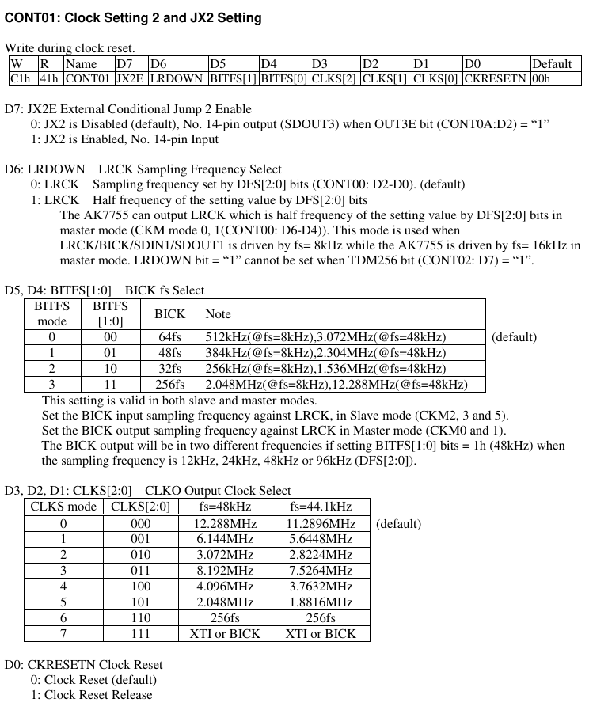

# AUDIO_CODEC

> AUDIO_CODEC 드라이버에 대한 문서.
>> AsahiKASEI 사 AK7755 를 레퍼런스 함.

 - block diagram
	

 - Path and Sequence 
   * playback(digital to analog)
	   
	  + SDIN1 -> DSP -> DAC -> OUT1/OUT2


   * recoding(analog to digital)
	   
	  + IN1/IN3 -> ADC -> DSP -> SDOUT1


	
## Develop

### regmap
 regmap 메커니즘은 Linux 3.1 에 추가 된 새로운 기능입니다.
 주요 목적은 I/O 드라이버에서 반복적인 논리 코드를 줄이고 기본 하드웨어에서 레지스터를 작동 할 수 있는 범용 인터페이스를 제공하는 것 입니다.
 
 에를 들어 이전에 i2c 장치의 레지스터를 조작하려면 i2c_transfer 인터페이스를 호출해야 합니다. 
 spi 장치 인터페이스를 조작하려면 spi_write / spi_read 와 같은 인터페이스를 호출해야 합니다.
 regmap 구조체의 regmap_read / regmap_write 를 호출해 대신 사용가능합니다.

 **struct regmap_config** 구조는 초기화 중에 구성해야 하는 장치의 레지스터 구성 정보를 나타냅니다.
```c
struct regmap_config {
	const char *name;				/* regmap name, 장치에 여러 레지스터 영역이 있을 때 사용 */

	int reg_bits;					/* register 주소 bit, 필수 */
	int reg_stride;					/* register 주소 스테핑 */
	int pad_bits;					/* register 와 value 사이의 padding bit 수 */
	int val_bits;					/* register value 의 bit, 필수 */

	/* register status 를 판단하는데 사용(ex. read 가능 여부, write 가능 여부)
	bool (*writeable_reg)(struct device *dev, unsigned int reg);
	bool (*readable_reg)(struct device *dev, unsigned int reg);
	bool (*volatile_reg)(struct device *dev, unsigned int reg);	
	/**
	  * volatile_reg : cache를 통해 register 를 write 하거나 read 할때마다 호출됩니다.
	  * driver가 regmap cache를 통해 레지스터를 read 하거나 write 할때마다 이 함수가 먼저 호출되고, 
	  * 'false'를 반환하면 cache method가 사용 됩니다. 
	  * 'true'를 반환하면 register 가 휘발성이고 cache를 사용하지 않기 때문에 register를 read, write 합니다.
	  */
	bool (*precious_reg)(struct device *dev, unsigned int reg);
	bool (*readable_noinc_reg)(struct device *dev, unsigned int reg);

	bool disable_locking;
	regmap_lock lock;
	regmap_unlock unlock;
	void *lock_arg;

	/* read write register call back 함수 */
	int (*reg_read)(void *context, unsigned int reg, unsigned int *val);
	int (*reg_write)(void *context, unsigned int reg, unsigned int val);

	bool fast_io;

	unsigned int max_register;		/* 최대 레지스터 주소 */
	const struct regmap_access_table *wr_table;
	const struct regmap_access_table *rd_table;
	const struct regmap_access_table *volatile_table;
	const struct regmap_access_table *precious_table;
	const struct regmap_access_table *rd_noinc_table;
	const struct reg_default *reg_defaults;	/* 초기화 후 기본 레지스터 값 */
	unsigned int num_reg_defaults;	/* 기본 레지스터 갯수 */

	/** 
	  * regmap은 caching을 지원합니다. cache_type field에 따라서 cache system 사용 여부를 판단합니다. 
	  * REGCACHE_NONE : (default) cache 비활성화
	  * cache 저장 방법을 정의합니다.
	  * REGCACHE_RBTREE  
	  * REGCACHE_COMPORESSED  
	  * REGCACHE_FLAT 
	  */
	enum regcache_type cache_type;
	const void *reg_defaults_raw;
	unsigned int num_reg_defaults_raw;

	unsigned long read_flag_mask;
	unsigned long write_flag_mask;
	bool zero_flag_mask;

	bool use_single_rw;
	bool can_multi_write;

	/* register 와 값의 끝 */
	enum regmap_endian reg_format_endian;
	enum regmap_endian val_format_endian;

	const struct regmap_range_cfg *ranges;	/* 가상 주소 범위 */
	unsigned int num_ranges;

	bool use_hwlock;
	unsigned int hwlock_id;
	unsigned int hwlock_mode;
};
```

### regmap api 
 디바이스 드라이버 초기화 시, device의 register 정보, bit length, address bit length, register bus 등을 정의합니다. 
 regmap을 초기화 하고 다른 bus에  해당하는 초기화 함수를 호출합니다.
 초기화가 완료된 후 regmap API를 호출하여 정상적으로 read  write 를 할수 있습니다.
 
 * interface 초기화

```c
//i2c
#define devm_regmap_init_i2c(i2c, config)        \
  __regmap_lockdep_wrapper(__devm_regmap_init_i2c, #config,  \
        i2c, config)
//spi       
#define devm_regmap_init_spi(dev, config)        \
  __regmap_lockdep_wrapper(__devm_regmap_init_spi, #config,  \
        dev, config)

```
 * read write interface
```c
int regmap_write(struct regmap *map, unsigned int reg, unsigned int val);
int regmap_read(struct regmap *map, unsigned int reg, unsigned int *val);

```

 * 종료

```c
void regmap_exit(struct regmap *map);
```

### ALSA 

#### Kcontrol

##### Kcontrol 이란?

 - audio codec의 기능(register)을 user space application에서 제어할 수 있도록 ALSA kernel driver 에서 제공하는 인터페이스 중 핵심이 되는 중요 요소.

 user space application은 audio codec을 문자열을 통하여 제어한다. 

 ex>
```bash
Mixer name: 'rockchip,ak7755'
Number of controls: 76
ctl     type    num     name                                     value

0       INT     1       MIC Input Volume L                       0
1       INT     1       MIC Input Volume R                       0
2       INT     1       Line Out Volume 1                        15
3       INT     1       Line Out Volume 2                        15
4       INT     1       Line Out Volume 3                        15
5       ENUM    1       Line Input Volume                        0dB
6       INT     1       ADC Digital Volume L                     207
7       INT     1       ADC Digital Volume R                     207
8       INT     1       ADC2 Digital Volume L                    207
9       INT     1       ADC2 Digital Volume R                    207
10      INT     1       DAC Digital Volume L                     231
11      INT     1       DAC Digital Volume R                     231
12      BOOL    1       ADC Mute                                 Off
13      BOOL    1       ADC2 Mute                                Off
14      BOOL    1       DAC Mute                                 On
15      BOOL    1       Analog DRC Lch                           Off
16      BOOL    1       Analog DRC Rch                           Off
17      BOOL    1       MICGAIN Lch Zero-cross                   Off
18      BOOL    1       MICGAIN Rch Zero-cross                   Off
19      ENUM    1       DAC De-emphasis                          Off
20      BOOL    1       JX0 Enable                               Off
21      BOOL    1       JX1 Enable                               Off
22      BOOL    1       JX2 Enable                               Off
23      BOOL    1       JX3 Enable                               Off
24      ENUM    1       DLRAM Mode(Bank1:Bank0)                  0:8192
25      ENUM    1       DRAM Size(Bank1:Bank0)                   512:1536
26      ENUM    1       DRAM Addressing Mode(Bank1:Bank0)        Ring:Ring
27      ENUM    1       POMODE DLRAM Pointer 0                   DBUS Immediate
28      ENUM    1       CRAM Memory Assignment                   33 word
29      ENUM    1       FIRMODE1 Accelerator Ch1                 Adaptive Filter
30      ENUM    1       FIRMODE2 Accelerator Ch2                 Adaptive Filter
31      ENUM    1       SUBMODE1 Accelerator Ch1                 Fullband
32      ENUM    1       SUBMODE2 Accelerator Ch2                 Fullband
33      ENUM    1       Accelerator Memory(ch1:ch2)              2048:-
34      ENUM    1       CLKO pin                                 CLKO=L
35      ENUM    1       CLKO Output Clock                        XTI or BICK
36      ENUM    1       BICK fs                                  48fs
37      ENUM    1       DSP Firmware PRAM                        basic
38      ENUM    1       DSP Firmware CRAM                        basic
39      ENUM    1       DSP Firmware OFREG                       basic
40      ENUM    1       DSP Firmware ACRAM                       basic
41      ENUM    1       Set CRAM Address H                       00
42      ENUM    1       Set CRAM Address L                       00
43      ENUM    1       Set CRAM Data H                          00
44      ENUM    1       Set CRAM Data M                          00
45      ENUM    1       Set CRAM Data L                          00
46      INT     1       Read MIR                                 0
47      ENUM    1       CRAM EQ1 Level                           0dB
48      ENUM    1       CRAM EQ2 Level                           0dB
49      ENUM    1       CRAM EQ3 Level                           0dB
50      ENUM    1       CRAM EQ4 Level                           0dB
51      ENUM    1       CRAM EQ5 Level                           0dB
52      ENUM    1       CRAM HPF1 fc                             Off
53      ENUM    1       CRAM HPF2 fc                             Off
54      ENUM    1       CRAM Limiter Release Time                128ms
55      ENUM    1       CRAM Limiter Volume                      Off
56      ENUM    1       SELMIX2-0                                SDOUTAD
57      BOOL    1       LineOut Amp3 Mixer LOSW1                 Off
58      BOOL    1       LineOut Amp3 Mixer LOSW2                 Off
59      BOOL    1       LineOut Amp3 Mixer LOSW3                 Off
60      ENUM    1       LineOut Amp2                             Off
61      ENUM    1       LineOut Amp1                             Off
62      ENUM    1       RIN MUX                                  IN3
63      ENUM    1       LIN MUX                                  IN1
64      ENUM    1       DSPIN SDOUTAD2                           Off
65      ENUM    1       DSPIN SDOUTAD                            Off
66      BOOL    1       SDOUT3 Enable Switch                     Off
67      BOOL    1       SDOUT2 Enable Switch                     Off
68      BOOL    1       SDOUT1 Enable Switch                     Off
69      ENUM    1       SDOUT3 MUX                               DSP DOUT3
70      ENUM    1       SDOUT2 MUX                               DSP
71      ENUM    1       SDOUT1 MUX                               DSP
72      ENUM    1       DAC MUX                                  DSP
73      ENUM    1       SELMIX DSP                               Off
74      ENUM    1       SELMIX AD2                               Off
75      ENUM    1       SELMIX AD                                Off

rk3568_poc:/ # tinymix  35
CLKO Output Clock: 12.288MHz 6.144MHz 3.072MHz 8.192MHz 4.096MHz 2.048MHz 256fs >XTI or BICK
```
 - widget 이나 path 에 독립적인 kcontrol 도 있으며, widget과 path 와 깊이 연관된 kcontrol도 있다.

 - kcontrol 은 구조체 이름을 말하며 종류가 두가지 있다.
 > snd_kcontrol_new 구조체와 snd_kcontrol 구조체가 있다.
   * snd_kcontrol_new 구조체는 선언 및 kcontrol 등록 함수에 매개 변수로 사용되는 구조체.
   * snd_kcontrol 구조체는 운용되기 위해 사용되는 구조체.
   * snd_soc_add_controls 함수에서 snd_kcontrol_new 가 snd_kcontrol로 변환되어 등록 됨.


##### Kcontrol 구조체

 - snd_kcontrol_new 구조체와 snd_kcontrol 구조체. 

```c
struct snd_kcontrol_new {
	snd_ctl_elem_iface_t iface;	/* interface identifier */
	// kcontrol 의 interface 종류를 나타낸다. 명시적인 것이라 제어에 영향을 미치지 않는다
	unsigned int device;		/* device/client number */
	// 사용하지 않는다.(미확인)
	unsigned int subdevice;		/* subdevice (substream) number */
	// 사용하지 않는다.(미확인)
	const unsigned char *name;	/* ASCII name of item */
	// kcontrol 의 이름
	unsigned int index;		/* index of item */
	// 사용처 없음(확인 필요)
	unsigned int access;		/* access rights */
	// kcontrol 접근 권한에 대해 설정한다.(RW)
	unsigned int count;		/* count of same elements */
	// 사용처 없음 (확인 필요), 대부분 0 이기 때문에 1로 세팅 된다.
	snd_kcontrol_info_t *info;
	// User Space 에서 Kcontrol 에 대한 정보 요청시 수행 할 함수 포인터
	snd_kcontrol_get_t *get;
	// User Space 에서 Kcontrol 에 대한 현재 값 요청시 수행 할 함수 포인터
	snd_kcontrol_put_t *put;
	// User Space 에서 Kcontrol 에 대한 값 수정시 수행 할 함수 포인터
	union {
		snd_kcontrol_tlv_rw_t *c;
		// 사용처 없음 (확인 필요)
		const unsigned int *p;
		// 종류에 따라 soc_enum 구조체의 첫 주소나, dB 범위를 지정한 int 형 배열의 첫 주소가 들어 간다.
	} tlv;
	unsigned long private_value;
	// 대부분 soc_mixer_control 구조체의 첫 주소가 들어간다.
};

struct snd_kcontrol_volatile {
	struct snd_ctl_file *owner;	/* locked */
	unsigned int access;	/* access rights */
};

struct snd_kcontrol {
	struct list_head list;		/* list of controls */
	struct snd_ctl_elem_id id;
	unsigned int count;		/* count of same elements */
	snd_kcontrol_info_t *info;
	snd_kcontrol_get_t *get;
	snd_kcontrol_put_t *put;
	union {
		snd_kcontrol_tlv_rw_t *c;
		const unsigned int *p;
	} tlv;
	unsigned long private_value;
	void *private_data;
	void (*private_free)(struct snd_kcontrol *kcontrol);
	struct snd_kcontrol_volatile vd[0];	/* volatile data */
};
```

##### Kcontrol 선언

 - ALSA driver 에서는 kcontrol 을 쉽게 선언하기 위해서 MACRO를 제공한다.
	 MACRO를 통하여 snd_kcontrol_new을 생성한다.

```c
#define AK7755_C1_CLOCK_SETTING2			0xC1

static const char *ak7755_bank_select_texts[] = 
		{"0:8192", "1024:7168","2048:6144","3072:5120","4096:4096",
			"5120:3072","6144:2048","7168:1024","8192:0"};
static const char *ak7755_drms_select_texts[] = 
		{"512:1536", "1024:1024", "1536:512"};
static const char *ak7755_dram_select_texts[] = 
		{"Ring:Ring", "Ring:Linear", "Linear:Ring", "Linear:Linear"};
static const char *ak7755_pomode_select_texts[] = {"DBUS Immediate", "OFREG"};
static const char *ak7755_wavp_select_texts[] = 
		{"33 word", "65 word", "129 word", "257 word"};
static const char *ak7755_filmode1_select_texts[] = {"Adaptive Filter", "FIR Filter"};
static const char *ak7755_filmode2_select_texts[] = {"Adaptive Filter", "FIR Filter"};
static const char *ak7755_submode1_select_texts[] = {"Fullband", "Subband"};
static const char *ak7755_submode2_select_texts[] = {"Fullband", "Subband"};
static const char *ak7755_memdiv_select_texts[] = 
		{"2048:-", "1792:256", "1536:512", "1024:1024"};
static const char *ak7755_dem_select_texts[] = {"Off", "48kHz", "44.1kHz", "32kHz"};
static const char *ak7755_clkoe_select_texts[] = {"CLKO=L", "CLKO Out Enable"};
static const char *ak7755_clks_select_texts[] = 			// CLKO Output Clock
		{"12.288MHz", "6.144MHz", "3.072MHz", "8.192MHz",
			"4.096MHz", "2.048MHz", "256fs", "XTI or BICK"};

static const struct soc_enum ak7755_set_enum[] = {
	SOC_ENUM_SINGLE(AK7755_C3_DELAY_RAM_DSP_IO, 0,
			ARRAY_SIZE(ak7755_bank_select_texts), ak7755_bank_select_texts),
	SOC_ENUM_SINGLE(AK7755_C4_DATARAM_CRAM_SETTING, 6,
			ARRAY_SIZE(ak7755_drms_select_texts), ak7755_drms_select_texts),
	SOC_ENUM_SINGLE(AK7755_C4_DATARAM_CRAM_SETTING, 4,
			ARRAY_SIZE(ak7755_dram_select_texts), ak7755_dram_select_texts),
	SOC_ENUM_SINGLE(AK7755_C4_DATARAM_CRAM_SETTING, 3,
			ARRAY_SIZE(ak7755_pomode_select_texts), ak7755_pomode_select_texts),
	SOC_ENUM_SINGLE(AK7755_C4_DATARAM_CRAM_SETTING, 0,
			ARRAY_SIZE(ak7755_wavp_select_texts), ak7755_wavp_select_texts),
	SOC_ENUM_SINGLE(AK7755_C5_ACCELARETOR_SETTING, 5,
			ARRAY_SIZE(ak7755_filmode1_select_texts), ak7755_filmode1_select_texts),
	SOC_ENUM_SINGLE(AK7755_C5_ACCELARETOR_SETTING, 4,
			ARRAY_SIZE(ak7755_filmode2_select_texts), ak7755_filmode2_select_texts),
	SOC_ENUM_SINGLE(AK7755_C5_ACCELARETOR_SETTING, 3,
			ARRAY_SIZE(ak7755_submode1_select_texts), ak7755_submode1_select_texts),
	SOC_ENUM_SINGLE(AK7755_C5_ACCELARETOR_SETTING, 2,
			ARRAY_SIZE(ak7755_submode2_select_texts), ak7755_submode2_select_texts),
	SOC_ENUM_SINGLE(AK7755_C5_ACCELARETOR_SETTING, 0,
			ARRAY_SIZE(ak7755_memdiv_select_texts), ak7755_memdiv_select_texts),
	SOC_ENUM_SINGLE(AK7755_C6_DAC_DEM_SETTING, 6,
			ARRAY_SIZE(ak7755_dem_select_texts), ak7755_dem_select_texts),
	SOC_ENUM_SINGLE(AK7755_CA_CLK_SDOUT_SETTING, 7,
			ARRAY_SIZE(ak7755_clkoe_select_texts), ak7755_clkoe_select_texts),
	SOC_ENUM_SINGLE(AK7755_C1_CLOCK_SETTING2, 1,			// CLKO Output Clock
			ARRAY_SIZE(ak7755_clks_select_texts), ak7755_clks_select_texts),
};

#define SOC_ENUM(xname, xenum) \
{	.iface = SNDRV_CTL_ELEM_IFACE_MIXER, .name = xname,\
	.info = snd_soc_info_enum_double, \
	.get = snd_soc_get_enum_double, .put = snd_soc_put_enum_double, \
	.private_value = (unsigned long)&(struct soc_mixer_control)
									{
										.reg = reg_left, 
										.rreg = reg_right, 
										.shift = xshift,
										.max = xmax,
										.platform_max = xmax,
										.invert = xinvert
									}

static const struct snd_kcontrol_new ak7755_snd_controls[] = {
	(...)
	SOC_ENUM("CLKO Output Clock", ak7755_set_enum[12]), 
	(...)
}	

```

 - MACRO를 모두 해석하면 아래와 같은 snd_kcontrol_new 구조체가 나온다.

```c
static const struct snd_kcontrol_new ak7755_snd_controls[] = {
	.iface = SNDRV_CTL_ELEM_IFACE_MIXER,
	.device = 0,
	.subdevice = 0,
	.name = "CLKO Output Clock",
	.index = 0,
	.access = SNDRV_CTL_ELEM_ACCESS_TLV_READ | SNDRV_CTL_ELEM_ACCESS_READWRITE,
	.count = 0,
	.info = snd_soc_info_enum_double,
	.get = snd_soc_get_enum_double, 
	.put = snd_soc_put_enum_double, 
	.tlv.p , 
	.private_value = (unsigned long)&(struct soc_mixer_control)
									{
										.reg = AK7755_C1_CLOCK_SETTING2, 
										.items = 8, 
										.texts =  {"12.288MHz", "6.144MHz", "3.072MHz", "8.192MHz",
										"4.096MHz", "2.048MHz", "256fs", "XTI or BICK"};
									}
};
```


 - User Space 에서 "CLKO Output Clock" 대한 값을 요청 했을 경우, 수행되는 함수.
 "CLKO Output Clock" snd_kcontrol_new  선언 시, 멤버 변수 get 포인트 함수를 수행하여 읽어온다.
 get 에는 snd_soc_get_enum_double 이 연결되어 있다. 
 put 에는 snd_soc_put_enum_double 이 연결되어 있다.

```c
int snd_soc_get_enum_double(struct snd_kcontrol *kcontrol,
	struct snd_ctl_elem_value *ucontrol)
{
	struct snd_soc_component *component = snd_kcontrol_chip(kcontrol);
	struct soc_enum *e = (struct soc_enum *)kcontrol->private_value;
	unsigned int val, item;
	unsigned int reg_val;
	int ret;

	ret = snd_soc_component_read(component, e->reg, &reg_val);
	if (ret)
		return ret;
	val = (reg_val >> e->shift_l) & e->mask;
	item = snd_soc_enum_val_to_item(e, val);
	ucontrol->value.enumerated.item[0] = item;
	if (e->shift_l != e->shift_r) {
		val = (reg_val >> e->shift_r) & e->mask;
		item = snd_soc_enum_val_to_item(e, val);
		ucontrol->value.enumerated.item[1] = item;
	}

	return 0;
}
```


 - Linux kernel source의 audio codec device drier 의 source code안에 MACRO를 통하여 많은 snd_kcontrol_new가 선언되어 있다.

```c
static const struct snd_kcontrol_new ak7755_snd_controls[] = {
	SOC_SINGLE_TLV("MIC Input Volume L",
			AK7755_D2_MIC_GAIN_SETTING, 0, 0x0F, 0, mgnl_tlv),
	SOC_SINGLE_TLV("MIC Input Volume R",
			AK7755_D2_MIC_GAIN_SETTING, 4, 0x0F, 0, mgnr_tlv),
	SOC_SINGLE_TLV("Line Out Volume 1",
			AK7755_D4_LO1_LO2_VOLUME_SETTING, 0, 0x0F, 0, lovol1_tlv),
	SOC_SINGLE_TLV("Line Out Volume 2",
			AK7755_D4_LO1_LO2_VOLUME_SETTING, 4, 0x0F, 0, lovol2_tlv),
	SOC_SINGLE_TLV("Line Out Volume 3",
			AK7755_D3_LIN_LO3_VOLUME_SETTING, 0, 0x0F, 0, lovol3_tlv),
	SOC_ENUM_EXT("Line Input Volume", ak7755_linein_enum, get_linein, set_linein),  // 16/03/25 ak7755_linein_enum[0] => ak7755_linein_enum
	SOC_SINGLE_TLV("ADC Digital Volume L",
			AK7755_D5_ADC_DVOLUME_SETTING1, 0, 0xFF, 1, voladl_tlv),
	SOC_SINGLE_TLV("ADC Digital Volume R",
			AK7755_D6_ADC_DVOLUME_SETTING2, 0, 0xFF, 1, voladr_tlv),
	SOC_SINGLE_TLV("ADC2 Digital Volume L",
			AK7755_D7_ADC2_DVOLUME_SETTING1, 0, 0xFF, 1, volad2l_tlv),
	SOC_SINGLE_TLV("ADC2 Digital Volume R",
			AK7755_DD_ADC2_DVOLUME_SETTING2, 0, 0xFF, 1, volad2r_tlv),
	SOC_SINGLE_TLV("DAC Digital Volume L",
			AK7755_D8_DAC_DVOLUME_SETTING1, 0, 0xFF, 1, voldal_tlv),
	SOC_SINGLE_TLV("DAC Digital Volume R",
			AK7755_D9_DAC_DVOLUME_SETTING2, 0, 0xFF, 1, voldar_tlv),

	SOC_SINGLE("ADC Mute", AK7755_DA_MUTE_ADRC_ZEROCROSS_SET, 7, 1, 0),
	SOC_SINGLE("ADC2 Mute", AK7755_DA_MUTE_ADRC_ZEROCROSS_SET, 6, 1, 0), 
	SOC_SINGLE("DAC Mute", AK7755_DA_MUTE_ADRC_ZEROCROSS_SET, 5, 1, 0), 
	SOC_SINGLE("Analog DRC Lch", AK7755_DA_MUTE_ADRC_ZEROCROSS_SET, 2, 1, 0), 
	SOC_SINGLE("Analog DRC Rch", AK7755_DA_MUTE_ADRC_ZEROCROSS_SET, 3, 1, 0), 
	SOC_SINGLE("MICGAIN Lch Zero-cross", AK7755_DA_MUTE_ADRC_ZEROCROSS_SET, 0, 1, 0), 
	SOC_SINGLE("MICGAIN Rch Zero-cross", AK7755_DA_MUTE_ADRC_ZEROCROSS_SET, 1, 1, 0), 

	SOC_ENUM("DAC De-emphasis", ak7755_set_enum[10]), 

	SOC_SINGLE("JX0 Enable", AK7755_C2_SERIAL_DATA_FORMAT, 0, 1, 0),
	SOC_SINGLE("JX1 Enable", AK7755_C2_SERIAL_DATA_FORMAT, 1, 1, 0),
	SOC_SINGLE("JX2 Enable", AK7755_C1_CLOCK_SETTING2, 7, 1, 0),
	SOC_SINGLE("JX3 Enable", AK7755_C5_ACCELARETOR_SETTING, 6, 1, 0),

	SOC_ENUM("DLRAM Mode(Bank1:Bank0)", ak7755_set_enum[0]), 
	SOC_ENUM("DRAM Size(Bank1:Bank0)", ak7755_set_enum[1]), 
	SOC_ENUM("DRAM Addressing Mode(Bank1:Bank0)", ak7755_set_enum[2]), 
	SOC_ENUM("POMODE DLRAM Pointer 0", ak7755_set_enum[3]), 
	SOC_ENUM("CRAM Memory Assignment", ak7755_set_enum[4]), 
	SOC_ENUM("FIRMODE1 Accelerator Ch1", ak7755_set_enum[5]), 
	SOC_ENUM("FIRMODE2 Accelerator Ch2", ak7755_set_enum[6]), 
	SOC_ENUM("SUBMODE1 Accelerator Ch1", ak7755_set_enum[7]), 
	SOC_ENUM("SUBMODE2 Accelerator Ch2", ak7755_set_enum[8]), 
	SOC_ENUM("Accelerator Memory(ch1:ch2)", ak7755_set_enum[9]), 
	SOC_ENUM("CLKO pin", ak7755_set_enum[11]), 
	SOC_ENUM("CLKO Output Clock", ak7755_set_enum[12]), 
```

##### Kcontrol 등록 

 - 대부분 같은 audio codec device driver 안에서 MACRO를 통해 선언된 snd_kcontrol_new가 snd_soc_add_controls 함수를 통하여 snd_kcontrol 구조체로 변환되어 snd_card의 controls에 연결된다.
   * snd_soc_cnew 함수를 통해 snd_kcontrol_new 구조체가 snd_kcontrol 구조체로 변환.
   * snd_ctl_add 함수는 snd_card의 controls에 snd_kcontrol을 NUmbering하며 링크드리스트로 연결하고, kcontrol 총 개수를 관리.
```c

static int snd_soc_add_controls(struct snd_card *card, struct device *dev,
	const struct snd_kcontrol_new *controls, int num_controls,
	const char *prefix, void *data)
{
	int err, i;

	for (i = 0; i < num_controls; i++) {
		const struct snd_kcontrol_new *control = &controls[i];
		err = snd_ctl_add(card, snd_soc_cnew(control, data,
						     control->name, prefix));
		if (err < 0) {
			dev_err(dev, "ASoC: Failed to add %s: %d\n",
				control->name, err);
			return err;
		}
	}

	return 0;
}
```

 - kcontrol이 등록되면 snd_card 구조체의 controls에 다음과 같이 연결된다.


##### Kcontrol 운용


-----

### AK7755

> note : ak7755 Low 상태에서 소리 출력

```c
set_DSP_write_pram()
set_DSP_write_cram()
set_DSP_write_ofreg()
set_DSP_write_acram()
	|
	+-> ak7755_firmware_write_ram()
```


### RK817

> rockchip evboard codec


```c
static const struct snd_soc_component_driver soc_codec_dev_rk817 = {
	.probe = rk817_probe,
	(...)
};


static int rk817_probe(struct snd_soc_component *component)
{
	(...)
	snd_soc_add_component_controls(component, rk817_snd_path_controls,
					       ARRAY_SIZE(rk817_snd_path_controls));
}


static struct snd_kcontrol_new rk817_snd_path_controls[] = {
	SOC_ENUM_EXT("Playback Path", rk817_playback_path_type,
		rk817_playback_path_get, rk817_playback_path_put),
				 	
	SOC_ENUM_EXT("Capture MIC Path", rk817_capture_path_type,
		rk817_capture_path_get, rk817_capture_path_put),
};

/* For tiny alsa playback/capture/voice call path */
static const char * const rk817_playback_path_mode[] = {
	"OFF", "RCV", "SPK", "HP", "HP_NO_MIC", "BT", "SPK_HP", /* 0-6 */
	"RING_SPK", "RING_HP", "RING_HP_NO_MIC", "RING_SPK_HP"}; /* 7-10 */

static SOC_ENUM_SINGLE_DECL(rk817_playback_path_type,
	0, 0, rk817_playback_path_mode);

static int rk817_playback_path_get(struct snd_kcontrol *kcontrol,
				   struct snd_ctl_elem_value *ucontrol)
{
	struct snd_soc_component *component = snd_soc_kcontrol_component(kcontrol);
	struct rk817_codec_priv *rk817 = snd_soc_component_get_drvdata(component);

	DBG("%s : playback_path %ld\n", __func__, rk817->playback_path);

	ucontrol->value.integer.value[0] = rk817->playback_path;

	return 0;
}

static int rk817_playback_path_put(struct snd_kcontrol *kcontrol,
				   struct snd_ctl_elem_value *ucontrol)
{
	struct snd_soc_component *component = snd_soc_kcontrol_component(kcontrol);
	struct rk817_codec_priv *rk817 = snd_soc_component_get_drvdata(component);

	if (rk817->playback_path == ucontrol->value.integer.value[0]) {
		DBG("%s : playback_path is not changed!\n",
		    __func__);
		return 0;
	}

	return rk817_playback_path_config(component, rk817->playback_path,
					  ucontrol->value.integer.value[0]);
}

```

