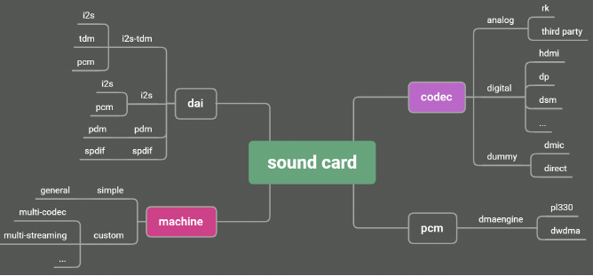

# AUDIO_CODEC

 - Linux Sound Subsystem Documentation : https://www.kernel.org/doc/html/latest/sound/index.html

> AUDIO_CODEC 드라이버에 대한 문서.
>> AsahiKASEI 사 AK7755 를 레퍼런스 함.

 - block diagram
	

 - Path and Sequence 
   * playback(digital to analog)
	  + SDIN1 -> DSP -> DAC -> OUT1/OUT2
	   


   * recoding(analog to digital)
	  + IN1/IN3 -> ADC -> DSP -> SDOUT1
	   


<br />
<br />
<br />
<br />
<br />

-----

	
# Develop


## sound card 

 - ALSA sound card 구성  

  
   * DAI : Digital Audio Interface
   * MACHINE : Link dai and codec to be a new sound card
   * DMAENGINE : Transfer data between memory and dai's fifo

 > 일반적으로 SDK를 기반으로하여 sound card를 추가하려면 codec driver를 작성만 하면되지만, 경우에 따라서 machine driver를 추가해야 하는 경우도 있다. 


## I2S

### master / slave

 - 설정  
   master / slave설정은 machine driver를 통해 dts를 파싱 한 후, set_fmt API를 호출하여 controler 의 protocol type을 설정한다.   


## Machine driver  

 - simple card는 ASoC용 공통으로 사용되는 Machine driver로 대부분의 표준 사운드 카드 추가를 지원합니다. 
 
### dts

```dtb
ak7755_sound: ak7755-sound {
	status = "okay";
	compatible = "simple-audio-card";
	simple-audio-card,format = "i2s";			// protocol; i2s, right_j, left_j, dsp_a, dsp_b, pdm
	simple-audio-card,name = "rockchip,ak7755";
	simple-audio-card,mclk-fs = <256>;			// sampling rate; by default, mclk is 256 time

	simple-audio-card,cpu {
		sound-dai = <&i2s_2ch>;
	};

	simple-audio-card,codec {
		sound-dai = <&ak7755_codec>;
	};
};


```

## regmap
 regmap 메커니즘은 Linux 3.1 에 추가 된 새로운 기능입니다.
 주요 목적은 I/O 드라이버에서 반복적인 논리 코드를 줄이고 기본 하드웨어에서 레지스터를 작동 할 수 있는 범용 인터페이스를 제공하는 것 입니다.
 
 에를 들어 이전에 i2c 장치의 레지스터를 조작하려면 i2c_transfer 인터페이스를 호출해야 합니다. 
 spi 장치 인터페이스를 조작하려면 spi_write / spi_read 와 같은 인터페이스를 호출해야 합니다.

 kernel 3.8 버전으로 오면서 regmap을 사용하도록 되어 있다.

 regmap 구조체의 regmap_read / regmap_write 를 호출해 대신 사용가능합니다.
 아래 함수를 통해 addr_bits, data_bits 를 정해준다.

 snd_soc_codec_set_cache_io의 3번째 매개변수를 통하여 다음과 같이 구분하여 regmap_init을 한다.
 (SND_SOC_REGMAP을 처음부터 하였다면 그전에 이미 register set이 REGMAP으로 등록되어 있어야 한다.
 ex. snd_soc_codec_set_cache_io(codec, 8, 16, SND_SOC_I2S))
```c
enum snd_soc_control_type {
	SND_SOC_I2C = 1,
	SND_SOC_SPI,
	SND_SOC_REGMAP,
};

int snd_soc_codec_set_cache_io(struct snd_soc_codec *codec, 
	int addr_bits, int data_bits, 
	enum snd_soc_control_type contol)


	codec->write = hw_write;
	codec->read = hw_read;


static int hw_write(struct snd_soc_codec *codec, unsigned int reg, unsigned int value)
{
	(...)
	return regmap_write(codec->control_data, reg, value);
}

static unsigned int hw_read(struct snd_soc_codec *codec, unsigned int reg)
{
	(...)
	ret = snd_soc_cache_read(codec, reg, &val);
}

```

### Implementing regmap
 regmap 은 Linux API로 **include/linux/regmap.h**을 통해 제공되며, **drivers/base/regmap/**에 구현되어있다.
 struct **regmap_config**와 struct **regmap** 이 중요함.
 
 - struct regmap_config
 	device와 통신하기 위해 regmap sub-system에서 사용하는 device별 configuration structure이다.
	driver code에 의해 정의되며 device의 register와 관련된 모든 정보를 포함한다.
	중요한 필드에 대한 설명은 다음과 같다.
		
   * reg_bits : 
   * val_bits : 
   * writeable_reg : 
   * wr_table : 
   * readable_reg : 
   * rd_table : 
   * volatile_reg : 
   * volatile_table : 
   * lock : 
   * unlock : 
   * lock_arg : 
   * fast_io : 
   * max_register :
   * read_flag_mask : 
   * write_flag_mask :

 **struct regmap_config** 구조는 초기화 중에 구성해야 하는 장치의 레지스터 구성 정보를 나타냅니다.
```c
struct regmap_config {
	const char *name;				/* regmap name, 장치에 여러 레지스터 영역이 있을 때 사용 */

	int reg_bits;					/* register 주소 bit, 필수 */
	int reg_stride;					/* register 주소 스테핑 */
	int pad_bits;					/* register 와 value 사이의 padding bit 수 */
	int val_bits;					/* register value 의 bit, 필수 */

	/* register status 를 판단하는데 사용(ex. read 가능 여부, write 가능 여부)
	bool (*writeable_reg)(struct device *dev, unsigned int reg);
	bool (*readable_reg)(struct device *dev, unsigned int reg);
	bool (*volatile_reg)(struct device *dev, unsigned int reg);	
	/**
	  * volatile_reg : cache를 통해 register 를 write 하거나 read 할때마다 호출됩니다.
	  * driver가 regmap cache를 통해 레지스터를 read 하거나 write 할때마다 이 함수가 먼저 호출되고, 
	  * 'false'를 반환하면 cache method가 사용 됩니다. 
	  * 'true'를 반환하면 register 가 휘발성이고 cache를 사용하지 않기 때문에 register를 read, write 합니다.
	  */
	bool (*precious_reg)(struct device *dev, unsigned int reg);
	bool (*readable_noinc_reg)(struct device *dev, unsigned int reg);

	bool disable_locking;
	regmap_lock lock;
	regmap_unlock unlock;
	void *lock_arg;

	/* read write register call back 함수 */
	int (*reg_read)(void *context, unsigned int reg, unsigned int *val);
	int (*reg_write)(void *context, unsigned int reg, unsigned int val);

	bool fast_io;

	unsigned int max_register;		/* 최대 레지스터 주소 */
	const struct regmap_access_table *wr_table;
	const struct regmap_access_table *rd_table;
	const struct regmap_access_table *volatile_table;
	const struct regmap_access_table *precious_table;
	const struct regmap_access_table *rd_noinc_table;
	const struct reg_default *reg_defaults;	/* 초기화 후 기본 레지스터 값 */
	unsigned int num_reg_defaults;	/* 기본 레지스터 갯수 */

	/** 
	  * regmap은 caching을 지원합니다. cache_type field에 따라서 cache system 사용 여부를 판단합니다. 
	  * REGCACHE_NONE : (default) cache 비활성화
	  * cache 저장 방법을 정의합니다.
	  * REGCACHE_RBTREE  
	  * REGCACHE_COMPORESSED  
	  * REGCACHE_FLAT 
	  */
	enum regcache_type cache_type;
	const void *reg_defaults_raw;
	unsigned int num_reg_defaults_raw;

	unsigned long read_flag_mask;
	unsigned long write_flag_mask;
	bool zero_flag_mask;

	bool use_single_rw;
	bool can_multi_write;

	/* register 와 값의 끝 */
	enum regmap_endian reg_format_endian;
	enum regmap_endian val_format_endian;

	const struct regmap_range_cfg *ranges;	/* 가상 주소 범위 */
	unsigned int num_ranges;

	bool use_hwlock;
	unsigned int hwlock_id;
	unsigned int hwlock_mode;
};
```

## regmap api 
 디바이스 드라이버 초기화 시, device의 register 정보, bit length, address bit length, register bus 등을 정의합니다. 
 regmap을 초기화 하고 다른 bus에  해당하는 초기화 함수를 호출합니다.
 초기화가 완료된 후 regmap API를 호출하여 정상적으로 read  write 를 할수 있습니다.
 
 * interface 초기화
 	regmap API 는 **include/linux/regmap.h**에 정의되어 있음.
	regmap 초기화 루틴에서 regmap_config 구성이 사용된다. 
	그런 다음 regmap structure가 할당되고 configuration이 복사된다.

	각 bus의 read/write function도 regmap structure에 복사됩니다.
  	예를 들어 SPI bus의 경우 regmap read 및 write function pointer는 SPI read 및 write function을 가리킵니다.

	regmap 초기화 후 드라이버는 다음 루틴을 사용하여 device와 통신할 수 있다.

	- regmap_write 
		+ regmap_write takes the lock.
		+ check register length. 
		 	(if it is less **max_register**, then only the write operation is performed; else -EIO(invalid I/O) is return)
		+ **writeable_reg** callback 이 **regmap_config** 에 정의된 경우, callback function가 호출된다. 
			(if that callback returns 'true', then further operations are done; if it returns 'false', then an error -EIO is returned.)
		+ cache permitted 여부를 확인한다.
			= permitted 되는 경우, hardware에 직접 write 하는 대신, register value을 cache에 저장하고 이 단계에서 작업을 마친다.
			= permitted 되지 않는 경우, 다음 단계로 넘어간다.
		+ hardware register에 value을 write하기 위해 hardware write routine이 호출된 경우, write_flag_mask를 첫번째 byte에 write한 후, value를 device에  write한다.
		+ write 이 완료되면 lock을 해제 되고 함수 returen한다.

	- regmap_read

	- caching
    	+ chching은 device에 직접 operations을 수행하지 않도록 한다. 
		+ 대신 device와 driver간에 전송되는 값을 cache에 저장하고 참조하여 사용한다.
		+ 초창기에는 flat arrays 를 사용했으나, 32-bit address 에 적합하지 않아 더 나은 cache type으로 변경되었다.
  		  = rbtree stores blocks of contiguous registers in a red/black tree
		  = Compressed stores blocks of compressed data
		  Both rely on the existing kernel library:

		  ```c
		  enum regcache_type cache_type;
		  ```
	  
```c
//i2c
#define devm_regmap_init_i2c(i2c, config)        \
  __regmap_lockdep_wrapper(__devm_regmap_init_i2c, #config,  \
        i2c, config)
//spi       
#define devm_regmap_init_spi(dev, config)        \
  __regmap_lockdep_wrapper(__devm_regmap_init_spi, #config,  \
        dev, config)

```
 * read write interface
```c

int snd_soc_component_write(struct snd_soc_component *component, unsigned reg, unsigned int val)
|	// return: 0 on success, a negative error code otherwise.
|	// component->regmap
+->	int regmap_write(struct regmap *map, unsigned int reg, unsigned int val);
	|	// drivers/base/regmap/regmap.c
	+->	int _regmap_write(struct regmap *map, unsigned int reg, unsigned int val)
		|

int regmap_read(struct regmap *map, unsigned int reg, unsigned int *val);
```


 * 종료

```c
void regmap_exit(struct regmap *map);
```

##

 * mixer control

```bash
tinymix 72 0 ; tinymix 73 1 ; tinymix 61 1

tinymix 72 0 ; tinymix 61 1 ; tinymix 71 5


> tinymix  24 5 ; tinymix 25 1 ; tinymix 26 1 ; tinymix 27 1 ; tinymix 28 1 ; tinymix 33 3 ; tinymix 36 0 ; tinymix  72 3 ;  
```


| Addr 	| Name                                                                  	| Value 	| Func                                                                                                                                                             	|
|------	|-----------------------------------------------------------------------	|-------	|------------------------------------------------------------------------------------------------------------------------------------------------------------------	|
| C0h  	| clock setting1, analog input setting                                  	| 0x38  	| Slave, Main Clock(BICK), Analog Input Setting                                                                                                                    	|
| C1h  	| clock setting2, JX2 setting                                           	| 0x0E  	| JX2 is disabled, LRCK sampling frequency set by DFS[2:0] bits, BITFS mode(0) BICK(64fs), CLKO output clock select(XTI or BICk)                                   	|
| C2h  	| serial data format, JX1, JX0 setting                                  	| 0x10  	| TDM interface(no), BICK Edge(falling), LRCK I/F Format(I2S), DSPDIN3&DSPDIN4 Input Source Select(no), JX1(no), JX)(no)                                           	|
| C3h  	| delay ram, dsp input / output setting                                 	| 0x05  	| DSP DIN2 Input Format Select(MSB 24bit), DSP DOUT2 Output Format Select(MSB (24bit), DLRAM mode setting(5120words,3072words)                                     	|
| C4h  	| data ram, cram setting                                                	| 0x61  	| Data RAM Size Setting(1024:1024), Data RAM Addressing mode Setting(Ring:Linear), DLRAM Pointer(OFREG), CRAM Memory Assignment(65word)                            	|
| C5h  	| accelerator setting, JX3 setting                                      	| 0x03  	| Accelator Memory Select(1024:1024)                                                                                                                               	|
| C6h  	| DAC De-emphasis, DAC and DSP Input Format Settings                    	| 0x00  	| DAC De-emphasis Setting(OFF), DAC Input Format Select(MSB Justified(24-bit)), MSB (24-bit)                                                                       	|
| C7h  	| DSP output format setting                                             	| 0x00  	| DSP DOUT4 Output Format Select(MSB justified (24-bit)), DSP DOUT3 Format Select(MSB justified (24-bit)), DSP DOUT1 Output Format Select(MSB(24-bit))             	|
| C8h  	| DAC input, SDOUT2 Output, SDOUT3 Output, Digital Mixer Input Settings 	| 0xC4  	| DAC Input Select(SDIN1), SDOUT3 pin Output Select(DSP DOUT3), SDOUT2 pint Output Select(GP1), Digital Mixer Input Select(SDOUTAD Rch)                            	|
| C9h  	| analog input / output setting                                         	| 0x02  	| INL ADC Lch Analog Input(IN1), OUT3 Mixing Select 3(LIN off), OUT3 Mixing Select 2(DAC Rch on), OUT3 Mixing Select 1(DAC Lch off), Digital Mixer Input Select(0) 	|
| CAh  	| CLK and SDOUT output setting                                          	| 0x00  	| CLKO(Low), BICK(Low), LRCK(Low), OUT3E(Low), OUT2E(Low), OUT1E(Low)                                                                                              	|
| CEh  	| ADC, DAC Lineout Power Management                                     	| 0x05  	| Lineout1 Power(normal), DAC Lch(normal) when CODEC Reset (CRESETN bit = "1")                                                                                     	|
| CFh  	| Reset Settings Lineout and Digital MIC2 Rch Power Management          	| 0x00  	| CODEC Reset N(CODEC Reset)                                                                                                                                       	|

   - C1h_D0 (CKRESETN Clock Reset) : 0 인경우, Clock Reset 을 진행합니다. 1 인경우, Clock Reset 을 release 합니다.

   - CFh_D3 (CRESETN; CODEC Reset N) : CODEC 의미는 ADC, DAC입니다.
   - CFh_D2 (DSPRESETN; DSP Reset N) : CRESETN bit = "0"이고 DSPRESETN bit = "0" 인경우, system reset 상태가 됩니다.
   - CFh_D0 (DLRDY; DSP Download Ready field) : clock reset(CKRESETN bit = "0")인 경우나 main clock이 멈춘 경우, **DLRDY** (DSP Download Ready field)를 1로 세팅하여 DSP programs과 coefficient data를 다운로드 할 수 있습니다. 다운로드 완료 후, **DSP Download Ready field** 를 0 으로 재 세팅 해야 합니다.

 * play

```bash
tinyplay /sdcard/Download/file_example_WAV_10MG.wav -D 0 -d 0; 

[2022-12-13 11:47:48]   [ak7755]        ak7755_reg_read(1375) :
[2022-12-13 11:47:48] [  230.351505]            [ak7755]        ak7755_i2c_read(1316) :
[2022-12-13 11:47:48] [  230.351698]            [ak7755]        ak7755_hw_params_set(2460) : receive nfs value(44100)
[2022-12-13 11:47:48] [  230.351718]            [ak7755]        ak7755_hw_params_set(2461) : addr 0xc0 read value(0x3d)
[2022-12-13 11:47:48] [ [  230.739491]          [ak7755]        ak7755_trigger(2643) :
[2022-12-13 11:47:48] [  230.739703]            [ak7755]        ak7755_set_dai_mute(2671) :


```
-----

## AUDIO HAL

 * alsa_route.c
	 ```c
	 route_card_init
	 ```
   - config_list.h : default_config.h cx2072_config.h
   -

<br />
<br />
<br />
<br />
<br />

-----

# AK7755

## Analysis

> datasheet 분석 

 - Control Register 설정.
   * power down(PDN pin = "L" -> "H") 이 release 되었을 때, Control Register 는 초기화 됨.
   * CONT00 ~ CONT01은 clock generation과 관련이있음. 
     + clock reset 시, (CKRESETN bit (CONT01:D0) = "0")으로 변경해야 함.
   * CONT12 ~ CONT19는 동작중에 write가능함. 
   * 그외 다른 register는 error 및 noise를 방지하기 위해 clock reset 또는 system reset(CRESETN bit(CONT0F:D3) 및 DSPRESETN bit(CONT0F:D2)="0") 중에 하나를 변경해야 함. 

   * 시스템 reset중에는 CONT0D:D6, CONT1A:D4, CONT26:D0, CONT2A:D7 bit 를 "1"로 설정해야 함.
     + 한번 "1"로 설정된 경우, power down이 발생되기 전까지, 값을 유지함. 
   * CONT1F ~ CONT25, CONT27 ~ CONT29, CONT2B ~ CONT3F register 는 write 하면 안됨.


## Develop

> note : ak7755 MUTE pin Low 상태에서 소리 출력

```c
set_DSP_write_pram()
set_DSP_write_cram()
set_DSP_write_ofreg()
set_DSP_write_acram()
	|
	+-> ak7755_firmware_write_ram()


```
 * legacy code 

```c
	/**
	  * register write (0xC0 ~ 0xEA)
	  */
	next = ak7755_normal_register;
	ak7755_reg_write(component, next->reg, next->def);

	/**
	  * 
	  */
	  apply_register(component, KDIWIN_AUDIO_PATH_NORMAL, 1);
	  	|
		+-> reg_control(component, AK7755_C1_CLOCK_SETTING2, 0x01, BIT_SET)
		|	|
		|	+-> /* C1h 레지스터의 값을 읽은 후, C1h_D0 (CKRESETN Clock Reset) 을 세팅 하여 clock reset 을 reset 한다. */
		+-> fw_download(component, pram_default, sizeof(pram_default));
		+-> fw_download(component, cram_door_default, sizeof(cram_door_default));
		|	|
		|	+-> reg_control(component, AK7755_CF_RESET_POWER_SETTING, 0x01, BIT_SET); 
		|		/*
		|		 * 1. DSP download ready 상태 : CFh_D0 (DLRDY; DSP Download Ready field) 를 세팅. 
		|		 * 2. write firmware
		|		 * 3. DSP download ready 상태 해제 : CFh_D0 (DLRDY; DSP Download Ready field) 를 해제 
		|		 */
		+-> reg_control(component, AK7755_CF_RESET_POWER_SETTING, 0x08, BIT_SET);
		|	/* CFh_CRESETN; CODEC Reset N : CODEC Reset Release */
		+-> reg_control(component, AK7755_CF_RESET_POWER_SETTING, 0x04, BIT_SET);
		|	/* CFh_DSPRESETN; DSP Reset N : DSP Reset Release */


```


<br />
<br />
<br />
<br />
<br />

-----

# RK817

> rockchip evboard codec


```c
static const struct snd_soc_component_driver soc_codec_dev_rk817 = {
	.probe = rk817_probe,
	(...)
};


static int rk817_probe(struct snd_soc_component *component)
{
	(...)
	snd_soc_add_component_controls(component, rk817_snd_path_controls,
					       ARRAY_SIZE(rk817_snd_path_controls));
}


static struct snd_kcontrol_new rk817_snd_path_controls[] = {
	SOC_ENUM_EXT("Playback Path", rk817_playback_path_type,
		rk817_playback_path_get, rk817_playback_path_put),
				 	
	SOC_ENUM_EXT("Capture MIC Path", rk817_capture_path_type,
		rk817_capture_path_get, rk817_capture_path_put),
};

/* For tiny alsa playback/capture/voice call path */
static const char * const rk817_playback_path_mode[] = {
	"OFF", "RCV", "SPK", "HP", "HP_NO_MIC", "BT", "SPK_HP", /* 0-6 */
	"RING_SPK", "RING_HP", "RING_HP_NO_MIC", "RING_SPK_HP"}; /* 7-10 */

static SOC_ENUM_SINGLE_DECL(rk817_playback_path_type,
	0, 0, rk817_playback_path_mode);

static int rk817_playback_path_get(struct snd_kcontrol *kcontrol,
				   struct snd_ctl_elem_value *ucontrol)
{
	struct snd_soc_component *component = snd_soc_kcontrol_component(kcontrol);
	struct rk817_codec_priv *rk817 = snd_soc_component_get_drvdata(component);

	DBG("%s : playback_path %ld\n", __func__, rk817->playback_path);

	ucontrol->value.integer.value[0] = rk817->playback_path;

	return 0;
}

static int rk817_playback_path_put(struct snd_kcontrol *kcontrol,
				   struct snd_ctl_elem_value *ucontrol)
{
	struct snd_soc_component *component = snd_soc_kcontrol_component(kcontrol);
	struct rk817_codec_priv *rk817 = snd_soc_component_get_drvdata(component);

	if (rk817->playback_path == ucontrol->value.integer.value[0]) {
		DBG("%s : playback_path is not changed!\n",
		    __func__);
		return 0;
	}

	return rk817_playback_path_config(component, rk817->playback_path,
					  ucontrol->value.integer.value[0]);
}

```

