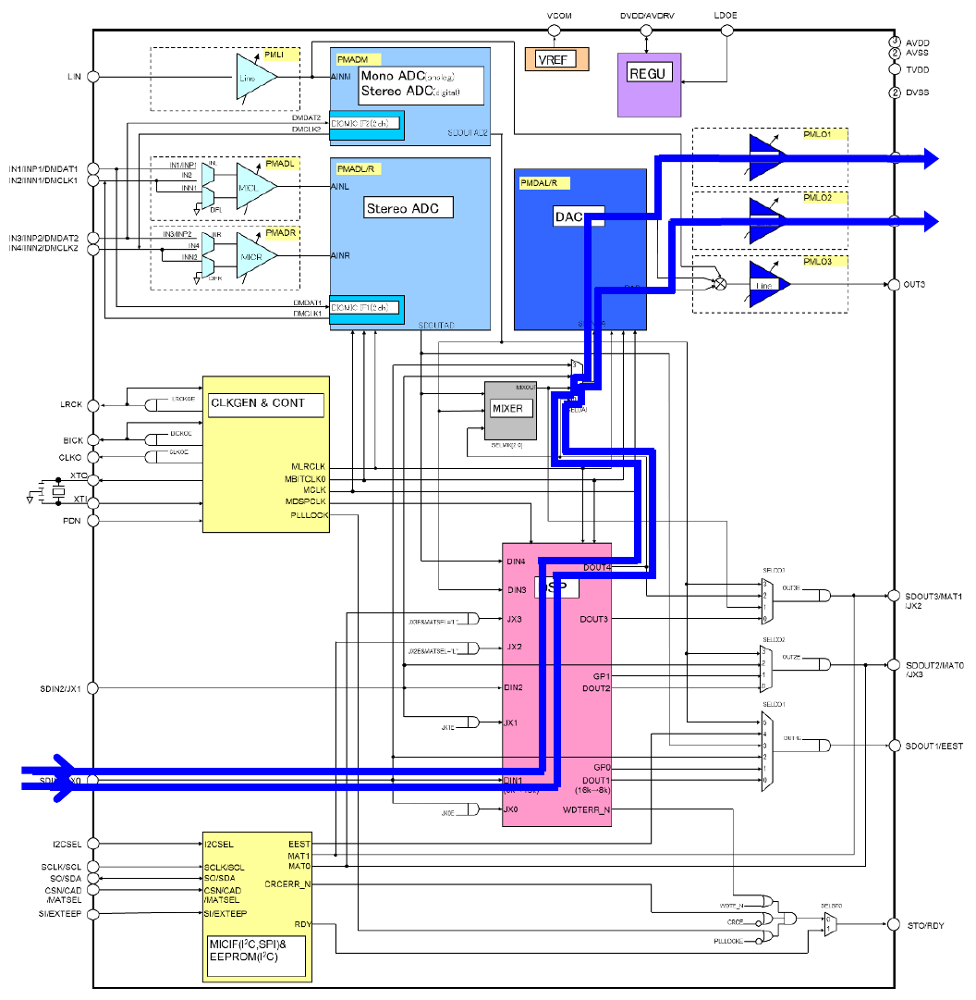

# AUDIO_CODEC

> AUDIO_CODEC 드라이버에 대한 문서.
>> AsahiKASEI 사 AK7755 를 레퍼런스 함.

 - block diagram
	

 - Path and Sequence 
   * playback(digital to analog)
	   
	  + SDIN1 -> DSP -> DAC -> OUT1/OUT2

   * recoding(analog to digital)
	   
	  + IN1/IN3 -> ADC -> DSP -> SDOUT1

	
