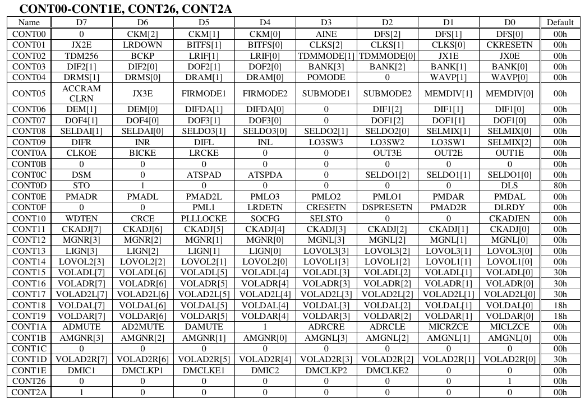
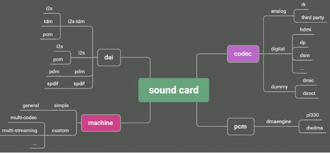
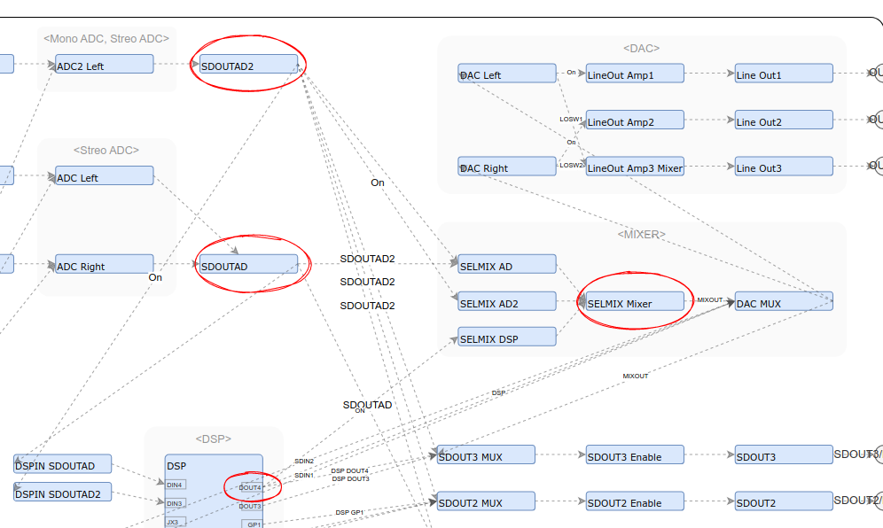
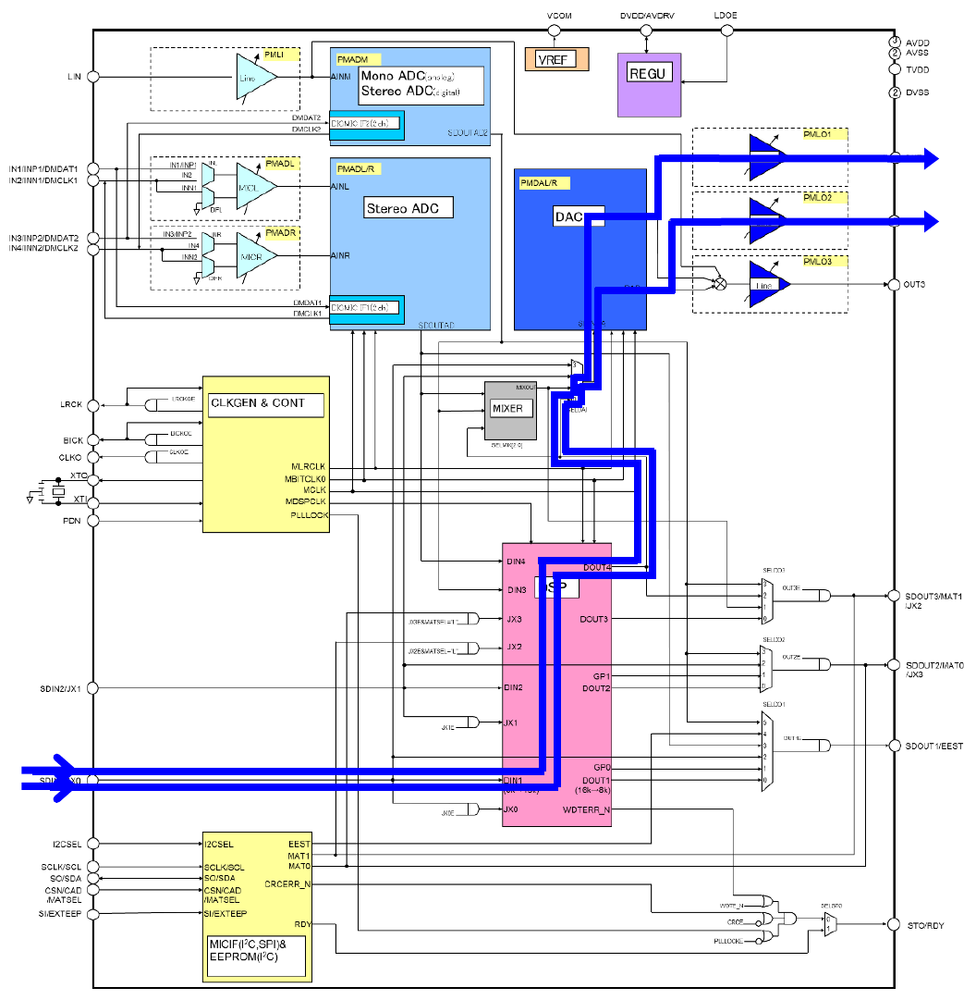
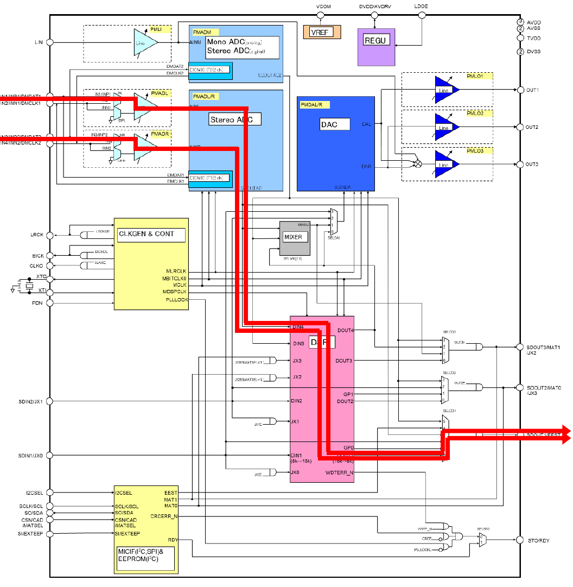

# AUDIO_CODEC
>  오디오 코덱 모듈(AK7755)을 개발하며 작성하는 문서


[AK7755](#ak7755)  
 - [Analysis](#analysis)  

[Develop](#develop)  
 - [ASoC : Audio System on Chip](#asoc--audio-system-on-chip)  
 - [sound card](#sound-card)  
 - [I2S](#i2s)  
     - [master / slave](#master--slave)  
 - [Machine driver](#machine-driver)  
     - [dts](#dts)  
 
 - [AK7755 Control Software](#ak7755-control-software)  
  
[Reference](#reference)  
 - [Reference RK817](#reference-rk817)  
 - [Reference Audio Codec driver Develop sample guide](#reference-audiocodec-driver-develop-sample)  
  
[Memo](#memo)  

<br/>
<br/>
<br/>
<br/>
<hr>


# AK7755

 AK7755EN 은 고성능 스테레오 오디오 코덱으로 사용자 프로그램 가능한 DSP 를 포함하고 있음.  

 DSP 에는 모노 ADC, 쓰테레오 오디오 CODEC, 마이크 프리앰프, 라인 출력 앰프 및 디지털 오디오 I/F가 포함됨.  
 AK7755EN은 48KHz  에서 2560 단계의 병렬 처리 능력을 갖고 있음.  
 
 RAM기반 DSP로 사용자 요구사항에 맞게 프로그램 할수 있음.  


## Analysis

> datasheet 분석 

 - Control Register 설정.
   * power down(PDN pin = "L" -> "H") 이 release 되었을 때, Control Register 는 초기화 됨.
   * CONT00 ~ CONT01은 clock generation과 관련이있음. 
     + clock reset 시, (CKRESETN bit (CONT01:D0) = "0")으로 변경해야 함.
   * CONT12 ~ CONT19는 동작중에 write가능함. 
   * 그외 다른 register는 error 및 noise를 방지하기 위해 clock reset 또는 system reset(CRESETN bit(CONT0F:D3) 및 DSPRESETN bit(CONT0F:D2)="0") 중에 하나를 변경해야 함. 

   * 시스템 reset중에는 CONT0D:D6, CONT1A:D4, CONT26:D0, CONT2A:D7 bit 를 "1"로 설정해야 함.
     + 한번 "1"로 설정된 경우, power down이 발생되기 전까지, 값을 유지함. 
   * CONT1F ~ CONT25, CONT27 ~ CONT29, CONT2B ~ CONT3F register 는 write 하면 안됨.



| Addr     | Name                                                                      | Value     | Func                                                                                                                                                                 |
|------    |-----------------------------------------------------------------------    |-------    |------------------------------------------------------------------------------------------------------------------------------------------------------------------    |
| C0h      | clock setting1, analog input setting                                      | 0x3D      | Slave, Main Clock(BICK), Analog Input Setting                                                                                                                        |
| C1h      | clock setting2, JX2 setting                                               | 0x0E      | JX2 is disabled, LRCK sampling frequency set by DFS[2:0] bits, BITFS mode(0) BICK(64fs), CLKO output clock select(XTI or BICk)                                       |
| C2h      | serial data format, JX1, JX0 setting                                      | 0x10      | TDM interface(no), BICK Edge(falling), LRCK I/F Format(I2S), DSPDIN3&DSPDIN4 Input Source Select(no), JX1(no), JX)(no)                                               |
| C3h      | delay ram, dsp input / output setting                                     | 0x05      | DSP DIN2 Input Format Select(MSB 24bit), DSP DOUT2 Output Format Select(MSB (24bit), DLRAM mode setting(5120words,3072words)                                         |
| C4h      | data ram, cram setting                                                    | 0x61      | Data RAM Size Setting(1024:1024), Data RAM Addressing mode Setting(Ring:Linear), DLRAM Pointer(OFREG), CRAM Memory Assignment(65word)                                |
| C5h      | accelerator setting, JX3 setting                                          | 0x03      | Accelator Memory Select(1024:1024)                                                                                                                                   |
| C6h      | DAC De-emphasis, DAC and DSP Input Format Settings                        | 0x00      | DAC De-emphasis Setting(OFF), DAC Input Format Select(MSB Justified(24-bit)), MSB (24-bit)                                                                           |
| C7h      | DSP output format setting                                                 | 0x00      | DSP DOUT4 Output Format Select(MSB justified (24-bit)), DSP DOUT3 Format Select(MSB justified (24-bit)), DSP DOUT1 Output Format Select(MSB(24-bit))                 |
| C8h      | DAC input, SDOUT2 Output, SDOUT3 Output, Digital Mixer Input Settings     | 0xC4      | DAC Input Select(SDIN1), SDOUT3 pin Output Select(DSP DOUT3), SDOUT2 pint Output Select(GP1), Digital Mixer Input Select(SDOUTAD Rch)                                |
| C9h      | analog input / output setting                                             | 0x02      | INL ADC Lch Analog Input(IN1), OUT3 Mixing Select 3(LIN off), OUT3 Mixing Select 2(DAC Rch on), OUT3 Mixing Select 1(DAC Lch off), Digital Mixer Input Select(0)     |
| CAh      | CLK and SDOUT output setting                                              | 0x00      | CLKO(Low), BICK(Low), LRCK(Low), OUT3E(Low), OUT2E(Low), OUT1E(Low)                                                                                                  |
| CEh      | ADC, DAC Lineout Power Management                                         | 0x05      | Lineout1 Power(normal), DAC Lch(normal) when CODEC Reset (CRESETN bit = "1")                                                                                         |
| CFh      | Reset Settings Lineout and Digital MIC2 Rch Power Management              | 0x00      | CODEC Reset N(CODEC Reset)                                                                                                                                           |
  
 - C1h_D0 (CKRESETN Clock Reset) : 0 인경우, Clock Reset 을 진행합니다. 1 인경우, Clock Reset 을 release 합니다.  
 - CFh_D3 (CRESETN; CODEC Reset N) : CODEC 의미는 ADC, DAC입니다.  
 - CFh_D2 (DSPRESETN; DSP Reset N) : CRESETN bit = "0"이고 DSPRESETN bit = "0" 인경우, system reset 상태가 됩니다.  
 - CFh_D0 (DLRDY; DSP Download Ready field) : clock reset(CKRESETN bit = "0")인 경우나 main clock이 멈춘 경우,    
          **DLRDY** (DSP Download Ready field)를 1로 세팅하여 DSP programs과 coefficient data를 다운로드 할 수 있습니다.  
          다운로드 완료 후, **DSP Download Ready field** 를 0 으로 재 세팅 해야 합니다.  

 - Note:
 > - Master Mode (CKM mode 0, 1: using XTI Input Clock) : input clock를 BITFS[1:0] bits에 세팅된  XTI pin 으로 받는다.
 >   * XTI에 synchronized된 internal counter는 LRCK(1fs) 및 BICK(64fs, 48fs, 32fs, 256fs)를 생성합니다. BICK frequency 는  BITFS[1:0] bits에 의해 설정된다.   
 > - Slave Mode 2 (CKM mode 3: BICK Input Clock) : CKM mode 3에서 필요한 system clock 은 BICK, LRCK이다. 
 >   * 이 모드에서 BICK는 XTI대신에 사용된다.  
 >   * BICK 와 LRCK 는 동기화되어 제공되어야 함. 
 >   * BITFS[1:0] 비트로 LRCK에 대한 BICK clock을 설정. 
 >   * sampling rate 는 DFS[2:0] 베트로 설정. XTI pin을 open해 놓는다.  
 > - BICK fs Select(BITFS[1:0]) : BICK fs Select는 슬래이브 모드와 마스터 모드에서 동작되며,
 >   * 슬래이브 모드에서는  LRCK에 대한 BICK input sampling frequcncy 를 설정합니다. 
 >   * 마스터모드에서는 LRCK에 대한 BICK output sampling frequency를 설정.  

<br/>
<br/>
<br/>
<hr> 

## Datasheet

 - Program RAM(PRAM) : 144 Byte (4096 x 36-bit)
   * 프로그램 코드를 저장하는 메모리  
   * DSP에서 실행되는 알고리즘, 필터, 변환 등의 프로그램 코드를 관리  
   * Program RAM은 DSP 가 작동하는데 필요한 명령어와 제어 흐름을 저장.  
  
 - Coefficient RAM(CRAM) : 48 Byte (2048 x 24-bit)
   * 계수(Coefficient)을 저장하는 메모리.  
   * DSP에서 필터, 이퀄라이저, 변환 등의 계산에 사용되는 계수(가중치)가 저장됨.  
   * Coefficient RAM에는 신호 처리를 수행하는데 필요한 상수 값을 저장.  
  
 - Offset Register(OFREG) : (32 x 13-bit)
   * Offset 값을 저장하는 레지스터.   
   * Offset 은 신호를 보정하는데 사용.   
   * 입력 신호의 Offset 을 조정하여 정확한 처리를 수행 하도록 함.  

 - Accelerator Coefficient RAM(ACRAM) : 40 Byte (2048 x 20-bit)
   * Accelerator Coefficient 를 저장하는 RAM.  
   * 특정 알고리즘을 가속화 하는데 사용.
   * 예를 들어 오디오 처리 알고리즘에서 필요한 계수를 저장.  

 - Data RAM : 48 Byte (2048 x 24-bit)
 - Delay RAM : (8192 x 24-bit)
 - Accelerator Data RAM : (2048 x 16-bit)

<br/>
<br/>
<br/>
<br/>
<hr>

# Develop

<br/>
<br/>
<br/>
<hr>

## ASoC : Audio System on Chip


```c
struct snd_soc_component_driver
 | // devm_snd_soc_register_component() 를 통해 codec 등록
 |
 +-> probe
 |    |
 |    +-> snd_soc_add_component_controls()
 |
 +-> remove
 |
 |
 +-> controls 
 |
 +-> dapm_widgets
 |
 +-> dapm_routes

(...)
```

<br/>
<br/>
<br/>
<hr>

## sound card 

 - ALSA sound card 구성  

  
   * DAI : Digital Audio Interface
   * MACHINE : Link dai and codec to be a new sound card
   * DMAENGINE : Transfer data between memory and dai's fifo

 > 일반적으로 SDK를 기반으로하여 sound card를 추가하려면 codec driver를 작성만 하면되지만,
 > 경우에 따라서 machine driver를 추가해야 하는 경우도 있다. 

<br/>
<br/>
<br/>
<hr>

## I2S

<br/>
<br/>
<hr>

### master / slave

 - 설정  
   master / slave설정은 machine driver를 통해 dts를 파싱 한 후,   
    set_fmt API를 호출하여 controler 의 protocol type을 설정한다.   

<br/>
<br/>
<br/>
<hr>

## Machine driver  

 - simple card는 ASoC용 공통으로 사용되는 Machine driver로 대부분의 표준 사운드 카드 추가를 지원한다.   

<br/>
<br/>
<hr>

### dts

```dtb
ak7755_sound: ak7755-sound {
    status = "okay";
    compatible = "simple-audio-card";
    simple-audio-card,format = "i2s";            // protocol; i2s, right_j, left_j, dsp_a, dsp_b, pdm
    simple-audio-card,name = "rockchip,ak7755";
    simple-audio-card,mclk-fs = <256>;            // sampling rate; by default, mclk is 256 time

    simple-audio-card,cpu {
        sound-dai = <&i2s_2ch>;
    };

    simple-audio-card,codec {
        sound-dai = <&ak7755_codec>;
    };
};
```

<br/>
<br/>
<br/>
<hr>

## AK7755 Control Software

 DSP 셋업을 위해 필요한 파일  

  - SCRIPT File
  - PRAM File
  - CRAM File

<br/>
<br/>
<br/>
<br/>
<hr>

# Reference

<br/>
<br/>
<br/>
<hr>

## Reference RK817

> rockchip evboard codec

```c
static const struct snd_soc_component_driver soc_codec_dev_rk817 = {
    .probe = rk817_probe,
    (...)
};


static int rk817_probe(struct snd_soc_component *component)
{
    (...)
    snd_soc_add_component_controls(component, rk817_snd_path_controls,
                           ARRAY_SIZE(rk817_snd_path_controls));
}


static struct snd_kcontrol_new rk817_snd_path_controls[] = {
    SOC_ENUM_EXT("Playback Path", rk817_playback_path_type,
        rk817_playback_path_get, rk817_playback_path_put),
                     
    SOC_ENUM_EXT("Capture MIC Path", rk817_capture_path_type,
        rk817_capture_path_get, rk817_capture_path_put),
};

/* For tiny alsa playback/capture/voice call path */
static const char * const rk817_playback_path_mode[] = {
    "OFF", "RCV", "SPK", "HP", "HP_NO_MIC", "BT", "SPK_HP", /* 0-6 */
    "RING_SPK", "RING_HP", "RING_HP_NO_MIC", "RING_SPK_HP"}; /* 7-10 */

static SOC_ENUM_SINGLE_DECL(rk817_playback_path_type,
    0, 0, rk817_playback_path_mode);

static int rk817_playback_path_get(struct snd_kcontrol *kcontrol,
                   struct snd_ctl_elem_value *ucontrol)
{
    struct snd_soc_component *component = snd_soc_kcontrol_component(kcontrol);
    struct rk817_codec_priv *rk817 = snd_soc_component_get_drvdata(component);

    DBG("%s : playback_path %ld\n", __func__, rk817->playback_path);

    ucontrol->value.integer.value[0] = rk817->playback_path;

    return 0;
}

static int rk817_playback_path_put(struct snd_kcontrol *kcontrol,
                   struct snd_ctl_elem_value *ucontrol)
{
    struct snd_soc_component *component = snd_soc_kcontrol_component(kcontrol);
    struct rk817_codec_priv *rk817 = snd_soc_component_get_drvdata(component);

    if (rk817->playback_path == ucontrol->value.integer.value[0]) {
        DBG("%s : playback_path is not changed!\n",
            __func__);
        return 0;
    }

    return rk817_playback_path_config(component, rk817->playback_path,
                      ucontrol->value.integer.value[0]);
}

```

<br/>
<br/>
<br/>
<br/>
<hr>

# Reference AudioCodec driver Develop sample

 - audio codec 드라이버 개발 업무 순서(절차).

  1. 디바이스 드라이버 소스를 제공하는지 부터 확인(중요)  
  2. datasheet중 spec관련 내용과 pin map 부분 정독.  나머지는 필요할때 마다 꺼내보면 됨.  
  3. main clock, 전원, reset pin 상태를 확인. 오디오 코덱은 이 세가지만 잘 인가되고 있으면 별 문제 없이 동작됨.  
  4. data sheet에서 analog loop-back 모드를 확인하여 analog loop-back 모드로 설정하고 loop-back 기능이 잘 동작되면 코덱 자체(HW)는 잘 구성되어 있다고 판단됨.   
  
  그런 다음 아래 명령을 사용하여 record, play를 진행해본다.  
  
```bash
    audio device file name : /dev/dsp
    record : cat /dev/dsp > raw.wav
    play : cat raw.wav > /dev/dsp
```
  
  여기 까지 했을때 record, play가 잘되면 디바이스 드라이버 단까지는 완료된 것으로 판단해도 됨.  

  디바이스 드라이버 기능 동작까지는 잘 확인했으니, 한 이삼일동안 데이터 시트 보면서   
  오디오 코덱의 여러 기능들을 테스트 해 보는 시간을 가져야 한다.  

  시간을 버리는 것처럼 보일 수 있지만 이번에 이런걸 해보아야   
  Application 개발자에게 전달할 때 Application을 쉽게 짤 수 있도록  
  여러 준비를 할 수 있는 토대를 마련할 수 있다.  
  
  **꼭 기억. 플랫폼 개발자는 자기 개발건만 생각하면 안된다.  
  H/W, S/W 엔지니어가 쉽게 개발을 할 수 있도록 항상 신경써 주면서 개발해야 한다.**  

  이제 디바이스 드라이버단에 대한 개발은 완료되었으니   
  application 개발자를 위해 library를 만들어 주자.  

  요즘은 디바이스 드라이버 단독으로 동작하는 경우는 거의 없고,   
  ALSA나 OSS같은 프레임워크에 연동되도록 디바이스 드라이버를 작성하고 있다.  

  하지만  그렇다 하더라도 '네가 알아서 ALSA, OSS 프레임워크에 맞게 Application을 작성해라'   
  라고 하는 것은 능력 없는 플랫폼 개발자나 하는 행동이고  
  뛰어난 플랫폼 개발자는 Application 개발자가 API만 호출해서 쓸수 있도록 준비해 줘야 합니다.  

<br/>
<br/>
<br/>
<br/>
<hr>

# Memo 

 - tinymix command 

 ```bash
 tinymix 'DSP Firmware PRAM' 'basic' ; tinymix 'DSP Firmware CRAM' 'basic' ;  tinymix 'LIN MUX' 'IN1' ; tinymix 'DSPIN SDOUTAD' On ; tinymix 'SDOUT1 MUX' DSP ; tinymix 'SDOUT1 Enable Switch'  1 ; tinymix 'DAC MUX' 'DSP' ; tinymix 'LineOut Amp1' On ; tinymix 'DAC Mute' 0 ; tinymix 'Line Out Volume 1' 15 ; tinymix 'Line Out Volume 2' 15; tinymix 'Line Out Volume 3' 15
 ```

 - dsp inout mixer setting  

   - [x] normal : IN1 -> SDOUT1, SDIN2 -> OUT1  
       basic-basic
   - [ ] echo line :   


<hr>

 - Data RAM, CRAM Setting
     > Program RAM(PRAM), Coefficient RAM (CRAM)

   * Format 
    
    **Write Operation during System Reset**

      + Program RAM (PRAM) Write (during system reset)
    
        | Field                | Write data                                                           |
        |------------------    |------------------------------------------------------------------    |
        | (1) COMMAND Code     | 0xB8                                                                 |
        | (2) ADDRESS1         | 0 0 0 0 0 0 0                                                        |
        | (3) ADDRESS2         | 0 0 0 0 0 0 0                                                        |
        | (4) DATA1            | 0 0 0 0 D35 D34 D33 D32                                              |
        | (5) DATA2            | D31 ~ D24                                                            |
        | (6) DATA3            | D23 ~ D16                                                            |
        | (7) DATA4            | D15 ~ D8                                                             |
        | (8) DATA5            | D7 ~ D0                                                              |
        |                      | Five bytes of data may be written continuously for each address.     |

      + Coefficient RAM (CRAM) Write (during system reset)

        | **Field**            | **Write data**                                                      |
        |------------------    |-----------------------------------------------------------------    |
        | (1) COMMAND Code     | 0xB4                                                                |
        | (2) ADDRESS1         | 0 0 0 0 A10 A9 A8                                                   |
        | (3) ADDRESS2         | A7 A6 A5 A4 A3 A2 A1 A0                                             |
        | (4) DATA1            | D23 ~ D16                                                           |
        | (5) DATA2            | D15 ~ D8                                                            |
        | (6) DATA3            | D7 ~ D0                                                             |
        |                      | Three bytes of data may be written continuosly for each address     |

      + Offset REG (OFREG) Write (during sytem reset)
    
        | **Field**            | **Write data**                                                      |
        |------------------    |-----------------------------------------------------------------    |
        | (1) COMMAND Code     | 0xB2                                                                |
        | (2) ADDRESS1         | 0 0 0 0 0 0 0 0                                                     |
        | (3) ADDRESS2         | 0 0 A5 A4 A3 A2 A1 A0                                               |
        | (4) DATA1            | 0 0 0 0 0 0 0 0                                                     |
        | (5) DATA2            | 0 0 0 D12 D11 D10 D9 D8                                             |
        | (6) DATA3            | D7 ~ D0                                                             |
        |                      | Three bytes of data may be written continuosly for each address     |
        
      + Accelerator Coefficient RAM (ACCRAM) Write (during system reset)

        | **Field**            | **Write data**                                                      |
        |------------------    |-----------------------------------------------------------------    |
        | (1) COMMAND Code     | 0xBB                                                                |
        | (2) ADDRESS1         | 0 0 0 0 0 A10 A9 A8                                                 |
        | (3) ADDRESS2         | A7 A6 A5 A4 A3 A2 A1 A0                                             |
        | (4) DATA1            | D19 ~ D12                                                           |
        | (5) DATA2            | D11 ~ D4                                                            |
        | (6) DATA3            | D3 ~ D0 0 0 0 0                                                     |
        |                      | Three bytes of data may be written continuosly for each address     |


<hr>
 
 - firmware file 경로 :

```
    * locate firmware file : 
     /vendor/etc/firmware/
```

<hr>

 - Digital Mixer
    ADC output (SDOUTAD) ADC2 output (SDOUTAD2), DSP-DOUT4 의 데이터는 single serial data 으로  
    mixer circuit에 의해 mixed 될 수 있다. 
    SELMIX[2:0] bit를 통해 제어 됨.

    ;

<hr>

 - 하드웨어 핀 connected table

| **pin**                 | **name**                 | **AK7755**                     | **connected**     |
|---------------------    |----------------------    |----------------------------    |---------------    |
| GPIO4_C3 (I2S3)         | I2S_BCLK                 | BICK(8)(I/O)                   | -                 |
| GPIO4_C4 (I2S3)         | I2S_LRCK                 | LRCK(7)(I/O)                   | -                 |
| GPIO4_C5 (I2S3)         | I2S_DAO                  | SDIN1/JX0(5)(Input)            |                   |
| GPIO4_C6 (I2S3)         | I2S_DAI                  | SDOUT1/EEST(16)(Output)        | -                 |
| GPIO4_B2 (I2C4_SDA)     | I2C_SDA_EC_DE            | SO/SDA(17)(I/O)                | -                 |
| GPIO4_B3 (I2C4_SCL)     | I2C_SCL_EC_DE            | SCLK/SCL(18)(I/O)              | -                 |
| GPIO0_A6                | I2S_RESET                | PDN(22)(Input)                 | -                 |
| GPIO4_D1                | NMUTE_SPK (0_unmute)     | -                              | -                 |
| -                       | -                        | CLKO(9)(Output)                |                   |
| -                       | -                        | OUT2(26)(Output)               | BACK_CALL_OUT     |
| -                       | -                        | OUT3(27)(Output)               | ECHO_LINE_OUT     |
| -                       | -                        | OUT1(28)(Output)               | SPK               |
| -                       | -                        | IN4/INN2/DMCLK2(31)(I/O)       | -                 |
| -                       | -                        | IN3/INP2/DMDAT2(32)(Input)     | ECHO_LINE_IN      |
| -                       | -                        | IN2/INN1/DMCLK1(33)(I/O)       | -                 |
| -                       | -                        | IN1/INP1/DMDAT1(34)(Input)     | MIC               |

<hr>

 - Linux Sound Subsystem Documentation : https://www.kernel.org/doc/html/latest/sound/index.html  
  
> AUDIO_CODEC 드라이버에 대한 문서.  
>> AsahiKASEI 사 AK7755 를 레퍼런스 함.  
  
 - block diagram 
      
  
 - Path and Sequence   
   * playback(digital to analog)  
      + SDIN1 -> DSP -> DAC -> OUT1/OUT2  
         
  
  
   * recoding(analog to digital)  
      + IN1/IN3 -> ADC -> DSP -> SDOUT1  
         
  

<br/>
<br/>
<br/>
<br/>
<hr>


