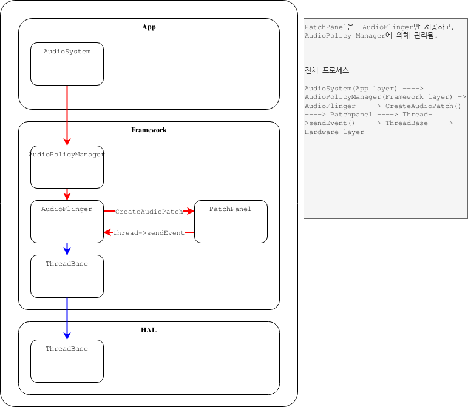
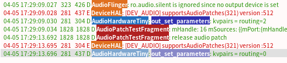

# AUDIO_DEV

 > private/audio

<br/>  
<br/>  
<br/>  
<br/>  
<hr>

 - [ANALYSE audio_hal](#analyse-audio_hal)  
	- [ANALYSE audio package related](#analyse-audio-package-related)  
    - [ANALYSE tinyalsa](#analyse-tinyalsa)  
    - [ANALYSE audio interface](#analyse-audio-interface)  
    - [ANALYSE tinyalsa](#analyse-tinyalsa)  
		- [audio patch](#audio-patch)  
		- [route](#route)  
  
 - [ANALYSE reference Quallcomm Audio HAL](#analyse-reference-qualcomm-audio-hal)  
	 - [1. Audio block diagram overview](#1.-audio-block-diagram-overview)  
	 - [1. HAL use case(use example) and device](#1.-audio-block-diagram-overview)  
  
 - [WIKI control audio interface](#wiki-control-audio-interface)  
  
 - [develop](#develop)


<hr>

    
<br/>  
<br/>  
<br/>  
<hr>

## ANALYSE audio_hal


### ANALYSE audio package related

 device/rockchip/common/device.mk 파일에 packages가 선언됨.

 - audio interface

 
```bash
PRODUCT_PACKAGES += \ 
    android.hardware.audio@2.0-service \ 
    android.hardware.audio@7.0-impl \ 
    android.hardware.audio.effect@7.0-impl
```
  
> *android.hardware.audio@2.0-service, android.hardware.audio@7.0-impl naming rule*  
>  - android : Android System   
>  - hardware : hardware interface  
>  - audio : audio hardware interface   
>  - 2.0 or 7.0 : version  
>  - service : service는 인터페이스를 정의하고 해당 인터페이스를 구현하는 코드를 포함.   
>  - impl : service에서 정의한 인터페이스를 실제로 구현하는 클래스.   
  
<br/>
  
 *android.hardware.audio@2.0-service* : core HAL, effect HAL API를 포함.   

 - core HAL : AudioFlinger가 오디오를 재생하고 오디오 라우팅을 제어하는데 사용하는 주API.  
 - effect HAL : effect framework가 오디오 effect를 제어하는 데 사용되는 API  
 - code : hardware/interfaces/audio/common/all-versions/default/service/  

 *android.hardware.audio@7.0-impl* : common HAL API와 관련 있음.  

 - common HAL API : core 및 effect HAL 에서 공통적으로 사용되는 데이터 유형의 라이브러리.   
                   인터페이스는 없으며 데이터 구조만 정의함.   
 - code : hardware/interfaces/audio/core/all-versions/default/  
 
   
     
  
 - audio lib

 안드로이드 시스템에서 사용되는 오디오 라이브러리.   
 오디오 하드웨어와 상호 작용하며, Android 운영체제의 오디오 기능을 제어하는데 사용.  
 오디오 출력 및 입력을 관리하며, 스피커, 헤드폰, 마이크 등과 상호작용.   

```bash
PRODUCT_PACKAGES += \
    audio_policy.$(TARGET_BOARD_HARDWARE) \ 
    audio.primary.$(TARGET_BOARD_HARDWARE) \
    ...
```

   * hardware/rockchip/audio/tinyalsa_hal/Android.mk 정의

 *audio.primary.rk30board.so*

<br/>
<br/>
<hr>

### ANALYSE audio interface

> upper layer (android.media)에서 사용할 수 있는 사운드 관련 프레임워크 관련 method를 audio 드라이버에게 연결하는 역할 담당.

 아래 경로에 코드 위치  
 - hardware/libhardware/include/hardware/   

 Audio HAL 관련 2개 interface 제공  

 1. audio device의 main function을 제공하는 interface  
 hardware/libhardware/include/hardware/audio.h  
  
 2. effect(echo cancellation, noise suppression, downmixing, etc) interface 제공  
 hardwrae/libhardware/include/hardware/audio_effect.h  
  

<br/>  
<br/>  
<hr>

### ANALYSE tinyalsa
  
<br/>  
<hr>
  
#### audio patch

 audio patch는 하나 이상의 source 를 하나 이상의 sink에 represent 하기 위해 사용됨.   

-  ex. 댐에 비유해 설명하면, 물의 유입구와 배출구는 여러 개 있을 수 있다.   
        물을 저장 및 방수하기 위해 유입구와 배출구는 하나일 수도 있고 여러개가 될 수도 있다.  
        실제 동작에서 1개 오디오 파일이 2개 speaker, headphone 으로 playback되거나,  
        2개의 mic가 left, right channel을 1개 오디오 파일에 record 하는 것.  
  
> android.permission.MODIFY_AUDIO_ROUTING permission 필요.  

 audio_patch 구조에는 2개 배열이 있으며, 각 포트는 audio_port이다.  
 stream, device 등 기본적으로 필요한 몇가지 기본 매개변수가 포함되어 있다.  
  

  
  
 각 audio_path는 APS에서 지정한 매개변수를 통해 Audioflinger에서 생성되며,  
 Audioflinger 호출을 통해 AudioHAL에서 처리됨.   
  
 > (빨간색 선 생성과정, 파란색 선 처리 과정)
   
 
  
<hr>
  
 - **audio patch scenarios 1** : Mix, that is, stream, plays to multiple Devices, that is, hardware


 - 일반적으로 setParameters method를 대체하여 setOutputDevice에서 사용됨.


 - code flow


<hr>

 - **audio patch scenarios 2** : Device to Mix, that is recording from hardware device to an audio track.


 - code flow


<hr>

 - **audio patch scenarios 3** : Device to Device. 
 > encoder 처리 없이 AudioFlinger 


 - code flow


 두 장치 사이에서 사용되는 버퍼를 사용. 


 - code flow


<br/>
<br/>
<br/>
<br/>
<hr>

 - adev_create_audio_patch
```c
// playback
adev_create_audio_patch sum_sources:1,num_sinks:1,mix(d)->device(2),handle:0xffaefcf4
// system/media/audio/include/system/audio-hal-enums.h
// mix(d) : // audio port 가 sub mix 인 경우, audio port configuration structre 에 대한 확장.
// device(2) : AUDIO_DEVICE_OUT_SPEAKER // audio port가 hardware device인 경우, audio port configuration structure 에 대한 extension

// record
adev_create_audio_patch num_sources:1,num_sinks:1,device(80000004)->mix(1e),handle:0xedabba1c
// system/media/audio/include/system/audio-hal-enums.h
// device(80000004) : AUDIO_DEVICE_IN_BUILTIN_MIC // audio port가 hardware device인 경우, audio port configuration structure 에 대한 extension
// mix(1e) : // audio port 가 sub mix 인 경우, audio port configuration structre 에 대한 확장.
```

<hr>

 - *AudioPatch는 AUDIO_DEVICE_API_VERSION_3_0 버전 이상에서 지원.*
   * 이하버전에서는 AudioPolicy에서 전달한 AudioPatch는 AudioFlinger에서 set_parameters로 변환되어 HAL로 전달. 



   * kvpairs는 createAudioPatch_l 에서 생성. 

```c

```

<br/>
<hr>

#### route 

 - alsa_route.c

```c
#define PCM_DEVICE0_PLAYBACK 0 
#define PCM_DEVICE0_CAPTURE  1
#define PCM_DEVICE1_PLAYBACK 2
#define PCM_DEVICE1_CAPTURE  3
#define PCM_DEVICE2_PLAYBACK 4
#define PCM_DEVICE2_CAPTURE  5

#define PCM_MAX PCM_DEVICE2_CAPTURE

struct pcm*     mPcm[PCM_MAX + 1];
struct mixer*     mMixerPlabyack;
struct mixer*    mMixerCapture;


route_pcm_open()
    |
    +-> route_init()
    |    /* route_init 시, mPcm[PCM_MAX]을 NULL로 초기화 */
    |
    +-> is_playback_route(route) 
    |   /* route value를 참고하여 playback, capture 여부 확인 */
    |
    +-> get_route_config(route)
    |   /** 
    |     * route_table에 사전 정의된 route value에 해당하는 값을 얻는다
    |     * sound_card, devices, controls 값이 포함 
    |     */
    |
    +-> mixer_open_legacy()
    |   /** 
    |     * mMixerPlayback, mMixerCapture을 업데이트
    |     * route_info->sound_card의 값이 1 인경우 0, 
    |     * 그렇지 않은 경우, cound_card id 값이 입력.
    |     * 
    |     * 1. /dev/snd/controlC0  장치 노드를 오픈(sound/core/control.c)
    |     * 2. SNDRV_CTL_IOCTL_ELEM_LIST ioctl 을 통해 control element list 를 가져온다.
    |     * 3. struct mixer 를 정의함.
    |     *    { 
    |     *      int fd;                            fd 값
    |     *      struct snd_ctl_elem_info *info;    control element List 저장.
    |     *      struct mixer_ctl *ctl;                control element value 저장
    |     *      unsigned count;                    control count값 
    |     *    }
    |     */
    |
    +-> route_set_controls(route)
    |    /**
    |      * route 값을 근거로 mixer 값을 가지고 set_controls를 진행.
    |      */ 
```

 - audio_hw.c

```c
adev_open_output_stream()
    |    /** 
    |     * adev_open_output_stream() 함수는 출력 장치를 열고, 해당 장치에 대한 출력 스트림을 생성.
    |     * audio_device_t device : 열고자하는 출력 장치를 지정.
    |     *                         정수형 상수로, 다양한 출력 장치를 나타냄.(ex. 스피커, 헤드폰, HDMI)
    |     *                         각 장치는 고유한 ID를 가지며, 이 ID를 사용하여 해당 장치를 선택
    |     * audio_output_flags_t flags : 출력 스트림에 대한 특정 플래그를 지정.
    |     *                              audio_output_flags_t는 비트필드로 특성을 조합할 수있다. 
    |     *                              AUDIO_OUTPUT_FLAG_DIRECT : 직접 출력 모드를 사용. 
    |     *                              AUDIO_OUTPUT_FLAG_PRIMARY : 기본 출력장치를 사용.
    |     */

```


<br/>  
<hr>

#### note

 - stream_out구조체의 멤버 변수 standby에 대한 설명.  
 standby 는 오디오 하드웨어 입력/출력을 대기 모드로 전환하는데 사용.   
 아래 목적으로 호출 된다.   

  1. 대기 모드 모드 진입(standby mode) : standby 가 호출되면 hardware는 대기 모드로 전환.  
                                        이 상태에서 다음 I/O 작업이 발생할 때까지 대기.  
  2. 성공 여부 반환 : standby mode로 성공적으로 전환되면 0, 실패하면 음수 값을 반환.  

 이러한 동작은 오디오 시스템의 안정성과 성능을 유지 하기 위해 필요함.  
  
  
 - *out->stream.common.standby* : 오디오 스트림이 standby 상태인지 여부를 나타냄.   

```c
out->stream.common.standby = out_standby
```

<br/>  
<br/>  
<br/>  
<hr>

## ANALYSE reference Qualcomm Audio HAL audio path settings
  
<br/>  
<br/>  
<hr>
 
### 1. **Audio block diagram overview**  
  
```bash
| Front End PCMs    |  SoC DSP  | Back End DAIs | Audio devices |

                    *************
PCM0 <------------> *           * <----DAI0-----> Codec Headset
                    *           *
PCM1 <------------> *           * <----DAI1-----> Codec Speakers/Earpiece
                    *   DSP     *
PCM2 <------------> *           * <----DAI2-----> MODEM
                    *           *
PCM3 <------------> *           * <----DAI3-----> BT
                    *           *
                    *           * <----DAI4-----> DMIC
                    *           *
                    *           * <----DAI5-----> FM
                    *************
```
  
 - Front End PCMs : Audio front end, 1개의 fornt end 는 1개의 PCM device에 연결됨.  
 - Back End DAIs : Audio back end, 1개의 back end 는 DAI 인터페이스에 해당하고   
                   FE, PCM 은 하나 이상의 back end DAI에 연결될 수 있다.   
 - Audio devices : Headset, Speakers, Earpiece, Mic, Bt, Modem, FM 등을 의미.  
                   서로 다른 장치가 서로 다른 DAI 인터페이스에 연결될 수 이도 있고,   
                   동일한 DAI 인터페이스 연결될 수 있다.     
 - SoC DSP : routing 기능 구현되는 모듈, front end PCM 및 back end DAI 연결. (예, PCM0 & DAI1 연결)   
  
```bash
                    *************
PCM0 <============> *<====++    * <----DAI0-----> Codec Headset
                    *     ||    *
PCM1 <------------> *     ++===>* <====DAI1=====> Codec Speakers/Earpiece
                    *           *
PCM2 <------------> *           * <----DAI2-----> MODEM
                    *    DSP    *
PCM3 <------------> *           * <----DAI3-----> BT
                    *           *
                    *           * <----DAI4-----> DMIC
                    *           *
                    *           * <----DAI5-----> FM
                    *************
```


 *Qualcomm msm8996 audio block diagram*

> qualcomm msm8996 은 snapdragon 820, snapdragon 821로 알려진 qualcomm soc. 
> wcd9335 는 qualcomm의 audio codec. 


  
 - FE PCMs  
   * deep_buffer  
   * low_latency  
   * multi_channel  
   * compress_offload  
   * audio_record  
   * usb_audio  
   * a2dp_audio  
   * voice_call  
  
 - BE DAIs  
   * SLIM_BUS  
   * Aux_PCM  
   * Primary_MI2S  
   * Secondary_MI2S  
   * Tertiary_MI2S  
  
<br/>
<br/>
<hr>

### 2. **HAL use case(use example) and device**
   
 **use case(사용 예제)**  
 사용예제는 일반적으로 다음과 같은 audio front end 에 해당하는 오디오 동작 시나리오를 의미한다. 

 - low_latency : key sound, touch sound, game background sound 등과 같이 지연 시간이 짧은 재생 시나리오.   
 - deep_buffer : 높은 대기 시간이 필요하지 않는 음악, 비디오 및 기타 재생 시나리오.  
 - compress_offload : mp3, flac, aac 및 기타 형식의 오디오 소스 재생 시나리오.   
                      오디오 소스에는 software decoding이 필요하지 않는 경우(hardware decoder 의해 처리)  
 - recoard : normal record 시나리오.  
 - record_low_latency : 지연시간이 짧은 녹음 시나리오.  
 - voice_call : voice 시나리오.  
 - voip_call : voip 시나리오  
  
```c
enum {
    USECASE_INVALID = -1,
    /* Playback usecases */
    USECASE_AUDIO_PLAYBACK_DEEP_BUFFER = 0,
    USECASE_AUDIO_PLAYBACK_LOW_LATENCY,
    USECASE_AUDIO_PLAYBACK_MULTI_CH,
    USECASE_AUDIO_PLAYBACK_OFFLOAD,
    USECASE_AUDIO_PLAYBACK_ULL,

    /* FM usecase */
    USECASE_AUDIO_PLAYBACK_FM,

    /* HFP Use case*/
    USECASE_AUDIO_HFP_SCO,
    USECASE_AUDIO_HFP_SCO_WB,

    /* Capture usecases */
    USECASE_AUDIO_RECORD,
    USECASE_AUDIO_RECORD_COMPRESS,
    USECASE_AUDIO_RECORD_LOW_LATENCY,
    USECASE_AUDIO_RECORD_FM_VIRTUAL,

    /* Voice usecase */
    USECASE_VOICE_CALL,

    /* Voice extension usecases */
    USECASE_VOICE2_CALL,
    USECASE_VOLTE_CALL,
    USECASE_QCHAT_CALL,
    USECASE_VOWLAN_CALL,
    USECASE_VOICEMMODE1_CALL,
    USECASE_VOICEMMODE2_CALL,
    USECASE_COMPRESS_VOIP_CALL,

    USECASE_INCALL_REC_UPLINK,
    USECASE_INCALL_REC_DOWNLINK,
    USECASE_INCALL_REC_UPLINK_AND_DOWNLINK,

    USECASE_AUDIO_PLAYBACK_AFE_PROXY,
    USECASE_AUDIO_RECORD_AFE_PROXY,

    USECASE_AUDIO_PLAYBACK_EXT_DISP_SILENCE,

    AUDIO_USECASE_MAX
};
```
  
 **장치(device)**

 장치(device)는 데이터 출력 endpoint (예, speaker , headphone,,) 및 데이터 입력 endpoint(예, headset mic, internal mic,,) 을 포함한 audio endpoint 를 나타냄.   
 qualcomm hal은 audio device를 확장하여 구현했다.   
 예를 들어, 스피커는 아래와 같다.  
  
  - SND_DEVICE_OUT_SPEAKER : normal external amp device  
  - SND_DEVICE_OUT_SPEAKER_PROTECTED : protected된 normal amp device  
  - SND_DEVICE_OUT_VOICE_SPEAKER : 통화용 normal handfree device  
  - SND_DEVICE_OUT_VOICE_SPEAKER_PROTECTED : protected된 통화용 handfree device  
      
```c
enum {
    SND_DEVICE_NONE = 0,

    /* Playback devices */
    SND_DEVICE_MIN,
    SND_DEVICE_OUT_BEGIN = SND_DEVICE_MIN,
    SND_DEVICE_OUT_HANDSET = SND_DEVICE_OUT_BEGIN,
    SND_DEVICE_OUT_SPEAKER,
    SND_DEVICE_OUT_HEADPHONES,
    SND_DEVICE_OUT_HEADPHONES_DSD,
    SND_DEVICE_OUT_SPEAKER_AND_HEADPHONES,
    SND_DEVICE_OUT_SPEAKER_AND_LINE,
    SND_DEVICE_OUT_VOICE_HANDSET,
    SND_DEVICE_OUT_VOICE_SPEAKER,
    SND_DEVICE_OUT_VOICE_HEADPHONES,
    SND_DEVICE_OUT_VOICE_LINE,
    SND_DEVICE_OUT_HDMI,
    SND_DEVICE_OUT_DISPLAY_PORT,
    SND_DEVICE_OUT_BT_SCO,
    SND_DEVICE_OUT_BT_A2DP,
    SND_DEVICE_OUT_SPEAKER_AND_BT_A2DP,
    SND_DEVICE_OUT_AFE_PROXY,
    SND_DEVICE_OUT_USB_HEADSET,
    SND_DEVICE_OUT_USB_HEADPHONES,
    SND_DEVICE_OUT_SPEAKER_AND_USB_HEADSET,
    SND_DEVICE_OUT_SPEAKER_PROTECTED,
    SND_DEVICE_OUT_VOICE_SPEAKER_PROTECTED,
    SND_DEVICE_OUT_END,

    /* Capture devices */
    SND_DEVICE_IN_BEGIN = SND_DEVICE_OUT_END,
    SND_DEVICE_IN_HANDSET_MIC  = SND_DEVICE_IN_BEGIN, // 58
    SND_DEVICE_IN_SPEAKER_MIC,
    SND_DEVICE_IN_HEADSET_MIC,
    SND_DEVICE_IN_VOICE_SPEAKER_MIC,
    SND_DEVICE_IN_VOICE_HEADSET_MIC,
    SND_DEVICE_IN_BT_SCO_MIC,
    SND_DEVICE_IN_CAMCORDER_MIC,
    SND_DEVICE_IN_END,

    SND_DEVICE_MAX = SND_DEVICE_IN_END,
};
```
  
 qualcomm hal에서 defined된 audio device와 android framework에서 define한 것과 일치 하지 않는 경우(새롭게 추가된 경우), android framework에서 전달된 audio device는 audio 동작 시나리오에 따라서 qualcomm hal에서 변환 된다.   
  
 - platform_get_output_snd_device()  
 - platform_get_input_snd_device()  
 
<br/>
<br/>
<hr> 

### 3. **audio routing**  

> qualcomm hal layer 오디오 채널의 routing에 대해 설명
 audio block diagram에 정리된것 처럼 audio route는 **FE PCM**, **BE DAI**, **DEVICE** 로 구분.
 audio routing을 하려면 이 3 블록을 연결해야 한다.  
  
 FE_PCM <=> BE_DAI <=> DEVICE  
  
<br/>
<hr> 

#### 3.1 FE_PCM open

 FE_PCM 은 audio stream이 열릴 때 설정된다. (ref : Android Audio System: Audio Track~AudioFliner)  
  
  
 Audio Track, AudioFlinger Threads, Audio HAL usecase 및 AudioDriver PCM간의 간계  
 > primary input mixer 의 경우, AudioTrack (Record) 에 의해 MixerThread가 생성 될때 생성되는 것 같음.  

 - start_output_stream() 코드 분석  
  upper layer는 audio mode를 AUDIO_MODE_IN_CALL 로 설정. 
 - out_set_parameters() 코드 분석  
  
<br/>
<hr> 

#### 3.2 routing 선택

 routing은 실제로 usecase와 device를 routing하는 것을 의미.   
 예를들어 deep-buffer-playback speaker는 deep buffer playback FE PCM과 speaker device를 routing.    
  
<br/>
<br/>
<hr> 

### 4. **audio framework develop data**

 H/W DSP, S/W DSP 처리에 최적화된 AUDIO HAL을 제공하여, Application 별 오디오 출력 장치를 규정하는 가변적 Audio Policy 를 이용.  
 적용 : 기가지니, nugu, kakao mini 등 다양한 솔루션에 적용  


  

  

<br/>  
<br/>  
<br/>  
<br/>  
<hr>
    
# WIKI control audio interface 

<br/>
<br/>
<br/>
<hr>

## 개발 project 및 branch

 - 아래 project/branch 에서 개발 작업 진행.  

```bash
$ repo branch 
(...)

*  private/audio_io          | in:
                                   device/kdiwin/test/common
                                   hardware/rockchip/audio
                                   kernel-4.19


```

<br/>
<br/>
<br/>
<hr>

## audio policy 지정

<hr>

 - /vendor/etc/audio_policy_configuration.xml  
  xml 내의 **modules**는 각 audio HAL 의 so 파일에 해당.  
  모듈에 나열된 mixPorts, devicePorts, routes 는 audio routing에 대한 정보를 기술.  
  
   * device port 
         
| **index** | **io_path (Devices)** | **route mode**           | **data stream**                                  |
|-----------|-----------------------|--------------------------|--------------------------------------------------|
| 0         | Speaker               | 내장 SPK 출력(기본 모드) | mixer(android)  -> 내장 SPK                      |
| 0         | Built-In Mic          | 내장 MIC 입력(기본 모드) | 내장 MIC        -> mixer(android)                |
| 1         | door_ring             | 도어 호출                | mixer(android)  -> 내장 SPK & 도어 SPK           |
| 2         | door_call             | 월패드, 도어 간 통화     | 내장 MIC_SPK   <-> 도어 MIC_SPK(without mixer)   |
| 3         | voip_door_call        | VOIP, 도어 간 통화       | mixer(android) <-> 도어 MIC_SPK                  |
| 4         | door_subp_call        | 도어, 서브폰 간 통화     | 도어 MIC_SPK   <-> 서브폰 MIC_SPK(without mixer) |
| 5         | voip_subp_call        | 서브폰 VOIP 간 통화      | mixer(android) <-> 서브 MIC_SPK                  |
| 6         | pstn_ring             | PSTN RING 출력 경로      | wall(mix) -> wall(spk)                           |
| 7         | pstn_dial             | PSTN DIAL , 오디오 경로  | pstn -> wall(spk), wall(mic) -> pstn             |
| 8         | pstn_call             | PSTN 통화 경로           | pstn -> wall(spk), wall(mic) -> pstn             |
| 9         | pstn_call_dial        | PSTN 통화 중, DIAL 경로  | pstn -> wall(spk), wall(mic) -> pstn             |
| 10        | pstn_subp_call        | PSTN 서브폰 간 통화 경로 | pstn -> subp(spk), subp(mic) -> pstn             |
| -         | -                     | -                        | -                                                |
  

<br/>
<br/>
<br/>
<hr>

## AudioPortConfig


 android.media.AudioPortConfig  
 Audio Port Config 나타내는 Class, Audio Port와 Config을 정의.   
 Audio Patch 시, 사용됨.   
 
<br/>
<br/>
<hr>

### Create Audio Patch

 - 목적 : Audio IO Path 변경.  
 - 예) 도어폰 백콜 출력(DOOR_CALL) 모드 출력.   


```bash
04-24 16:05:27.455  3309  3309 D AudioPatchTestFragment: mHandle: 8 mSources: {{mPort:{mHandle: 1, mRole: SOURCE}, mSamplingRate:48000, mChannelMask: 12, mFormat:2, mGain:null}, } mSinks: {{mPort:{{mHandle: 3, mRole: SINK}, mType: bus, mAddress: io_path=door_call}, mSamplingRate:0, mChannelMask: 1, mFormat:1, mGain:null}, }
04-24 16:07:20.937  3309  3309 D AudioPatchTestFragment: play media sample:media/iphone_marinba.wav
04-24 16:07:28.162  3309  3309 D AudioPatchTestFragment: stop playing
04-24 16:08:11.809  3309  3309 D AudioPatchTestFragment: release audio patch
```

<br/>
<br/>
<hr>

### Release Audio Patch

 - 목적 : Audio IO Path 적용 해제  
 - 예) 도어폰 백콜 출력후, 노멀 상태로 오디오 장치 변경.  


<br/>
<br/>
<br/>
<hr>

## Volume Control

 - **안드로이드 볼륨** : AudioManager 를 사용하여 제어.(ex. setStreamVolume)   
   (PCM데이터가 오디오 인터페이스(mixer)를 통해 통신 되는 경우)  
   * 통화 모드 : 
     + normal(STBY)
     + 도어폰 백콜 출력(DOOR_CALL)
     + Voip&서브폰 통화(VOIP_SUB_TALK)   
     + Voip&도어폰 통화(VOIP_DOOR_TALK)  

   
  
 - **오디오 코덱 볼륨** : setParameter API 를 사용하여 제어. ~audioGain 을 사용하여 제어.~  
  (PCM데이터가 오디오 인터페이스(mixer)를 통해 통신 되지 않는 경우)   
   * 통화 모드 : 
     + 월패드&도어폰 통화(DOOR_TALK) 

| **setParameters**  | **key**     | **value**    |
|--------------------|-------------|--------------|
| wallpad SPK volume | sink_gain   | integer(0~5) |
|                    | source_gain | integer(0~5) |
  
 **door_talk**  audio io path가  patch 된 조건에서만 허용.  
 sink_gain key 를 사용 시, 월패드 스피커 볼륨 제어(0~5)  

 - 볼륨 제어를 사용하지 않는 CASE : 도어폰&서브폰 통화, PSTN&서브폰 통화.


<br/>
<br/>
<br/>
<hr>

## wallAudioConfiguration

 Audio Manager 의 Route 별 Audio Patch 설정 및 Stream을 WallAudioConfiguration에서 wrapping 함.


| **라우트**                         | **Platform Audio Policy Configuration**        | **volume**        |
|------------------------------------|------------------------------------------------|-------------------|
| WAudioManager.ROUTE_DOOR_RING      | wall(mix) -> door(spk) && wall(spk)            | STREAM_RING       |
| WAudioManager.ROUTE_DOOR_CALL      | door(mic) -> wall(spk), wall(mic) -> door(spk) | STREAM_VOICE_CALL |
| WAudioManager.ROUTE_VOIP_DOOR_CALL | wall(mix) -> door(spk), door(mic) -> wall(mix) | STREAM_VOICE_CALL |
| WAudioManager.ROUTE_DOOR_SUBP_CALL | door(mic) -> subp(spk), subp(mic) -> door(spk) | STREAM_VOICE_CALL |
| WAudioManager.ROUTE_VOIP_SUBP_CALL | wall(mix) -> subp(spk), subp(mic) -> wall(mix) | STREAM_VOICE_CALL |
| WAudioManager.ROUTE_PSTN_RING         | wall(mix) -> wall(spk)                          | STREAM_RING       |
| WAudioManager.ROUTE_PSTN_DIAL         | pstn -> wall(spk), wall(mic) -> pstn              | STREAM_VOICE_CALL |
| WAudioManager.ROUTE_PSTN_CALL         | pstn -> wall(spk), wall(mic) -> pstn           | STREAM_VOICE_CALL |
| WAudioManager.ROUTE_PSTN_CALL_DIAL | pstn -> wall(spk), wall(mic) -> pstn              | STREAM_VOICE_CALL | 
| WAudioManager.ROUTE_SUBP_CALL         | pstn -> subp(spk), subp(mic) -> pstn              | STREAM_VOICE_CALL |


```xml
<!--
    @element <wallAudioConfiguration>
        @attribute 'version': version code of this xml
        @element <routes>
            @element <route>
                @attribute 'name': route name
                @attribute 'sink' : sink port name or address
                @attribute 'source' : source port name or address
-->

<wallAudioConfiguration version="1">
    <routes>
        <route name="door_ring" sink="io_path=door_ring" source="primary output" stream="STREAM_RING" />
        <route name="door_call" sink="io_path=door_call" source="primary output" stream="STREAM_VOICE_CALL" />
        <route name="voip_door_call" sink="io_path=voip_door_call" source="primary output" stream="STREAM_VOICE_CALL" />
        <route name="door_subp_call" sink="io_path=door_subp_call" source="primary output" stream="STREAM_VOICE_CALL" />
        <route name="voip_subp_call" sink="io_path=voip_subp_call" source="primary output" stream="STREAM_VOICE_CALL" />
    </routes>
</wallAudioConfiguration>
```


<br/>  
<br/>  
<br/>  
<br/>  
<hr>

# develop

 - regmap 

> regmap은 cache mechanism base로 운영된다. 
> register가 io명령을 통해 직접수행될 때, driver의 regmap cache를 비활성화 하지 않는 경우, 
> regmap node는 업데이트 된 레지스터를 반영하지 않는다.

```bash
/sys/kernel/debug/regmap/5-0018-ak7755-codec/register

// disable cache

# echo N > cache_only
[148833.374641] rockchip-i2s-tdm ff800000.i2s: debugfs cache_only=N forced:
syncing cache

# echo Y > cache_bypass
[148834.760274] rockchip-i2s-tdm ff800000.i2s: debugfs cache_bypass=Y forced
```


 - IO Control Path 를 사용하여 관련 GPO 제어
```bash
Card:0
  id iface dev sub idx num perms     type   name
     1 MIXER   0   0   0   1 rw        ENUM   IO Control Path: (0 STBY) { STBY=0, DOOR_CALL=1, DOOR_TALK=2, DOOR_SUB_TALK=3, VOIP_SUB_TALK=4 }
      
```
  
<hr>    

- io contorl - door

  SEL_DC : GPIO0_A6
  * High(Active)  
```bash
// set gpio
# io -4 -w 0xfdc20004 0x07000000

// set directiron to out
# io -4 -w 0xfdd60008 0x00400040 

// set value to high
# io -4 -w 0xfdd60000 0x00400040 

// set value to low
# io -4 -w 0xfdd60000 0x00400000 
```


  
<hr>    

 - STO/RDY 핀 기능
  
 STO(Status Output Pin)/RDY(RDY Pin) 으로 정의되어져 있으며, LED 로 상태 출력.   

 기본 설정으로는 STO 핀 기능이 선택되어져 있음.   
 SDOUT2EN bit 가 "0" (default)인 경우, STO 핀 출력이 활성화 됨.  
 SDOUT2EN bit 가 "1" 인 경우, STO 핀 출력은 비활성화(L)로 출력됨.  
  
 AK7755의 전원이 인가된 후, PDN 핀이 "L" 인경우, STO 핀은 "L"로 출력.  
 내부 디지털 전원 공급 회로(VREG) 가 전원이 켜진 후(PDN핀 = H), STO 핀은 활성화(H) 됨.  
  
 전원 다운 상태가 해제된 후에는 제어 레지스터 설정에 따라 VREG 다운 상태, PLL 락 신호, WDT1 및 WDT2 DSP 오류, CRC 오류 및 SRC1~2 Lock  신호를 STO 핀에서 출력할수 있다.  


```bash

[ VDD_3V3 ]
     |       +---AK7755---+
     |       |            |
   [LED]     |            |
     |       |            |
     +-----> + STO/RDY    |
             |            |
             +------------+

```

<hr>    
