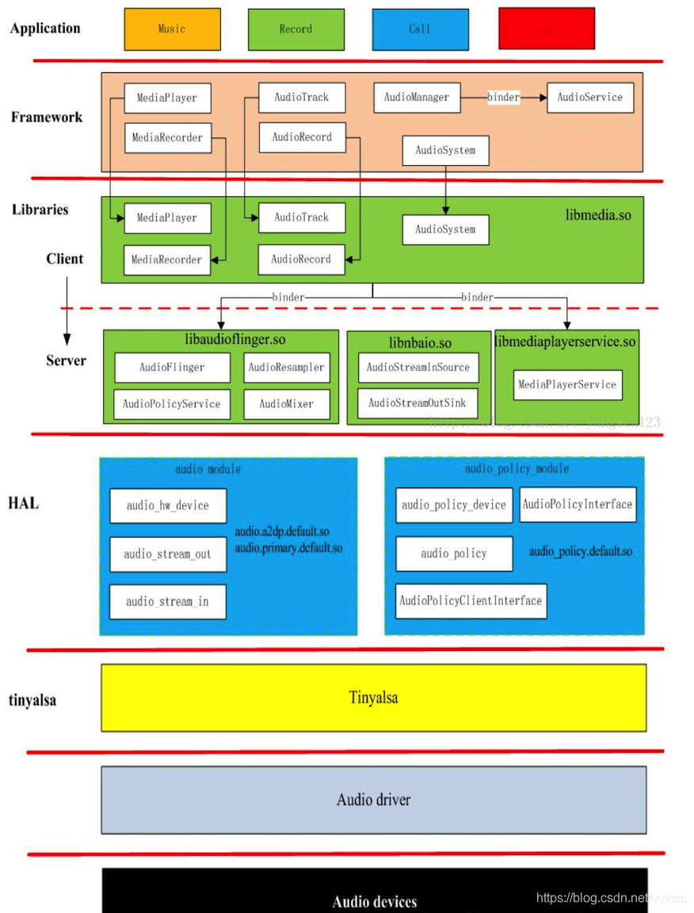

AUDIO_HAL
=====

# Audio HAL blockdiagram

 

## HAL layer 
 - audio HAL에는 audio_module과 audio_policy_module이 존재합니다. 
 - HAL layer의 아래의 layer는 tinyalsa를 사용합니다. 

 - audio.a2dp.default.so(bluetooth a2dp audio 관리), audio.usb.default.so(usb 외부 audio 관리)와 같은 독립적인 lib 파일로 구현됩니다. 
 - audio.primary.default.so(장치의 대부분의 audio 관리)
 - 일부 manufacturer 은 audio.primary.rk30board.so 와 같은 lib를 구현해 배포합니다.

-----

## key class 및 structure
 - HAL은 upper layer에 hardware에 대한 인터페이스를 제공해야 합니다.
   * **struct audio_hw_device** : struct audio_hw_device 를 통해 인터페이스를 제공합니다.

 - AudioFlinger가 library를 호출하는 과정은 아래와 같습니다.

 ```bash
	AudioFlinger::loadHwModule
	->AudioFlinger::loadHwModule_l
	-->load_audio_interface
	--->audio_hw_device_open(mod, dev);
	---->module->methods->open 
 ```

   * AudioFlinger에서 libhardware 함수 hw_get_module(hw_get_module_by_class)을 통해 struct hw_module_t정보를 획득합니다.
   * 이후, audio_hw_device_open을 통해 audio_hw_device_t 정보를 얻어옵니다.  
    방법은 hw_module_t->methods(hw_module_methods_t)->open 을 호출하면 audio hal에서 adev_open 함수를 호출하여

	```c
	struct audio_device {
		struct audio_hw_device device;
		...
	};
	```
	struct audio_device를 생성하여 멤버변수 struct audio_hw_device device를 리턴합니다.

	```c
	struct audio_hw_device {
		struct hw_device_t common;
		uint32_t (*get_supported_devices)(const struct audio_hw_device *dev);
		int (*init_check)(const struct audio_hw_device *dev);
		int (*set_voice_volume)(struct audio_hw_device *dev, float volume);
		int (*set_master_volume)(struct audio_hw_device *dev, float volume);
		int (*get_master_volume)(struct audio_hw_device *dev, float *volume);
		int (*set_mode)(struct audio_hw_device *dev, audio_mode_t mode);
		int (*set_mic_mute)(struct audio_hw_device *dev, bool state);
		int (*get_mic_mute)(const struct audio_hw_device *dev, bool *state);
		int (*set_parameters)(struct audio_hw_device *dev, const char *kv_pairs);
		char * (*get_parameters)(const struct audio_hw_device *dev,
		                         const char *keys);
		size_t (*get_input_buffer_size)(const struct audio_hw_device *dev,
		                                const struct audio_config *config);
		int (*open_output_stream)(struct audio_hw_device *dev,
		                          audio_io_handle_t handle,
		                          audio_devices_t devices,
		                          audio_output_flags_t flags,
		                          struct audio_config *config,
		                          struct audio_stream_out **stream_out);
		void (*close_output_stream)(struct audio_hw_device *dev,
		                            struct audio_stream_out* stream_out);
		int (*open_input_stream)(struct audio_hw_device *dev,
		                         audio_io_handle_t handle,
		                         audio_devices_t devices,
		                         struct audio_config *config,
		                         struct audio_stream_in **stream_in);
		void (*close_input_stream)(struct audio_hw_device *dev,
		                           struct audio_stream_in *stream_in);
		int (*dump)(const struct audio_hw_device *dev, int fd);
		int (*set_master_mute)(struct audio_hw_device *dev, bool mute);
		int (*get_master_mute)(struct audio_hw_device *dev, bool *mute);
	};
	typedef struct audio_hw_device audio_hw_device_t;
	```

	* AudioFlinger에서 hw_get_module와 audio_hw_device_open를 호출하여 audio HAL과 연결을 먼저하고, 
	* open_output_stream 함수를 호출하면 struct audio_stream를 하나 생성하여 각 포인터를 연결합니다.

 - Audio HAL의 연결 포인터 3그룹.

### 1. module open시 일어나는 audio hw device 관련 연결 작업.

 ```c
   static int adev_open(....)
   {
       adev->device.init_check = adev_init_check;
       adev->device.set_voice_volume = adev_set_voice_volume;
       adev->device.set_master_volume = adev_set_master_volume;
       adev->device.get_master_volume = adev_get_master_volume;
       adev->device.set_master_mute = adev_set_master_mute;
       adev->device.get_master_mute = adev_get_master_mute;
       adev->device.set_mode = adev_set_mode;
       adev->device.set_mic_mute = adev_set_mic_mute;
       adev->device.get_mic_mute = adev_get_mic_mute;
       adev->device.set_parameters = adev_set_parameters;
       adev->device.get_parameters = adev_get_parameters;
       adev->device.get_input_buffer_size = adev_get_input_buffer_size;
       adev->device.open_output_stream = adev_open_output_stream;
       adev->device.close_output_stream = adev_close_output_stream;
       adev->device.open_input_stream = adev_open_input_stream;
       adev->device.close_input_stream = adev_close_input_stream;
       adev->device.dump = adev_dump;
   }
 ```

### 2. openOutput에서 일어나는 audio hw output 관련 연결 작업
 
 ```c
 static int adev_open_output_stream(.... ) 
   {
       out->stream.common.get_sample_rate = out_get_sample_rate;
       out->stream.common.set_sample_rate = out_set_sample_rate;
       out->stream.common.get_buffer_size = out_get_buffer_size;
       out->stream.common.get_channels = out_get_channels;
       out->stream.common.get_format = out_get_format;
       out->stream.common.set_format = out_set_format;
       out->stream.common.standby = out_standby;
       out->stream.common.dump = out_dump;
       out->stream.common.set_parameters = out_set_parameters;
       out->stream.common.get_parameters = out_get_parameters;
       out->stream.common.add_audio_effect = out_add_audio_effect;
       out->stream.common.remove_audio_effect = out_remove_audio_effect;
       out->stream.get_latency = out_get_latency;
       out->stream.set_volume = out_set_volume;
       out->stream.write = out_write;
       out->stream.get_render_position = out_get_render_position;
       out->stream.get_next_write_timestamp = out_get_next_write_timestamp;
       out->stream.get_presentation_position = out_get_presentation_position;
   }
 ```

### 3. openInput에서 일어나는 audio hw input 관련 연결 작업
 
 ```c
   static int adev_open_input_stream(....)
   {
       in->stream.common.get_sample_rate = in_get_sample_rate;
       in->stream.common.set_sample_rate = in_set_sample_rate;
       in->stream.common.get_buffer_size = in_get_buffer_size;
       in->stream.common.get_channels = in_get_channels;
       in->stream.common.get_format = in_get_format;
       in->stream.common.set_format = in_set_format;
       in->stream.common.standby = in_standby;
       in->stream.common.dump = in_dump;
       in->stream.common.set_parameters = in_set_parameters;
       in->stream.common.get_parameters = in_get_parameters;
       in->stream.common.add_audio_effect = in_add_audio_effect;
       in->stream.common.remove_audio_effect = in_remove_audio_effect;
       in->stream.set_gain = in_set_gain;
       in->stream.read = in_read;
       in->stream.get_input_frames_lost = in_get_input_frames_lost;
   }

 ```


-----

## AudioFlinger 와 Audio HW HAL 간 relations

 - AuioFlinger와 Audio HW HAL 에서 일어나는 연결 작업은 크게 3가지 그룹으로 나눌수 있습니다.


# Code Analyse


 [-> *hardware/rockchip/audio/tinyalsa_hal/audio_hw.c* ]
```c
static struct hw_module_methods_t hal_module_methods = {
    .open = adev_open,
};

struct audio_module HAL_MODULE_INFO_SYM = {
    .common = {
        .tag = HARDWARE_MODULE_TAG,
        .module_api_version = AUDIO_MODULE_API_VERSION_0_1,
        .hal_api_version = HARDWARE_HAL_API_VERSION,
        .id = AUDIO_HARDWARE_MODULE_ID,
        .name = "Manta audio HW HAL",
        .author = "The Android Open Source Project",
        .methods = &hal_module_methods,
    },
};

static int adev_open(const hw_module_t* module, const char* name,
                     hw_device_t** device)
{
    struct audio_device *adev;
    int ret;
	
	// log : ALSA Audio Version: V1.1.0
    ALOGD(AUDIO_HAL_VERSION);

    if (strcmp(name, AUDIO_HARDWARE_INTERFACE) != 0)
        return -EINVAL;

    adev = calloc(1, sizeof(struct audio_device));
    if (!adev)
        return -ENOMEM;

    adev->hw_device.common.tag = HARDWARE_DEVICE_TAG;
    adev->hw_device.common.version = AUDIO_DEVICE_API_VERSION_2_0;
    adev->hw_device.common.module = (struct hw_module_t *) module;
    adev->hw_device.common.close = adev_close;

    adev->hw_device.init_check = adev_init_check;
    adev->hw_device.set_voice_volume = adev_set_voice_volume;
    adev->hw_device.set_master_volume = adev_set_master_volume;
    adev->hw_device.set_mode = adev_set_mode;
    adev->hw_device.set_mic_mute = adev_set_mic_mute;
    adev->hw_device.get_mic_mute = adev_get_mic_mute;
    adev->hw_device.set_parameters = adev_set_parameters;
    adev->hw_device.get_parameters = adev_get_parameters;
    adev->hw_device.get_input_buffer_size = adev_get_input_buffer_size;
    adev->hw_device.open_output_stream = adev_open_output_stream;
    adev->hw_device.close_output_stream = adev_close_output_stream;
    adev->hw_device.open_input_stream = adev_open_input_stream;
    adev->hw_device.close_input_stream = adev_close_input_stream;
    adev->hw_device.dump = adev_dump;
    adev->hw_device.get_microphones = adev_get_microphones;
    //adev->ar = audio_route_init(MIXER_CARD, NULL);
    //route_init();
    /* adev->cur_route_id initial value is 0 and such that first device
     * selection is always applied by select_devices() */
    *device = &adev->hw_device.common;

    adev_open_init(adev);
    return 0;
}
```

 [-> *hardware/rockchip/audio/tinyalsa_hal/audio_hw.h* ]
```c
struct audio_device {
    struct audio_hw_device hw_device;

    pthread_mutex_t lock; /* see note below on mutex acquisition order */
    audio_devices_t out_device; /* "or" of stream_out.device for all active output streams */
    audio_devices_t in_device;
    bool mic_mute;
    struct audio_route *ar;
    audio_source_t input_source;
    audio_channel_mask_t in_channel_mask;

    struct stream_out *outputs[OUTPUT_TOTAL];
    pthread_mutex_t lock_outputs; /* see note below on mutex acquisition order */
    unsigned int mode;
    bool   screenOff;
#ifdef AUDIO_3A
    rk_process_api* voice_api;
#endif

    /*
     * hh@rock-chips.com
     * this is for HDMI/SPDIF bitstream
     * when HDMI/SPDIF bistream AC3/EAC3/DTS/TRUEHD/DTS-HD, some key tone or other pcm
     * datas may come(play a Ac3 audio and seek the file to play). It is not allow to open sound card
     * as pcm format and not allow to write pcm datas to HDMI/SPDIF sound cards when open it
     * with config.flag = 1.
     */
    int*  owner[2];

    struct dev_info dev_out[SND_OUT_SOUND_CARD_MAX];
    struct dev_info dev_in[SND_IN_SOUND_CARD_MAX];
};
```

```c
adev_open(const hw_module_t* module, const char* name, hw_device_t** device)
	|
	+->	adev_open_init(struct audio_device *adev)
				

```
