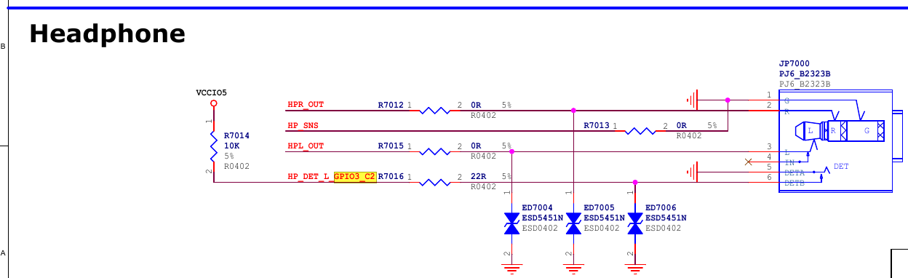

# AUDIO_RECEIVER
> AUDIO 관련 RECEIVER 장치 개발 문서
> Develop based on AK7755

<br/>
<br/>
<br/>
<hr>

## AUDIO MUX

```plane
                              +------------+
---(stream;ECHO_LINE_OUT)---> +             |
                              |             |
<--(stream;ECHO_LINE_IN)----- +             |
                              |             |
                              |             |
<--(stream;DTMF)------------> +             |
                              |             |
                              |             |
--(SEL_PSTN_AUD)------------> +             |
--(DTMF_EN)-----------------> +             |
--(SEL_LB_AUD)--------------> +             |
                              +-------------+

```

| **MODE**  | **SEL_PSTN_AUD** | **DTMF_EN** | **SEL_LB_AUD** |
|-----------|------------------|-------------|----------------|
| pstn_call |         H        |      L      |        L       |
| pstn_dial |         L        |      H      |        L       |
| loby_call |         L        |      L      |        H       |


<br/>
<br/>
<br/>
<hr>

## RECEIVER UNIT

 - Flow

```plane
[수화기 상태 변경 (Hook GPIO)]
   ↓
[커널 감지 드라이버: (extcon)]
   |  1. 상태 업데이트
   +-> notifier chain 호출 
   |                    +-> LED 제어 드라이버(notifier)
   |                    +-> Amp Enable 드라이버(notifier) (es8316)
   +-> uevent 생성(userspace 전달)
   ↓
[사용자 공간]
  - Audio HAL, udev, Input HAL 등이 감지
  - Android system service → 앱에 전달
[Audio Routing 변경 / Android AudioManager 제어]
```

 - to do

| 계층             | 역할                                              |
| ---------------- | ------------------------------------------------- |
| 커널 (Driver)    | GPIO 읽고 `extcon_set_state_sync()` 호출          |
| Notifier Chain   | Audio routing 드라이버, LED 제어 드라이버 등 통지 |
| uevent           | Android HAL 또는 udev에게 신호 전달               |
| Android HAL      | 수화기 상태에 따라 오디오 경로 변경               |
| 앱               | `Intent` 또는 `KeyEvent`로 상태 인식 가능         |


RECEIVER_EN

<br/>
<br/>
<br/>
<br/>
<hr>

# ETC

- peripheral pin

  * common
 SEL_LB_AUD       : GPIO0_A5(05)
 SEL_PSTN_AUD     : GPIO0_C6(22)
 DTMF_EN          : GPIO3_C2(114)

 RECEIVER_EN      : GPIO1_D5(61)
 HOOK_DET         : GPIO3_C6(118)


  * special
 LBAUDIOSEL_0     : GPIO1_A7(39) (high: enable)
 LBAUDIOSEL_1     : GPIO1_B3(43) (high: enable)
 LBAUDIOSEL_2     : GPIO0_A4(04) (high: enable)
 LBVIDEOSEL_0     : GPIO1_D7(63) (high: LB_VIDEO_IN -> LB_VIDEO_OUT, low: LB_VIDEO_IN -> LB_VIDEO)

<br/>
<br/>
<br/>
<br/>
<hr>

# Receiver: Headset observe

> Headset Observe 코드를 참고하여 Receiver 를 구현.


  
 3.5mm 오디오 잭 연결 여부를 감지하기 위한 회로로, 잭이 연결되면 SoC의 GPIO 입력 핀으로 감지 신호(HP_DET_L_GPIO3_C2)가 LOW로 들어오도록 설계됨.   

  - HP_DET_L_GPIO3_C2 : 잭 연결 감지용 GPIO 입력 핀(Low Active)  
    * 잭 연결 시 : Low(GND)  
      + HP_DET_L_GPIO3_C2 라인은 내부 R7016(10KΩ) Pull-up 저항에 의해 HIGH 상태 유지  
      + SoC에서는 이 GPIO 입력을 **high** 로 인식함.  
    * 잭 미 연결 시 : High(Pull-Up)  
      + 잭 내부의 **Switch (DET 핀)**이 GND에 연결됨.  
      + *HP_DET_L_GPIO3_C2*핀이 GND 연결되어 LOW 상태.  
      + SoC에서는 이 GPIO 입력을 **low** 으로 감지. 

```dtb
    rk_headset: rk-headset {
        compatible = "rockchip_headset";
        headset_gpio = <&gpio3 RK_PC2 GPIO_ACTIVE_LOW>;
        pinctrl-names = "default";
        pinctrl-0 = <&hp_det>;
    };

```

<br/>
<br/>
<br/>
<br/>
<hr>

# design : HAL 레벨에서 제어하기

 HAL 레벨에서 GPIO를 직접 읽어서 수화기 상태에 따라 오디오 라우팅, LED제어, 등을 모두 처리하면 안되는가?  
 즉, extcon이나 notifier 없이 단순 GPIO 체크 기반 처리 방식은 비효율적인가?  
  
 가능 하지만, 비효율적일수 잇고, 유지보수성과 확장성이 떨어짐.  
 **커널 <-> HAL <-> 앱 간의 역할 분리 원칙을 어기게 되며,**   
 여러 장치가 같은 상태 변화에 반응해야 하는 경우, extcon + nitifier 구조가 훨씬 깔끔하고 확장성 있음.  

✅ 단순 GPIO polling in HAL 방식의 특징  
✔ 장점  
 구조 단순  
 빠른 구현 가능 (프로토타이핑에 유리)
 SoC GPIO만 연결되어 있으면 HAL에서 직접 읽을 수 있음 (/sys/class/gpio/gpioX/value 등)

❌ 단점
| 항목                                   | 이점                                                       |
| ------------------------------------ | -------------------------------------------------------- |
| **단일 진실 소스(Single Source of Truth)** | 커널이 Hook 상태를 하나의 기준으로 감지함            |
| **Notifier chain으로 분산처리**   | Audio driver, LED driver, Amp driver 등 개별 모듈이 알림받아 반응 가능 |
| **HAL은 이벤트만 감지**     | HAL은 `uevent` 또는 `sysfs` 통해 상태를 "알려만 받음" → 깔끔한 역할 구분     |
| **Android 시스템 통합 용이** | uevent로 Intent나 SystemService에 쉽게 연결 가능                  |
| **재사용성**         | 같은 Hook 상태를 이용해 OEM 커스터마이징, 테스트 자동화 등에 재활용 가능            |


✅ extcon + notifier 기반 구조의 이점
| 항목                                   | 이점                                                       |
| ------------------------------------ | -------------------------------------------------------- |
| **단일 진실 소스(Single Source of Truth)** | 커널이 Hook 상태를 하나의 기준으로 감지함              |
| **Notifier chain으로 분산처리** | Audio driver, LED driver, Amp driver 등 개별 모듈이 알림받아 반응 가능 |
| **HAL은 이벤트만 감지**   | HAL은 `uevent` 또는 `sysfs` 통해 상태를 "알려만 받음" → 깔끔한 역할 구분     |
| **Android 시스템 통합 용이**       | uevent로 Intent나 SystemService에 쉽게 연결 가능                  |
| **재사용성**      | 같은 Hook 상태를 이용해 OEM 커스터마이징, 테스트 자동화 등에 재활용 가능            |

