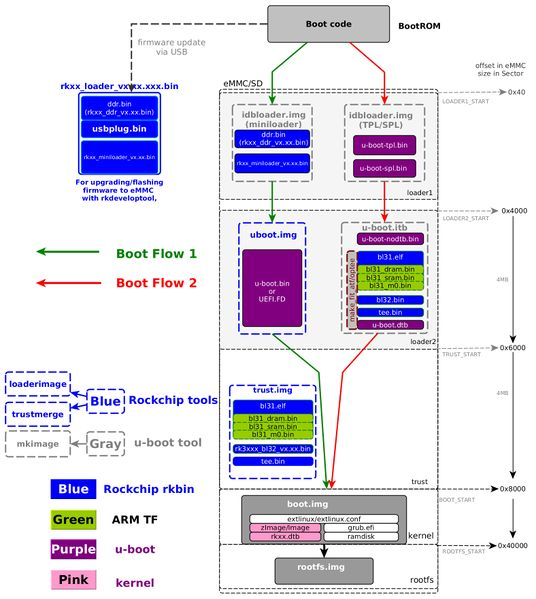

<hr/>

# 1. Boot introduce
linux os 를 부팅할 때 많은 부팅 단계가 있습니다. 그런 다음 이미지가 어디에 packaging되어야 하는지 알아야 합니다.  
마지막으로 storage에 flash 후, storage에서 부팅하는 방법을 설명합니다.  
Rockschip사에서 released된 binaries 이 rkbin(https://github.com/rockchip-linux/rkbin) 을 통하여 배포됩니다. (GPT Partition 정보가 포함되어 있습니다.)  

## 1.1 boot flow
Rockchip 플랫폼에서 사용되는 boot flow에 대해 설명합니다.  2종류의 boot path가 있습니다. 
- upstream 또는 Rockchip u-boot 의 tls/spl 을 사용. (소스코드 제공)
- Rockchip사 rkbin 프로젝트를 통해 배포되는 Rockchip ddr init bin 과 miniloader bin이 포함된 idbLoader를 사용합니다.  

```bash
+--------+----------------+----------+-------------+---------+
| Boot   | Terminology #1 | Actual   | Rockchip    | Image   |
| stage  |                | program  |  Image      | Location|
| number |                | name     |   Name      | (sector)|
+--------+----------------+----------+-------------+---------+
| 1      |  Primary       | ROM code | BootRom     |         |
|        |  Program       |          |             |         |
|        |  Loader        |          |             |         |
|        |                |          |             |         |
| 2      |  Secondary     | U-Boot   |idbloader.img| 0x40    | pre-loader
|        |  Program       | TPL/SPL  |             |         |
|        |  Loader (SPL)  |          |             |         |
|        |                |          |             |         |
| 3      |  -             | U-Boot   | u-boot.itb  | 0x4000  | including u-boot and atf
|        |                |          | uboot.img   |         | only used with miniloader
|        |                |          |             |         |
|        |                | ATF/TEE  | trust.img   | 0x6000  | only used with miniloader
|        |                |          |             |         |
| 4      |  -             | kernel   | boot.img    | 0x8000  |
|        |                |          |             |         |
| 5      |  -             | rootfs   | rootfs.img  | 0x40000 |
+--------+----------------+----------+-------------+---------+
```
BootRom에 Rom code(idbLoader)를 write하여 ddr init 및 초기 AP initialize가 필요한 부분을 수행하고 u-boot 코드로 점프하게 된다.

일반적인 이미지 업데이트 모드는 u-boot에서 GPIO Pin 형태로 Boot-pin 또는 switch 인식하여 전환하게 되는데, 
만약 BootRom 내에 이미 Code가 Write 되어 Rom 내역을 수행하고 u-boot로 jump하는 흐름에서 문제 발생되었을 때는 정상적으로 부팅을 하지 못하게 된다.

이 상황에서 Mask Rom 모드로 진입이 가능하도록 eMMC 또는 부팅 매체로 jump되지 못하도록 설정하여 Rom 이미지를 다시 Write 또는 설정한다.

Rockchip AP의 Boot Flow는 아래의 그림과 같다.

</img>
## 1.2 packages option
### 1.2.1 The Pre-bootloader(IDBLoader)
#### 1.2.1.1 IDBLoader 란 
IDBLoader.img는 SoC start up시 동작하며, 아래 기능을 포함하는 Rockchip 형식의 pre-loader 입니다.
 - Rockchip BootRom에 의해 알려진 IDBlock header.
 - MaskRom에 의해 load되고, 내부 SRAM에서 실행되는 DRAM 초기화 프로그램.
 - MaskRom에 의해 load되고, DRAM에서 다음 loader를 실행시킵니다.

#### 1.2.1.2 아래 방법으로 IDBLoader를 얻을 수 있습니다. 

#### Rockchip release loader에서 eMMC용 IDBLoader 패키징.
Rockchip release loader를 사용하는 경우, eMMC IDBLoader.img를 패키징할 필요가 없습니다. 아래 명령어를 사용하여 eMMC IDBLoader를 얻을 수 있습니다.
```bash
rkdeveloptool db rkxx_loader_vx.xx.bin
rkdeveloptool ul rkxx_loader_vx.xx.bin
```

#### 1.2.1.3 Rockchip binary 에서 IDBLoader.img를 패키징 합니다.
SD boot 또는 eMMC의 경우, IDBLoader가 필요 합니다. 
```bash
tools/mkimage -n rkxxxx -T rksd -d rkxx_ddr_vx.xx.bin idbloader.img
cat rkxx_miniloader_vx.xx.bin >> idbloader.img
```


#### 1.2.1.4 U-boot TPL/SPL(which is fully open source) 에서 IDBLoader.img를 패키징 합니다.
```bash
tools/mkimage -n rkxxxx -T rksd -d tpl/u-boot-tpl.bin idbloader.img
cat spl/u-boot-spl.bin >> idbloader.img
```
stage 2를 포함하여 offset 0x40으로 IDBLoader.img를 writing하면 u-boot.img 가 로드 됩니다.(stage 3)
 
<hr/>
<br/>
<br/>
<br/>
<hr/>

## 2 flash and boot from Media device
### 2.1 Boot from eMMC


- references : http://opensource.rock-chips.com/wiki_Boot_option
