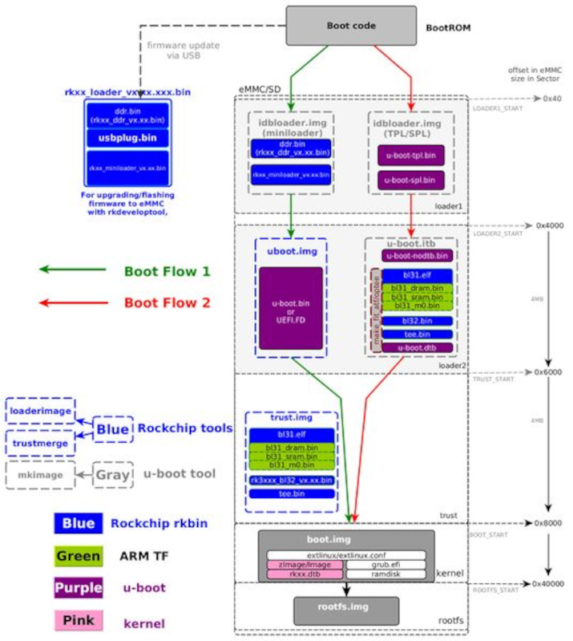

<hr/>

# 1. Boot introduce
linux os 를 부팅할 때 많은 부팅 단계가 있습니다. 
이미지가 어느 위치에 flashing되는지 설명하며, 
storage에 flash 후, storage에서 부팅하는 방법을 설명합니다.  
Rockschip사에서 released된 binarie는 rkbin(https://github.com/rockchip-linux/rkbin) 을 통하여 배포됩니다.

## 1.1 boot flow
Rockchip 플랫폼에서 사용되는 boot flow에 대해 설명합니다.  2종류의 boot path가 있습니다. 
- upstream 또는 Rockchip u-boot 의 tls/spl 을 사용. (소스코드 제공)
- Rockchip사 rkbin 프로젝트를 통해 배포되는 Rockchip ddr init bin 과 miniloader bin이 포함된 idbLoader를 사용합니다.  

```bash
+--------+----------------+----------+-------------+---------+
| Boot   | Terminology #1 | Actual   | Rockchip    | Image   |
| stage  |                | program  |  Image      | Location|
| number |                | name     |   Name      | (sector)|
+--------+----------------+----------+-------------+---------+
| 1      |  Primary       | ROM code | BootRom     |         |
|        |  Program       |          |             |         |
|        |  Loader        |          |             |         |
|        |                |          |             |         |
| 2      |  Secondary     | U-Boot   |idbLoader.img| 0x40    | pre-loader
|        |  Program       | TPL/SPL  |             |         |
|        |  Loader (SPL)  |          |             |         |
|        |                |          |             |         |
| 3      |  -             | U-Boot   | u-boot.itb  | 0x4000  | including u-boot and atf
|        |                |          | uboot.img   |         | only used with miniloader
|        |                |          |             |         |
|        |                | ATF/TEE  | trust.img   | 0x6000  | only used with miniloader
|        |                |          |             |         |
| 4      |  -             | kernel   | boot.img    | 0x8000  |
|        |                |          |             |         |
| 5      |  -             | rootfs   | rootfs.img  | 0x40000 |
+--------+----------------+----------+-------------+---------+
```
BootRom에 Rom code(idbLoader)를 write하여 ddr init 및 초기 AP initialize가 필요한 부분을 수행하고 u-boot 코드로 점프하게 된다.

일반적인 이미지 업데이트 모드는 u-boot에서 GPIO Pin 형태로 Boot-pin 또는 switch 인식하여 전환하게 되는데, 
만약 BootRom 내에 이미 Code가 Write 되어 Rom 내역을 수행하고 u-boot로 jump하는 흐름에서 문제 발생되었을 때는 정상적으로 부팅을 하지 못하게 된다.

이 상황에서 Mask Rom 모드로 진입이 가능하도록 eMMC 또는 부팅 매체로 jump되지 못하도록 설정하여 Rom 이미지를 다시 Write 또는 설정한다.

Rockchip AP의 Boot Flow는 아래의 그림과 같다.



- bootflow-1 : 일반적인 Rockchip Boot Flow로 Rockchip miniloader 바이너리를 사용.
- bootflow-2 : 일반적인 대부분의 AP부팅 Sequence로 u-boot TPL/SPL에서 DDR init을 진행하고 다음 스테이지 진행.

보통의 경우 위의 두 가지 중 bootflow-1을 주로 쓰며, 바이너리 형태로 배포되는 miniloader를 rkbin github에서 받아 Android Tool을 이용하여 프로그램을 flash 한다.

## 1.2 packages option
 stage 2~4 단계의 package 에 사용되는 파일 목록은 다음과 같습니다.
 - from source code:
   * from u-boot : u-boot-spn.bin, u-boot.bin(u-boot-nodtb.bin 및 u-boot.dtb를 대신 사용할 수 있음).
   * from kernel : kernel Image/zImage file, kernel dtb.
   * from ATF ; bl31.elf.
 - from rockchip binary:
   * ddr, usbplug, miniloader , bl31/op-tee, ( 파일명은  'rkxx_' 로 시작 하며, '_x.xx.bin' 으로 끝맺임 합니다. )

### 1.2.1 The Pre-bootloader(idbLoader)
#### 1.2.1.1 idbLoader 란 
idbLoader.img는 SoC start up시 동작하며, 아래 기능을 포함하는 Rockchip 형식의 pre-loader 입니다.
 - Rockchip BootRom 으로 알려진 IDBlock header 
 - MaskRom에 의해 load되고, 내부 SRAM에서 실행되는 DRAM 초기화 프로그램.
 - MaskRom에 의해 load되고, DRAM에서 다음 loader를 실행시킵니다.

#### 아래 방법으로 idbLoader를 얻을 수 있습니다. 

#### 1.2.1.2 Rockchip release loader에서 eMMC용 idbLoader 패키징.
Rockchip release loader를 사용하는 경우, eMMC idbLoader.img를 패키징할 필요가 없습니다. 
아래 명령어를 사용하여 eMMC idbLoader를 얻을 수 있습니다.
```bash
rkdeveloptool db rkxx_loader_vx.xx.bin	// rkxx_loader_vx.xx.bin 을 download.
rkdeveloptool ul rkxx_loader_vx.xx.bin	// rkxx_loader_vx.xx.bin 을 upgrade.	
```

#### 1.2.1.3 Rockchip binary 에서 idbLoader.img를 패키징 합니다.
SD boot 또는 eMMC의 경우, idbLoader가 필요 합니다. 
```bash
tools/mkimage -n rkxxxx -T rksd -d rkxx_ddr_vx.xx.bin idbLoader.img
cat rkxx_miniloader_vx.xx.bin >> idbloader.img
```


#### 1.2.1.4 U-boot TPL/SPL(fully open source) 에서 idbLoader.img를 패키징 합니다.
```bash
tools/mkimage -n rkxxxx -T rksd -d tpl/u-boot-tpl.bin idbloader.img
cat spl/u-boot-spl.bin >> idbloader.img
```
statge 2에서 idbloader.img 를 offset 0x40 위치에 flash 합니다. 
이후 stage 3 진행을 위해 uboot.img 가 필요로 합니다.
 
### 1.2.2 u-boot

#### 1.2.2.1 uboot.img
Rockchip miniloader 의 idbLoader 를 사용하는 경우, miniloader 에 로드될 형식의 u-boot.bin 이 필요합니다. 
```bash
tools/loaderimage --pack --uboot u-boot.bin uboot.img $SYS_TEXT_BASE
```
> Note: $SYS_TEXT_BASE 값은 각 SoC에 따라 따릅니다.

#### 1.2.2.1 u-boot.itb
When using SPL to load the ATF/OP-TEE, package the bl31.bin, u-boot-nodtb.bin and uboot.dtb into one FIT image. 
You can skip the step to package the Trust image and flash that image in the next section.
```bash
make u-boot.itb
```
> Note: please copy the trust binary() to u-boot root directory and rename it to tee.bin(armv7) or bl31.elf(armv8).

### 1.2.3 trust
#### 1.2.3.1 trust.img

### 1.2.4 boot.img
This image is package the kernel Image and dtb file into a know filesystem(FAT or EXT2) image for distro boot.
See Install kernel for detail about generate boot.img from kernel zImage/Image, dtb.
Flash the boot.img to offset 0x8000 which is stage 4.

### 1.2.5 rootfs.img
Flash the rootfs.img to offset 0x40000 which is stage 5. As long as the kernel you chosen can support that filesystem, there is not limit in the format of the image.

### 1.2.6 rkxx_loader_vx.xx.xxx.bin
rkdeveloptool을 사용하여 eMMC에 펌웨어를 upgrade하는데 사용되는 바이너리로, Rockchip사에서 제공합니다.
ddr.bin, usbplug.bin, miniloader.bin 의 package 입니다. Rockchip tool db 명령어로 usbplug.bin 을 만들어 target에서 실행시킵니다.
Rockchip사에서는 대부분의 장치의 이 이미지를 제공합니다.

<hr/>
<br/>
<br/>
<br/>
<hr/>

## 2 flash and boot from Media device
아래 과정을 통해 eMMC에 flash합니다.
 - maskrom mode 진입합니다.
 - usb cable을 통해 target과 host pc 연결합니다.
 - rkdeveloptool을 사용하여 이미지를 eMMC에 flash합니다.

target 장치의 eMMC에 flash하는 예제 입니다.

target 장치에 GPT partition을 flash 합니다.
```bash
lchy0113@kdiwin-nb:~/Develop/Rockchip/rk3568b2/Android11/rk3568_android11/u-boot$ ~/Develop/Rockchip/rockchip-linux/rkdeveloptool/rkdeveloptool db rk356x_spl_loader_v1.10.111.bin 
Downloading bootloader succeeded.

lchy0113@kdiwin-nb:~/Develop/Rockchip/rk3568b2/Android11/rk3568_android11/rkbin/tools$ ~/Develop/Rockchip/rockchip-linux/rkdeveloptool/rkdeveloptool gpt /home/lchy0113/AOA_PC/ssd/Rockchip/ROCKCHIP_ANDROID11/rockdev/Image-rk3568_r/parameter.txt
Writing gpt succeeded.
```

- For with SPL ;
```bash
```

- for with miniloader
```bash
lchy0113@kdiwin-nb:~/Develop/Rockchip/rk3568b2/Android11/rk3568_android11/rkbin/tools$ ~/Develop/Rockchip/rockchip-linux/rkdeveloptool/rkdeveloptool db ../../u-boot/rk356x_spl_loader_v1.10.111.bin 
Downloading bootloader succeeded.
lchy0113@kdiwin-nb:~/Develop/Rockchip/rk3568b2/Android11/rk3568_android11/rkbin/tools$ ~/Develop/Rockchip/rockchip-linux/rkdeveloptool/rkdeveloptool ul ../../u-boot/rk356x_spl_loader_v1.10.111.bin 
Upgrading loader succeeded.
lchy0113@kdiwin-nb:~/Develop/Rockchip/rk3568b2/Android11/rk3568_android11/rkbin/tools$ ~/Develop/Rockchip/rockchip-linux/rkdeveloptool/rkdeveloptool wl 0x40 ../../u-boot/uboot.im
```
### 2.1 Boot from eMMC


- references : http://opensource.rock-chips.com/wiki_Boot_option
