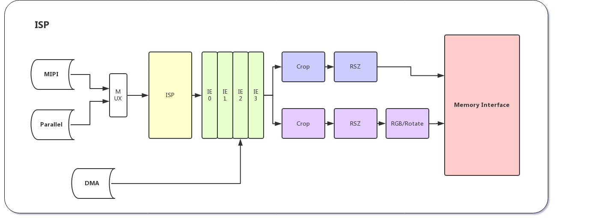
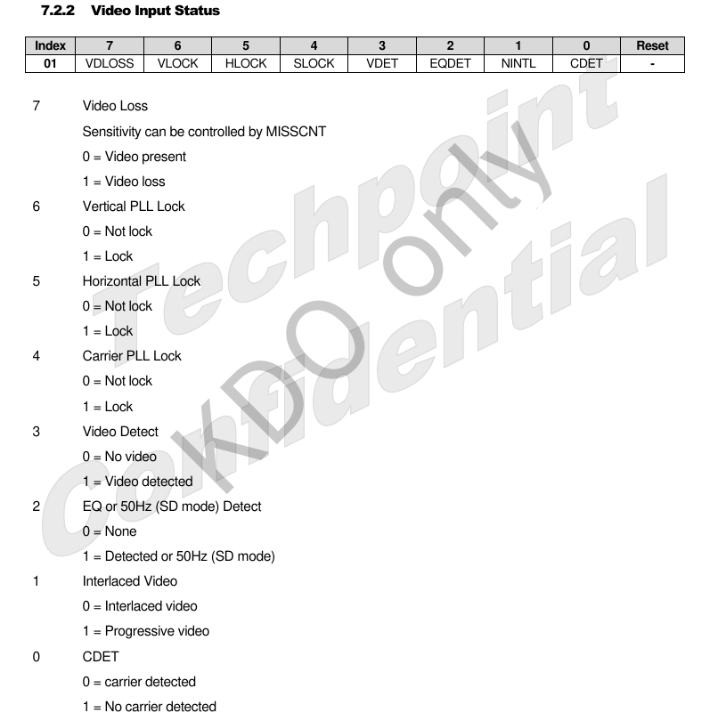

# CAMERA 


## 1. CAMERA(mipi)

RK3568 플랫폼은 1개의 physical mipi csi2 dphy를 가지고 있습니다. physical mipi csi2 dphy는 2가지 모드를 선택할 수 있습니다.
 - full mode : 
	* csi2_dphy0 (csi2_dphy0, csi2_dphy1/csi2_dphy2 을 동시에 사용하지 못합니다.)
	* 최대 4 data lanes
	* 최대 2.5Gbps/lane 속도
 - split mode :
	* csi2_dphy1 and/or csi2_dphy2 (csi2_dphy0 을 이 모드에서는 사용 할수 없습니다.)
	* csi2_dphy1과 csi2_dphy2 는 동시에 사용 가능합니다.
	* csi2_dphy1과 csi2_dphy2 는 동시에 사용하는경우, 최대 2 data lanes 을 사용가능 합니다.
	* csi2_dphy1은 physical dphy lane0/lane1 과 매핑 됩니다.
	* csi2_dphy2은 physical dphy lane2/lane3 과 매핑 됩니다.
	* 최대 2.5Gmps/lane 속도
	
| **Option**   	| **Sensor Lane**                 	| **Interface**                                                                                        	|
|--------------	|---------------------------------	|------------------------------------------------------------------------------------------------------	|
| _full mode_  	| sensor1 x4lane                  	| MIPI_CSI_RX_D0, MIPI_CSI_RX_D1, MIPI_CSI_RX_D2, MIPI_CSI_RX_D3, MIPI_CSI_RX_CLK0                     	|
| _split mode_ 	| sensor1 x2lane + sensor2 x2lane 	| MIPI_CSI_RX_D0, MIPI_CSI_RX_D1, MIPI_CSI_RX_CLK0, & MIPI_CSI_RX_D2, MIPI_CSI_RX_D3, MIPI_CSI_RX_CLK1 	|

 Link Freq 와 Pixel Rate 관계
> Link Freq와 Pixel Rate 는 MIPI CSI-2 인터페이스에서 사용되는 데이터 전송 속도와 이미지 센서에서 생성된 픽셀의 속도를 결정하는 요소.
 - link frequency
   * link_freq는 MIPI CSI-2 인터페이스에서 사용되는 Clock 주파수. 
   * 이 주파수는 MIPI CSI-2 인터페이스에서 사용되는 데이터 전송 속도를 결정.
 - pixel rate 
   * pixel rate는 이미지 센서에서 생성된 픽셀의 속도. 
   * 이 속도는 이미지 센서에서 생성된 픽셀의 수와 초당 전송되는 픽셀 수를 결정. 
> 이미지 센서에서 픽셀은 이미지를 구성하는 최소 단위. 이미지 센서의 화소수는 흔히 메가픽셀(Megapixels) 단위로 표시.
> 만약 800만 화소의 카메라로 촬영한 이미지는 800만개의 픽셀로 구성되어 있다고 생각하면 됨. 


### 1.1 Full Mode 설정

- link path :
	* sensor->csi_dphy0->isp_vir0

#### 1.1.1 configure sensor

- camera sensor와 통신하는 i2c 버스 세팅. 

```dtb
&i2c4 {
	status = "okay";
	ov5695: ov5695@36 {
		status = "okay";
		compatible = "ovti,ov5695";
		reg = <0x36>;
		clocks = <&cru CLK_CIF_OUT>;
		clock-names = "xvclk";
		power-domains = <&power RK3568_PD_VI>;
		pinctrl-names = "default";
		pinctrl-0 = <&cif_clk>;
		reset-gpios = <&gpio3 RK_PB6 GPIO_ACTIVE_HIGH>;
		pwdn-gpios = <&gpio4 RK_PB4 GPIO_ACTIVE_HIGH>;
		rockchip,camera-module-index = <0>;
		rockchip,camera-module-facing = "back";
		rockchip,camera-module-name = "TongJu";
		rockchip,camera-module-lens-name = "CHT842-MD";
		port {
			ov5695_out: endpoint {
				remote-endpoint = <&mipi_in_ucam2>;
				data-lanes = <1 2>;
			};
		};
	};
};
```

#### 1.1.2 configure logical dphy

- csi2_dphy0, csi2_dphy1/csi2_dphy2 은 동시에 사용할 수 없습니다. 
- csi2_dphy_hw 노드를 활성화 시킵니다.

```dtb
&csi2_dphy0 {
	status = "okay";

	ports {
		#address-cells = <1>;
		#size-cells = <0>;
		port@0 {
			reg = <0>;
			#address-cells = <1>;
			#size-cells = <0>;

			mipi_in_ucam0: endpoint@1 {
				reg = <1>;
				remote-endpoint = <&ucam_out0>;
				data-lanes = <1 2 3 4>;
			};
			mipi_in_ucam1: endpoint@2 {
				reg = <2>;
				remote-endpoint = <&gc8034_out>;
				data-lanes = <1 2 3 4>;
			};
			mipi_in_ucam2: endpoint@3 {
				reg = <3>;
				remote-endpoint = <&ov5695_out>;
				data-lanes = <1 2>;
			};
		};
		port@1 {
			reg = <1>;
			#address-cells = <1>;
			#size-cells = <0>;

			csidphy_out: endpoint@0 {
				reg = <0>;
				remote-endpoint = <&isp0_in>;
			};
		};
	};
};


&csi2_dphy_hw {
   status = "okay";
};

&csi2_dphy1 {
        status = "disabled";
};

&csi2_dphy2 {
        status = "disabled";
};
```


#### 1.1.3 configure isp

- The remote-endpoint in rkisp_vir0 node should point to *csidphy_out*

```dtb
&rkisp {
   status = "okay";
};

&rkisp_mmu {
   status = "okay";
};

&rkisp_vir0 {
	status = "okay";

	port {
		#address-cells = <1>;
		#size-cells = <0>;

		isp0_in: endpoint@0 {
			reg = <0>;
			remote-endpoint = <&csidphy_out>;
		};
	};
};

```


### 1.2 Split Mode 설정


- link path:
	* sensor->csi_dphy0->isp_vir0  
	or   
	* sensor1->csi_dphy1->isp_vir0
	* sensor2->csi_dphy2->mipi_csi2->vicap->isp_vir1

#### 1.2.1 configure Sensor

```dtb
&i2c4 {
	status = "okay";

	// MIPI
	tp2860: tp2860@44 {
			status = "okay";
			compatible = "techpoint,tp2860";
			reg = <0x44>;

			// resetPin assignment and effective level
			reset-gpios = <&gpio3 RK_PC6 GPIO_ACTIVE_LOW>;	/* low active */
			//sensor Related power domain enable
			power-domains = <&power RK3568_PD_VI>;
			
			// Module number, this number should not be repeated
			rockchip,camera-module-index = <0>;
			// Module orientation which are "back" and "front"
			rockchip,camera-module-facing = "back";
			// module name
			rockchip,camera-module-name = "E-QFN40";
			// lens name
			rockchip,camera-module-lens-name = "DP-VIN3";

			port {
				tp2860_out: endpoint {
					// mipi dphy port
					remote-endpoint = <&mipi_in_ucam0>;
					//slave-mode;
					// csi2 dphy lane name,2lane is <1 2>, 4lane is <1 2 3 4>
					data-lanes = <1 2>;

			};
		};
	};
};

```

#### 1.2.2 configure csi2_dphy0 (or csi2_dphy1/csi2_dphy2)

 - dphy는  isp와 sensor 를 link 합니다. 
   * mipi_in_ucam0 : sensor side의 link
   * csidphy_out : isp side의 link

```dtb
&csi2_dphy0 {
	status = "okay";

	ports {
		#address-cells = <1>;
		#size-cells = <0>;
		port@0 {
			reg = <0>;
			#address-cells = <1>;
			#size-cells = <0>;

			mipi_in_ucam0: endpoint@1 {
				reg = <1>;
				// The port name of the sensor
				remote-endpoint = <&tp2860_out>;
				// csi2 dphy lane number
				data-lanes = <1 2>;
			};
		};
		port@1 {
			reg = <1>;
			#address-cells = <1>;
			#size-cells = <0>;

			csidphy_out: endpoint@0 {
				reg = <0>;
				remote-endpoint = <&isp0_in>;
			};	
		};
	};	
};

&csi2_dphy_hw {
      status = "okay";
};

&mipi_csi2 {
        status = "okay";

        ports {
                #address-cells = <1>;
                #size-cells = <0>;

                port@0 {
                        reg = <0>;
                        #address-cells = <1>;
                        #size-cells = <0>;

                        mipi_csi2_input: endpoint@1 {
                                        reg = <1>;
                                        remote-endpoint = <&dphy2_out>;
                                        data-lanes = <1 2>;
                        };
                };

                port@1 {
                        reg = <1>;
                        #address-cells = <1>;
                        #size-cells = <0>;

                        mipi_csi2_output: endpoint@0 {
                                        reg = <0>;
                                        remote-endpoint = <&cif_mipi_in>;
                                        data-lanes = <1 2>;
                        };
                };
        };
};
```


#### 1.2.3 configure isp

 - The remote-endpoint in rkisp_vir0 node should point to dphy1_out

```dtb
&rkisp {
        status = "okay";
};

&rkisp_mmu {
        status = "okay";
};

&rkisp_vir0 {
	status = "okay";

	port {
		#address-cells = <1>;
		#size-cells = <0>;

		isp0_in: endpoint@0 {
			reg = <0>;
			remote-endpoint = <&csidphy_out>;
		};
	};
};

&rkcif_mmu {
    status = "okay";
};

&rkcif {
    status = "okay";
};
```

#### 1.2.4 debug cif & isp driver

 - RKISP1 모듈이 성공적으로 probe되면, 다수의 /dev/video* 디바이스가 생성 됩니다. 
 - RKISP1 모듈은 /sys filesystem 에도 video node를 등록하므로 아래 명령어를 통해 정보를 확인 할 수 있습니다.
   * **rkisp1** 모듈은 4개의 device(selfpath, mainpath, statistics, input-params)를 등록합니다. 
   * [mipi_topology](./attachment/CAMERA/mipi_topology)

| **Device node** 	| **Name**     	| **Functions**         	|
|-----------------	|--------------	|-----------------------	|
| /dev/video0      	| Main Path    	| video output          	|
| /dev/video1      	| Self Path    	| video output          	|
| /dev/video7     	| Statistics   	| 3a statistics         	|
| /dev/video8      	| Input-params 	| 3a parameter settings 	|

```bash
rk3568_poc:/ # grep '' /sys/class/video4linux/video*/name
/sys/class/video4linux/video0/name:rkisp_mainpath
/sys/class/video4linux/video1/name:rkisp_selfpath
/sys/class/video4linux/video2/name:rkisp_rawwr0
/sys/class/video4linux/video3/name:rkisp_rawwr2
/sys/class/video4linux/video4/name:rkisp_rawwr3
/sys/class/video4linux/video5/name:rkisp_rawrd0_m
/sys/class/video4linux/video6/name:rkisp_rawrd2_s
/sys/class/video4linux/video7/name:rkisp-statistics
/sys/class/video4linux/video8/name:rkisp-input-params
```


### 1.3 Related Directory(kernel)

```bash
Linux Kernel-4.19
|-- arch/arm/boot/dts 								#DTS configuration file
|-- drivers/phy/rockchip
|	|-- phy-rockchip-mipi-rx.c						#mipi dphy driver
|	|-- phy-rockchip-csi2-dphy-common.h
|	|-- phy-rockchip-csi2-dphy-hw.c
|	|-- phy-rockchip-csi2-dphy.c
|
|-- drivers/media
|	|-- platform/rockchip/cif 						#RKCIF driver 
|   |                                               (probe from "rockchip,rkcif-dvp","rockchip,rkcif-mipi-lvds" node)
|	|-- platform/rockchip/isp 						#RKISP driver  
|   |   |                                           (probe from "rockchip,rkisp-vir" node)
|	|	|-- dev.c	  								#includes probe, asynchronous register clock, pipeline, iommu and media/v4l2 framework
|	|	|-- capture.c								#includes mp/sp/rawwr configuration and vb2, frame interrupt handle
|	|	|-- dmarx.c 								#includes rawrd configuration and vb2, frame interrupt handle
|	|	|-- isp_params.c							#3A-related parameters
|	|	|-- isp_stats.c								#3A-related statistics
|	|	|-- isp_mipi_luma.c							#mipi luminance data statistics
|	|	|-- regs.c 									#register-related read/write operation
|	|	|-- rkisp.c									#isp subdev and entity register
|	|	|-- csi.c 									#csi subdev and mipi configuration
|	|	|-- bridge.c								#bridge subdev,isp and ispp interaction bridge
|   |
|	|-- platform/rockchip/ispp 						#rkispp driver
|	|	|-- dev.c 									#includes probe, asynchronous register, clock, pipeline, iommu and media/v4l2 framework
|	|	|-- stream.c 								#includes 4-channel video output configuration and  vb2, frame interrupt handle
|	|	|-- rkispp.c 								#ispp subdev and entity register
|	|	|-- params.c								#TNR/NR/SHP/FEC/ORB parameters
|	|	|-- stats.c 								#ORB statistics
|   |   
|   |-- i2c
|	|   |-- tp2860.c								#CIS(cmos image sensor) driver	
```


### 1.4 Develop 

* hw Interface

| **GPIOs**         	| **IOMUX**         	| **address**       	|
|-------------------	|-------------------	|-------------------	|
| GPIO4_B2          	| RESERVE_SDA       	| 0xFDC60068[08:10] 	|
| GPIO4_B3          	| RESERVE_SCL       	| 0xFDC60068[14:12] 	|
| GPIO3_C6          	| MIPI_CAM0_RST     	| 0xFDC60054[10:8]  	|
| MIPI_CSI_RX_D0P   	| MIPI_CSI_RX_D0P   	| 0xFE870000        	|
| MIPI_CSI_RX_D0N   	| MIPI_CSI_RX_D0N   	| 0xFE870000        	|
| MIPI_CSI_RX_D1P   	| MIPI_CSI_RX_D1P   	| 0xFE870000        	|
| MIPI_CSI_RX_D1N   	| MIPI_CSI_RX_D1N   	| 0xFE870000        	|
| MIPI_CSI_RX_CLK0P 	| MIPI_CSI_RX_CLK0P 	| 0xFE870000        	|
| MIPI_CSI_RX_CLK0N 	| MIPI_CSI_RX_CLK0N 	| 0xFE870000        	|


* code 
	- [x] RKISP 드라이버는 프레임워크에서 제공하는 user control을 사용해야 합니다. 카메라 센서 드라이버는 다음 control functions을 구현해야 합니다. (CIS 드라이버 V4L2-controls list1 참조)
	- [x] PTZ 란 ? : cctv 에서 카메라 모듈을 제어하는 기능
	- [x] sensor와 cif가 바인딩되었는지 확인. : rkisp-vir0: Async subdev notifier completed 
	- [x] BLOB, YCbCr_420_888, IMPLEMENTATION_DEFINED
	- [x] rk3568 evb에서 CIF_CLKOUT 핀의 용도. 센서 동작중에 어떤 동작을 취하는지 확인 필요.  : 외부 크리스탈을 대체 하여 Soc 에서 발진


### 1.5 Camera 디버깅

 * v4l2-ctl 을 사용하여 카메라 프레임 데이터를 디버깅 합니다.

```bash
# camera test device
v4l2-ctl --verbose -d /dev/video0 --set-fmt-video=width=720,height=480,pixelformat='NV12' --stream-mmap=4 --set-selection=target=crop,flags=0,top=0,left=0,width=720,height=480 --stream-to=/data/out.yuv
```

 * debug 활성화
```bash
echo 1 > /sys/module/video_rkcif/parameters/debug
// vb2(vpu/isp)
echo 7 > /sys/module/videobuf2_core/parameters/debug
```

 * dumpsys CAMERA
	```bash
	dumpsys media.camera
	```

 * write register timing
```c
__ov5695_start_stream
	|	// preview 시작 시,
	+-> ret = ov5695_write_array(ov5695->client, ov5695->cur_mode->reg_list);


__ov5695_stop_stream
	| preview 종료 시,	
	+-> 
```


-----

## 2. CAMERA(dvp)

RK3568 플랫폼은 1개의 DVP 인터페이스를 가지고 있습니다. 

- link path :
	* sensor->rkcif_dvp


### 2.1 DVP 인터페이스 설정

#### 2.1.1 configure sensor

- camera sensor와 통신하는 i2c 버스 세팅. 

```dtb
&i2c2 {
	status = "okay";
	pinctrl-0 = <&i2c2m1_xfer>;

	gc2145: gc2145@3c{
		status = "okay";
		compatible = "galaxycore,gc2145";
		reg = <0x3c>;
		pinctrl-names = "default";
		clocks = <&cru CLK_CIF_OUT>;
		clock-names = "xvclk";
		power-domains = <&power RK3568_PD_VI>;
		pinctrl-0 = <&cif_clk &cif_dvp_clk &cif_dvp_bus16>;
		/* avdd-supply = <>; */
		/* dvdd-supply = <>; */
		/* dovdd-supply = <>; */
		/*power-gpios = <&gpio4 RK_PA6 GPIO_ACTIVE_HIGH>;*/
		reset-gpios = <&gpio4 RK_PA7 GPIO_ACTIVE_LOW>;
		pwdn-gpios = <&gpio4 RK_PA6 GPIO_ACTIVE_HIGH>;
		rockchip,camera-module-index = <1>;
		rockchip,camera-module-facing = "front";
		rockchip,camera-module-name = "CameraKing";
		rockchip,camera-module-lens-name = "Largan";
		port {
			gc2145_out: endpoint {
				remote-endpoint = <&dvp_in_bcam>;
			};
		};
	};
};

```

#### 2.1.2 configure logical dvp

- dvp 노드를 활성화 시킵니다.

```dtb
&rkcif_dvp {
	status = "okay";
	port {
		/* Parallel bus endpoint */
		dvp_in_bcam: endpoint {
			remote-endpoint = <&gc2145_out>;
			bus-width = <8>;
			vsync-active = <0>;
			hsync-active = <1>;
		};
	};
};
```

### 2.2 Develop(BT601)
 - hsync-active, vsync-active 구성 여부에 따라 BT601 인터페이스를 식별합니다. 구성하지 않으면 BT656 으로 식별.
 - v4l g_mbus_config 인터페이스를 통해 valid 한 polarity (hsync, vsync, pclk) 를 전달합니다.
 - pinctrl을 사용하는 인터페이스에 맞도록 구성합니다.
	 | **GPIOs** 	| **IOMUX** 	|
	 |-----------	|-----------	|
	 | GPIO3_D6  	| DATA0     	|
	 | GPIO3_D7  	| DATA1     	|
	 | GPIO4_A0  	| DATA2     	|
	 | GPIO4_A1  	| DATA3     	|
	 | GPIO4_A2  	| DATA4     	|
	 | GPIO4_A3  	| DATA5     	|
	 | GPIO4_A4  	| DATA6     	|
	 | GPIO4_A5  	| DATA7     	|
	 | GPIO4_B6  	| HSYNC     	|
	 | GPIO4_B7  	| VSYNC     	|
	 | GPIO4_C0  	| MCLK      	|
	 | GPIO4_C1  	| PCLK      	|


### 2.3 debug cif & dvp driver

 - [dvp_topology](./attachment/CAMERA/dvp_topology)

```bash
rk3568_poc:/ # grep '' /sys/class/video4linux/video*/name
/sys/class/video4linux/video0/name:stream_cif_dvp_id0
/sys/class/video4linux/video1/name:stream_cif_dvp_id1
/sys/class/video4linux/video2/name:stream_cif_dvp_id2
/sys/class/video4linux/video3/name:stream_cif_dvp_id3
/sys/class/video4linux/video4/name:rkcif-mipi-luma
```

---

## 3. rkcif

rkcif 드라이버는 v4l2/media framework를 기반으로 구성된 하드웨어 장치 subdevices의(mipi dphy, sensor)  인터럽트 처리, 버퍼 관리, power 제어 등을 담당.
  
 


### 3.1 cif 장치 

#### 3.1.1 cif 장치 probe 확인.

cif 장치가 probe 되면 /dev/ 경로에 비디오 및 미디어 장치 노드가 생성됩니다. (ex. /dev/media0)
system에는 여러 /dev/video 장치가 있을 수 있으며, 해당되는 cif장치 노드는  /sys 노드를 통해서 확인할 수 있습니다.

```bash
rk3568_poc:/ # grep -H '' /sys/class/video4linux/video*/name
/sys/class/video4linux/video0/name:stream_cif_dvp_id0
/sys/class/video4linux/video1/name:stream_cif_dvp_id1
/sys/class/video4linux/video10/name:rkisp_rawrd0_m
/sys/class/video4linux/video11/name:rkisp_rawrd2_s
/sys/class/video4linux/video12/name:rkisp-statistics
/sys/class/video4linux/video13/name:rkisp-input-params
/sys/class/video4linux/video2/name:stream_cif_dvp_id2
/sys/class/video4linux/video3/name:stream_cif_dvp_id3
/sys/class/video4linux/video4/name:rkcif-mipi-luma
/sys/class/video4linux/video5/name:rkisp_mainpath
/sys/class/video4linux/video6/name:rkisp_selfpath
/sys/class/video4linux/video7/name:rkisp_rawwr0
/sys/class/video4linux/video8/name:rkisp_rawwr2
/sys/class/video4linux/video9/name:rkisp_rawwr3

```

media-ctl 명령어를 사용하여 topology 를 출력해 확인 할 수 있습니다.
또는 커널 로그를 디버깅하여 확인 할 수 있습니다.

```bash

rk3568_poc:/ # dmesg | grep cif
[    0.559511] phy phy-fe8b0000.usb2-phy.3: No vbus specified for otg port
[    1.046449] rkcifhw fdfe0000.rkcif: iommu is disabled, using non-iommu buffers
[    1.046476] rkcifhw fdfe0000.rkcif: No reserved memory region assign to CIF
[    1.046663] rkcif rkcif_dvp: rkcif driver version: v00.01.0a
[    1.046713] rkcif rkcif_dvp: attach to cif hw node
[    1.046729] rkcif rkcif_dvp: rkcif wait line 0
[    1.216975] rkcif rkcif_dvp: Entity type for entity rkcif-dvp-sof was not initialized!
[    1.217393] rkcif_dvp: Async subdev notifier completed
[    1.263367] rkcif rkcif_dvp: clear unready subdev num: 0
[    7.691702] rkcif_dvp: get_remote_sensor: remote pad is null
[    7.691765] rkcif_dvp: rkcif_update_sensor_info: stream[1] get remote sensor_sd failed!
[    7.691773] stream_cif_dvp_id1: update sensor info failed -19
[    9.384067] rkcif_dvp: get_remote_sensor: remote pad is null
[    9.384105] rkcif_dvp: rkcif_update_sensor_info: stream[2] get remote sensor_sd failed!
[    9.384113] stream_cif_dvp_id2: update sensor info failed -19
[    9.384234] rkcif_dvp: get_remote_sensor: remote pad is null
[    9.384258] rkcif_dvp: rkcif_update_sensor_info: stream[3] get remote sensor_sd failed!
[    9.384266] stream_cif_dvp_id3: update sensor info failed -19
```

#### 3.1.2 snesor와 cif 바인딩 확인.

cif와 sensor는 비동기식으로 로드(probe)되며, cif와 sensor 드라이버가 로드된 후, 바인딩 됩니다.

```bash
127|rk3568_poc:/ # dmesg | grep Async
[    1.217393] rkcif_dvp: Async subdev notifier completed
[    1.331093] rkisp-vir0: Async subdev notifier completed
```


 - *RKCIF* Driver User Manual

 아래 block diagram은 RKCIF1 드라이버의 토폴로지를 보여준다.


#### 3.1.3 sensor & cif & isp link

```bash

    [tp2860]
    	|
    	+----[port@0]
    	         +----[tp2860_out] 
    	                  |
                          |
                          |
[csi2_dphy_hw@fe870000]   |
    [csi2_dphy0]          |
        |                 |
        +----[port@0]     |
        |        |        |
        |        +----[mipi_in_ucam0]
        |
        +----[port@1]
                 |
                 +----[csidphy_out]
                          |
                          |
                          |
                          |
                          |
[rkisp@fdff0000]          |
        [rkisp_vir0]      |
    	    |             |
    	    +--------[isp0_in]


```


---

## 4. VICAP

 * VICAP : Video Capture(Video Input Processor) 모듈은 DVP/MIPI 인터페이스의 장치로 부터 받은 데이터를 AXI bus를 사용하여 system main memory로 전달합니다.
 * VICAP 드라이버는 주로 v4l2 또는 media framework를 기반으로 하여 subdevices의 hardware configuration, interrupt processing, control buffer rotation, control power 처리를 제공합니다.
 * RK3568의 경우, VICAP는 하나의 Core와 2개의 인터페이스(dvp, mipi)를 제공합니다.
	 - dvp 인터페이스의 경우, rkvicap_dvp node 와 연결.
	 - mipi 인터페이스의 경우, rkvicap_mipi_lvds node 와 연결.
 * VICAP에 입력된 데이터를 ISP 드라이버와 동기화 하기 위해서 VICAP 드라이버는 sditf 노드를 사용합니다.
 	- dvp 인터페이스의 경우, rkvicap_dvp_sditf 노드를 생성.
	- mipi/lvds 인터페이스의 경우, rkvicap_mipi_lvds_sditf 노드 생성.
 * 아래 그림은 VICAP에 의해 구동되는 device topology를 설명합니다.
		

 * rk3568 poc vicap link path

```bash
[m00_b_tp2860 5-0044] -> [rockchip-csi2-dphy1] -> [rockchip-mipi-csi2] -> [stream_cif_mipi_id0]
```

 * rk3568 evb vicap link path

```bash
[m00_b_ov5695 4-0036] -> [rockchip-csi2-dphy1] -> [rockchip-mipi-csi2]/dev/v4l-subdev0 -> [stream_cif_mipi_id0]/dev/video0
```

---

## 5. ISP 

 * ISP : Image Signal Processing  
	- ISP 는 아래 기능을 포함합니다.
		+ DVP 인터페이스를 지원합니다.
		+ MIPI 인터페이스를 지원합니다.(mipi dphy가 필요)
		+ Image Signal Processing  
			= ISP에 데이터가 입력되면 MP, SP 모듈로 데이터를 전달 합니다.  
			- [ ] de-interlaced 기능은 SP 모듈에서만 지원합니다.  

			= Crop  
			= Resize  
	- block diagram
		

 * ISP 와 VICAP 모듈 간 관계
	- rk3568 플랫폼은 VICAP와  ISP,  2개의 독립적인 이미지 관련 IP 를 가지고 있습니다. 
	- VICAP에서 입력된 데이터를 ISP에게 전달하여 입력된 데이터를 처리 합니다. 
	  * v4l2 subdev 를 생성하여 ISP 노드에 연결해야 합니다.
		  


---

## 6. camera hal(rockchip camera hal3)
 rockchip camera hal3 는 rkisp와 cif 드라이버를 기반으로 통신하고 있습니다.

### 6.1 구조
 * Camera HAL3 구조  
   - android framework 에서 camera hal3의 구조는 아래와 같습니다.   
   - framework API 인터페이스를 제공하여 제어 명령에 응답하고 데이터 및 결과를 반환 합니다.  
   - driver 와 v4l2 interface 를 통해 커널과 통신합니다.   
   - 기능 동작을 위해 camera buffer 할당과 같은 라이브러리를 호출하고, jpeg 인코딩을 위해 hwjpeg관련 라이브러리를 호출합니다.  
    

	 

 * 코드 디렉토리

```bash
ROCKCHIP_ANDROID12/hardware/rockchip/camera$ tree -d
.
├── AAL						// Android Abstraction Layer, 프레임워크와 상호작용 
├── common					// common file (thread, message processingg, log, etc)
│   ├── gcss				// xml parsing 
│   │   ├── cipf_css
│   │   ├── ia_cipf
│   │   └── ia_tools
│   ├── imageProcess		// image processing, (scale)
│   ├── jpeg				// jpeg encoding 
│   ├── mediacontroller		// media pipeline
│   ├── platformdata		// xml 파일에서 얻은 속성을 관리
│   │   ├── gc
│   │   └── metadataAutoGen
│   │       └── 6.0.1
│   ├── utils				// return값 정의(Errors.h)
│   └── v4l2dev				// v4l2 driver와 상호 작용
├── etc
│   ├── camera				// config files(xml)
│   │   └── rkisp1
│   ├── firmware
│   └── tools
├── include					// control loop header files, buffer 관리 
│   └── arc
├── lib						// isp 에서 사용되는 3a lib(ae, af, awb)
│   ├── arm
│   └── arm64
├── psl						// physical layer. 
│   ├── rkisp1				// rkisp1 관련 코드
│   │   ├── tasks
│   │   ├── tunetool
│   │   └── workers			// data 처리와 수집을 처리
│   └── rkisp2				// rkisp2 관련 코드(for rk356x)
│       ├── eptz
│       ├── rockx
│       │   ├── modules
│       │   └── utils
│       ├── tasks
│       └── workers
└── tools

38 directories
```

 Camera HAL3 모듈은 AAL 모듈과 PSL 모듈을 포함합니다.  
   - AAL : android framework와 통신 하는 모듈이며, camera_module, API 인터페이스 가 정의 되어 있습니다. android framework로 부터 받은 요청을 PSL에게 전달 합니다.  
   - PSL : physical layer 기능을 담당하는 모듈이며, isp와 통신, 커널과 v4l2 통신을 담당합니다.  
	 

### 6.2 디버깅

 - log 활성화

```bash
setprop persist.vendor.camera.debug.logfile 1
setprop persist.vendor.camera.debug.assert 1

# ls /data/misc/camera
cam_dbg_log_hal.txt_286


# enable log
setprop persist.vendor.camera.global.debug 7
setprop persist.vendor.camera.hal.debug 7

setprop persist.vendor.camera.debug
setprip persist.vendor.camera.perf
setprop persist.vendor.camera.dump


# view the driver debug information 
echo 3 > /sys/module/video_rkisp/parameters/debug (n = 0, 1, 2, 3; 0 is off)
echo 3 > /sys/module/video_rkispp/parameters/debug 
echo 8 > /proc/sys/kernel/printk


# check the register inforamtion and pull out reg file
io -4 -l 0x10000 0xfdff0000 > /tmp/isp.reg
```


 - VICAP(VICAP1) 레지스터 디버깅
   * VICAP_MIPI_ID0_CTRL0 : ID0 를 사용(dphy0 으로 정의한 경우) ID0, ID1, ID2, ID3의 CTRL0, CTRL1 레지스터를 제공함.
   * VICAP_MIPI_FRAME0_ADDR_Y_ID0, VICAP_MIPI_FRAME1_ADDR_Y_ID0, VICAP_MIPI_FRAME0_ADDR_UV_ID0, VICAP_MIPI_FRAME1_ADDR_UV_ID0, VICAP_MIPI_FRAME0_VLW_Y_ID0, VICAP_MIPI_FRAME1_VLW_Y_ID0, VIACP_MIPI_FRAME0_VLW_UV_ID0, VICAP_MIPI_FRAME1_VLW_UV_ID0 : frame 데이터가 저장되는 레지스터.
   * VICAP_MIPI_ID0_CROP_START : start x and y coordinate for id0
 


<br/>


 - camera hal3 과 framework 간 Interface

```bash

  +---------------+                                                  +---------------+
  | framework     |                                                  | hal           |
  +-------+-------+                                                  +-------+-------+
          |                                                                  |
		  +----camera_module_t->common.open()------------------------------->+
          |                                                                  |
          +<--------------------------------------------hardware_device_t----+
          |                                                                  |
		  +----(camera3_device_t *)hardware_device_t->ops->initialize()----->+
          |                                                                  |
		  +----camera3_device_t->ops->configure_stream()-------------------->+
          |                                                                  |
		  +----camera3_device_t->ops->construct_default_request_settings()-->+
          |                                                                  |
          |  +--------------------------loop------------------------------+  |
		  +--|-camera3_device_t->ops->process_capture_request()-----------|->+
          |  |                                                            |  |
		  +<-|-------------------camera3_callback_ops_t->notify():SHUTTER-|--+
          |  |                                                            |  |
		  +<-|-----------camera3_callback_ops_t->process_capture_result()-|--+
          |  +------------------------------------------------------------+  |
          |                                                                  |
		  +----camera3_device_t->common->close()---------------------------->+
          |                                                                  |
          |                                                                  |
          |                                                                  |

 ```
 camera framework hal API관련 코드는 아래 경로 참조. 
  <android_root>/hardware/libhardware/include/hardware/camera3.h

 - camera hal3 분석.

   * debug log

```bash
"", "persist.vendor.camera.global.debug"     }, /* CAM_NO_MODULE     */
"<HAL>", "persist.vendor.camera.hal.debug"        }, /* CAM_HAL_MODULE    */
"<JPEG>", "persist.vendor.camera.mmstill.logs"     }, /* CAM_JPEG_MODULE   */
```
  
### 6.2 sensor 등록
  
 센서 드라이버가 변경되거나 새로운 센서를 HAL에서 지원하도록 추가하려면 아래 파일을 수정해야 합니다.   
 HAL 코드 : hardware/rockchip/camera   

 * sensor tuning file.(soc sensor는 skip 해도 됨)
 * camera3_profile.xml 파일


#### 6.2.1 sensor tuning file
 sensor의 turning file은 센서로 부터 raw data를 수신할 때 필요합니다.  
 <sensor_name>_<module_name>_<lens_name>.xml 형식으로 파일이름을 지정해주어야 하며, /vendor/etc/camera/rkisp1 디렉토리에 위치해야 합니다. 3a 라이브러리는 위 경로를 참조합니다.  
 ex) tp2860_E-QFN40_DP-VIN3.xml  

#### 6.2.2 camera3_profile.xml
 <hal3_camera>/etc/camera 경로에 camera3_profiles_<platform>.xml 파일들이 있습니다.  
 빌드 과정에서 /vendor/etc/camera/camera3_profile.xml 으로 해당 파일이 위치하게 됩니다.  
 camera hal3은 camera3_profile.xml파일을 참조합니다.  

 * camera3_profile.xml 파일은 다수의 Profiles Node가 포함되어 있으며, Profile Node에는 센서의 속성 정보가 포함되어 있습니다.  
 * Profile 노드에는 아래 4개의 sub node가 있습니다.  

```xml
<Profiles cameraId="0" name="tp2860" moduleId="m00">

        <Supported_hardware>
		</Supported_hardware>

		<Android_metadata>
		</Android_metadata>

		<Hal_tuning_RKISP1>
		</Hal_tuning_RKISP1>

		<Sensor_info_RKISP1>
		</Sensor_info_RKISP1>

</Profiles>
```

   - Android_metadata : Node에 포함된 정보는 Sensor 에서 지원하는 기능이며, 각 필드는 camera_module의 get_camrea_info() API를 통해 얻을 수 있습니다.

```bash
$ adb shell dumpsys media.camera
```
	각 노드의 설명은 Android개발자 웹사이트에서 확인 가능
	https://developer.android.com/reference/android/hardware/camera2/CameraCharacteristics

   - 그외 노드 : rkisp 및 sensor 초기화에 필요한 정보 입니다.   
	 ex) sensor 의 타입을 정의합니다. raw 또는 soc
```xml
	<Sensor_info_RKISP1>
		<sensorType value="SENSOR_TYPE_SOC"/> <!-- SENSOR_TYPE_SOC or SENSOR_TYPE_RAW -->
	</Sensor_info_RKISP1>

```
 
---

## 7. rkisp
 rkisp1 isp 드라이버
 7.1 framework에 대한 설명

 rkisp 드라이버는 주로 v4l2/media framework를 기반으로 hardware 구성, 인터럽트 처리, buffer rotation, sub device(예, mipi dphy, 센서) 의 전원 enable/disable을 제어한다.
 아래 블록 다이어그랩은 rkisp1 드라이버의 topology를 보여준다.

 
 
|       **name**      	|       **type**      	|                                                                                                                                                                       **describe**                                                                                                                                                                       	|
|:-------------------:	|:-------------------:	|:--------------------------------------------------------------------------------------------------------------------------------------------------------------------------------------------------------------------------------------------------------------------------------------------------------------------------------------------------------:	|
| rkisp1_mainpath     	| v4l2_vdev, capture  	| Format: YUV, RAW Bayer; Support: Crop                                                                                                                                                                                                                                                                                                                    	|
| rkisp1_selfpath     	| v4l2_vdev, capure   	| Format: YUV, RGB; Support: Crop                                                                                                                                                                                                                                                                                                                          	|
| rkisp1-isp-subdev   	| v4l2_subdev         	| Internal isp blocks; Support: source/sink pad crop  The format on sink pad should be equal to sensor input format, the size should be equal/less than sensor input size.  The format on source pad sould be equal to vdev output format if output format is raw bayer, otherwise it should be YUYV2X8. The size should be equal/less than sink pad size. 	|
| rockchip-sy-mipi    	| v4l2_subdev         	| MIPI_DPHY Configure.                                                                                                                                                                                                                                                                                                                                     	|
| rkisp1-statistics   	| v4l2_vdev,  capture 	| Provide Image color Statistics information.                                                                                                                                                                                                                                                                                                              	|
| rkisp1-input-params 	| v4l2_vdev, output   	| Accept params for AWB, BLC..... Image enhancement blocks.                                                                                                                                                                                                                                                                                                	|

---

## 8. decoder : techpoint tp2825 

> techpoint tp2826 코드 분석 자료 

* 코드 분석 

```c
static int __init tp2802_module_init(void)
	|
	+-> misc_regiser(&tp2802_dev);
	|	// register misc device
	|		static struct file_operations tp2802_fops =
	|	    {
	|			.owner = THIS_MODULE,
	|			.unlocked_ioctl = tp2802_ioctl,
	|			.open = tp2802_open,
	|			.release = tp2802_close
	|		};
	|		|
	|		+-> long tp2802_ioctl(struct file *file, unsigned int cmd, unsigned long arg)
	|		|	/**
	|		|	  * TP2802_READ_REG:
	|		|	  * TP2802_WRITE_REG:
	|		|	  * TP2802_SET_VIDEO_MODE:
	|		|	  * TP2802_GET_VIDEO_MODE:
	|		|	  * TP2802_GET_VIDEO_LOSS:
	|		|	  * TP2802_SET_IMAGE_ADJUST:
	|		|	  * TP2802_GET_IMAGE_ADJUST:
	|		|	  * TP2802_SET_PTZ_DATA:
	|		|	  * TP2802_GET_PTZ_DATA:
	|		|	  * TP2802_SET_SCAN_MODE:
	|		|	  * TP2802_DUMP_REG:
	|		|	  * TP2802_FORCE_DETECT:
	|		|	  * TP2802_SET_BURST_DATA:
	|		|	  * TP2802_SET_VIDEO_INPUT:
	|		|	  * TP2802_SET_PTZ_MODE:
	|		|	  * TP2802_SET_RX_MODE:
	|		|	  * TP2802_SET_FIFO_DATA:
	|		+-> // open, release 는 특별한 기능 없음.
	+-> i2c_client_init();
	|	// register i2c device
	|
	+-> tp2802_comm_init();	//	val : 2860
	|	// tp2860 초기화 코드 동작(write register)
	|	// TP2825B_reset_default(chip, VIDEO_PAGE)
	|	// tp2802_set_video_mode(chip, mode, VIDEO_PAGE, STD_TVI)
	|		// mode : #define DEFAULT_FORMAT TP2802_1080P25(0x03) -> TP2802_NTSC(0x09)
	|		|
	|		+-> tp2802_set_work_mode_NTSC(chip)
	|	// TP2860_output(chip);
	|	// TP2825B_RX_init(chip, PTZ_RX_TVI_CMD);
	printk("TP2825B Driver Init Successful!\n");

```


##  develop : de-interlaced feature on NTSC

Chapter27. MIPI CSI HOST는 CSI_RX_CTRL1(mipi-csi2@fdfb0000)와 mapping.
Chapter28. MIPI CSI DPHY는 CSI_RX_PHY(csi2-dphy-hw@fe870000)와 mapping.


```bash
// set power control  for cam
io -4 -w 0xfdc20014 0x00300000; io -4 -w 0xfdd6000c 0x00200020; io -4 -w 0xfdd60004 0x00200020
// start camera2
am start -n com.android.camera2/com.android.camera.CameraActivity
```

 - 해상도 
   MIPI 출력 해상도가 720x480i, AP에서 even 720x240, odd 720x240 이렇게 capture하여 de-interlaced 해야함. 

 - horizontal half mode 사용.
   decoding 해상도(mipi출력)를 ntsc의 경우, 960x480i(interlaced)로 출력됨.

 - [v] WDT를 사용하지 않는 경우, video page의 0x26=0x05 로 설정.
 - [v] ntsc의 경우, reg0x01=0x78 로 read되어야 함.
	 : Video Input Status(addr : 0x01) 
	 
 - [v] width, height 가 맞지 않으면 open 이후 동작되지 않음. 로그 분석.
```logcat
06-19 16:04:26.017     0     0 W audit   : audit_lost=1 audit_rate_limit=5 audit_backlog_limit=64
06-19 16:04:26.017     0     0 E audit   : rate limit exceeded
06-19 16:04:25.907   364   364 E Camera2-Parameters: Error finding static metadata entry 'android.distortionCorrection.availableModes' (1b0001)
06-19 16:04:25.908   364   364 I Camera2-Parameters: initialize: allowZslMode: 0 slowJpegMode 0
06-19 16:04:25.914   364   364 W ServiceManager: Permission failure: android.permission.SYSTEM_CAMERA from uid=10080 pid=1864
06-19 16:04:25.915   364   364 W ServiceManager: Permission failure: android.permission.SYSTEM_CAMERA from uid=10080 pid=1864
06-19 16:04:25.915   288   288 D AudioHardwareTiny: adev_set_parameters: kvpairs = cameraFacing=back
06-19 16:04:25.920  1864  1864 D RICHGOLD: mCamera : android.hardware.Camera@e7ee489
06-19 16:04:25.925  1864  1864 D RICHGOLD: previewSize.width: 1920 previewSize.height: 1080
06-19 16:04:25.933   303   394 D Camera3HAL: configure_streams: streams list ptr: 0xe96c1e30, num 2
06-19 16:04:25.933   303  1903 E RkCamera: <HAL> RKISP2GraphConfig: @selectSensorOutputFormat : App stream size(1920x1080) larger than Sensor full size(960x720), Check camera3_profiles.xml
06-19 16:04:25.933   303  1903 E RkCamera: <HAL> RKISP2GraphConfigManager: Couldn't get mediaCtl config
06-19 16:04:25.934   303  1903 E RkCamera: <HAL> V4L2Subdev: queryDvTimings, ret:-1, I:0, wxh:0x0
06-19 16:04:25.934   303  1903 E RkCamera: <HAL> V4L2Subdev: VIDIOC_SUBDEV_QUERY_DV_TIMINGS failed: Inappropriate ioctl for device
06-19 16:04:25.934   303  1903 E RkCamera: <HAL> PlatformData: Error queryDvTimings ret:-2147483648 (/dev/v4l-subdev3)
06-19 16:04:25.934   303  1903 E RkCamera: <HAL> PlatformData: Error closing device (/dev/v4l-subdev3)
06-19 16:04:25.934   303  1903 E RkCamera: <HAL> RKISP2GraphConfig: getMediaDevInfo info.model:rkisp0
06-19 16:04:25.935   303  1903 E RkCamera: <HAL> RKISP2GraphConfigManager: Couldn't get Imgu mediaCtl config
06-19 16:04:25.935   303  1903 E RkCamera: <HAL> RKISP2ImguUnit: Processing tasks creation failed (ret = -2147483648)
06-19 16:04:25.935   303  1903 E RkCamera: <HAL> RKISP2CameraHw: Unable to configure stream for imgunit
06-19 16:04:25.935   303  1903 E RkCamera: <HAL> RequestThread: Error configuring the streams @handleConfigureStreams:213
06-19 16:04:25.935   303  1903 E RkCamera: <HAL> RequestThread:     error -2147483648 in handling message: 3
```
 - [ ] iep : Image Enhancement (IEP moudle) ; 무슨 기능을 하는 모듈인지 확인.
 - [ ] /dev/video1 노드에서  ***v4l2-ctl --list-formats-ext --device /dev/video1*** 명령어가 조회 되지 않는 이유 검토.
 - [ ] rkisp 분석.


 - media-ctl -p 명령을 통해 확인.

 - tp2860

```bash

 [m00_b_tp2860 5-0044] 
   |
   +-> [rockchip-csi2-dph0]
         |
		 +-> [rkisp-csi-subdev] 
		       |
			   +-> [rkisp-isp-subdev] 
			         |
					 +-> [rkisp_selfpath]  /* processe de-interlaced */
```

```bash
rk3568_edpp01:/ # media-ctl -p
Opening media device /dev/media0
Enumerating entities
Found 13 entities
Enumerating pads and links
Media controller API version 0.0.255

Media device information
------------------------
driver          rkisp-vir0
model           rkisp0
serial
bus info
hw revision     0x0
driver version  0.0.255

Device topology
- entity 1: rkisp-isp-subdev (4 pads, 7 links)
            type V4L2 subdev subtype Unknown
            device node name /dev/v4l-subdev0
        pad0: Sink
                [fmt:UYVY2X8/720x480
                 crop.bounds:(0,0)/720x480
                 crop:(0,0)/720x480]
                <- "rkisp-csi-subdev":1 [ENABLED]
                <- "rkisp_rawrd0_m":0 []
                <- "rkisp_rawrd2_s":0 []
        pad1: Sink
                <- "rkisp-input-params":0 [ENABLED]
        pad2: Source
                [fmt:YUYV2X8/720x480
                 crop.bounds:(0,0)/720x480
                 crop:(0,0)/720x480]
                -> "rkisp_mainpath":0 []
                -> "rkisp_selfpath":0 [ENABLED]
        pad3: Source
                -> "rkisp-statistics":0 [ENABLED]

- entity 6: rkisp-csi-subdev (6 pads, 5 links)
            type V4L2 subdev subtype Unknown
            device node name /dev/v4l-subdev1
        pad0: Sink
                [fmt:UYVY2X8/720x480]
                <- "rockchip-csi2-dphy0":1 [ENABLED]
        pad1: Source
                [fmt:UYVY2X8/720x480]
                -> "rkisp-isp-subdev":0 [ENABLED]
        pad2: Source
                [fmt:UYVY2X8/720x480]
                -> "rkisp_rawwr0":0 [ENABLED]
        pad3: Source
                [fmt:UYVY2X8/720x480]
        pad4: Source
                [fmt:UYVY2X8/720x480]
                -> "rkisp_rawwr2":0 [ENABLED]
        pad5: Source
                [fmt:UYVY2X8/720x480]
                -> "rkisp_rawwr3":0 [ENABLED]

- entity 13: rkisp_mainpath (1 pad, 1 link)
             type Node subtype V4L
             device node name /dev/video0
        pad0: Sink
                <- "rkisp-isp-subdev":2 []

- entity 19: rkisp_selfpath (1 pad, 1 link)
             type Node subtype V4L
             device node name /dev/video1
        pad0: Sink
                <- "rkisp-isp-subdev":2 [ENABLED]

- entity 25: rkisp_rawwr0 (1 pad, 1 link)
             type Node subtype V4L
             device node name /dev/video2
        pad0: Sink
                <- "rkisp-csi-subdev":2 [ENABLED]

- entity 31: rkisp_rawwr2 (1 pad, 1 link)
             type Node subtype V4L
             device node name /dev/video3
        pad0: Sink
                <- "rkisp-csi-subdev":4 [ENABLED]

- entity 37: rkisp_rawwr3 (1 pad, 1 link)
             type Node subtype V4L
             device node name /dev/video4
        pad0: Sink
                <- "rkisp-csi-subdev":5 [ENABLED]

- entity 43: rkisp_rawrd0_m (1 pad, 1 link)
             type Node subtype V4L
             device node name /dev/video5
        pad0: Source
                -> "rkisp-isp-subdev":0 []

- entity 49: rkisp_rawrd2_s (1 pad, 1 link)
             type Node subtype V4L
             device node name /dev/video6
        pad0: Source
                -> "rkisp-isp-subdev":0 []

- entity 55: rkisp-statistics (1 pad, 1 link)
             type Node subtype V4L
             device node name /dev/video7
        pad0: Sink
                <- "rkisp-isp-subdev":3 [ENABLED]

- entity 61: rkisp-input-params (1 pad, 1 link)
             type Node subtype V4L
             device node name /dev/video8
        pad0: Source
                -> "rkisp-isp-subdev":1 [ENABLED]

- entity 67: rockchip-csi2-dphy0 (2 pads, 2 links)
             type V4L2 subdev subtype Unknown
             device node name /dev/v4l-subdev2
        pad0: Sink
                [fmt:UYVY2X8/720x480]
                <- "m00_b_tp2860 5-0044":0 [ENABLED]
        pad1: Source
                [fmt:UYVY2X8/720x480]
                -> "rkisp-csi-subdev":0 [ENABLED]

- entity 70: m00_b_tp2860 5-0044 (1 pad, 1 link)
             type V4L2 subdev subtype Sensor
             device node name /dev/v4l-subdev3
        pad0: Source
                [fmt:UYVY2X8/720x480]
                -> "rockchip-csi2-dphy0":0 [ENABLED]

```


 - gc2145
 
```bash

 [m01_f_gc2145 2-003c] 
   |
   +-> [stream_cif_dvp_id0]
```

```bash

Opening media device /dev/media0
Enumerating entities
Found 7 entities
Enumerating pads and links
Media controller API version 0.0.255

Media device information
------------------------
driver          rkcif
model           rkcif_dvp
serial
bus info
hw revision     0x0
driver version  0.0.255

Device topology
- entity 1: stream_cif_dvp_id0 (1 pad, 1 link)
            type Node subtype V4L
            device node name /dev/video0
        pad0: Sink
                <- "m01_f_gc2145 2-003c":0 [ENABLED]

- entity 5: stream_cif_dvp_id1 (1 pad, 0 link)
            type Node subtype V4L
            device node name /dev/video1
        pad0: Sink

- entity 9: stream_cif_dvp_id2 (1 pad, 0 link)
            type Node subtype V4L
            device node name /dev/video2
        pad0: Sink

- entity 13: stream_cif_dvp_id3 (1 pad, 0 link)
             type Node subtype V4L
             device node name /dev/video3
        pad0: Sink

- entity 17: rkcif-mipi-luma (0 pad, 0 link)
             type Node subtype V4L
             device node name /dev/video4

- entity 20: m01_f_gc2145 2-003c (1 pad, 1 link)
             type V4L2 subdev subtype Sensor
             device node name /dev/v4l-subdev0
        pad0: Source
                [fmt:UYVY2X8/800x600]
                -> "stream_cif_dvp_id0":0 [ENABLED]

- entity 22: rkcif-dvp-sof (0 pad, 0 link)
             type V4L2 subdev subtype Unknown
             device node name /dev/v4l-subdev1


rk3568_edpp01:/ #


```
### MIPI interface - MIPI Error

 mipi 통신 실패 시, 드라이버는 아래 에러를 출력함.

```bash
develop_2023-06-27__091303.log
1541:[2023-06-27 09:18:18.485] [   44.317386] rkisp-vir0: MIPI error: packet: 0x00000010
1555:[2023-06-27 09:18:18.569] [   44.318948] rkisp-vir0: MIPI error: packet: 0x00010000
3626:[2023-06-27 09:22:35.437] [   72.279252] rkisp-vir0: MIPI error: packet: 0x00000010
3628:[2023-06-27 09:22:35.438] [   72.284433] rkisp-vir0: MIPI error: packet: 0x00000001
5674:[2023-06-27 09:28:46.919] [  257.464051] rkisp-vir0: MIPI error: packet: 0x00000010
5759:[2023-06-27 09:30:39.592] [  370.191583] rkisp-vir0: MIPI error: packet: 0x00000010
5760:[2023-06-27 09:30:39.592] [  370.193650] rkisp-vir0: MIPI error: packet: 0x01000000
5764:[2023-06-27 09:30:39.644] [  370.210785] rkisp-vir0: MIPI error: packet: 0x00000100
```

| **Bits** 	| **Name**       	| **Desc**              	|
|----------	|----------------	|-----------------------	|
| 22       	| ECC2           	|                       	|
| 27:24    	| Checksum error 	| one bit for each lane 	|
| 11:8     	| SOT Sync Error 	| ont bit for each lane 	|
| 7:4      	| EOT Sync Error 	| one bit for each lane 	|

 *아래 list 체크 필요*
 MIPI DPHY 수준
 ISP PIC_SIZE_ERROR
 ISP 데이터 손실
 MIPI CSI-2 동기화 fifo 오버플로
 MIPI CSI-2 기타 오류

 *MIPI인터페이스는 Data를 수신하지 않으면 메시지를 출력하지 않는다.* 

 - MIPI error 

 - MIPI status

	 CSI2HOST_PHY_STATE : 0xfdfb0014 : General settings for all blocks

### ISP 관련 디버깅
 > MIPI Camera 의 MIPI DPHY디버깅을 먼저 진행해야 함. 
 아래 로그 출력 & 디버깅.


| CSI_RX_CTRL0 	| 0xFDFA0000 	| 64KB 	|
|--------------	|------------	|------	|
| CSI_RX_CTRL1 	| 0xFDFB0000 	| 64KB 	|
| Reserved     	| 0xFDFC0000 	| 64KB 	|
| VICAP0       	| 0xFDFD0000 	| 64KB 	|
| VICAP1       	| 0xFDFE0000 	| 64KB 	|
| ISP          	| 0xFDFF0000 	| 64KB 	|
| CSI_RX_PHY   	| 0xFE870000 	| 64KB 	|

```bash
[2023-06-29 17:18:52] [ 1690.801166] rkisp-vir0: CIF_ISP_PIC_SIZE_ERROR (0x00000001)
[2023-06-29 17:18:54] [ 1690.817852] rkisp-vir0: CIF_ISP_PIC_SIZE_ERROR (0x00000001)
```
 - *CIF_ISP_PIC_SIZE_ERROR* 출력은 ISP_ERR 레지스터, PIC_SIZE_ERROR ISP 에 의해 출력 
 - ISP Capture 해상도는 sensor 출력 이미지 해상도 보다 작거나 같아야 한다.


 ** rkisp : 0xfdff0000 ** 
  Chapter 12 Image Signal Processign 

```bash
io -4 -l 0x1000 0xfdff0000
```

```bash
rk3568_edpp01:/sys/devices/platform # cat /proc/rkisp-vir0 
rkisp-vir0 Version:v01.08.00
clk_isp    297000000
aclk_isp   396000000
hclk_isp   198000000
Interrupt  Cnt:34361 ErrCnt:0
Input      rockchip-csi2-dphy0 Format:UYVY8_2X8 Size:720x480@60fps Offset(0,0)
Isp online frame:17179 working time:30ms v-blank:2856us
Output     rkisp_selfpath Format:NV12 Size:720x480 (frame:17179 rate:33ms delay:30ms frameloss:4)
DPCC0      OFF(0x4)
DPCC1      OFF(0x4)
BLS        OFF(0x0)
SDG        OFF(0x6115)
LSC        OFF(0x0)
AWBGAIN    OFF(0x6115) (gain: 0x01000100, 0x01000100)
DEBAYER    OFF(0x7000110)
CCM        OFF(0x0)
GAMMA_OUT  OFF(0x0)
CPROC      OFF(0x0)
IE         OFF(0x0) (effect: BLACKWHITE)
HDRDRC     OFF(0x0)
HDRMGE     OFF(0x0)
BAYNR      OFF(0x100)
BAY3D      OFF(0x10)
YNR        OFF(0x801000)
CNR        OFF(0x0)
SHARP      OFF(0x0)
GIC        OFF(0x0)
DHAZ       OFF(0x110)
3DLUT      OFF(0x0)
LDCH       OFF(0x0)
CSM        FULL(0x6115)
SIAF       OFF(0x0)
SIAWB      OFF(0x0)
YUVAE      OFF(0x0)
SIHST      OFF(0x0)
RAWAF      OFF(0x6)
RAWAWB     OFF(0x0)
RAWAE0     OFF(0x0)
RAWAE1     OFF(0x0)
RAWAE2     OFF(0x0)
RAWAE3     OFF(0x0)
RAWHIST0   OFF(0x80000000)
RAWHIST1   OFF(0xa0000000)
RAWHIST2   OFF(0x0)
RAWHIST3   OFF(0xa0000000)
Monitor    OFF Cnt:0
```

### MIPI interface - Clamgping Control

MIPI 인터페이스에서 클램핑 컨트롤은 센서에서 MIPI 인터페이스로 전송되는 데이터의 레벨을 제한하는 데 사용되는 기능입니다. 클램핑 컨트롤을 사용하면 센서에서 MIPI 인터페이스로 전송되는 데이터의 최대 및 최소 레벨을 설정할 수 있습니다. 이렇게 하면 센서에서 MIPI 인터페이스로 전송되는 데이터가 너무 높거나 너무 낮아서 손상되는 것을 방지할 수 있습니다.

클램핑 컨트롤은 센서와 MIPI 인터페이스 간의 전압 레벨 차이를 보상하는 데에도 사용될 수 있습니다. 센서와 MIPI 인터페이스 간의 전압 레벨 차이가 있는 경우 클램핑 컨트롤을 사용하여 센서에서 MIPI 인터페이스로 전송되는 데이터의 레벨을 조정할 수 있습니다. 이렇게 하면 센서와 MIPI 인터페이스 간의 전압 레벨 차이로 인해 발생하는 오류를 방지할 수 있습니다.

클램핑 컨트롤은 MIPI 인터페이스의 중요한 기능입니다. 클램핑 컨트롤을 사용하면 센서에서 MIPI 인터페이스로 전송되는 데이터의 레벨을 제한하고 전압 레벨 차이를 보상할 수 있습니다. 이렇게 하면 센서와 MIPI 인터페이스 간의 데이터 전송을 안정적으로 유지할 수 있습니다.

### support odd and even field synthesis

 **rkisp** 드라이버는 odd, event field synthesis 기능을 지원한다.
 제한 조건.
 1. MIPI interface : 출력 frame count number(frame 시작, frame end on short packets에서) 를 rkisp 드라이버는 사용하여 기능을 지원한다.
 2. BT656 interface : 출력 frame 의 표준 SAV/EAV의 bit6 (odd, event field) flag정보를 사용하여 rkisp 드라이버는 기능을 지원한다.  
> SAV는 비디오 프레임의 시작을 나타내는 비트입니다. EAV는 비디오 프레임의 끝을 나타내는 비트입니다. SAV와 EAV는 비디오 프레임의 시작과 끝을 식별하는 데 사용됩니다.
 3. RKISP driver모듈 내 RKISP1_selfpath video device node에서 기능을 제공한다. 다른 video device nodes는 기능을 제공하지 않는다. 
 만약, app layer에서 다른 device node를 호출한 경우 아래 에러가 출력된다.

```bash
Only selfpath support interlaced"
```

 RKISP_selfpath 정보는 아래 명령어를 통해 볼수 있다.
```bash
 # media-ctl -p
Opening media device /dev/media0
Enumerating entities
Found 13 entities
Enumerating pads and links
Media controller API version 0.0.255

Media device information
------------------------
driver          rkisp-vir0
model           rkisp0
serial
bus info
hw revision     0x0
driver version  0.0.255

Device topology
- entity 1: rkisp-isp-subdev (4 pads, 7 links)
            type V4L2 subdev subtype Unknown
            device node name /dev/v4l-subdev0
        pad0: Sink
                [fmt:UYVY2X8/1920x1080
                 crop.bounds:(0,0)/1920x1080
                 crop:(0,0)/1920x1080]
                <- "rkisp-csi-subdev":1 [ENABLED]
                <- "rkisp_rawrd0_m":0 []
                <- "rkisp_rawrd2_s":0 []
        pad1: Sink
                <- "rkisp-input-params":0 [ENABLED]
        pad2: Source
                [fmt:YUYV2X8/1920x1080
                 crop.bounds:(0,0)/1920x1080
                 crop:(0,0)/1920x1080]
                -> "rkisp_mainpath":0 [ENABLED]
                -> "rkisp_selfpath":0 [ENABLED]
        pad3: Source
                -> "rkisp-statistics":0 [ENABLED]

- entity 6: rkisp-csi-subdev (6 pads, 5 links)
            type V4L2 subdev subtype Unknown
            device node name /dev/v4l-subdev1
        pad0: Sink
                [fmt:UYVY2X8/1920x1080]
                <- "rockchip-csi2-dphy0":1 [ENABLED]
        pad1: Source
                [fmt:UYVY2X8/1920x1080]
                -> "rkisp-isp-subdev":0 [ENABLED]
        pad2: Source
                [fmt:UYVY2X8/1920x1080]
                -> "rkisp_rawwr0":0 [ENABLED]
        pad3: Source
                [fmt:UYVY2X8/1920x1080]
        pad4: Source
                [fmt:UYVY2X8/1920x1080]
                -> "rkisp_rawwr2":0 [ENABLED]
        pad5: Source
                [fmt:UYVY2X8/1920x1080]
                -> "rkisp_rawwr3":0 [ENABLED]

- entity 13: rkisp_mainpath (1 pad, 1 link)
             type Node subtype V4L
             device node name /dev/video0
        pad0: Sink
                <- "rkisp-isp-subdev":2 [ENABLED]

- entity 19: rkisp_selfpath (1 pad, 1 link)
             type Node subtype V4L
             device node name /dev/video1
        pad0: Sink
                <- "rkisp-isp-subdev":2 [ENABLED]

- entity 25: rkisp_rawwr0 (1 pad, 1 link)
```

#### v4l2_bt_timings for NTSC format interlaced

```c
/** struct v4l2_dv_timings_cap - DV timings capabilities
 * @type:	the type of the timings (same as in struct v4l2_dv_timings)
 * @pad:	the pad number for which to query capabilities (used with v4l-subdev nodes only)
 * @bt:		the BT656/1120 timings capabilities
 */
struct v4l2_dv_timings_cap {
	__u32 type; 		// V4L2_DV_BT_656_1120
	__u32 pad;
	__u32 reserved[2];	// 0
	union {
		struct v4l2_bt_timings_cap bt;          ----->  struct v4l2_bt_timings_cap {
                                                            __u32	min_width;
                                                            __u32	max_width;
                                                            __u32	min_height;
                                                            __u32	max_height;
                                                            __u64	min_pixelclock;
                                                            __u64	max_pixelclock;
                                                            __u32	standards;
                                                            __u32	capabilities;
                                                            __u32	reserved[16];
                                                        } __attribute__ ((packed));
		__u32 raw_data[32];
	};
};

```

```c
struct v4l2_bt_timings {
	__u32	width;
	__u32	height;
	__u32	interlaced;
	__u32	polarities;
	__u64	pixelclock;
	__u32	hfrontporch;
	__u32	hsync;
	__u32	hbackporch;
	__u32	vfrontporch;
	__u32	vsync;
	__u32	vbackporch;
	__u32	il_vfrontporch;
	__u32	il_vsync;
	__u32	il_vbackporch;
	__u32	standards;
	__u32	flags;
	struct v4l2_fract picture_aspect;
	__u8	cea861_vic;
	__u8	hdmi_vic;
	__u8	reserved[46];
}	__atribute__ ((packed));
```


-----

## check. 

```bash

-ctl --verbose -d /dev/video6 --set-fmt-video=width=720,height=240,pixelformat=NV12 --stream-mmap=3 --stream-to=/data/local/tmp/out.yuv --stream-skip=9 --stream-count=1                                                                                   <
VIDIOC_QUERYCAP: ok
VIDIOC_G_FMT: ok
VIDIOC_S_FMT: ok
Format Video Capture Multiplanar:
        Width/Height      : 720/240
        Pixel Format      : 'NV12'
        Field             : None
        Number of planes  : 1
        Flags             :
        Colorspace        : Default
        Transfer Function : Default
        YCbCr Encoding    : Default
        Quantization      : Full Range
        Plane 0           :
           Bytes per Line : 720
           Size Image     : 259200
VIDIOC_REQBUFS: ok
VIDIOC_QUERYBUF: ok
VIDIOC_QUERYBUF: ok
VIDIOC_QBUF: ok
VIDIOC_QUERYBUF: ok
VIDIOC_QBUF: ok
VIDIOC_QUERYBUF: ok
VIDIOC_QBUF: ok
VIDIOC_STREAMON: ok
```

- [v] check ISP interrupt status as below

```bash
rk3568_edpp01:/ # cat /proc/interrupts | grep isp
32:          1          0          0          0     GICv3  89 Level     rkisp_hw
33:       2192          0          0          0     GICv3  90 Level     rkisp_hw
34:       4387          0          0          0     GICv3  92 Level     rkisp_hw
```

---

## Note


### RKISP1

 RKISP1 driver는 4개의 device를 등록한다. (selfpath, mainpath, statistics, input-params) 
 selfpath, mainpath는 frame output,  statistics, input-params는 3A parameter setting, statistics를 담당한다.

### How to support odd and even field synthesis

*RKISP 드라이버는 odd and even field 합성 기능을 지원한다.*

1. MIPI 인터페이스: frame count number 를 통해 지원하며, RKISP 드라이버는 이를 사용하여 현재 필드의 parity를 판단한다.

2. BT656 인터페이스: 표준 SAV/EAV 데이터를 사용하여 지원한다. 즉, bit6은 홀수 및 짝수 필드 플래그 정보이며 RKISP 드라이버는 이를 사용하여 현재 필드의 패리티를 결정한다.

3. RKISP드라이버의 RKISP1_selfpath video device node는 odd and even field synthesis기능을 가지고 있다. (다른 video device node는 기능이 없다.)
```bash
"Only selfpath support interlaced"
```

#### devleop
 device driver 의 *format.field* 를 *V4L2_FIELD_INTERLACED* 으로 세팅해야한다.   
 현재 device의 output format을 의미 하며, 이 foramt은 *xxxx_get_fmt*에 의해 반환 된다. 


### tcs35874x는 rk3399 reference code 버전

### version 


 - ISP 드라이버 버전
 rkisp rkisp-vir0: rkisp driver version: v01.08.00

 - 카메라 HAL버전

	 v2.1.0 

```bash
rk3568_edpp01:/ # su
rk3568_edpp01:/ # getprop | grep cam
[init.svc.cameraserver]: [running]
[init.svc.vendor.camera-provider-2-4]: [running]
[init.svc.vendor.camera-provider-2-4-ext]: [running]
[init.svc_debug_pid.cameraserver]: [366]
[init.svc_debug_pid.vendor.camera-provider-2-4]: [289]
[init.svc_debug_pid.vendor.camera-provider-2-4-ext]: [288]
[persist.vendor.camera.debug.logfile]: [0]
[ro.boottime.cameraserver]: [8176988035]
[ro.boottime.vendor.camera-provider-2-4]: [6652136757]
[ro.boottime.vendor.camera-provider-2-4-ext]: [6637964089]
[vendor.cam.hal3.ver]: [v2.1.0]
[vendor.cam.librkaiq.ver]: [AIQ v3.0x8.7]
[vendor.cam.librkaiqAdapter.ver]: [v1.0.3]
[vendor.cam.librkaiqCalib.ver]: [Calib v1.4.8,magicCode:1170944]
rk3568_edpp01:/ #
```


### video format

 해상도가 1080p, 720p, NTSC, PAL 이렇게 있다고 가정하자. 
 NTSC, PAL은 기존 표준(SD급) 이라 상관이 없는데, Analog HD로 넘어가면서 field에 video format 이 3 종이 있다.
 CVI는 거의 사용하지 않으며, TVI, AHD 로 설명하면 
  - TVI는 Techpoint에서 만든 Analog HD 방식,
  - AHD는 Nextchip이 만든 방식,
 따라서 해상도가 동일한 상황에 카메라가 TVI이고, TP2860 설정이 AHD이면 흑백으로 출력된다.
 반대 상황도 마찬가지..

 우선 TVI 카메라 확인 방법은 카메라의 비디오 출력을 스코프로 보면 1H(1Line) 파형에서 burst 주파수가 대략 40~45MHz 정도이면 TVI 1080Op이고,
 20~25MHz 정도이면 TVI 720p 이다. 

### Document

```bash
	camera 
		├── common
		│   └── Camera_External_FAQ_v1.0 .pdf	/* 카메라 센서, MIPI, DVP, CIF 컨트롤러, ISP, IQ관련 */ /* 검토 */
		├── HAL1
		│   ├── README_CN.txt
		│   ├── README_EN.txt
		│   ├── RK312x_Camera_User_Manual_v1.4(3288&3368).pdf
		│   ├── RK_ISP10_Camera_User_Manual_v2.3.pdf
		│   ├── RKISPV1_Camera_Module_AVL_v1.7.pdf
		│   ├── Rockchip_Camera_AVL_v2.0_Package_20180515.7z
		│   ├── Rockchip_Introduction_RKISPV1_Camera_Driver_Debugging_Method_CN.pdf
		│   ├── Rockchip_Introduction_RKISPV1_Camera_FAQ_CN.pdf
		│   ├── Rockchip SOFIA 3G-R_PMB8018(x3_C3230RK)_Camera_Module_AVL_v1.6_20160226.pdf
		│   └── Rockchip_Trouble_Shooting_Android_CameraHAL1_CN_EN.pdf
		├── HAL3
		│   ├── camera_engine_rkisp_user_manual_v2.2.pdf	/* 카메라 엔진 참조 문서 */	/* 검토 */
		│   ├── camera_hal3_user_manual_v2.3.pdf /* 카메라 HAL3 참조 문서 */ /* 검토 */
		│   ├── README_CN.txt
		│   ├── RKCIF_Driver_User_Manual_v1.0.pdf /* cif 컨트롤러 드라이버에 연결된 카메라 센서 참조 문서 */	/* 검토 */
		│   ├── RKISP1_IQ_Parameters_User_Guide_v1.2.pdf /* IQ 효과 파일 매개변수 설명 문서 */
		│   ├── RKISP_Driver_User_Manual_v1.3.pdf  /* rkisp1, sensor, vcm, 드라이버 관련 문서 */
		│   ├── Rockchip_Color_Optimization_Guide_ISP
		│   │   ├── ISP21
		│   │   │   └── CN
		│   │   │       └── Rockchip_Color_Optimization_Guide_ISP21_CN_v2.0.1.pdf
		│   │   └── ISP30
		│   │       └── CN
		│   │           └── Rockchip_Color_Optimization_Guide_ISP30_CN_v3.0.0.pdf
		│   ├── Rockchip_Development_Guide_3A_ISP
		│   │   └── ISP30
		│   │       └── CN
		│   │           └── Rockchip_Development_Guide_3A_ISP30_v1.1.0.pdf
		│   ├── Rockchip_Development_Guide_ISP	/* ISP API 설명 문서. X */ /* 검토 */
		│   │   ├── ISP21
		│   │   │   └── CN
		│   │   │       └── Rockchip_Development_Guide_ISP21_CN_v2.1.0.pdf
		│   │   └── ISP30
		│   │       └── CN
		│   │           └── Rockchip_Development_Guide_ISP30_CN_v1.2.3.pdf
		│   ├── Rockchip_Driver_Guide_VI	/* VI 드라이버 개발 문서 */ /* 검토 */
		│   │   ├── CN
		│   │   │   └── Rockchip_Driver_Guide_VI_CN_v1.1.1.pdf
		│   │   └── EN
		│   │       └── Rockchip_Driver_Guide_VI_EN_v1.0.7.pdf
		│   ├── Rockchip_IQ_Tools_Guide_ISP
		│   │   ├── ISP21
		│   │   │   └── Rockchip_IQ_Tools_Guide_ISP2x_CN_v2.0.3.pdf
		│   │   └── ISP30
		│   │       └── Rockchip_IQ_Tools_Guide_ISP21_ISP30_CN_v2.0.4.pdf
		│   ├── Rockchip_Trouble_Shooting_Camera_FAQ_CN_EN_CameraHAL3.pdf
		│   ├── Rockchip_Tuning_Guide_ISP	/* ISP debug 문서 */ /* 검토 */
		│   │   ├── ISP21
		│   │   │   └── CN
		│   │   │       └── Rockchip_Tuning_Guide_ISP21_CN_v2.1.0.pdf
		│   │   └── ISP30
		│   │       └── CN
		│   │           └── Rockchip_Tuning_Guide_ISP30_CN_v1.1.0.pdf
		│   └── USB_UVC_Integrated_Cameras.pdf
		└── README.txt

		27 directories, 31 files
```

---

## 10. Develop

### Camera HAL

```
// device/rockchip/common/modules/camera.mk
# Camera HAL
PRODUCT_PACKAGES += \
    camera.$(TARGET_BOARD_HARDWARE) \
    camera.device@1.0-impl \
    camera.device@3.2-impl \
    android.hardware.camera.provider@2.4-impl \
    android.hardware.camera.metadata@3.2 \
    librkisp_aec \
    librkisp_af \
    librkisp_awb
```


