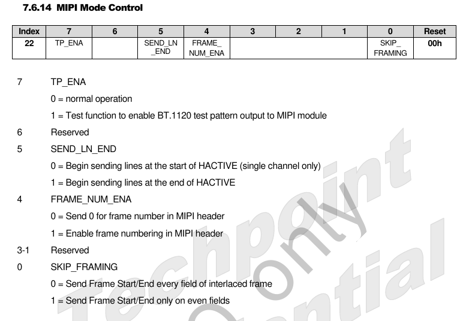
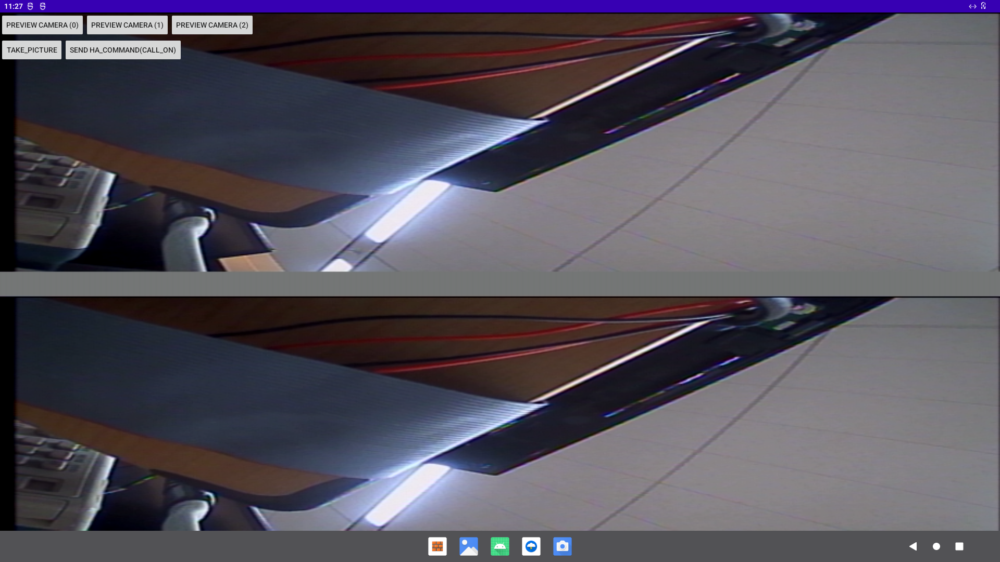

# CAM DE-INTERLACED

> Camera 의 de-interlaced 기능 개발 md. 

-----
/**
  * ROCKCHIP Camera 
  * PC : 192.168.27.12
  * PATH : /home/lchy0113/ssd/Rockchip/ROCKCHIP_ANDROID12 
  * comment : 
  *            ROCKCHIP Camera de-interlace기능 개발은 feature/csi branch로 개발 진행 중.
  *            stc 사 로부터 전달받은 patch가 kernel에 적용되어 있음. 코드 본 기능 검증은 되지 않음. 
  */
  
// repo branch
```bash
lchy0113@AOA:~/ssd/Rockchip/ROCKCHIP_ANDROID12$ repo branch 
*  feature/csi                         | in:
                                             device/COMPANY/nova/common
                                             hardware/rockchip/camera
                                             kernel-4.19
   feature/rk3568_edp-p01              | in:
                                             device/COMPANY/test/common
                                             kernel-4.19
                                             u-boot
                                             rkbin
   feature/rk3568_rgb-p02              | in kernel-4.19, u-boot, rkbin
   feature/rk3568_rgb_p02              | in device/COMPANY/nova/rk3568
   master                              | in:
                                             device/COMPANY/nova/common
                                             device/COMPANY/nova/rk3568
                                             device/COMPANY/test/common
                                             device/COMPANY/test/rk3568_rgbp01
                                             device/COMPANY/test/rk3568_rgbp02
                                             external/camera_engine_rkaiq
                                             hardware/rockchip/audio
                                             hardware/rockchip/camera
                                             kernel-4.19
                                             u-boot
                                             vendor/COMPANY/packages/Wall
                                             vendor/COMPANY/packages/WallTest
                                             vendor/rockchip/common
                                             rkbin
   private/develop                     | in:
                                             device/COMPANY/nova/rk3568
                                             external/camera_engine_rkaiq
                                             hardware/rockchip/audio
                                             hardware/rockchip/camera
                                             kernel-4.19
                                             u-boot
                                             vendor/rockchip/common
                                             rkbin
   private/develop_ak7755              | in:
                                             hardware/rockchip/audio
                                             kernel-4.19
   private/develop_camera_differential | in kernel-4.19
   rk35/mid/12.0/develop               | in vendor/rockchip/common
```bash

----
## condition
 - platform : rk3568 / android12 / kernel 4.19
 - hw interface : csi2_dphy / ntsc
 - sensor : tp2860 

----
## study

 - ricif
	rkcif 드라이버는 v4l2/media framework를 기반으로 구성된 하드웨어 장치 subdevices의(mipi dphy, sensor)  인터럽트 처리, 버퍼 관리, power 제어 등을 담당.

	* camera HAL 버전

	 v2.1.0 

 - rkisp
	rkisp 드라이버는 주로 v4l2/media framework를 기반으로 hardware 구성, 인터럽트 처리, buffer rotation, sub device(예, mipi dphy, 센서) 의 전원 enable/disable을 제어.

	* rkisp1 드라이버의 topology


 
| **name**            	| **type**           	|
|---------------------	|--------------------	|
| rkisp1_mainpath     	| v4l2_vdev, capture 	|
| rkisp1_selfpath     	| v4l2_vdev, capure  	|
| rkisp1-isp-subdev   	| v4l2_subdev        	|
| rockchip-sy-mipi    	| v4l2_subdev        	|
| rkisp1-statistics   	| v4l2_vdev, capture 	|
| rkisp1-input-params 	| v4l2_vdev, output  	|


 * RKISP 드라이버는 odd and even field 합성 기능을 지원한다.
	1. MIPI 인터페이스: frame count number 를 통해 지원하며, RKISP 드라이버는 이를 사용하여 현재 필드의 parity를 판단한다.
	2. BT656 인터페이스: 표준 SAV/EAV 데이터를 사용하여 지원한다. 즉, bit6은 홀수 및 짝수 필드 플래그 정보이며 RKISP 드라이버는 이를 사용하여 현재 필드의 패리티를 결정한다.
	3. RKISP드라이버의 RKISP1_selfpath video device node는 odd and even field synthesis기능을 가지고 있다. (다른 video device node는 기능이 없다.)

```bash
"Only selfpath support interlaced"
```


 * isp 드라이버 버전
  rkisp rkisp-vir0: rkisp driver version: v01.08.00


----
## legacy (1080p, 720p) 

 - 기존 data path : sensor module -> mipi_dphy -> isp -> MP(Main Path) -> Memory  

 - 개발 data path : sensor module -> mipi_dphy -> isp -> SP(Self Path) -> Memory


----
## develop

 - develop project
```
$ repo status
project hardware/rockchip/camera/			branch feature/csi
project kernel-4.19/						branch feature/csi
```
   
 - [x] *sensor device driver의 foramt 을 field interlaced으로 세팅*

  device driver 의 *format.field* 를 *V4L2_FIELD_INTERLACED* 으로 세팅해야한다.   
 현재 device의 output format을 의미 하며, 이 foramt은 *xxxx_get_fmt*에 의해 반환 된다. 

 - [x] *mipi Interface : tp2860 side mipi packet 전송 시, field의 frame count number를 포함한다.*

 

```bash
reg:0x22 val:0x91
/**
  * bit[7]: test pattern 활성화
  * bit[0]: even field에만 start/end frame 을 전송.   // every field로 세팅 시, rk3568 side에서 detect 되지 않음.
  */
```

 - [x] *isp interrupt status 확인*

```bash
# v4l2-ctl --verbose -d /dev/video6 --set-fmt-video=width=720,height=240,pixelformat=NV12 --stream-mmap=3 --stream-to=/data/local/tmp/out.yuv --stream-skip=9 --stream-count=1
VIDIOC_QUERYCAP: ok
VIDIOC_G_FMT: ok
VIDIOC_S_FMT: ok
Format Video Capture Multiplanar:
		Width/Height      : 720/480
		Pixel Format      : 'NV12'
		Field             : None
		Number of planes  : 1
		Flags             :
		Colorspace        : Default
		Transfer Function : Default
		YCbCr Encoding    : Default
		Quantization      : Full Range
		Plane 0           :
		   Bytes per Line : 720
		   Size Image     : 259200
VIDIOC_REQBUFS: ok
VIDIOC_QUERYBUF: ok
VIDIOC_QUERYBUF: ok
VIDIOC_QBUF: ok
VIDIOC_QUERYBUF: ok
VIDIOC_QBUF: ok
VIDIOC_QUERYBUF: ok
VIDIOC_QBUF: ok
VIDIOC_STREAMON: ok

# cat /proc/interrupts | grep isp
32:          1          0          0          0     GICv3  89 Level     rkisp_hw
33:       2192          0          0          0     GICv3  90 Level     rkisp_hw
34:       4387          0          0          0     GICv3  92 Level     rkisp_hw
```

 - [x] *isp의 selfpath 로 data path 세팅(i.g sensor driver의 interlaced정보를 get하는 과정)*

 * camera hal side
```c
// v4l2dev/v4l2subdevice.cpp
status_t V4L2Subdevice::queryDvTimings(struct v4l2_dv_timings &timings)
{
	LOGI("@%s device = %s", __FUNCTION__, mName.c_str());
	int ret = 0;

	if (mState == DEVICE_CLOSED) {
		LOGE("%s invalid device state %d",__FUNCTION__, mState);
		return INVALID_OPERATION;
	}

	ret = pbxioctl(VIDIOC_SUBDEV_QUERY_DV_TIMINGS, &timings);
	LOGE("%s, ret:%d, I:%d, wxh:%dx%d", __func__, ret,
			timings.bt.interlaced, timings.bt.width, timings.bt.height);
	if (ret < 0) {
		LOGE("VIDIOC_SUBDEV_QUERY_DV_TIMINGS failed: %s", strerror(errno));
		return UNKNOWN_ERROR;
	}

	return NO_ERROR;
}
```

 * v4l2 side
	
```c
// drivers/media/v4l2-core/v4l2-subdev.c

	case VIDIOC_SUBDEV_QUERY_DV_TIMINGS:
		return v4l2_subdev_call(sd, video, query_dv_timings, arg);

	case VIDIOC_SUBDEV_G_DV_TIMINGS:
		return v4l2_subdev_call(sd, video, g_dv_timings, arg);
		
	case VIDIOC_SUBDEV_S_DV_TIMINGS:
		return v4l2_subdev_call(sd, video, s_dv_timings, arg);
```

 * sensor driver(tp2860) side

```c
static const struct v4l2_subdev_video_ops tp2860_video_ops = {
	.s_dv_timings = tp2860_s_dv_timings,
	.g_dv_timings = tp2860_g_dv_timings,
	.query_dv_timings = tp2860_query_dv_timings,
```


----
## issue

 1. de-interlace data path로 config시, selfpath module에서 memory로 데이터가 출력되지 않음.
	```logcat
	07-14 11:39:53.077     0     0 D rkisp-vir0: update_mi stream:1 Y:0xffd00000 CB:0xffd00000 CR:0xffd00000 | Y_SHD:0xffd00000
	07-14 11:39:53.077     0     0 D rkisp-vir0: rkisp_check_idle irq:0x10 ends:0x13 mask:0x13
	07-14 11:39:53.077     0     0 D rkisp-vir0: isp isr:0x22, 0x0
	07-14 11:39:53.078     0     0 D rkisp-vir0: rkisp_check_idle irq:0x2 ends:0x13 mask:0x13
	07-14 11:39:53.078     0     0 D rkisp-vir0: rkisp_check_idle irq:0x1 ends:0x13 mask:0x13
	07-14 11:39:53.079     0     0 D rkisp-vir0: isp isr:0x40, 0x0
	07-14 11:39:53.094     0     0 D rkisp-vir0: isp isr:0x22, 0x0
	07-14 11:39:53.094     0     0 D rkisp-vir0: rkisp_check_idle irq:0x2 ends:0x13 mask:0x13
	07-14 11:39:53.094     0     0 D rkisp-vir0: rkisp_check_idle irq:0x1 ends:0x13 mask:0x13
	07-14 11:39:53.094     0     0 D rkisp-vir0: mi isr:0x2
	07-14 11:39:53.094     0     0 D rkisp-vir0: update_mi stream:1 Y:0xffd00000 CB:0xffd00000 CR:0xffd00000 | Y_SHD:0xffd00000
	07-14 11:39:53.094     0     0 D rkisp-vir0: rkisp_check_idle irq:0x10 ends:0x13 mask:0x13
	07-14 11:39:53.096     0     0 D rkisp-vir0: isp isr:0x40, 0x0
	07-14 11:39:53.111     0     0 D rkisp-vir0: isp isr:0x22, 0x0
	07-14 11:39:53.111     0     0 D rkisp-vir0: rkisp_check_idle irq:0x2 ends:0x13 mask:0x13
	07-14 11:39:53.111     0     0 D rkisp-vir0: rkisp_check_idle irq:0x1 ends:0x13 mask:0x13
	07-14 11:39:53.111     0     0 D rkisp-vir0: mi isr:0x2
	07-14 11:39:53.111     0     0 D rkisp-vir0: update_mi stream:1 Y:0xffd00000 CB:0xffd00000 CR:0xffd00000 | Y_SHD:0xffd00000
	07-14 11:39:53.111     0     0 D rkisp-vir0: rkisp_check_idle irq:0x10 ends:0x13 mask:0x13
	07-14 11:39:53.112     0     0 D rkisp-vir0: isp isr:0x40, 0x0
	07-14 11:39:53.127     0     0 D rkisp-vir0: mi isr:0x2
	07-14 11:39:53.128     0     0 D rkisp-vir0: update_mi stream:1 Y:0xffd00000 CB:0xffd00000 CR:0xffd00000 | Y_SHD:0xffd00000
	07-14 11:39:53.128     0     0 D rkisp-vir0: rkisp_check_idle irq:0x10 ends:0x13 mask:0x13
	07-14 11:39:53.128     0     0 D rkisp-vir0: isp isr:0x22, 0x0
	07-14 11:39:53.128     0     0 D rkisp-vir0: rkisp_check_idle irq:0x2 ends:0x13 mask:0x13
	07-14 11:39:53.128     0     0 D rkisp-vir0: rkisp_check_idle irq:0x1 ends:0x13 mask:0x13
	07-14 11:39:53.129     0     0 D rkisp-vir0: isp isr:0x40, 0x0
	07-14 11:39:53.144     0     0 D rkisp-vir0: isp isr:0x22, 0x0
	07-14 11:39:53.144     0     0 D rkisp-vir0: rkisp_check_idle irq:0x2 ends:0x13 mask:0x13
	07-14 11:39:53.144     0     0 D rkisp-vir0: rkisp_check_idle irq:0x1 ends:0x13 mask:0x13
	07-14 11:39:53.144     0     0 D rkisp-vir0: mi isr:0x2
	```

 2. main path로 config시, mainpath node(/dev/video0) -> mem  으로 부터 부터 데이터 출력을 확인되지만, 캡쳐 이미지와 같이 interlaced-before 데이터로 확인됨.

  	

----
## note

 - logcat filter
```
 tp2860|camera|cam|isp|RkCamera|CamPrvdr@2.4|interlace|tp2860_get_fmt
```

 - v4l command for test

```bash
 v4l2-ctl --verbose -d /dev/video1 --set-fmt-video=width=720,height=480,pixelformat=NV12 --stream-mmap=3 --stream-to=/data/local/tmp/out_video1.yuv --stream-skip=1 --stream-count=1
  v4l2-ctl --verbose -d /dev/video1 --set-fmt-video=width=720,height=480,pixelformat=NV12,field=interlaced --stream-mmap=3 --stream-to=/data/local/tmp/out_video1.yuv --stream-skip=4 --stream-count=1
 v4l2-ctl --verbose -d /dev/video0 --set-fmt-video=width=720,height=480,pixelformat=NV12 --stream-mmap=3 --stream-to=/data/local/tmp/out_video0.yuv --stream-skip=1 --stream-count=1
  v4l2-ctl --verbose -d /dev/video0 --set-fmt-video=width=720,height=480,pixelformat=NV12,field=interlaced --stream-mmap=3 --stream-to=/data/local/tmp/out_video0.yuv --stream-skip=4 --stream-count=1
 ffplay tmp/out_video1.yuv -f rawvideo -pixel_format nv12 -video_size 720x480
 ffplay tmp/out_video0.yuv -f rawvideo -pixel_format nv12 -video_size 720x480
 
 
 v4l2-ctl --verbose -d /dev/video5 --set-fmt-video=width=1920,height=1090,pixelformat=NV12 --stream-mmap=3 --stream-to=/data/local/tmp/out_video5.yuv --stream-skip=9 --stream-count=1
 v4l2-ctl --verbose -d /dev/video6 --set-fmt-video=width=1920,height=1080,pixelformat=NV12 --stream-mmap=3 --stream-to=/data/local/tmp/out_video6.yuv --stream-skip=9 --stream-count=1
```


 - debug

  check the register information... 
```bash  
  # io -4 -r -l 0x4 0xfdff0000
```
  
```bash
// cif driver
echo 1 > /sys/module/video_rkcif/parameters/debug_csi2 
echo 3 > /sys/module/video_rkcif/parameters/debug
// vb2 (such as VPU/ISP,etc)
echo 7 >  /sys/module/videobuf2_common/parameters/debug
// v4l2 related log
echo 0x1f > /sys/class/video4linux/video1/dev_debug
```

 - code
 
```bash
$ tree drivers/media/platform/rockchip/isp1/
drivers/media/platform/rockchip/isp1/
├── capture.c // Include mp/sp configuration and vb2, frame interrupt processing
├── dev.c // Contains probe, asynchronous registration, clock, pipeline, iommu and media/v4l2 framework
├── isp_params.c // 3A Related parameters setting
├── isp_stats.c // 3A Related statistics
├── regs.c // Registers related read and write operations
├── rkisp1.c // Corresponding to isp_sd entity node, including receiving data from mipi, crop function
$ ls drivers/phy/rockchip/phy-rockchip-mipi-rx.c
drivers/phy/rockchip/phy-rockchip-mipi-rx.c # mipi dphy driver
```

 - To do

 rkisp 의 isr에서 mipi_dphy 데이터 확인.
drivers/media/platform/rockchip/isp/rkisp.c
```bash
07-13 14:39:10.046     0     0 D rkisp-vir0: rkisp_check_idle irq:0x10 ends:0x13 mask:0x13
07-13 14:39:10.047     0     0 D rkisp-vir0: isp isr:0x40, 0x0
07-13 14:39:10.062     0     0 D rkisp-vir0: isp isr:0x22, 0x0
07-13 14:39:10.062     0     0 D rkisp-vir0: rkisp_check_idle irq:0x2 ends:0x13 mask:0x13
07-13 14:39:10.062     0     0 D rkisp-vir0: rkisp_check_idle irq:0x1 ends:0x13 mask:0x13
```

 - fhd 
   * isp isr: 0x40 

 - ntsc
   * isp isr: 0x40 : CIF_SIP_V_START 
   * isp isr: 0x22 : CIF_ISP_FRAME_IN | CIF_ISP_FRAME


 - Debug

```log
/******
 * rkisp stream start 확인. 
 */
07-14 15:32:31.039     0     0 D rkisp-vir0: rkisp_start_streaming 1
07-14 15:32:31.039     0     0 W [tp2860]	tp2860_g_mbus_config(1635):  
07-14 15:32:31.039     0     0 W [tp2860]	tp2860_get_fmt(1242): width(720), height(480), code(0x2006), field(4, V4L2_FIELD_INTERLACED)
07-14 15:32:31.039     0     0 D rkisp-vir0: CSI ch0 vc:0 dt:0x1e 720x480
07-14 15:32:31.039     0     0 W [tp2860]	tp2860_get_fmt(1242): width(720), height(480), code(0x2006), field(4, V4L2_FIELD_INTERLACED)
07-14 15:32:31.039     0     0 D rkisp-vir0: CSI ch1 vc:0 dt:0x1e 720x480
07-14 15:32:31.039     0     0 W [tp2860]	tp2860_get_fmt(1242): width(720), height(480), code(0x2006), field(4, V4L2_FIELD_INTERLACED)
07-14 15:32:31.040     0     0 D rkisp-vir0: CSI ch2 vc:0 dt:0x1e 720x480
07-14 15:32:31.040     0     0 W [tp2860]	tp2860_get_fmt(1242): width(720), height(480), code(0x2006), field(4, V4L2_FIELD_INTERLACED)
07-14 15:32:31.040     0     0 D rkisp-vir0: CSI ch3 vc:0 dt:0x1e 720x480
07-14 15:32:31.040     0     0 W [tp2860]	tp2860_get_fmt(1242): width(720), height(480), code(0x2006), field(4, V4L2_FIELD_INTERLACED)
07-14 15:32:31.040     0     0 D rkisp-vir0: CSI ch4 vc:0 dt:0x1e 720x480
07-14 15:32:31.040     0     0 W [tp2860]	tp2860_g_frame_interval(1615):  
07-14 15:32:31.040     0     0 D rkisp-vir0: rkisp_alloc_page_dummy_buf buf:0xffd00000 map cnt:1 size:491520
07-14 15:32:31.040     0     0 W [tp2860]	tp2860_ioctl(1742):  
07-14 15:32:31.040     0     0 D rkisp-vir0: CSI2RX_IDS 0x1e1e1e1e 0x0000001e
07-14 15:32:31.040     0     0 D rkisp-vir0: stream 1 rsz/scale: 720x480 -> 720x480
07-14 15:32:31.040     0     0 D rkisp-vir0: chroma scaling 360x480 -> 360x240
07-14 15:32:31.040     0     0 W         : richgold rkisp_stream_config_rsz(287)
07-14 15:32:31.040     0     0 D rkisp-vir0: stream 1 crop disabled
07-14 15:32:31.040     0     0 W rkisp-vir0: interlaced: width should be 64 aligned
07-14 15:32:31.040     0     0 D rkisp-vir0: update_mi stream:1 Y:0xffd00000 CB:0xffd00000 CR:0xffd00000 | Y_SHD:0x0
07-14 15:32:31.040     0     0 D rkisp-vir0: hdr:0 buf index dma0:0 dma1:0 dma2:0
07-14 15:32:31.040     0     0 D rkisp-vir0: update_dmatx_v2 stream:2 Y:0xffd00000 SHD:0xffd00000
07-14 15:32:31.040     0     0 D rkisp-vir0: update_dmatx_v2 stream:4 Y:0xffd00000 SHD:0xffd00000
07-14 15:32:31.040     0     0 D rkisp-vir0: CSI2RX CTRL0:0x20820000 CTRL1:0x1
07-14 15:32:31.040     0     0 D rkisp-vir0: update_mi stream:1 Y:0xffd00000 CB:0xffd00000 CR:0xffd00000 | Y_SHD:0xffd00000
07-14 15:32:31.040     0     0 D rkisp-vir0: rkisp_config_cif CIF_ID:0x2012007 SP:1, MP:0

```


```bash
// cam pwr-on command
# adb wait-for-device ; adb root ; adb remount ;adb wait-for-device ; adb shell "io -4 -w 0xfdc20014 0x00300000"; adb shell  "io -4 -w 0xfdd6000c 0x00200020"; adb shell "io -4 -w 0xfdd60004 0x00200020" ;   adb shell ;
```
