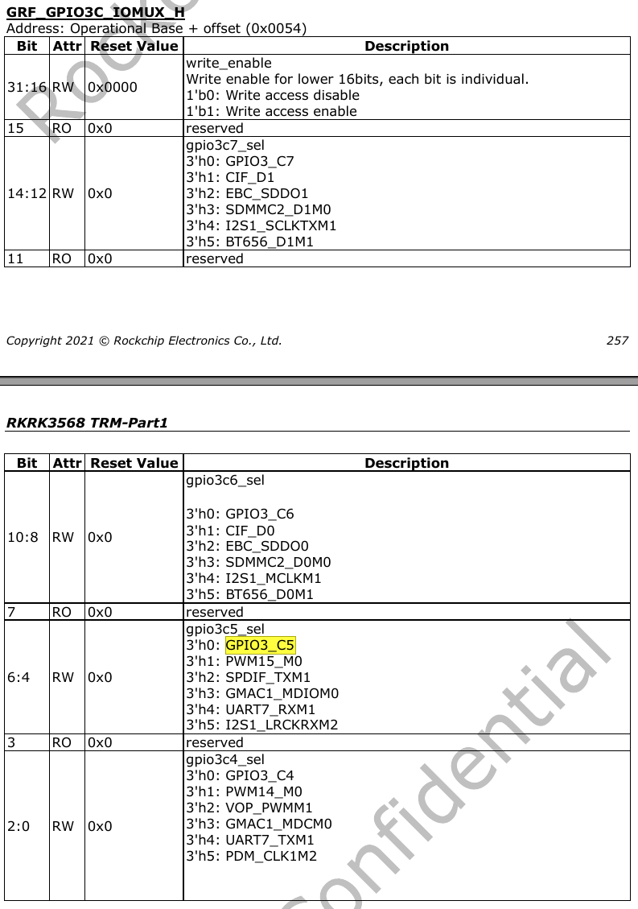
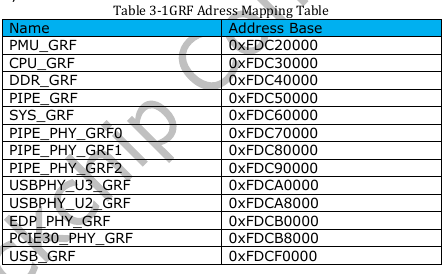

# DEBUG
> Debugging method에 대해 정리합니다.

## io instruction

```bash

rk3568_evb:/ # io
Raw memory i/o utility - $Revision: 1.5 $

io -v -1|2|4 -r|w [-l <len>] [-f <file>] <addr> [<value>]

    -v         Verbose, asks for confirmation
    -1|2|4     Sets memory access size in bytes (default byte)
    -l <len>   Length in bytes of area to access (defaults to
               one access, or whole file length)
    -r|w       Read from or Write to memory (default read)
    -f <file>  File to write on memory read, or
               to read on memory write
    <addr>     The memory address to access
    <val>      The value to write (implies -w)

Examples:
    io 0x1000                  Reads one byte from 0x1000
    io 0x1000 0x12             Writes 0x12 to location 0x1000
    io -2 -l 8 0x1000          Reads 8 words from 0x1000
    io -r -f dmp -l 100 200    Reads 100 bytes from addr 200 to file
    io -w -f img 0x10000       Writes the whole of file to memory

Note access size (-1|2|4) does not apply to file based accesses.

1|rk3568_evb:/ #

```

### 사용 방법

```bash
$ io -4 -r 0x1000				// read the value of 4-bit register starting from 0x1000
$ io -4 -w 0x1000				// write the value of the 4-bit register from 0x1000
```

### 사용 예제
 -  View the multiplexing of GPIO3_C5 pins  
 -  From the datasheet of the master control, the base address of the register corresponding to GPIO3 is: 0xFDC60000 (SYS_GRF) 
 -  The offset of GRF_GPIO3C_IOMUX_H found from the datasheet of the master control is: 0x0054 
 -  The address of the iomux register of GPIO3_C5 is: base address (Operational Base) + offset (offset)=0xFDC60000 + 0x0054=0xFDC60054  
 -  Use the following command to check the multiplexing of GPIO3_C5:  



```bash

rk3568_poc:/ # io -4 -r -l 0x4 0xfdc60054
fdc60054:  00000001
```


```bash
rk3568_poc:/ # io -4 -r -l 100 0xfe040000
fe040000:  0000c000 40158023 00000000 00000000
fe040010:  00000ac0 00000000 00000000 00000000
fe040020:  00000000 e0000010 00010010 00000000
fe040030:  10000000 10000000 00000000 00000000
fe040040:  68600000 10000030 00000000 00000000
fe040050:  00000000 00000000 00000000 00000000
fe040060:  00000002
rk3568_poc:/ #

```

 -  find [7:6] from the datasheet:
```bash
gpio1b3_sel
GPIO1B[3] iomux select
2'b00: gpio
2'b01: i2c4sensor_sda
2'b10: reserved
2'b11: reserved
```

Therefore, it can be determined that the GPIO is multiplexed as i2c4sensor_sda.

 -  If you want to reuse as GPIO, you can use the following command setting
```bash
# io -4 -w 0xff320014 0x0000812a
```


### GRF Address Mapping Table


---


## error

```bash
rk3368H_64:/ # io -4 -r 0xFF770028                                                                                                      
open /dev/mem: No such file or directory
1|rk3368H_64:/ #
```
커널에서 아래 옵션을 활성화 해야 합니다.

```
CONFIG_DEVMEM=y
CONFIG_DEVKMEM=y
```

---
