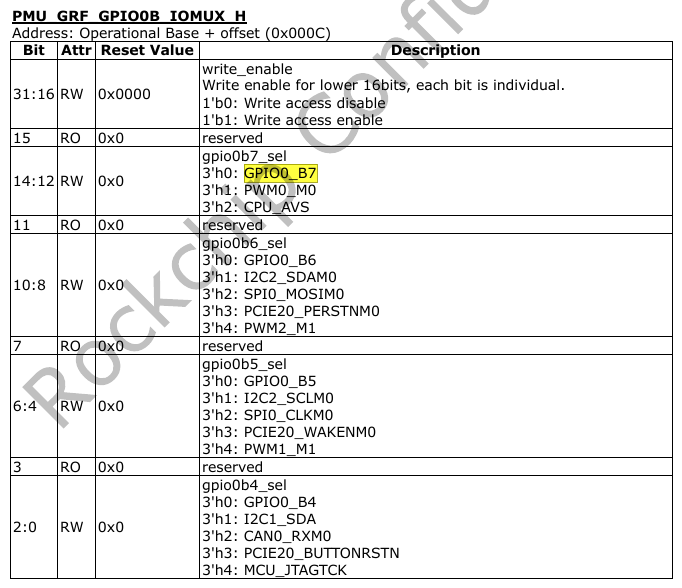
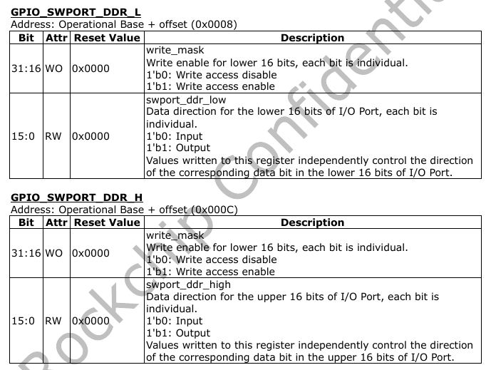
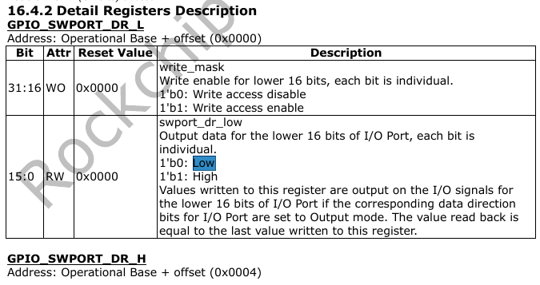
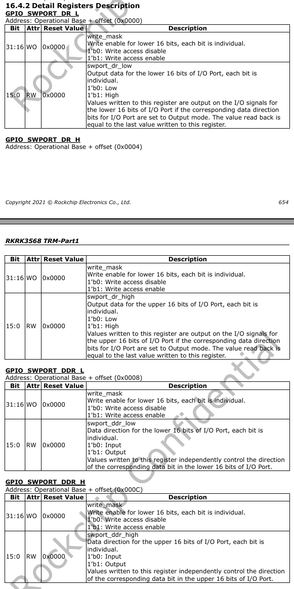

# DEBUG
> Debugging method에 대해 정리합니다.

## io instruction

```bash

rk3568_evb:/ # io
Raw memory i/o utility - $Revision: 1.5 $

io -v -1|2|4 -r|w [-l <len>] [-f <file>] <addr> [<value>]

    -v         Verbose, asks for confirmation
    -1|2|4     Sets memory access size in bytes (default byte)
    -l <len>   Length in bytes of area to access (defaults to
               one access, or whole file length)
    -r|w       Read from or Write to memory (default read)
    -f <file>  File to write on memory read, or
               to read on memory write
    <addr>     The memory address to access
    <val>      The value to write (implies -w)

Examples:
    io 0x1000                  Reads one byte from 0x1000
    io 0x1000 0x12             Writes 0x12 to location 0x1000
    io -2 -l 8 0x1000          Reads 8 words from 0x1000
    io -r -f dmp -l 100 200    Reads 100 bytes from addr 200 to file
    io -w -f img 0x10000       Writes the whole of file to memory

Note access size (-1|2|4) does not apply to file based accesses.

1|rk3568_evb:/ #

```

### 사용 방법

```bash
$ io -4 -r 0x1000				// read the value of 4-bit register starting from 0x1000
$ io -4 -w 0x1000				// write the value of the 4-bit register from 0x1000
```
## gpio iomux 

### 사용 예제(GPIO3_C5)
 -  View the multiplexing of GPIO3_C5 pins  
 -  From the datasheet of the master control, the base address of the register corresponding to GPIO3 is: 0xFDC60000 (SYS_GRF) 
 -  The offset of GRF_GPIO3C_IOMUX_H found from the datasheet of the master control is: 0x0054 
 -  The address of the iomux register of GPIO3_C5 is: base address (Operational Base) + offset (offset)=0xFDC60000 + 0x0054=0xFDC60054  
 -  Use the following command to check the multiplexing of GPIO3_C5:  


```bash

rk3568_poc:/ # io -4 -r -l 0x4 0xfdc60054
fdc60054:  00000001
```


 -  find [6:4] from the datasheet:
```bash
gpio3c5_sel
3'h0: GPIO3_C5
3'h1: PWM15_M0
3'h2: SPDIF_TXM1
3'h3: GMAC1_MDIOM0
3'h4: UART7_RXM1
3'h5: I2S1_LRCKRXM2
```

Therefore, it can be determined that the GPIO is multiplexed as 3'h0: GPIO3_C5.

 - The offset of GPIO_SWPORT_DDR_L(Data direction register) found from the datasheet of the master control is : 0x0008
 - The address of the GPIO3 register of GPIO3_C5 is : base address (Operation base) + offset(offset) = 0xfe760000 + 0x000c = 0xfe76000c

```bash
// set directiron to out
rk3568_edp:/ # io -4 -w 0xfe76000c 0x00202060 

// set value to high
rk3568_edp:/ # io -4 -w 0xfe760004 0x00202060 

// set value to low
rk3568_edp:/ # io -4 -w 0xfe760004 0x00200040 
```


### 사용 예제(GPIO0_B7)
 - View the multiplexing of GPIO0_B7 pins  
 - The offset of GRF_GPIO0B_IOMUX_H found from the datasheet of the master control is: 0x000C
 - The address of the iomux register of GPIO0_B7 is : base address (Operation base) + offset(offset) = 0xFDC60000 + 0x000C = 0xFDC6000C  
	 > pin multiplxing 설정




```bash

// change to gpio0_b7 
rk3568_poc:/ # io -4 -w 0xfdc6000c 0xf0000111

```

 - The offset of GPIO_SWPORT_DDR_L(Data direction register) found from the datasheet of the master control is : 0x0008
 - The address of the GPIO0 register of GPIO0_B7 is : base address (Operation base) + offset(offset) = 0xFDD60000 +  0x0008
	 > in/out 설정



```bash
// change to output for gpio0_b7
rk3568_poc:/sys/class/gpio/gpio15 # io -4 -w 0xfdd60008 0x800080A4
rk3568_poc:/sys/class/gpio/gpio15 # cat direction
out
```

 - The offset of GPIO_SWPORT_DR_L(Low/High Output data) foud from the datasheet of the master control is : 0x0000 
 - The address of the GPIO0 register of GPIO0_B7 is : base address (Operation base) + offset(offset) = 0xFDD60000 +  0x0000



```bash
rk3568_poc:/sys/class/gpio/gpio15 # io -4 -w 0xfdd60000 0x80008000
1|rk3568_poc:/sys/class/gpio/gpio15 # cat value
1
rk3568_poc:/sys/class/gpio/gpio15 #

```

gpio4_c7, gpio4_d1 체크  

```bash
// iomux 
1|rk3568_poc:/ # io -4 -r -l 0x8 0xfdc60074
fdc60074:  00001000 00000001
// set hdmitx_scl, hdmitx_hda
```


### GRF Address Mapping Table


## gpio control
> Rockchip_RK3568_TRM_Part1_V1.1-20210301.pdf 652 page
- gpio pin의 data와 direction control은 GPIO_SWPORT_DR_L/GPIO_SWPORT_DR_H 레지스터에 의해 제어됩니다.
- gpio pin의 direction control 은 GPIO_SWPORT_DDR_L/GPIO_SWPORT_DDR_H 레지스터에 의해 제어 됩니다.

* 레지스터 설명

| **GPIOs** 	| **Register** 	| **address** 	|
|-----------	|--------------	|-------------	|
| GPIO0     	| PD_PMU       	| 0xFDD60000  	|
| GPIO1     	| PD_BUS       	| 0xFE740000  	|
| GPIO2     	| PD_BUS       	| 0xFE750000  	|
| GPIO3     	| PD_BUS       	| 0xFE760000  	|
| GPIO4     	| PD_BUS       	| 0xFE770000  	|


ex)
GPIO4_D2 (gpio number;154)(gpio4_26)



```bash
# gpio4 bank read value, direction
rk3568_poc:/ # io -4 -r -l 0x10 0xfe770000
fe770000:  00000000 00000400 00000000 00000400
rk3568_poc:/ #


# set out direction to gpio4_26 
rk3568_poc:/ # io -4 -w 0xfe77000c 0x04000400 

# set high value to gpio4_26
rk3568_poc:/ # io -4 -w 0xfe770004 0x04000400 

# set high value to gpio0_a6
rk3568_poc:/ # io -4 -w 0xfdd60000 0x40C040

# set low value to gpio0_a6
rk3568_poc:/ # io -4 -w 0xfdd60000 0x40C000

# set strength value to gpio0_a6 (level 5)
rk3568_poc:/ # io -4 -r -l 0x4 0xfdc6007c
fdc6007c:  00000000
rk3568_poc:/ # io -4 -w 0xfdc6007c 0x3f003f

```

---

## u-boot (dm tree)
> 기능: 모든 device driver 간의 binding 및 probe status를 체크.

```bash
// example
[2023-05-30 15:10:38] => dm tree
[2023-05-30 15:10:39]  Addr        Class      Probed    Driver                   Name
[2023-05-30 15:10:39] -------------------------------------------------------------------------
[2023-05-30 15:10:39]  7bd45db0    root       [ + ]   root_driver                root_driver **
[2023-05-30 15:10:39]  7bd45ec0    rsa_mod_ex [   ]   mod_exp_sw                 |-- mod_exp_sw **
[2023-05-30 15:10:39]  7bd45fb0    ramdisk    [   ]   ramdisk-ro                 |-- ramdisk-ro **
[2023-05-30 15:10:39]  7bd460c0    blk        [   ]   ramdisk_blk                |   `-- ramdisk-ro.blk **
[2023-05-30 15:10:39]  7bd46240    firmware   [   ]   psci                       |-- psci *
[2023-05-30 15:10:39]  7bd46330    sysreset   [   ]   psci-sysreset              |   `-- psci-sysreset **
[2023-05-30 15:10:39]  7bd46420    clk        [   ]   fixed_rate_clock           |-- external-gmac0-clock *
[2023-05-30 15:10:39]  7bd464f0    clk        [   ]   fixed_rate_clock           |-- external-gmac1-clock *
[2023-05-30 15:10:39]  7bd46600    nop        [   ]   dwc3-generic-wrapper       |-- usbdrd *
[2023-05-30 15:10:39]  7bd46740    usb        [   ]   dwc3-generic-host          |   `-- dwc3@fcc00000 *
[2023-05-30 15:10:39]  7bd46810    nop        [   ]   dwc3-generic-wrapper       |-- usbhost **
[2023-05-30 15:10:39]  7bd468f0    usb        [   ]   dwc3-generic-host          |   `-- dwc3@fd000000 **
[2023-05-30 15:10:39]  7bd46a00    syscon     [ + ]   rk3568_syscon              |-- syscon@fdc20000 *
[2023-05-30 15:10:39]  7bd46ab0    syscon     [ + ]   rk3568_syscon              |-- syscon@fdc60000 *
[2023-05-30 15:10:39]  7bd46b60    syscon     [   ]   syscon                     |-- syscon@fdca0000 *
[2023-05-30 15:10:39]  7bd46c10    clk        [ + ]   rockchip_rk3568_pmucru     |-- clock-controller@fdd00000 *
[2023-05-30 15:10:39]  7bd46d00    reset      [   ]   rockchip_reset             |   `-- reset *
[2023-05-30 15:10:39]  7bd46dd0    clk        [ + ]   rockchip_rk3568_cru        |-- clock-controller@fdd20000 *
[2023-05-30 15:10:39]  7bd46e80    sysreset   [   ]   rockchip_sysreset          |   |-- sysreset **
[2023-05-30 15:10:39]  7bd46f50    reset      [   ]   rockchip_reset             |   `-- reset *
[2023-05-30 15:10:39]  7bd47060    mmc        [ + ]   rockchip_rk3288_dw_mshc    |-- dwmmc@fe2b0000 **
[2023-05-30 15:10:39]  7bd47250    blk        [   ]   mmc_blk                    |   `-- dwmmc@fe2b0000.blk **
[2023-05-30 15:10:39]  7bd47390    mmc        [ + ]   rockchip_rk3288_dw_mshc    |-- dwmmc@fe2c0000 **
[2023-05-30 15:10:39]  7bd47580    blk        [   ]   mmc_blk                    |   `-- dwmmc@fe2c0000.blk **
[2023-05-30 15:10:39]  7bd47700    spi        [   ]   rockchip_sfc               |-- sfc@fe300000 **
[2023-05-30 15:10:39]  7bd47850    mtd        [   ]   spi_nand                   |   |-- flash@0 **
[2023-05-30 15:10:39]  7bd47940    blk        [   ]   mtd_blk                    |   |   `-- flash@0.blk **
[2023-05-30 15:10:39]  7bd47ac0    spi_flash  [   ]   spi_flash_std              |   `-- flash@1 **
[2023-05-30 15:10:39]  7bd47bb0    blk        [   ]   mtd_blk                    |       `-- flash@1.blk **
[2023-05-30 15:10:39]  7bd47cf0    mmc        [ + ]   rockchip_sdhci_5_1         |-- sdhci@fe310000 **
[2023-05-30 15:10:39]  7bd47ee0    blk        [ + ]   mmc_blk                    |   `-- sdhci@fe310000.blk **
[2023-05-30 15:10:39]  7bd48020    mtd        [   ]   rk_nandc_v9                |-- nandc@fe330000 **
[2023-05-30 15:10:39]  7bd480f0    blk        [   ]   mtd_blk                    |   `-- nandc@fe330000.blk **
[2023-05-30 15:10:39]  7bd48270    crypto     [ + ]   rockchip_crypto_v2         |-- crypto@fe380000 **
[2023-05-30 15:10:39]  7bd48360    rng        [   ]   rockchip-rng               |-- rng@fe388000 *
[2023-05-30 15:10:39]  7bd48450    serial     [   ]   ns16550_serial             |-- serial@fe660000 *
[2023-05-30 15:10:39]  7bd48520    serial     [   ]   ns16550_serial             |-- serial@fe680000 **
[2023-05-30 15:10:39]  7bd48630    adc        [   ]   rockchip_saradc            |-- saradc@fe720000 *
[2023-05-30 15:10:39]  7bd48760    phy        [   ]   rockchip_usb2phy           |-- usb2-phy@fe8a0000 *
[2023-05-30 15:10:39]  7bd48810    phy        [   ]   rockchip_usb2phy_port      |   |-- host-port *
[2023-05-30 15:10:39]  7bd488c0    phy        [   ]   rockchip_usb2phy_port      |   `-- otg-port *
[2023-05-30 15:10:40]  7bd489b0    pinctrl    [ + ]   rockchip_rk3568_pinctrl    |-- pinctrl *
[2023-05-30 15:10:40]  7bd48aa0    gpio       [   ]   gpio_rockchip              |   |-- gpio@fdd60000 *
[2023-05-30 15:10:40]  7bd48b50    gpio       [   ]   gpio_rockchip              |   |-- gpio@fe740000 *
[2023-05-30 15:10:40]  7bd48c00    gpio       [   ]   gpio_rockchip              |   |-- gpio@fe750000 *
[2023-05-30 15:10:40]  7bd48cf0    pinconfig  [   ]   pinconfig                  |   |-- pcfg-pull-up *
[2023-05-30 15:10:40]  7bd48da0    pinconfig  [   ]   pinconfig                  |   |-- pcfg-pull-none *
[2023-05-30 15:10:40]  7bd48e50    pinconfig  [   ]   pinconfig                  |   |-- pcfg-pull-none-drv-level-1 *
[2023-05-30 15:10:40]  7bd48f00    pinconfig  [   ]   pinconfig                  |   |-- pcfg-pull-none-drv-level-2 *
[2023-05-30 15:10:40]  7bd48fb0    pinconfig  [   ]   pinconfig                  |   |-- pcfg-pull-up-drv-level-1 *
[2023-05-30 15:10:40]  7bd49060    pinconfig  [   ]   pinconfig                  |   |-- pcfg-pull-up-drv-level-2 *
[2023-05-30 15:10:40]  7bd49110    pinconfig  [   ]   pinconfig                  |   |-- eth0 **
```

 - binding된 모든 device driver list.
 - [+] 의미는 현재 driver가 probe 완료 되었음을 나타냄.
 - *  의미는 u-boot dtb 에서 참조된것을 나타냄.(그렇지 않은 경우, kernel dtb 에서 참조됨)


---


## error

```bash
rk3368H_64:/ # io -4 -r 0xFF770028                                                                                                      
open /dev/mem: No such file or directory
1|rk3368H_64:/ #
```
커널에서 아래 옵션을 활성화 해야 합니다.

```
CONFIG_DEVMEM=y
CONFIG_DEVKMEM=y
```

---
