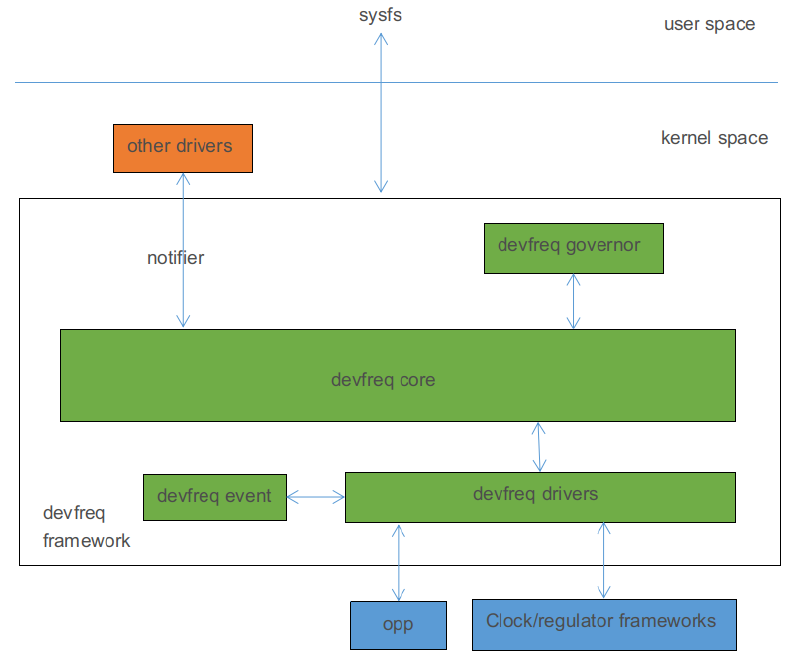

DEVFREQ
=====

정해진 governor에 따라 frequency 와 voltage가 동적으로 제어되도록 커널 developer가 정의한 framework 모델로, 성능과 전력소모를 효과적으로 관리할 수 있다.
devfreq는 cpufreq와 유사하지만, cpufreq는 cpu에만 적용되며 devfreq는 cpu 외에 동적 frequency 제어 및 voltage 제어 이 필요한 모듈을 타겟으로 사용된다.
devfreq 프레임워크는 governer, core, driver, event 로 구성되며 software framework는 아래와 같다.



 - devfreq governor : frequency를 결정하기 위해 사용되며 아래 governor가 포함되어 있다.
   * simple ondemand, userspace, powersave, performance, dmc ondemand.
 - devfreq core : devfreq governor와 devfreq 드라이버를 캡슐화 및 추상화하고, 인터페이스를 정의.
 - devfreq driver : device의 frequency voltage를 초기화하고, 특정 장치의 주파수를 설정한다.
 - devfreq event : device 의 부하 정보를 무니터링 하는데 사용.


-----

# GPU_DVFS

 - OPP Table
 특정frequency를 disable하려면 해당 opp node아래에 "status = disabled"; 를 추가.

```dtb
	gpu: gpu@fde60000 {
		compatible = "arm,mali-bifrost";
		reg = <0x0 0xfde60000 0x0 0x4000>;

		interrupts = <GIC_SPI 39 IRQ_TYPE_LEVEL_HIGH>,
			     <GIC_SPI 41 IRQ_TYPE_LEVEL_HIGH>,
			     <GIC_SPI 40 IRQ_TYPE_LEVEL_HIGH>;
		interrupt-names = "GPU", "MMU", "JOB";

		upthreshold = <40>;
		downdifferential = <10>;

		clocks = <&scmi_clk 1>, <&cru CLK_GPU>;
		clock-names = "clk_mali", "clk_gpu";
		power-domains = <&power RK3568_PD_GPU>;
		#cooling-cells = <2>;
		operating-points-v2 = <&gpu_opp_table>;

		...

	gpu_opp_table: opp-table2 {
		compatible = "operating-points-v2";

		mbist-vmin = <825000 900000 950000>;
		nvmem-cells = <&gpu_leakage>, <&core_pvtm>, <&mbist_vmin>;
		nvmem-cell-names = "leakage", "pvtm", "mbist-vmin";
		rockchip,pvtm-voltage-sel = <
			0        84000   0
			84001    91000   1
			91001    100000  2
		>;
		rockchip,pvtm-ch = <0 5>;

		opp-200000000 {
			opp-hz = /bits/ 64 <200000000>;		/* Hz */
			opp-microvolt = <850000>;			/* uV */
			opp-microvolt-L0 = <850000>;
			opp-microvolt-L1 = <825000>;
			opp-microvolt-L2 = <825000>;
		};

		...
		
		opp-800000000 {
			opp-hz = /bits/ 64 <800000000>;
			opp-microvolt = <1000000>;
			opp-microvolt-L0 = <1000000>;
			opp-microvolt-L1 = <950000>;
			opp-microvolt-L2 = <900000>;
		};
	};


```

# DMC DVFS
 DMC(Dynamic Memory Controller) DVFS, 즉 DDR Frequency 변환.

# BUS DVFS 


-----

# cpu frequeycy 변경

## rk3568 CPU의 max frequency 변경 

 rk3568 cpu의 기본 max frequency는 1992 MHz 이며, 2016 MHz 로 변경하려면 수정이 필요하다.
 
 - [ ] 실제 1992 MHz 동작 확인 필요.

```c
diff --git a/arch/arm64/boot/dts/rockchip/rk3568.dtsi b/arch/arm64/boot/dts/rockchip/rk3568.dtsi
index d8e85d5de8b6..f316fc0080a0 100644
--- a/arch/arm64/boot/dts/rockchip/rk3568.dtsi
+++ b/arch/arm64/boot/dts/rockchip/rk3568.dtsi
@@ -212,8 +212,8 @@
                        clock-latency-ns = <40000>;
                        status = "disabled";
                };
-               opp-1992000000 {
-                       opp-hz = /bits/ 64 <1992000000>;
+               opp-2016000000 {
+                       opp-hz = /bits/ 64 <2016000000>;
                        opp-microvolt = <1150000 1150000 1150000>;
                        opp-microvolt-L0 = <1150000 1150000 1150000>;
                        opp-microvolt-L1 = <1100000 1100000 1150000>;
diff --git a/drivers/clk/clk-scmi.c b/drivers/clk/clk-scmi.c
index 7da2c01c4444..a129cf95e4c1 100644
--- a/drivers/clk/clk-scmi.c
+++ b/drivers/clk/clk-scmi.c
@@ -69,6 +69,9 @@ static int scmi_clk_set_rate(struct clk_hw *hw, unsigned long rate,
 {
        struct scmi_clk *clk = to_scmi_clk(hw);
 
+       if ((clk->id == 0) && (rate == 2016000000))
+               rate = 1992000000;
+
        return clk->handle->clk_ops->rate_set(clk->handle, clk->id, rate);
 }
 
@@ -129,6 +132,8 @@ static int scmi_clk_ops_init(struct device *dev, struct scmi_clk *sclk)
                min_rate = sclk->info->range.min_rate;
                max_rate = sclk->info->range.max_rate;
        }
+       if (sclk->id == 0)
+               max_rate = 2016000000;
 
        clk_hw_set_rate_range(&sclk->hw, min_rate, max_rate);
        return ret;

```
