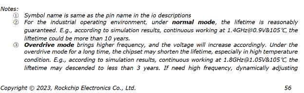
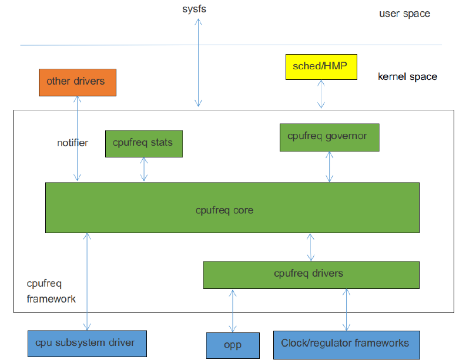

DEVFREQ
=====

정해진 governor에 따라 frequency 와 voltage가 동적으로 제어되도록 커널 developer가 정의한 framework 모델로, 성능과 전력소모를 효과적으로 관리할 수 있다.
devfreq는 cpufreq와 유사하지만, cpufreq는 cpu에만 적용되며 devfreq는 cpu 외에 동적 frequency 제어 및 voltage 제어 이 필요한 모듈을 타겟으로 사용된다.
devfreq 프레임워크는 governer, core, driver, event 로 구성되며 software framework는 아래와 같다.


 - devfreq governor : frequency를 결정하기 위해 사용되며 아래 governor가 포함되어 있다.
   * simple ondemand, userspace, powersave, performance, dmc ondemand.
 - devfreq core : devfreq governor와 devfreq 드라이버를 캡슐화 및 추상화하고, 인터페이스를 정의.
 - devfreq driver : device의 frequency voltage를 초기화하고, 특정 장치의 주파수를 설정한다.
 - devfreq event : device 의 부하 정보를 무니터링 하는데 사용.


-----

# GPU_DVFS

 - OPP Table
 특정frequency를 disable하려면 해당 opp node아래에 "status = disabled"; 를 추가.

```dtb
	gpu: gpu@fde60000 {
		compatible = "arm,mali-bifrost";
		reg = <0x0 0xfde60000 0x0 0x4000>;

		interrupts = <GIC_SPI 39 IRQ_TYPE_LEVEL_HIGH>,
			     <GIC_SPI 41 IRQ_TYPE_LEVEL_HIGH>,
			     <GIC_SPI 40 IRQ_TYPE_LEVEL_HIGH>;
		interrupt-names = "GPU", "MMU", "JOB";

		upthreshold = <40>;
		downdifferential = <10>;

		clocks = <&scmi_clk 1>, <&cru CLK_GPU>;
		clock-names = "clk_mali", "clk_gpu";
		power-domains = <&power RK3568_PD_GPU>;
		#cooling-cells = <2>;
		operating-points-v2 = <&gpu_opp_table>;

		...

	gpu_opp_table: opp-table2 {
		compatible = "operating-points-v2";

		mbist-vmin = <825000 900000 950000>;
		nvmem-cells = <&gpu_leakage>, <&core_pvtm>, <&mbist_vmin>;
		nvmem-cell-names = "leakage", "pvtm", "mbist-vmin";
		rockchip,pvtm-voltage-sel = <
			0        84000   0
			84001    91000   1
			91001    100000  2
		>;
		rockchip,pvtm-ch = <0 5>;

		opp-200000000 {
			opp-hz = /bits/ 64 <200000000>;		/* Hz */
			opp-microvolt = <850000>;			/* uV */
			opp-microvolt-L0 = <850000>;
			opp-microvolt-L1 = <825000>;
			opp-microvolt-L2 = <825000>;
		};

		...
		
		opp-800000000 {
			opp-hz = /bits/ 64 <800000000>;
			opp-microvolt = <1000000>;
			opp-microvolt-L0 = <1000000>;
			opp-microvolt-L1 = <950000>;
			opp-microvolt-L2 = <900000>;
		};
	};


```

# DMC DVFS
 DMC(Dynamic Memory Controller) DVFS, 즉 DDR Frequency 변환.

# BUS DVFS 


-----

# cpu frequeycy 변경

## rk3568 CPU의 max frequency 변경 

 rk3568 cpu의 기본 max frequency는 1992 MHz 이며, 2016 MHz 로 변경하려면 수정이 필요하다.
 
 - [ ] 실제 1992 MHz 동작 확인 필요.

```c
diff --git a/arch/arm64/boot/dts/rockchip/rk3568.dtsi b/arch/arm64/boot/dts/rockchip/rk3568.dtsi
index d8e85d5de8b6..f316fc0080a0 100644
--- a/arch/arm64/boot/dts/rockchip/rk3568.dtsi
+++ b/arch/arm64/boot/dts/rockchip/rk3568.dtsi
@@ -212,8 +212,8 @@
                        clock-latency-ns = <40000>;
                        status = "disabled";
                };
-               opp-1992000000 {
-                       opp-hz = /bits/ 64 <1992000000>;
+               opp-2016000000 {
+                       opp-hz = /bits/ 64 <2016000000>;
                        opp-microvolt = <1150000 1150000 1150000>;
                        opp-microvolt-L0 = <1150000 1150000 1150000>;
                        opp-microvolt-L1 = <1100000 1100000 1150000>;
diff --git a/drivers/clk/clk-scmi.c b/drivers/clk/clk-scmi.c
index 7da2c01c4444..a129cf95e4c1 100644
--- a/drivers/clk/clk-scmi.c
+++ b/drivers/clk/clk-scmi.c
@@ -69,6 +69,9 @@ static int scmi_clk_set_rate(struct clk_hw *hw, unsigned long rate,
 {
        struct scmi_clk *clk = to_scmi_clk(hw);
 
+       if ((clk->id == 0) && (rate == 2016000000))
+               rate = 1992000000;
+
        return clk->handle->clk_ops->rate_set(clk->handle, clk->id, rate);
 }
 
@@ -129,6 +132,8 @@ static int scmi_clk_ops_init(struct device *dev, struct scmi_clk *sclk)
                min_rate = sclk->info->range.min_rate;
                max_rate = sclk->info->range.max_rate;
        }
+       if (sclk->id == 0)
+               max_rate = 2016000000;
 
        clk_hw_set_rate_range(&sclk->hw, min_rate, max_rate);
        return ret;

```


## rk3568 주파수 모드 설명

 RK3568의 전력 소비를 줄이고 운영 체제의 견고성을 향상시키기 위해서는 제품 현장에서 RK3568의 주 주파수를 조정하는 것이 특히 중요하다.
 
 (reference : RK3568J 공식 데이터 시트 주 주파수모드 설명)
 > Rockchip_Rk3568B2_Datasheet_V1.0-20210701.pdf 문서에 언급이 TBD로 되어 있어 RK3568J 문서 참고.
 > RK3568J는 RK3568의 산업용 코어 보드 버전?

 
  
  
 - normal mode  
    datasheet에 따르면 rk3568 chip은 normal mode에서 수명이 더 길다.   
	시뮬레이션 결과에 따르면 1.4GHz@0.9V 및 105°C 에서 지속적으로 작동시킬 때, RK3568J chip의 서비스 수명은 10년을 초과할 수 있다.  
  
 - over drive mode  
    datasheet에 따르면 over driver mode에서는 processor frequency를 더 높이 설정할 수 있지만, chip의 서비스 수명이 단축된다.  
	시뮬레이션 결과에 따르면 1.8GHz@1.05V 및 105°C 에서 지속적으로 작동시킬 때, RK3568J chip의 서비스 수명은 3년 미만으로 단축된다.  
  

	높은 주 주파수에서 실행해야하는 경우, 전력 소비를 줄이고 chip의 서비스 수명을 늘리려면 frequency와 voltage를 동적으로 조정하고,   
	우수한 열 방출 조건을 보장해야 한다.  

 avaliable frequency setting : 시스템은 6개의 frequency mode를 지원한다. 전력 소비를 줄이고 chip의 서비스 수명을 보장하기 위해 performance frequency mode로 설정된다.   
 frequency setting :1.4(1.416) GHz.   
 > frequency mode는 **kernel config**, **cmd line**을 통해 수정할 수 있다.  
   
 참고 : 설정 가능한 주파수는 아래와 같다.   
 408000 KHz, 600000 KHz, 816000 KHz, 1104000 KHz, 1416000 KHz, 1608000 KHz, 1800000 KHz, 1992000 KHz 를 지원한다.  
  
  
 문서에 따르면 전력소모를 줄이고 chip의 수명을 보장하기 위해 RK3568J의 frequency setting은 1.4(1.416) GHz를 초과 하지 않는 것이 좋다.  

## check current frequency 

 - for non big.LITTLE core chipset 

```bash
/* Method 1 : cpufreq userspace interface */
cat /sys/devices/system/cpu/cpufreq/policy0/scaling_cur_freq

/* Method 2 : clock debug interface */
cat /sys/kernel/debug/clk/armclk/clk_rate
```
	 
 - for big.LITTLE core chipset 

```bash
/* Method 1 : cpufreq userspace interface */
cat /sys/devices/system/cpu/cpufreq/policy0/scaling_cur_freq /* LITTLE core frequency */
cat /sys/devices/system/cpu/cpufreq/policy4/scaling_cur_freq /* big core frequency */

/* Method 2: clock debug interface*/
cat /sys/kernel/debug/clk/armclkl/clk_rate /* LITTLE core frequency*/
cat /sys/kernel/debug/clk/armclkb/clk_rate /* big core frequency */
```

> ARM big.LITTLE core chipset은 ARM에서 개발한 이기종 다중 처리(HMP) 컴퓨팅 아키텍처이다. 
> 전력 소모가 적은 저성능 코어(LITTLE)들과 전력 소모가 많은 고성능 프로세서 코어(big) 들을 함께 탑재하는 구조를 말한다.

## check current voltage

```bash
/* here vdd_core is not the fixing name, please modify */
cat /sys/kernel/debug/regulator/vdd_core/voltage
```


-----

# CPUFreq


1. overview
-----

 CPUFreq는 지정된 governor에 따라서 cpu frequency 와 voltage를 동적으로 변경하기위해 kernel 개발자가 정의한 프레임워크 모델이다. 
 cpu의 performance에 따라서 cpu의 소비전력을 낮추는것이 효과적일 수 있다.

 CPUFreq framwork는 governor, core, driver, stats으로 구성된다.


 - CPUFreq governor : :CPU frequency를 언제 변경할지, 어느 frequency로 변경할지를 결정하는데 사용합니다.
  kernel을 아래 governor를 포함하고 있다.
  * conservative : cpu 부하에 따라 dynamic으로 frequcncy를 변경하고, 일정 비율로 frequency를 부드럽게 늘리거나 낮춘다.
  * ondemand : cpu 부하에 따라 dynamic으로 frequency를 변경하고, frequency는 넓은 범위에서 변경될 수 있다. 
   ex. max frequency or min frequency 에서 변경된다. 
  * interactive : cpu 부하에 따라 frequency를 dynamic으로 변경하고, ondemand 대비 변경속도가 빠르고 매개변수가 많으며 유연하다.
  * userspace : user mode application에서 frequency를 변경할 수 있는 user interface를 제공한다.
  * powersave :  소비전력을 우선시하고 frequency는 항상 min frequcncy으로 설정한다.
  * performance : performance를 우선시 하고, frequency는 가장 높은 값으로 설정된다. 
  * schedutil : EAS의 special governor (EAS; Energy Aware Scheduling)는 CPUFreq 및 CPU Idle의 전력과 결합된 차세대  work scheduling 으로 작업을 위해 실행중인 CPU를 선택할때, performance와 power saving을 모두 고려하여 최저 시스템 에너지를 보장하고 성능을 높입니다. 
 - CPUFreq core : cpufreq 거버너, cpufreq 드라이버를 캡슐화 및 추상화하고 명확한 인터페이스를 정의한다.
 - CPUFreq driver : cpu frequency 테이블을 초기화하고 cpu frequency를 설정하는데 사용한다. 
 - CPUFreq stats : cpufreq에 대한 통계를 제공 


2. code path
-----

 - governor related code:
```bash
drivers/cpufreq/cpufreq_conservative.c	/* conservative governor */
drivers/cpufreq/cpufreq_ondemand.c		/* ondemand governor */
drivers/cpufreq/cpufreq_interactive.c	/* interactive governor */
drivers/cpufreq/cpufreq_userspace.c		/* userspace governor */
drivers/cpufreq/cpufreq_performance.c	/* performance governor */
kernel/sched/cpufreq_schedutil.c		/* schedutil governor */
```

 - stats related code:
```bash
drivers/cpufreq/cpufreq_stats.c
```

 - core related code:
```bash
drivers/cpufreq/cpufreq.c
```

 - driver related code:
```bash
drivers/cpufreq/cpufreq-dt.c				/* platform driver */
drivers/cpufreq/rockchip-cpufreq.c			/* platform device */
drivers/soc/rockchip/rockchip_opp_select.c	/* interface for changing opp */
```

3. configuration
-----

 3.1 menuconfig

```bash

 → CPU Power Management → CPU Frequency scaling ──────────────────────────────────────────────────────────────────────────────────────────────────────────────────────────────────────────────────────────────────
  ┌────────────────────────────────────────────────────────────────────────────────────────── CPU Frequency scaling ───────────────────────────────────────────────────────────────────────────────────────────┐
  │  Arrow keys navigate the menu.  <Enter> selects submenus ---> (or empty submenus ----).  Highlighted letters are hotkeys.  Pressing <Y> includes, <N> excludes, <M> modularizes features.  Press           │
  │  <Esc><Esc> to exit, <?> for Help, </> for Search.  Legend: [*] built-in  [ ] excluded  <M> module  < > module capable                                                                                     │
  │                                                                                                                                                                                                            │
  │                                                                                                                                                                                                            │
  │ ┌────────────────────────────────────────────────────────────────────────────────────────────────────────────────────────────────────────────────────────────────────────────────────────────────────────┐ │
  │ │                                                                 [*] CPU Frequency scaling                                                                                                              │ │
  │ │                                                                 [*]   CPU frequency transition statistics                                                                                              │ │
  │ │                                                                 [*]   CPU frequency time-in-state statistics                                                                                           │ │
  │ │                                                                       Default CPUFreq governor (performance)  --->                                                                                     │ │
  │ │                                                                 -*-   'performance' governor                                                                                                           │ │
  │ │                                                                 <*>   'powersave' governor                                                                                                             │ │
  │ │                                                                 <*>   'userspace' governor for userspace frequency scaling                                                                             │ │
  │ │                                                                 <*>   'ondemand' cpufreq policy governor                                                                                               │ │
  │ │                                                                 <*>   'conservative' cpufreq governor                                                                                                  │ │
  │ │                                                                 [*]   'schedutil' cpufreq policy governor                                                                                              │ │
  │ │                                                                 <*>   'interactive' cpufreq policy governor                                                                                            │ │
  │ │                                                                       *** CPU frequency scaling drivers ***                                                                                            │ │
  │ │                                                                 <*>   Generic DT based cpufreq driver                                                                                                  │ │
  │ │                                                                 < >   Dummy CPU frequency driver                                                                                                       │ │
  │ │                                                                 < >   Generic ARM big LITTLE CPUfreq driver                                                                                            │ │
  │ │                                                                 <*>   Rockchip CPUfreq driver                                                                                                          │ │
  │ │                                                                 < >   SCMI based CPUfreq driver                                                                                                        │ │
  │ │                                                                 < >   CPU frequency scaling driver for Freescale QorIQ SoCs                                                                            │ │
(...)
```


 3.2 clock configuration


 3.3 regulator configuration

 devicetree의 CPU nde에 "cpu-supply" property을 추가합니다.
 Regulator에 대한 자세한 구성 지침은 아래와 같습니다.
 
   - Regulator, PMIC 관련 개발 문서

	   rk3568을 예로 들어 "cpu-supply" property 을 cpu0 node에 추가한다.(for non-big.LITTLE core platform)
	    
   - regulator 를 configured하지 않은 경우라도, cpufreq driver는 loaded된다.  voltage를 변경하지 않고 CPU frequency가 변경되는 것. 
   - 그러나 cpu freq가 일정 값을 초과하면 low voltage 으로 인해 crash가 발생할 수 있다.

```dts

&cpu0 {
	cpu-supply = <&vdd_cpu>;
};


&i2c0 {
	status = "okay";

	vdd_cpu: tcs4525@1c {
		compatible = "tcs,tcs452x";
		reg = <0x1c>;
		vin-supply = <&vcc5v0_sys>;
		regulator-compatible = "fan53555-reg";
		regulator-name = "vdd_cpu";
		regulator-min-microvolt = <712500>;
		regulator-max-microvolt = <1390000>;
		regulator-init-microvolt = <900000>;
		regulator-ramp-delay = <2300>;
		fcs,suspend-voltage-selector = <1>;
		regulator-boot-on;
		regulator-always-on;
		regulator-state-mem {
			regulator-off-in-suspend;
		};
	};


```


 3.4 OPP table configuration

  Operating Performance Points(OPP) 는 linux kernel의 기능으로 CPU의 performance와 power saving을 조절하는데 사용된다.
  OPP는 CPU의 frequency와 voltage를 조합하여 나타내며, CPU의 perforfance와 power saving 은 OPP의 조합에 따라 달라진다. 
  OPP는 CPU의 성능을 높이거나 전력 소비량을 줄이기 위해 사용될 수 있다.   
   예를 들어, CPU의 성능을 높이기 위해서는 높은 주파수와 높은 전압의 OPP를 사용해야 하며, 
   전력 소비량을 줄이기 위해서는 낮은 주파수와 낮은 전압의 OPP를 사용해야 한다.

  - OPP 는 linux kernel의 power/opp.c 파일에서 관리된다. power/opp.c 파일에는 cpu의 opp목록이 저장되어 있으며, cpu의 opp는 power/opp.c파일에서 조회/변경 가능하다.
  - OPP 는 CPU의 성능과 전력 소비량을 조절하는데 중요한 역할을 한다. 

```bash
Documentation/devicetree/bindings/opp/opp.txt
Documentation/power/opp.txt
```

  - kernel은 frequency, voltage관련 파일을 devicetree에서 얻어 입력합니다.
  - devicetree의 OPP Table node는 frequency, voltage를 가지고 있다.

 3.4.1 Add OPP table

	platform에 따라 OPP table node를 추가하는 방법을 다르지만 일반적으로  dtsi파일에서 각 cpu node sub system에 "operating-points-v2" property 을 추가하여 사용한다.

```dtb
// rk3568.dtsi

	cpus {
		#address-cells = <2>;
		#size-cells = <0>;

		cpu0: cpu@0 {
			device_type = "cpu";
			compatible = "arm,cortex-a55";
			reg = <0x0 0x0>;
			enable-method = "psci";
			clocks = <&scmi_clk 0>;
			operating-points-v2 = <&cpu0_opp_table>;
			cpu-idle-states = <&CPU_SLEEP>;
			#cooling-cells = <2>;
			dynamic-power-coefficient = <187>;
		};

		cpu1: cpu@100 {
			device_type = "cpu";
			compatible = "arm,cortex-a55";
			reg = <0x0 0x100>;
			enable-method = "psci";
			clocks = <&scmi_clk 0>;
			operating-points-v2 = <&cpu0_opp_table>;
			cpu-idle-states = <&CPU_SLEEP>;
		};

		cpu2: cpu@200 {
			device_type = "cpu";
			compatible = "arm,cortex-a55";
			reg = <0x0 0x200>;
			enable-method = "psci";
			clocks = <&scmi_clk 0>;
			operating-points-v2 = <&cpu0_opp_table>;
			cpu-idle-states = <&CPU_SLEEP>;
		};

		cpu3: cpu@300 {
			device_type = "cpu";
			compatible = "arm,cortex-a55";
			reg = <0x0 0x300>;
			enable-method = "psci";
			clocks = <&scmi_clk 0>;
			operating-points-v2 = <&cpu0_opp_table>;
			cpu-idle-states = <&CPU_SLEEP>;
		};
(...)

	cpu0_opp_table: cpu0-opp-table {
		compatible = "operating-points-v2";
		opp-shared;					/* multiple CPUs에 shared된다는 것을 나타내는 property */ 

		mbist-vmin = <825000 900000 950000>;
		nvmem-cells = <&cpu_leakage>, <&core_pvtm>, <&mbist_vmin>;
		nvmem-cell-names = "leakage", "pvtm", "mbist-vmin";
		rockchip,pvtm-voltage-sel = <
			0        84000   0
			84001    91000   1
			91001    100000  2
		>;
		rockchip,pvtm-freq = <408000>;
		rockchip,pvtm-volt = <900000>;
		rockchip,pvtm-ch = <0 5>;
		rockchip,pvtm-sample-time = <1000>;
		rockchip,pvtm-number = <10>;
		rockchip,pvtm-error = <1000>;
		rockchip,pvtm-ref-temp = <40>;
		rockchip,pvtm-temp-prop = <26 26>;
		rockchip,thermal-zone = "soc-thermal";
		rockchip,temp-hysteresis = <5000>;
		rockchip,low-temp = <0>;
		rockchip,low-temp-adjust-volt = <
			/* MHz    MHz    uV */
			   0      1608   75000
		>;

		opp-408000000 {
			opp-hz = /bits/ 64 <408000000>;						/* Hz */
			opp-microvolt = <850000 850000 1150000>;			/* uV, <target min max> */
			opp-microvolt-L0 = <850000 850000 1150000>;			
			opp-microvolt-L1 = <825000 825000 1150000>;
			opp-microvolt-L2 = <825000 825000 1150000>;
			clock-latency-ns = <40000>;							/* ns, the time required to compile the transformation */
		};
		opp-600000000 {
			opp-hz = /bits/ 64 <600000000>;
			opp-microvolt = <850000 825000 1150000>;
			opp-microvolt-L0 = <850000 850000 1150000>;
			opp-microvolt-L1 = <825000 825000 1150000>;
			opp-microvolt-L2 = <825000 825000 1150000>;
			clock-latency-ns = <40000>;
		};
		opp-816000000 {
			opp-hz = /bits/ 64 <816000000>;
			opp-microvolt = <850000 850000 1150000>;
			opp-microvolt-L0 = <850000 850000 1150000>;
			opp-microvolt-L1 = <825000 825000 1150000>;
			opp-microvolt-L2 = <825000 825000 1150000>;
			clock-latency-ns = <40000>;
			opp-suspend;
		};
		opp-1104000000 {
			opp-hz = /bits/ 64 <1104000000>;
			opp-microvolt = <900000 900000 1150000>;
			opp-microvolt-L0 = <900000 900000 1150000>;
			opp-microvolt-L1 = <825000 825000 1150000>;
			opp-microvolt-L2 = <825000 825000 1150000>;
			clock-latency-ns = <40000>;
		};
		opp-1416000000 {
			opp-hz = /bits/ 64 <1416000000>;
			opp-microvolt = <1000000 1000000 1150000>;
			opp-microvolt-L0 = <1000000 1000000 1150000>;
			opp-microvolt-L1 = <925000 925000 1150000>;
			opp-microvolt-L2 = <925000 925000 1150000>;
			clock-latency-ns = <40000>;
		};
		opp-1608000000 {
			opp-hz = /bits/ 64 <1608000000>;
			opp-microvolt = <1075000 1075000 1150000>;
			opp-microvolt-L0 = <1075000 1075000 1150000>;
			opp-microvolt-L1 = <1000000 1000000 1150000>;
			opp-microvolt-L2 = <1000000 1000000 1150000>;
			clock-latency-ns = <40000>;
		};
		opp-1800000000 {
			opp-hz = /bits/ 64 <1800000000>;
			opp-microvolt = <1125000 1125000 1150000>;
			opp-microvolt-L0 = <1125000 1125000 1150000>;
			opp-microvolt-L1 = <1050000 1050000 1150000>;
			opp-microvolt-L2 = <1050000 1050000 1150000>;
			clock-latency-ns = <40000>;
		};
		opp-1992000000 {
			opp-hz = /bits/ 64 <1992000000>;
			opp-microvolt = <1150000 1150000 1150000>;
			opp-microvolt-L0 = <1150000 1150000 1150000>;
			opp-microvolt-L1 = <1100000 1100000 1150000>;
			opp-microvolt-L2 = <1075000 1075000 1150000>;
			clock-latency-ns = <40000>;
		};
	};
```

- Note :OPP Table에 "operating-point-v2"가 포함되어 잇지 않으면, cpufreq는 초기화가 되지 않는다. 초기화가 되지 않으면 system이 frequency와 voltage를 변경할 수 없으며 아래와 같은 error가 출력된다.

```bash
cpu cpu0: OPP-v2 not supported
cpu cpu0: couldn't find opp table for cpu:0, -19
```


 3.5 Modify OPP Table According to Leakage
  IDDQ(Integrated Circuit Quiescent Current), leakage(누설)이라고도 한다.
  CPU의 leakage은 특정 전압을 제공할 때 CPU의 대기 전류(quiescent current)를 의미한다.

 - note : 칩 생산 시 leakage 값이 eFuse 또는 OTP에 기록된다.

 3.5.1 Modify Voltage According to Leakage

 - 기능 설명 : eFuse 또는 OTP에서 CPU leakage value을 가져오고 particular table에서 leakage에 해당하는 voltage을 가져와 적용시킨다
 - 적용 방법 : 
   * eFuse 또는 OTP에 대한 관련 코드를 추가한다.
   * OPP table node에 "rockchip, leak-voltage-sel", "nvmem-cells", "nvmem-cell-names" 속석 3개를 추가한다. 

 - exampele

```dtb
	cpu0_opp_table: cpu0-opp-table {
		compatible = "operating-points-v2";
		opp-shared;

		mbist-vmin = <825000 900000 950000>;
		nvmem-cells = <&cpu_leakage>, <&core_pvtm>, <&mbist_vmin>;		/* get cpu leakage from eFuse or OTP */
		nvmem-cell-names = "leakage", "pvtm", "mbist-vmin";
		rockchip,pvtm-voltage-sel = <
			0        84000   0
			84001    91000   1
			91001    100000  2
		>;

	(...)


	dmc_opp_table: dmc-opp-table {
		compatible = "operating-points-v2";

		mbist-vmin = <825000 900000 950000>;
		nvmem-cells = <&log_leakage>, <&core_pvtm>, <&mbist_vmin>;
		nvmem-cell-names = "leakage", "pvtm", "mbist-vmin";
		rockchip,temp-hysteresis = <5000>;
		rockchip,low-temp = <0>;
		rockchip,low-temp-adjust-volt = <
			/* MHz    MHz    uV */
			   0      1560   75000
		>;

		/**
		  *  leakage이 1mA ~ 80mA 인경우, OPP는 voltage specified by opp-microvolt-L0 값을 사용한다.
		  *  leakage이 81mA ~ 254mA 인경우, OPP는 voltage specified by opp-microvolt-L1 값을 사용한다.
		  *  "rockchip,leakage-voltage-sel" 이 제거되었거나, leakage 가 위 range 에 초과한 경우, OPP 는 "opp-microvolt" 값을 사용한다. 
		  */

		rockchip,leakage-voltage-sel = <
			1   80    0
			81  254   1
		>;
		rockchip,pvtm-voltage-sel = <
			0        84000   0
			84001    100000  1
		>;
		rockchip,pvtm-ch = <0 5>;

		opp-1560000000 {
			opp-hz = /bits/ 64 <1560000000>;
			opp-microvolt = <900000>;
			opp-microvolt-L0 = <900000>;
			opp-microvolt-L1 = <850000>;
		};
	};
```

 3.6 Modify OPP Table According to PVTM

  CPU PVTM(Process-Voltage-Temperature Monitor)는 CPU 가까이에 위치 한 모듈이며, 칩 간의 성능차이를 반영될 수 있으며, voltage, temperature의 영향을 받는다.

 - 기능 설명 : 정해진 voltage 및 frequency에서 PVTM value 을 얻은 후, 기준 온도에서 PVTM value을 변환하여 PVTM table 에서  해당하는 voltage 의 값을 얻어 적용한다.
 - 적용 방법 : PVTM 관련 코드를 추가한다.   "rockchip,pvtm-voltage-sel", "rockchip,thermal-zone", "rockchip,pvtm-<name>" property을 OPP table node에 추가한다. 
 - example

```dtb
	cpu0_opp_table: cpu0-opp-table {
		compatible = "operating-points-v2";
		opp-shared;

		mbist-vmin = <825000 900000 950000>;
		nvmem-cells = <&cpu_leakage>, <&core_pvtm>, <&mbist_vmin>;
		nvmem-cell-names = "leakage", "pvtm", "mbist-vmin";

		/**
		  * 하나의 프로세스만 있는 경우 OPP 테이블 노드에 "rockchip,pvtm-voltage-sel" property을 추가하고 voltage을 구별하기 위해 OPP 노드에 "opp-microvolt-L0","opp-microvolt-L1" 속성을 추가한다.
		  * 프로세스가 둘 이상인 경우, 
		  *    예를들어 process0 및 process1, 이 2개의 process의 구성이 서로 다를 경우, "rockchip,p0-pvtm-voltage-sel","rockchip,p1-pvtm-voltage-sel"을 OPP table에 추가한다.
		  *    2개의 process가 동일한 provess 구성인 경우 "rockchip,pvtm-voltage-sel"을 추가하는 것이 좋습니다.
		  *
		  * PVTM 값이 0 ~ 84000 인경우, "opp-microvolt-L0" OPP 를 사용. 
		  * PVTM 값이 84001 ~ 91000 인경우, "opp-microvolt-L1" OPP를 사용.
		  * 만약, "rockchip,pvtm-voltage-sel" 또는 PVTM value이 값을 초과한 경우, "opp-microvolt"를 사용한다.
		  */

		rockchip,pvtm-voltage-sel = <
			0        84000   0
			84001    91000   1
			91001    100000  2
		>;

		/** PVTM 값을 얻어오기 이전 cpu frequency 를 408000Khz으로 변경*/
		rockchip,pvtm-freq = <408000>;
		/** PVTM 값을 얻어오기 이전 cpu voltage 를 900000uV으로 변경*/
		rockchip,pvtm-volt = <900000>;
		/** PVTM channel, format <channel sel> */
		rockchip,pvtm-ch = <0 5>;
		/** PVTM sampling time, unit it us */
		rockchip,pvtm-sample-time = <1000>;
		/** PVTM sampling number */
		rockchip,pvtm-number = <10>;
		/** error can be afford between sampling data */
		rockchip,pvtm-error = <1000>;
		/** reference temperature */
		rockchip,pvtm-ref-temp = <40>;
		/** 온도비례계수, 기준온도 이하일 때 첫 번째 계수 사용, 높을 때 두 번째 사용 */
		rockchip,pvtm-temp-prop = <26 26>;
		/** get temperature from soc-thermal */
		rockchip,thermal-zone = "soc-thermal";
		rockchip,temp-hysteresis = <5000>;
		rockchip,low-temp = <0>;
		rockchip,low-temp-adjust-volt = <
			/* MHz    MHz    uV */
			   0      1608   75000
		>;
```

 3.7 Wide Temperature Configuration
 
 일반적으로 주변 온도가 − 40°C ~ + 85°C임을 의미한다.

시스템이 온도가 특정 값보다 낮다는 것을 감지하면 각 주파수의 전압을 높입니다.

  일부 주파수의 전압이 시스템에서 제한하는 최대 전압을 초과하면 해당 주파수가 금지됩니다. 즉, 해당 주파수 없이 작동합니다.

    온도가 정상 온도로 돌아오면 전압이 기본 상태로 돌아갑니다.

	시스템이 온도가 특정 값보다 높다는 것을 감지하면 전압이 특정 값을 초과하는 빈도가 제한됩니다.

	  온도가 정상으로 돌아오고 주파수 제한이 해제됩니다.


 - 기능 설명 : system의 온도가 특정 값보다 낮다는 것을 감지하면 각 frequency의 voltage 을 높인다.
 - 적용 방법 : 저온을 지원하려면 "rockchip, temp-hysteresis", "rockchip,low-temp", "rockchip, low-temp-min-volt", "rockchip, low-temp-adjust-volt" 속성을 추가합니다. OPP 테이블 노드에 "rockchip, max-volt".
고온을 지원하려면 "rockchip, temp-hysteresis", "rockchip, high-temp" 및 "rockchip, high-temp-max-volt" 속성을 OPP 테이블 노드에 추가하십시오.

 - example
```dtb
	cpu0_opp_table: cpu0-opp-table {
		compatible = "operating-points-v2";
		opp-shared;

		mbist-vmin = <825000 900000 950000>;
		nvmem-cells = <&cpu_leakage>, <&core_pvtm>, <&mbist_vmin>;
		nvmem-cell-names = "leakage", "pvtm", "mbist-vmin";
		rockchip,pvtm-voltage-sel = <
			0        84000   0
			84001    91000   1
			91001    100000  2
		>;
		rockchip,pvtm-freq = <408000>;
		rockchip,pvtm-volt = <900000>;
		rockchip,pvtm-ch = <0 5>;
		rockchip,pvtm-sample-time = <1000>;
		rockchip,pvtm-number = <10>;
		rockchip,pvtm-error = <1000>;
		rockchip,pvtm-ref-temp = <40>;
		rockchip,pvtm-temp-prop = <26 26>;
		rockchip,thermal-zone = "soc-thermal";
		/** 
		  * Hysteresis paramerer, 고온, 저온상태를 방지합니다. 
		  *
		  * 예를 들어, 온도가 섭씨 0도 미만인 경우 저온 상태에서 작동하고 섭씨 5도 이상인 경우 정상 상태로 돌아갑니다.
		  *   온도가 섭씨 85도 이상이면 고온 상태에서 작동하고 섭씨 80도 미만이면 정상 상태로 돌아갑니다.
		  */
		rockchip,temp-hysteresis = <5000>;
		/** 
		  * 저온 임계값, 밀리셀시우스
		  */
		rockchip,low-temp = <0>;
		/**
		  * 저온에서의 최소 전압, uV 저온 상태에서 0-1608MHz의 주파수에 75mV를 더합니다.
		  */
		rockchip,low-temp-adjust-volt = <
			/* MHz    MHz    uV */
			   0      1608   75000
		>;

```


 4. User interface

 - Non-big.Little platforms : 모든 core 는 하나의 clock을 공유하고 동일한 user interface 를 아래 경로를 통해 갖는다.
	  /sys/devices/system/cpu/cpufreq/policy0/
```bash
rk3568_rgbp01:/sys/devices/system/cpu/cpufreq/policy0 # pwd
/sys/devices/system/cpu/cpufreq/policy0
rk3568_rgbp01:/sys/devices/system/cpu/cpufreq/policy0 # ls -alh
total 0
drwxr-xr-x 4 root   root      0 2023-06-12 11:04 .
drwxr-xr-x 3 root   root      0 2023-06-12 11:04 ..
-r--r--r-- 1 root   root   4.0K 2023-06-12 11:47 affected_cpus					/* All online CPUs at the same cluster */
-r-------- 1 root   root   4.0K 2023-06-12 11:47 cpuinfo_cur_freq				/* the last frequency set by software */
-r--r--r-- 1 root   root   4.0K 2023-06-12 11:47 cpuinfo_max_freq				/* the maximum frequency restricted on software */
-r--r--r-- 1 root   root   4.0K 2023-06-12 11:47 cpuinfo_min_freq				/* the minimum frequency restricted on software */
-r--r--r-- 1 root   root   4.0K 2023-06-12 11:47 cpuinfo_transition_latency		/* the transition time of two frequencies, unit is ns */
drwxr-xr-x 2 root   root      0 2023-06-12 11:47 interactive					
-r--r--r-- 1 root   root   4.0K 2023-06-12 11:47 related_cpus					/* All CPUs at the same cluster */
-r--r--r-- 1 root   root   4.0K 2023-06-12 11:04 scaling_available_frequencies	/* available frequencies */
-r--r--r-- 1 root   root   4.0K 2023-06-12 11:47 scaling_available_governors	/* current cpufreq governor */
-r--r--r-- 1 root   root   4.0K 2023-06-12 11:47 scaling_cur_freq				/* the last frequency set by software */
-r--r--r-- 1 root   root   4.0K 2023-06-12 11:47 scaling_driver
-rw-rw-r-- 1 system system 4.0K 2023-06-12 10:56 scaling_governor				/* current cpufreq governor */
-rw-rw---- 1 system system 4.0K 2017-08-04 18:04 scaling_max_freq				/* the maximum frequency restricted on software */
-rw-rw---- 1 system system 4.0K 2023-06-12 10:56 scaling_min_freq				/* the minimum frequency restricted on software */
-rw-rw-r-- 1 system system 4.0K 2017-08-04 18:04 scaling_setspeed				/* used to change frequency when governor is userspace */
drwxr-xr-x 2 root   root      0 2023-06-12 11:25 stats							
rk3568_rgbp01:/sys/devices/system/cpu/cpufreq/policy0 # ls -alh stats/
total 0
drwxr-xr-x 2 root root    0 2023-06-12 11:25 .
drwxr-xr-x 4 root root    0 2023-06-12 11:04 ..
--w------- 1 root root 4.0K 2023-06-12 11:55 reset
-r--r--r-- 1 root root 4.0K 2023-06-12 11:25 time_in_state						/* record work time at each frequency, unit is 10ms */
-r--r--r-- 1 root root 4.0K 2023-06-12 11:55 total_trans						/* record frequency scaling times */
-r--r--r-- 1 root root 4.0K 2023-06-12 11:55 trans_table						/* record frequency scaling times of each frequency */
```

 - Big.Little platforms : 2개의 clusters를 갖는다. 각각 독립적으로 clock과 user intaface를 갖는다. 
 - cluster0 은 little cores, user interface는 아래와 같다.
     /sys/devices/system/cpu/cpufreq/policy0/
 - cluster1 은 big cores, user interface는 아래와 같다.
	 /sys/devices/system/cpu/cpufreq/policy4/

> Note : Big.Little platform 에서 cluster는 고성능 코어와 저전력 코어의 그룹입니다. 고성능 코어는 짧은 시간 동안 많은 작업을 처리하는데 적합하며, 저전력 코어는 장기간 동안 적은 작업을 처리하는데 적절합니다. 클러스터는 2가지 유형의 코어를 결합하여 장치의 전력 효율성과 성능을 향상시킵니다.
