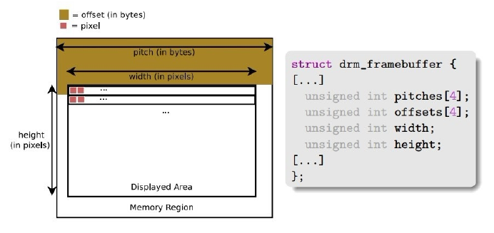
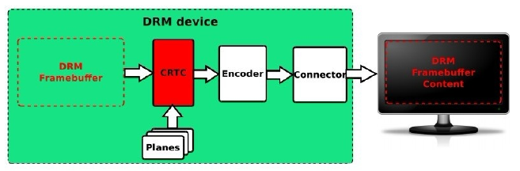
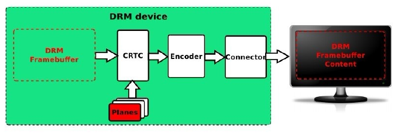
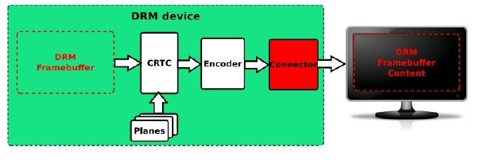
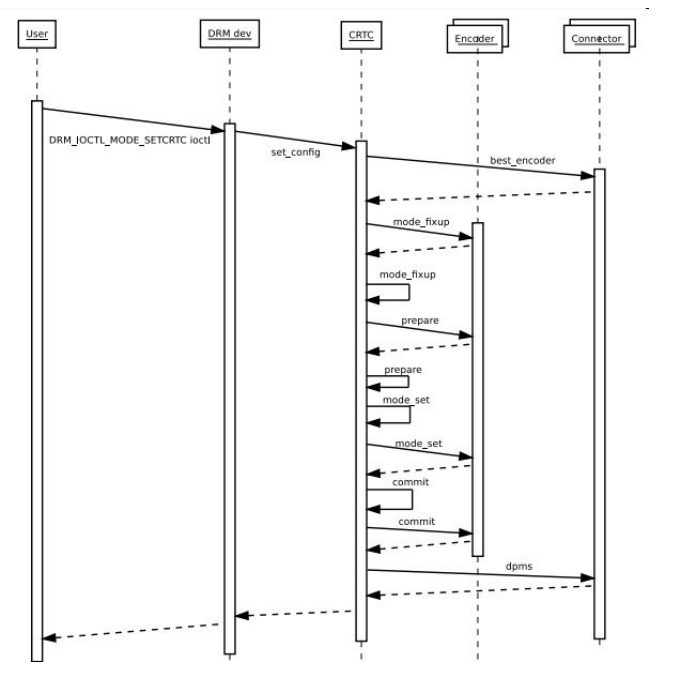

# DISPLAY
> rockchip display 에 대해 정리합니다.

# Introduction
## Display Pipe

```bash
[ LCD Controller ]  ->  [ Display Interface ]  ->  [ Panel ]
```

1) Rockchip 플랫폼의 LCD Controller 를 VOP(Video Output Processor)라고 합니다. 보통 1~2개의VOP를 가지고 있습니다. 2개의 VOP를 지원하는 경우, Dual Screen을 지원합니다. 
2) Rockchip 플랫폼의 칩은 HDMI/MIPI-DSI/RGB/LVDS/eDP/DP등을 포함하고 있습니다.


<br/>  
<br/>  
<br/>  
<br/>  
-----  

# Panel 장치
## Documentation and source code
- kernel
    drivers/gpu/drm/panel/panel-simple.c
    Documentation/devicetree/bindings/display/panel/simple-panel.txt
- uboot (next-dev)
    drivers/video/drm/rockchip_panel.c

## DT binding
1) simple-panel(lvds/rgb/edp)
2) simple-panel-dsi(mipi-dsi)

<br/>  
<br/>  
<br/>  
<br/>  
-----  

# RGB 인터페이스
## Documentation and source code
- uboot (next-dev)
    drivers/video/drm/rockchip_rgb.c
    drivers/video/drm/inno_video_combo_phy.c
    drivers/video/drm/inno_video_phy.c

## DT Bindings (rgb)
### Host
```dtb
&rgb {
    status = "okay";

    ports {
        port@1 {
            reg = <1>;

            rgb_out_panel: endpoint {
                remote-endpoint = <&panel_in_rgb>;
            };
        };
    };
};
```

### PHY
```dtb
&video_phy    {
    status = "okay";
};
```


### Panel
```dtb
    panel {
        compatible = "simple-panel";
        bus-format = <MEDIA_BUS_FMT_RGB666_1X24_CPADHI>;
        backlight = <&backlight>;
        enable-gpios = <&gpio3 RK_PC5 GPIO_ACTIVE_LOW>;
        enable-delay-ms = <20>;
        reset-gpios = <&gpio0 RK_PB7 GPIO_ACTIVE_LOW>;
        reset-delay-ms = <10>;
        prepare-delay-ms = <20>;
        unprepare-delay-ms = <20>;
        disable-delay-ms = <20>;
        status = "okay";
        width-mm = <1024>;
        height-mm = <600>;
        bpc = <8>;

        display-timings {
            native-mode = <&timing0>;

            timing0: timing0 {
                clock-frequency = <51200000>;
                hactive = <1024>;
                vactive = <600>;
                hback-porch = <140>;
                hfront-porch = <160>;
                vback-porch = <20>;
                vfront-porch = <12>;
                hsync-len = <100>;
                vsync-len = <10>;
                hsync-active = <1>;
                vsync-active = <1>;
                de-active = <0>;
                pixelclk-active = <1>;
            };
        };

        ports {
            panel_in_rgb: endpoint {
                remote-endpoint = <&rgb_out_panel>;
            };
        };
    };
```

<br/>  
<br/>  
<br/>  
<br/>  
-----  

# HDMI 인터페이스

## DT Bindings
### Host
```dtb
&hdmi {
    status = "okay";
    rockchip,phy-table =
        <92812500  0x8009 0x0000 0x0270>,
        <165000000 0x800b 0x0000 0x026d>,
        <185625000 0x800b 0x0000 0x01ed>,
        <297000000 0x800b 0x0000 0x01ad>,
        <594000000 0x8029 0x0000 0x0088>,
        <000000000 0x0000 0x0000 0x0000>;
};

&hdmi_in_vp0 {
    status = "okay";
};

```


## DT Bindings (edp)
### Host
```dtb
&edp {
    hpd-gpios = <&gpio0 RK_PC2 GPIO_ATIVE_HIGH>;
    status = "okay";
};
```

### PHY
```dtb
&edp_phy {
    status = "okay";
};


&edp_in_vp0 {
    status = "okay";
};

&edp_in_vp1 {
    status = "disabled";
};
```

### Panel
```dtb
    panel {
        compatible = "simple-panel";
        bus-format = <MEDIA_BUS_FMT_RGB666_1X24_CPADHI>;
        backlight = <&backlight>;
    


```

<br/>  
<br/>  
<br/>  
<br/>  
-----  

# DRM (Direct Rendering Manager)
 
 DRM의 전체 이름은 Direct Rendering Manager로 디스플레이 출력, 버퍼 할당, 프레임 버퍼링 관리.  
  
 libdrm library는 유저가 쉽게 디스플레이를 제어할 수 있도록 제어 패키지를 제공.  
 drm은 libdrm library 가 아닌 drm 장치를 ioctl하여 직접 작동하거나 frame buffer interface를 사용하여 
 디스플레이 작업을 구현할 수도 있다.  
  
  
 - **DRM framework**


 - **Framebuffer**




 - **CRTC**



 - **Plane**



 - **Encoder**

;

 - **Connector**



## Device Node

 DRM의 Device Node 는  "dev/dri/carX" 이며, X 의 범위는 0~15 값을 갖음.   
 (기본값은 /dev/dri/card0)   


## DRM Mode Setting Sequence Diagram
  



## MODETEST tool

 modetest 는 linux DRM/KMS (Direct Rendering Manager/Kernel Mode Setting) Test 툴.  
 이 툴은 디스플레이와 그래픽 하드웨어를 테스트하고 디버깅 하는데 사용.  

 1. 모든 디스플레이 기능 리스트 업   
 - modetest 명령어 실행 시, CRTCs, Encoders, Connectors(DSI, eDP, HDMI 등등), Plane, Mode 등과 같은
   모든 디스플레이 기능을 리스트 업.  
  

```bash
 # modetest -M rockchip
Encoders:
id      crtc    type    possible crtcs  possible clones
345     0       Virtual 0x00000003      0x00000000
347     87      TMDS    0x00000002      0x00000000
349     71      TMDS    0x00000001      0x00000000

Connectors:
id      encoder status          name            size (mm)       modes   encoders
348     347     connected       eDP-1           290x170         2       347
  modes:
        index name refresh (Hz) hdisp hss hse htot vdisp vss vse vtot
  #0 1920x1080 60.01 1920 1944 1992 2080 1080 1083 1095 1112 138800 flags: nhsync, nvsync; type: preferred, driver
  #1 1920x1080 47.99 1920 1944 1992 2080 1080 1083 1095 1112 111000 flags: nhsync, nvsync; type: driver
  props:
        1 EDID:
                flags: immutable blob
                blobs:

                value:
                        00ffffffffffff0026cf360500000000
                        001c
                        
(...)
```  
  
 2. 기본 테스트 수행
 - Test pattern을 출력하거나 2개의 레이어를 표시하고 Vsync 를 테스트 하는 등 기본 적인 테스트를 수행.  

> display 출력 테스트를 위해서는 현재 시스템의 디스플레이를 종료해야 함.  
> drm은 하나의 디스플레이 출력 프로그램만 허용   

```bash
# modetest -h
usage: modetest [-acDdefMPpsCvrw]

 Query options:

        -c      list connectors
        -e      list encoders
        -f      list framebuffers
        -p      list CRTCs and planes (pipes)

 Test options:

        -P <plane_id>@<crtc_id>:<w>x<h>[+<x>+<y>][*<scale>][@<format>]  set a plane
        -s <connector_id>[,<connector_id>][@<crtc_id>]:[#<mode index>]<mode>[-<vrefresh>][@<format>]    set a mode
        -C      test hw cursor
        -v      test vsynced page flipping
        -r      set the preferred mode for all connectors
        -w <obj_id>:<prop_name>:<value> set property
        -a      use atomic API
        -F pattern1,pattern2    specify fill patterns

 Generic options:

        -d      drop master after mode set
        -M module       use the given driver
        -D device       use the given device

        Default is to dump all info.


# modetest -M rockchip -c
Connectors:
id      encoder status          name            size (mm)       modes   encoders
348     347     connected       eDP-1           290x170         2       347
350     349     connected       HDMI-A-1        0x0             1       349


# modetest -M rockchip -p 
CRTCs:                                                                                                                                                        
id      fb      pos     size                                                   
71      0       (0,0)   (640x480)                                                                                                                             
  #0 640x480 59.94 640 656 752 800 480 489 492 525 25175 flags: nhsync, nvsync; type: preferred    
  
(....)  
  
87      0       (0,0)   (1920x1080)
  #0 1920x1080 60.01 1920 1944 1992 2080 1080 1083 1095 1112 138800 flags: nhsync, nvsync; type: preferred, driver
  props:
        21 ACTIVE:
                flags: range
                values: 0 1
                value: 1
        22 MODE_ID:

  modes:                                                                                                                                                      
        index name refresh (Hz) hdisp hss hse htot vdisp vss vse vtot                                                                                         
  #0 1920x1080 60.01 1920 1944 1992 2080 1080 1083 1095 1112 138800 flags: nhsync, nvsync; type: preferred, driver                                            
  #1 1920x1080 47.99 1920 1944 1992 2080 1080 1083 1095 1112 111000 flags: nhsync, nvsync; type: driver 

    modes:                                                                                                                                                      
            index name refresh (Hz) hdisp hss hse htot vdisp vss vse vtot                                                                                         
              #0 640x480 59.94 640 656 752 800 480 489 492 525 25175 flags: nhsync, nvsync; type: preferred  

# modetest -M rockchip -s 348@87:1920x1080 -v                                   <
setting mode 1920x1080-60.01Hz on connectors 348, crtc 87
freq: 60.77Hz
freq: 60.01Hz
freq: 60.01Hz
(...)

# modetest -M rockchip -s 350@71:#0 -v
freq: 57.16Hz
freq: 60.01Hz
freq: 60.02Hz
freq: 60.01Hz
(...)
```


<br/>  
<br/>  
<br/>  
<br/>  
-----  


# baseparameter images 
> baseparameter 이미지는 rockchip 디스플레이 해상도, 디스플레이 효과 조정 구성 등과 같은 정보를 저장하는데 사용되며, 종료 및 재시작 후에도 이전과 동일한 효과가 유지 될 수 있도록 보장합니다. 

<br/>  
<br/>  
<br/>  
<br/>  

----

# 💻  code review

```bash
+-------------------+    +----------------------------+    +---------------------+
| display_subsystem |    | vop                        |    | dsi0                | 
|                   |    |                            |    |       dsi0_in_vp0   |
|       route_dsi0  |    | vp0           vp0_out_dsi0 |    |       dsi0_in_vp1   |
|       route_dsi1  |    |               vp0_out_dsi1 |    +---------------------+
|       route_edp   |    |               vp0_out_edp  |    | dsi1                |
|       route_hdmi  |    |               vp0_out_hdmi |    |       dsi1_in_vp0   |
|       route_lvds  |    |                            |    |       dsi1_in_vp1   |
|       route_rgb   |    | vp1           vp1_out_dsi0 |    +---------------------+
+-------------------+    |               vp1_out_dsi1 |    | hdmi                |
                         |               vp1_out_edp  |    |       hdmi_in_vp0   |
                         |               vp1_out_hdmi |    |       hdmi_in_vp1   |
                         |               vp1_out_lvds |    +---------------------+
                         |                            |    | edp                 |
                         | vp2           vp2_out_lvds |    |       edp_in_vp0    | 
                         |               vp2_out_rgb  |    |       edp_in_vp1    |
                         +----------------------------+    +---------------------+
                                                           | lvds                |
                                                           |       lvds_in_vp1   |
                                                           |       lvds_in_vp2   |
                                                           +---------------------+
                                                           | rgb                 |
                                                           |       rgb_in_vp2    |
                                                           +---------------------+
 evb:    [route_dsi0] -> [vp1_out_dsi0] -> [dsi0_in_vp1] 

 edp-1:  [route_edp]  -> [vp0_out_edp]  -> [edp_in_vp0]
         [route_hdmi] -> [vp1_out_hdmi] -> [hdmi_in_vp1]
         
 edp-2:  [route_edp]  -> [vp1_out_edp]  -> [edp_in_vp1]
         [route_hdmi] -> [vp0_out_hdmi] -> [hdmi_in_vp0]

 rgb:    [route_rgb]  -> [vp2_out_rgb]  -> [rgb_in_vp2]
         [route_hdmi] -> [vp0_out_hdmi] -> [hdmi_in_vp0]
```

- display

```dtb
display_subsystem: {
    compatible = "rockchip,display-subsystem";

    route {
        route_dsi0:    {
            connect = <&vp0_out_dsi0>;
        };
        route_dsi1:    {
            connect = <&vp0_out_dsi1>;
        };
        route_edp:    {
            connect = <&vp0_out_edp>;
        };
        route_hdmi:    {
            connect = <&vp1_out_hdmi>;
        };
        route_lvds:    {
            connect = <&vp1_out_lvds>;
        };
        route_rgb:    {
            connect = <&vp2_out_rgb>;
        };
    };
};

```

- vop

```dtb
vop: vop@fe040000    {
    compatible = "rockhcip,rk3568-vop";

    vop_out: ports {
        vp0: port@0    {
            vp0_out_dsi0:    {
                remote-endpoint = <&dsi0_in_vp0>;
            };
            vp0_out_dsi1:    {
                remote-endpoint = <&dsi1_in_vp0>;
            };
            vp0_out_edp:    {
                remote-endpoint = <&edp_in_vp0>;
            };
            vp0_out_hdmi:    {
                remote-endpoint = <&hdmi_in_vp0>;
            };
        };
        vp1: port@1    {
            vp1_out_dsi0:    {
                remote-endpoint = <&dsi0_in_vp1>;
            };
            vp1_out_dsi1:    {
                remote-endpoint = <&dsi1_in_vp1>;
            };
            vp1_out_edp:    {
                remote-endpoint = <&edp_in_vp1>;
            };
            vp1_out_hdmi:    {
                remote-endpoint = <&hdmi_in_vp1>;
            };
            vp1_out_lvds:    {
                remote-endpoint = <&lvds_in_vp1>;
            };
        };
        vp2: port@2    {
            vp2_out_lvds:    {
                remote-endpoint = <&lvds_in_vp2>;
            };
            vp2_out_rgb:    {
                remote-endpoint = <&rgb_in_vp2>;
            };
        }:

    };
};
```

- display

```dtb
grf: syscon@fdc60000    {
    lvds: lvds    {
        compatible = "rockchip,rk3568-lvds";
        ports    {
            port@0    {
                lvds_in_vp1:    {
                    remote-endpoint = <&vp1_out_lvds>;
                };
                {
                lvds_in_vp2:    {
                    remote-endpoint = <&vp2_out_lvds>;
                };

            };
        };
    };

    rgb: rgb    {
        compatible = "rockchip,rk3568-rgb";

        ports {
            port@0    {
                rgb_in_vp2: endpoint    {
                    remote-endpoint = <&vp2_out_rgb>;
                };
            };
        };
    };
};

dsi0: dsi@fe060000    {
    compatible = "rockchip,rk3568-mipi-dsi";
    status = "okay";    // dsi0 enabled

    ports {
        dsi0_in: port@0    {
            dsi0_in_vp0:    {
                remote-endpoint = <&vp0_out_dsi0>;
            };
            dsi0_in_vp1:    {
                remote-endpoint = <&vp1_out_dsi0>;
                status = "okay";    // dsi0_in_vp1 enabled
            };
        };
    };
};

dsi1: dsi@fe070000    {
    compatible = "rockchip,rk3568-mipi-dsi";

    ports {
        dsi1_in: port@0    {
            dsi1_in_vp0:    {
                remote-endpoint = <&vp0_out_dsi1>;
            };
            dsi1_in_vp1:    {
                remote-endpoint = <&vp1_out_dsi1>;
            };
        };
    };
};


hdmi: hdmi@fe0a0000    {
    compatible = "rockchip,rk3568-dw-hdmi";

    ports {
        hdmi_in: port    {
            hdmi_in_vp0:    {
                remote-endpoint = <&vp0_out_hdmi>;
            };
            hdmi_in_vp1:    {
                remote-endpoint = <&vp1_out_hdmi>;
            };

        };
    };
};


edp: edp@fe0c0000    {
    compatible = "rockchip,rk3568-edp";

    ports {
        edp_in: port@0    {
            edp_in_vp0:    {
                remote-endpoint = <&vp0_out_edp>;
            };
            edp_in_vp1:    {
                remote-endpoint = <&vp1_out_edp>;
            };
        };
    };
};
```

<br/>  
<br/>  
<br/>  
<br/>  

----

# 💻  개발 업무

rgb node : rockchip,rk3568-rgb
```dtb
// rockchip/rk3568.dtsi
    grf: syscon@fdc60000 {
        compatible = "rockchip,rk3568-grf", "syscon", "simple-mfd";
        reg = <0x0 0xfdc60000 0x0 0x10000>;
...

        rgb: rgb {
            compatible = "rockchip,rk3568-rgb";
            pinctrl-names = "default";
            pinctrl-0 = <&lcdc_ctl>;
            status = "disabled";

            ports {
                #address-cells = <1>;
                #size-cells = <0>;

                port@0 {
                    reg = <0>;
                    #address-cells = <1>;
                    #size-cells = <0>;

                    rgb_in_vp2: endpoint@2 {
                        reg = <2>;
                        remote-endpoint = <&vp2_out_rgb>;
                        status = "disabled";
                    };
                };
            };
        };

    }
```

driver : drivers/gpu/drm/rockchip/rockchip_rgb.c


<br/>  
<br/>  
<br/>  
<br/>  
----  

# 🐛 디버그 : HDMI interface 제어(resolution 관련)

 - 원인 : HDMI EDID 값을 사용하지 않아 발생. 
 - 해결 : default 값을 지정해줌. 
  
```c
diff --git a/drivers/gpu/drm/bridge/synopsys/dw-hdmi.c b/drivers/gpu/drm/bridge/synopsys/dw-hdmi.c
index ad2eb99253ad..d8023dc15788 100644
--- a/drivers/gpu/drm/bridge/synopsys/dw-hdmi.c
+++ b/drivers/gpu/drm/bridge/synopsys/dw-hdmi.c
@@ -238,12 +238,10 @@ static const struct drm_display_mode dw_hdmi_default_modes[] = {
                   DRM_MODE_FLAG_NHSYNC | DRM_MODE_FLAG_NVSYNC),
          .vrefresh = 60, .picture_aspect_ratio = HDMI_PICTURE_ASPECT_4_3, },
 #else
-       /* 17 - 720x576@50Hz 4:3 */
-       { DRM_MODE("720x576", DRM_MODE_TYPE_DRIVER, 27000, 720, 732,
-                  796, 864, 0, 576, 581, 586, 625, 0,
-                  DRM_MODE_FLAG_NHSYNC | DRM_MODE_FLAG_NVSYNC),
-         .vrefresh = 50, .picture_aspect_ratio = HDMI_PICTURE_ASPECT_4_3, },
-
+       /* 640x480@60Hz */
+       { DRM_MODE("640x480", DRM_MODE_TYPE_DRIVER, 25175, 640, 656,
+                  752, 800, 0, 480, 489, 492, 525, 0,
+                  DRM_MODE_FLAG_NHSYNC | DRM_MODE_FLAG_NVSYNC)},
 #endif
 };
```


# 🐛 디버그 : DRM 

> 에러 메시지는 **Linux 커널의 DRM (Direct Rendering Manager)**에서 발생하는 것으로 보입니다.
> 이 에러는 **CRTC (Cathode Ray Tube Controller)**와 관련이 있습니다.
 
 - CRTC : CRTC는 디스플레이 컨트롤러로 디스플레이 출력을 관리하고, 타이밍을 조절함.   
         이 에러는 특정 CRTC(CRTC 71)에서 발생.   
 - vblank wait timed out : 수직 동기화(V-sync) 기능을 사용하여 화면을 업데이트 하려고 할 때,   
                          타임아웃이 발생했다는 것을 의미.   
                          V-sync 는 화면의 수직 리프레시 주기에 맞춰 프레임을 동기화 하는 기술.  
  
  예상 되는 원인  
 [ ] 하드웨어 :   
 [ ] 드라이버 :그래픽 드라이버 또는 커널 모듈 확인.     
 [ ] 설정 : 디스플레이 설정 확인  

```bash
"[drm] [CRTC:71:video_port0] state:1, vblank wait timed out"
```

---

<br/>
<br/>
<br/>
<br/>

# 📌 정리

rk3568 poc 의 디스플레이는 아래와 같이 구성되어 동작되고 있습니다. 

```
vop_out
    |
    +-> vp0 (0xfe040c00)
    |    |
    |    +-> hdmi interface
    |
    +-> vp2 (0xfe040e00)
        |
        +-> rgb interface
```

- hdmi to cvbs converter 
 hdmi to cvbs converter 를 통해 cvbs 출력을 내보내는 기능을 사용하기 위해서는 GPIO4_D2 핀을 high 로 세팅하면 동작
 
