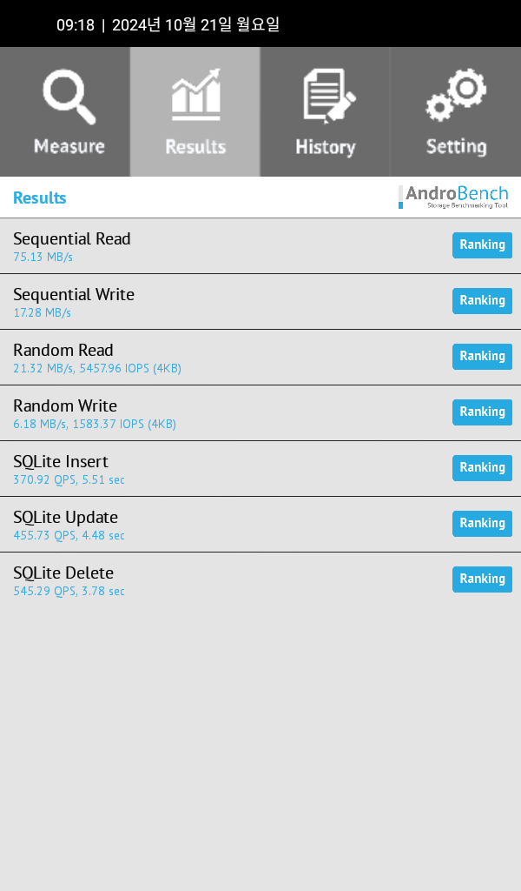
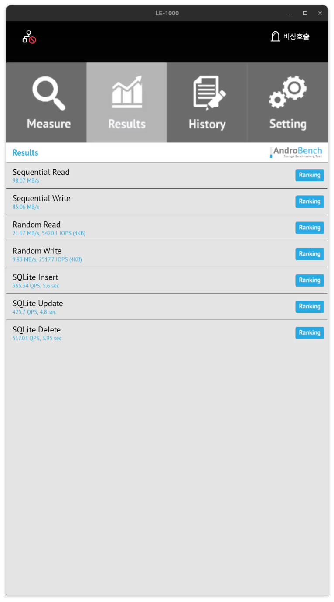

FILESYSTEM
====

<br/>
<br/>
<br/>
<br/>
<hr>

# TEST

> dd 명령어를 통해 filesystem 시험 진행

```bash
#!/system/bin/sh

# remove test data
rm -f /data/local/2g
sync

# 
sleep 30s

# write test
busybox dd if=/dev/zero of=/data/local/2g bs=4k count=512k

##
# Dirty 항목은 disk에 기록해야할 페이지 크기
# 이 값은 아직 디스크에 기록되지 않은 데이터를 포함하는 메모리 페이지의 총 크기
#
# Dirty page : 메모리에 있는 데이터가 변경되었지만, 아직 디스크에 기록되지 않은 상태.
#              이러한 페이지는 나중에 디스크에 기록되어야 하며, 이를 통해 데이터의 일관성을 유지
#
# Writeback : 페이지가 디스크에 기록되는 과정을 나타냄. 이 값은 현재 디스크에 기록중인 페이지의 크기를 나타냄.
# Dirty 페이지의 크기가 크면 시스템 성능에 영향을 미칠수 있다. 이는 Disk I/O작업이 증가하여 시스템의 응답속도가 느려질 수 있다.
# 시스템 관리자는 Dirty Page크기를 제어 가능 
cat /proc/meminfo | grep 'Dirty' -A 1

time sync

echo 3 > /proc/sys/vm/drop_caches

```

<br/>
<br/>
<br/>
<br/>
<hr>

# Quality improvement task


target : 5th generation platform
개선 항목 : Storage Read/Write 안정성 개선
개선 방법 : 
1) 플래시 메모리전용 파일시스템(F2FS) 적용
2) 메모리 Clock 등 세부 Parameter 최적화

기대 효과 : 제품 안정성 강화
1) F2FS FileSystem Before & After 벤치마크 비교
2) 기존 4세대 제품 대비 생산 단가 비교


<br/>
<br/>
<br/>
<hr>

## 1. 배경   

 안드로이드 시스템에서 파일 시스템을 선택하는 것은 시스템 성능, 안정성, 데이터 보존, 그리고 사용자 경험에 큰 영향을 미칩니다.  
 파일 시스템은 데이터 저장과 관리의 핵심적인 역할을 하며, 선택된 파일 시스템에 따라 디바이스의 성능과 수명이 달라 질 수 있습니다.  
 특히, 안드로이드는 플래시 메모리 기반 스토리지를 주로 사용하기 때문에, 파일 시스템 선택은 더욱 중요합니다.   

<br/>
<br/>
<br/>
<hr>

## 2. 안드로이드 시스템에서 파일 시스템 선정의 중요성  

<br/>
<br/>
<hr>

### 2.1. 성능 최적화  
파일 시스템은 디바이스의 읽기/쓰기 성능에 직접적인 영향을 미칩니다.  

 - 앱 실행 속도:  
 앱 데이터와 캐시의 읽기/쓰기 속도가 빠르면, 앱 실행 속도와 반응성이 향상 됩니다.

 - 부팅 시간 단축:  
 부팅 시 초기화 과정에서 파일 시스템이 데이터를 효율적으로 처리하면, 디바이스 부팅 시간이 줄어듭니다.  
 
 - 대용량 데이터 처리:  
 멀티미디어 파일(예: 동영상, 사진)이나 데이터베이스 처리 속도가 파일 시스템 성능에 크게 좌우됩니다.  

<br/>
<br/>
<hr>

### 2.2. 스토리지 수명 연장
안드로이드 디바이스는 대부분 플래시 메모리 기반 스토리지(예, eMMC, UFS)를 사용합니다.  
플래시 메모리는 쓰기/삭제 작업에 한계가 있어, 파일시스템이 스토리지의 수명에 중요한 역할을 합니다.

 - 웨어 레벨링:  
 특정 영역에 쓰기 작업이 집중되지 않도록 데이터를 고르게 분산하여 플래시 메모리의 마모를 줄입니다.  

 - 가비지 컬렉션 최적화:  
 불필요한 데이터를 효율적으로 정리하여 쓰기 성능을 유지하고, 스토리지의 사용 가능한 공간을 확보합니다.  

 - 쓰기 최소화:  
 플래시 메모리의 쓰기 횟수를 줄이는 파일 시스템은 스토리지의 내구성을 높이고 수명을 연장합니다.  

<br/>
<br/>
<hr>

### 2.3. 데이터 안정성과 복구
안드로이드 디바이스는 앱, 사용자 데이터, 시스템 데이터를 저장하기 때문에, 데이터 손상 방지가 중요합니다.  

 - 저널링:  
 전력 손실, 시스템 크래시 등의 상황에서도 데이터 무결성을 유지합니다.  

 - 파일 시스템 복구:  
 파일 시스템이 손상되었을 경우, 빠르고 안정적으로 복구할 수 있어야 합니다.  
 
 - 데이터 일관성:  
 파일 시스템은 데이터 저장 작업 중 문제가 발생하더라도, 데이터의 일관성을 보장해야 합니다.  

<br/>
<br/>
<hr>

### 2.4. 시스템 호환성  
파일 시스템은 안드로이드 운영 체제와 호환성이 중요합니다. 

 - 안드로이드 OS 지원:
 선택된 파일 시스템이 안드로이드의 파일 시스템 인터페이스(VFS)와 호환되며, 시스템에서 안정적으로 작동해야 합니다.  
 
 - 멀티미디어 및 외부 디바이스 지원  
 exFAT와 같은 파일시스템은 외장 스토리지에서 널리 사용되며, 대용량 파일 지원 및 호환성이 뛰어납니다.  

<br/>
<br/>
<hr>

### 2.5. 사용 사례에 따른 최적화  
 - 임베디드 시스템:   
 디바이스의 작동 환경(예: 월패드,로비 장치)에서 안정성과 내구성이 강조됩니다. 

 - 대용량 멀티미디어:  
 사진,동영상,음악과 같은 대용량 데이터를 효율적으로 관리 할 수 있는 파일 시스템이 필요합니다.  

<br/>
<br/>
<hr>

### 2.6. 시스템 전력 효율성  
 파일 시스템의 설계는 전력 소비에도 영향을 미칩니다.  

 - 쓰기 작업 최적화:  
 파일 시스템이 데이터를 효율적으로 관리하면, 불필요한 쓰기 작업을 줄이고 전력 소비를 감소시킬 수 있습니다.   

 - 가비지 컬렉션 효율화:  
 F2FS와 같은 파일시스템은 불필요한 가비지 컬렉션 작업을 최소화하여 전력 소비를 줄입니다.  

<br/>
<br/>
<br/>
<hr>

## 3. 파일시스템 F2FS, EXT4 소개

<br/>
<br/>
<hr>

### 3.1. 개요

 - EXT4 
 EXT4 (Fourth Extended File System)는 리눅스 기반 시스템에서 널리 사용되는 파일 시스템으로, 저널링, 성능, 안정성이 특징입니다.

 - F2FS
 F2FS(Flash-Friendly File System)은 플래시 기반 저장소에서의 성능 최적화를 위해 설계된 파일 시스템 입니다.

<br/>
<br/>
<hr>

### 3.2. 기본 설계
 
 - EXT4   
   * 저널링 파일 시스템으로, 쓰기 성능과 데이터 안정성을 보장합니다.  
   * 블록 크기(Block size)는 4KB, 8KB, 16KB 등을 지원하며, 파일 시스템 크기는 최대 1EB까지 지원합니다.  
   * 쓰기 오버헤드가 있을 수 있지만, 안정성 측면에서 뛰어난 성능을 자랑합니다.  
   * 주로 HDD 및 eMMC 와 같은 전통적인 스토리지에서 사용됩니다.  

 - F2FS  
   * 플래시 메모리 최적화에 중점을 둔 파일 시스템으로, 쓰기 성능 최적화 및 플래시 메모리 수명 연장을 목표로 합니다.  
   * 메모리 매핑 파일 I/O 및 여러 블록 관리를 통해 플래시 메모리의 특성을 반영합니다.  
   * 고정 크기 블록 및 쓰기 횟수 최소화 전략을 채택하여, NAND 플래시에서 성능을 극대화합니다.  

<br/>
<br/>
<hr>

### 3.3. 성능 비교

 - 쓰기 성능:
   * EXT4 : 일반적인 저장 장치에서 안정성과 성능의 균형을 맞추며, 빠른 읽기 성능을 자랑하지만, 쓰기 작업에서 오버헤드가 발생할 수 있습니다.  
   * F2FS : 플래시 메모리에 최적화 되어 있어 쓰기 성능이 매우 뛰어나며, NAND 플래시의 특성을 반영해 쓰기를 효율적으로 최적화합니다. 또한 쓰기에 관련된 오버헤드가 낮습니다.  

 - 읽기 성능:
   * EXT4 : 읽기 성능이 우수하며, 쓰기보다는 읽기 작업에서 최고 성능을 발휘합니다.  
   * F2FS : 쓰기 성능 최적화가 주목적이므로, 읽기 성능은 EXT4와 비슷하거나 다소 낮을 수 있습니다.  

 - 스냅샷 및 복구:
   * EXT4 : 저널링 기능 덕분에 파일 시스템 손상 시 빠른 복구가 가능하지만, 일부 데이터 손실이 발생 할 수 있습니다.  
   * F2FS : 쓰기 최적화 덕분에 안정성이 뛰어나지만, EXT4보다 복구 성능은 다소 떨어질 수 있습니다.    


<br/>
<br/>
<hr>

### 3.4. 내구성 및 수명

 - EXT4 : 
   * 저널링을 사용하며, 쓰기 작업 중에 시스템 장애가 발생하더라도 데이터 손실을 최소화합니다.  
   * 그러나 플래시 메모리에서는 쓰기 횟수가 제한적이기 때문에, 과도한 쓰기 작업이 플래시 수명에 영향을 미칠 수 있습니다.  
 - F2FS ;   
   * 플래시 메모리 최적화 덕분에 내구성과 수명이 향상됩니다. 쓰기 작업을 최적화하고 수명 연장을 위한 여러 기능을 제공합니다.  
   * F2FS는 플래시 메모리에 특화된 가비지 컬렉션 및 웨어 레벨링 기능을 지원하며, 쓰기 횟수를 효율적으로 분산시킵니다.  

<br/>
<br/>
<hr>

### 3.5. 사용 사례

 - EXT4 : 
   * 주로 HDD나, eMMC 기반 시스템에서 널리 사용됩니다. 
   * 안정성, 호환성, 성능 면에서 일반적인 리눅스 시스템이나 임베디드 시스템에 적합합니다. 
   * 산업용 시스템, 서버, 노트북 등에서 사용됩니다.
 - F2FS : 
   * NAND 플래시 및 eMMC, UFS와 같ㅇ느 플래시 기반 저장소에서 가장 잘 동작합니다. 
   * 특히 안드로이드와 스마트폰에서 뛰어난 성능을 제공합니다.
   * 플래시 메모리 기반의 내구성과 쓰기 성능 최적화가 필요한 모바일 기기, 임베디드 시스템 등에 적합합니다.

<br/>
<br/>
<hr>

### 3.6. 장단점 비교

| **특성**        | **EXT4**                                  | **F2FS**                                       |
|-----------------|-------------------------------------------|------------------------------------------------|
| **성능**        | 일반적인 스토리지에서 우수한 성능을 발휘. | 플래시 메모리에 최적화된 뛰어난 쓰기 성능.     |
| **안정성**      | 저널링 기능으로 빠른 복구, 안정성 우수.   | 쓰기 최적화에 집중, 플래시 메모리 내구성 개선. |
| **내구성**      | 플래시 메모리에서는 다소 제한적.          | 플래시 메모리에 최적화되어 내구성 우수.        |
| **호환성**      | 대부분의 리눅스 시스템에서 널리 사용.     | 리눅스와 안드로이드에서만 사용, 호환성 제한.   |
| **구현 복잡도** | 구현이 간단하고, 설정이 용이.             | 플래시 최적화 및 설정이 복잡할 수 있음.        |
| **최적화**      | HDD, eMMC에서 뛰어난 성능.                | 플래시 메모리에서 뛰어난 성능.                 |


<br/>
<br/>
<hr>

### 3.7. 결론

 - F2FS는 플래시 메모리 기반 시스템에서 성능을 극대화하고 내구성을 향상시키기 위해 설계된 파일 시스템입니다.   
 - 쓰기 성능 최적화와 플래시 메모리 수명 연장을 목표로 하며, 특히 안드로이드와 같은 디바이스에서 뛰어난 성능을 발휘합니다.  
 - 가비지 컬렉션, 웨어 레벨링, 쓰기 효율성 등의 기능을 통해 플래시 메모리 환경에서 탁월한 성능을 제공합니다.  
 - EXT4는 안정성과 호환성이 우수한 전통적인 파일 시스템으로, 다양한 환경에서 안정적인 성능을 제공합니다.  
 - 하지만 플래시 메모리에서의 쓰기 최적화 및 내구성 면에서는 F2FS보다 뒤떨어질 수 있습니다.

<br/>
<br/>
<hr>

### 3.8. 최종 평가

 - 안드로이드 시스템에서 F2FS는 플래시 메모리의 특성을 적극 활용하여, 쓰기 성능, 내구성, 시스템 응답성을 최적화하는데 탁월한 파일 시스템입니다.  
 - 배터리 없이 항상 전원이 공급되는 시스템이나 모바일 기기에서 F2FS는 시스템 성능과 스토리지 수명을 극대화 할 수 있는 강력한 선택입니다.  
 - 플래시 메모리를 사용하는 안드로이드 월패드 제품에서는 F2FS 가 가장 적합한 파일 시스템으로 추천됩니다.

### 3.8.1 파일 시스템 구성
 안드로이드 시스템에서 파일시스템의 특성과 해당 파티션의 사용 목적에 따라   
 system. vendor, odm, cache, metadata 파티션은 EXT4 파일시스템을 사용하고,   
 userdata 파티션은 F2FS 파일시스템을 사용하도록 구성했습니다.  

 각 파일 시스템의 사용 이유는 아래와 같습니다.   

 - ext4 파일시스템 마운트
 안정성과 무결성이 중요한 파티션에 적용하여 사용됩니다.  
   * system : 운영 체제의 핵심 파일과 바이너리가 저장되는 파티션입니다. 안전성과 무결성이 중요합니다.  
   * vendor : 하드웨어 관련 바이너리와 드라이버가 저장되는 파티션입니다. 안정성과 무결성이 중요합니다.  
   * odm : OEM에서 제공하는 드라이버와 설정 파일이 저장되는 파티션입니다. 안정성과 무결성이 중요합니다.  
   * cache : 시스템 업데이트와 어플리케이션 캐시가 저장되는 파티션입니다. 빠른 읽기/쓰기 성능이 중요합니다.  
   * metadata : 메타데이터와 설정 파일이 저장되는 파티션입니다. 안정성과 무결성이 중요합니다.  

 - f2fs 파일시스템 마운트
 읽기/쓰기 성능과 효율적인 공간 관리가 중요한 파티션에 적용하여 사용됩니다.  
   * userdata : 사용자 데이터와 애플리케이션 데이터가 저장되는 파티션입니다. 빠른 읽기/쓰기 성능과 효율적인 공간 관리가 중요합니다.  

<br/>
<br/>
<br/>
<hr>

## 4. 스토리지 인터페이스 속도 개선:Legacy Mode에서 HS200 으로 변경
 스토리지 인터페이스 속도를 기존 Legacy Mode(50MB/s) 에서 HS200(200MB/s)으로 업그레이드하여 데이터 전송 속도와 제품 생산성이 크게 향상되었습니다. 

<br/>
<br/>
<hr>

### 4.1 개선 사항

 - 인터페이스 업그레이드 :
   * 기존 : legacy mode(50 MB/s)
   * 변경 : HS200 (200 MB/s)

 - HS200의 주요 특징:
   * 최대 200MB/s 데이터 전송 속도
   * 낮은 전력 소비로 효율성 향상
   * 고속 데이터 처리를 위한 최적화된 신호 타이밍

<br/>
<br/>
<br/>
<hr>

## 5. 기대효과

<br/>
<br/>
<hr>

### 5.1 스토리지 벤치마크

> 아래 툴을 사용하여 스토리지 성능을 검증합니다.

 Androidbench : 안드로이드 디바이스에서 스토리지 성능을 측정하고, 분석할수 있는 벤치마크 툴을 사용하여, 
 디바이스의 스토리지의  읽기/쓰기 속도와 같은 성능 지표를 제공 해주는 툴.

| **특성**                                                   | **EXT4**                                                                    | **F2FS**                                                                | **기능**                                                                                                                                                                                                                                                              |
|------------------------------------------------------------|-----------------------------------------------------------------------------|-------------------------------------------------------------------------|-----------------------------------------------------------------------------------------------------------------------------------------------------------------------------------------------------------------------------------------------------------------------|
| **순차 읽기 테스트**                                       | 75.13 MB/s                                                                  | 98.07 MB/s                                                              | 설명: 대용량 데이터를 연속적으로 읽고 쓰는 속도를 측정합니다. <br/> 용도: 앱 설치 및 실행 속도, 큰 파일 복사/이동 성능 측정에 적합                                                                                                                                    |
| **순차 쓰기 테스트**                                       | 17.28 MB/s                                                                  | 85.06 MB/s                                                              | 설명: 대용량 데이터를 연속적으로 읽고 쓰는 속도를 측정합니다. <br/> 용도: 앱 설치 및 실행 속도, 큰 파일 복사/이동 성능 측정에 적합                                                                                                                                    |
| **랜덤 읽기 테스트**                                       | 21.32 MB/s, 5457.96 IOPS(4KB)                                               | 21.17 MB/s, 5420.1 IOPS (4KB)                                           | 설명: 여러 작은 파일을 무작위 위치에서 읽고 쓰는 속도를 측정합니다. <br/> 용도: 데이터베이스 작업, 작은 파일 처리 성능 분석.                                                                                                                                          |
| **랜덤 쓰기 테스트**                                       | 6.18 MB/s, 1583.37 IOBS(4KB)                                                | 9.83 MB/s, 2517.7 IOPS (4KB)                                            | 설명: 여러 작은 파일을 무작위 위치에서 읽고 쓰는 속도를 측정합니다. <br/> 용도: 데이터베이스 작업, 작은 파일 처리 성능 분석.                                                                                                                                          |
| **SQLite 데이터베이스 성능 테스트 (Insert,Update,Delete)** | 370.92 QPS, 5.51 sec <br/> 455.73 QPS, 4.48 sec <br/> 545.29 QPS, 3.78 sec  | 365.7 QPS, 5.6 sec <br/> 425.7 QPS, 4.8 sec <br/> 517.03 QPS, 3.95 sec  | SQLite 데이터베이스 성능 테스트 <br/> 설명: 디바이스의 SQLite 데이터베이스 관련 작업 성능을 측정. <br/> Insert: 데이터 삽입 성능. <br/> Update: 데이터 업데이트 성능. <br/> Delete: 데이터 삭제 성능. <br/> 용도: 데이터베이스를 자주 사용하는 앱의 성능 최적화 분석. |



  


<br/>
<br/>
<hr>

### 5.2 생산성 향상

 파일시스템 변경(F2FS)와 스토리지 인터페이스 개선(HS200)을 통해 기존 생산 공정에서 발생하던 병목 현상을 해소하고, 안드로이드 제품의 이미지 다운로드 및 데이터 처리 속도를 크게 향상 시켰습니다. 

 - 생산 공정 시간 단축
 
   * 기대효과
     생산 비용 절감, 제품 품질 향상. 

  
