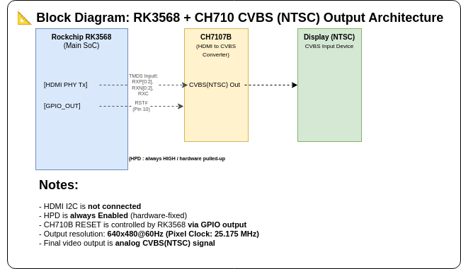
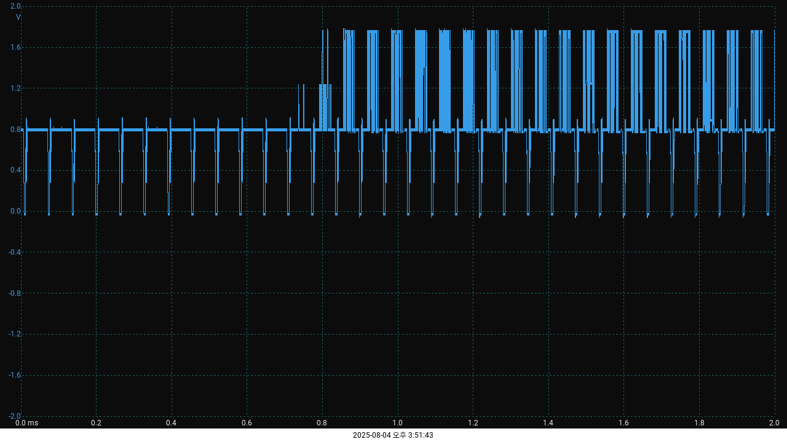
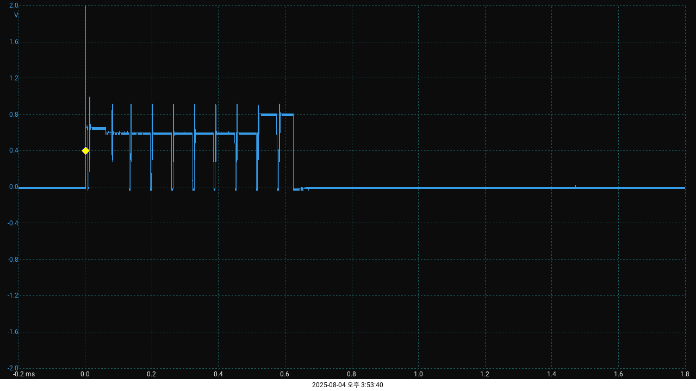

# HDMI2CVBS issue

📌 CH7107B-BF 동작 관련 이슈 요약  
대상 제품: RK3568 + CH7107B-BF 기반 HDMI → CVBS 변환 회로 사용 장비  
출력 형식: 640x480 @ 60Hz → NTSC CVBS 출력 (GPIO1 핀으로 NTSC 모드 설정)  

  
✅ 정상 동작 시  
제품 부팅 후 HDMI 상태는 "connected"로 인식  
TMDS 신호 송신 정상  
CH7107B에서 **DAC 출력 핀(CVBS)**을 통해 안정적인 NTSC 영상 출력  
  
- ROCKCHIP: RK3568B2 / NEBM9H142 2503 / Q03D448 000

  
❌ 이슈 증상 (Bad 모듈)  
CVBS 출력이 지연되거나 아예 출력되지 않음  
RESET 제어 후에도 출력이 중단되거나 짧게 출력되다 사라짐  
오실로스코프 상에서도 출력 파형이 불안정하거나 일정 시간 후에 발생  
동일 조건에서 정상 모듈은 항상 안정적인 출력이 유지됨  
  
- ROCKCHIP: RK3568B2 / NEBM3P746 / 2405 / P05A168 000
  
🔍 추정 원인  
CH7107B 내부 PLL Lock 타이밍 문제 또는 초기화 불완전  
RESET 타이밍 또는 전원 시퀀스 조건에 따른 초기화 실패 가능성  
I2C 제어 미사용으로 내부 상태 확인이 어려운 구조  
  
📥 현재 진행 상황  
회로 구성 및 파형 분석 자료 준비 완료  
I2C 디버깅을 위한 CH7107B Register Map 포함된 Datasheet 요청 중  
