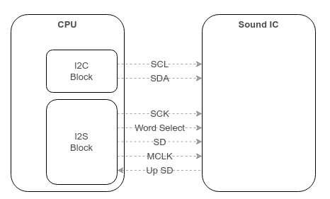
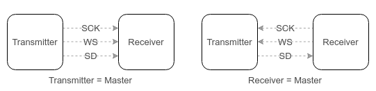
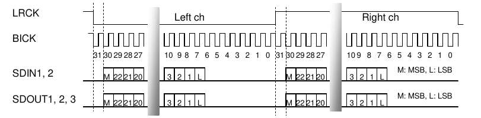

I2S interface 
=====

<br/>
<br/>
<br/>
<br/>
<hr>

# 1. I2S

 - I2S : Inter-IC Sound, Intergrated Interchip Sound

	 

<br/>
<br/>
<br/>
<br/>
<hr>

# 2. network 구성

 - I2S는 버스 구조를 갖기 때문에 여러 대의 장치와 연결이 될 수 있다. 
 - 오디오 신호를 전송하는 기기(트랜스미터)와 오디오 신호를 수신하는 기기(리시버)외에 마스터 클럭을 제공하는 기기(컨트롤러)가 연결될 수 있다.  
  (추가로 마이크장치가 버스에 연결될 수 있다.)

	

 - 3개의 라인으로 구성된다.
   * clock 라인 : SCK(Serial Clock), 또는 BCLK(Bit Clock)으로 표시. (ex. I2S_BCLK)
     동기식 통신에서 사용되는 클럭.
   * L/R 채널 라인 : 오디오의 왼쪽 채널과 오른쪽 채널을 구분할 수 있는 좌우 채널 선택 클럭 라인으로 LRCK(Left Right Clock), 또는 FS(Frame select), WS(Word Select)라고 표시. (ex. I2S_LRCK)
     좌우 채널은 일정한 주기로 반복이 되기 때문에 클럭으로 표기하기도 한다.
   * 시리얼 데이터 라인 : SD(Sound Data, Serial Data), SDATA, SDINT, SDOUT으로 표시. (ex. I2S_DAI, I2S_DAO)

   추가로 I2S 규격에는 포함되어 있지 않지만, 실제 제품에서 흔히 사용되는 네번째 라인이 있다.
   * 마스터 클럭 : 좌우 채널 선택 클럭(LRCK)의 256 배에 해당하는 클럭을 사용한다.   
     오디오 코덱은 이 신호에 동기화 하여 작동된다. 별도로 외부에 클럭 발생 장치를 사용하는 이유는 오디오 라는 특수성 때문이다.  
	 오디오 데이터는 끊김이 없이 일정한 속도로 흘러가야 하며, 그렇지 못하면 스피커를 통하여 재생되는 중 소리가 끊기거나 튀는 소리 등 비정상적인 소리가 발생한다.   
	 이러한 이유로 시스템 내부의 모든 부품이 일사 분란하게 동작되어야 한다.  

<br/>
<br/>
<br/>
<br/>
<hr>

# 3. 데이터 전송 속도
 - 일반적으로 데이터를 전송하는 UART, I2C, SPI 와 달리 오디오 데이터를 전송하는 I2S는 전송하는 데이터에 따라서 데이터의 전송 속도가 정해진다.  
   예를들어, 디지털 오디오 데이터가 고음질이라면 초당 전송해야 하는 데이터 양이 많아질 것이고, 그렇다면 전송 속도를 올려야한다.  
   이러한 현상은 데이터의 전송과 스피커를 통한 출력의 동기화되어야 하기 때문에 발생된다.   
   아무리 빨리 데이터를 보낼 수 있다고 하더라도 한번에 스피커로 출력되는 데이터의 양은 이미 정해져 있기 때문이다.   

  - 구체적으로 데이터의 전송속도를 결정 짓는 디지털 오디오의 특성은 다음 두가지 요소가 중요하다.
    샘플링 레이트(sampling rate), 	비트 깊이(bit depth)

    * **샘플링 레이트**  
		*아날로그 신호를 디지털 신호로 변환하기 위해서는 일정한 주기로 신호의 크기를 측정하는 표본화(sampling)작업*을 한다.   
		**이러한 표본화 작업을 초당 몇번 수행하는지를 나타내는 척도가 샘플링 레이트**이다.  
		샘플링 레이트는 임의의 값을 가질수 있으나, 일반적으로 사용되는 값들이 있는데 그중에서도  8kHz, 44.1kHz, 44kHz등이 대표적으로 사용된다.   
  

		| **샘플링 레이트 ** 	| **이용 **                                                                                                                                                                                                                                    	|
		|--------------------	|----------------------------------------------------------------------------------------------------------------------------------------------------------------------------------------------------------------------------------------------	|
		| 8,000 Hz           	| 표준 전화, 암호화된 워키토키, 무선 인터콤, 무선 마이크로폰 전송에 사용.                                                                                                                                                                      	|
		| 11,025 Hz          	| 서브우퍼 대역 주파수 오디오 분석을 위한 MPEG 오디오, 낮은 품질의 PCM에 사용됨.                                                                                                                                                               	|
		| 16,000 Hz          	| VoIP에서 사용(대역폭이 충분한 경우)                                                                                                                                                                                                          	|
		| 22,050 Hz          	| 낮은 품질의 PCM과 MPEG 오디오, 그리고 낮은 주파수 에너지의 오디오 분석을 위해 사용됨.                                                                                                                                                        	|
		| 32,000 Hz          	| 미니DV 디지털 비디오캠코더, 고품질 디지털무선 마이크로폰 등 CD 수준의 품질이 요구되지 않은 경우에 일반적으로 사용됨. 1980년대 FM 라디오에서 사용됨(영국과 일본).                                                                             	|
		| 37,800 Hz          	| CD-XA 오디오                                                                                                                                                                                                                                 	|
		| 44,056 Hz          	| NTSC를 위한 디지털 오디오에 사용.                                                                                                                                                                                                            	|
		| 44,100 Hz          	| 오디오 CD, MPEG-1 오디오(VCD, SVCD, MP3)에서 사용됨. 믹서, 이퀄라이저, 압축기, 리버브, 크로스오버, 녹음 장치, CD 품질 암호화 무선 마이크로폰에서 사용됨                                                                                      	|
		| 47,250 Hz          	| 닛폰 컬럼비아가 개발한 세계 첫 상용 PCM 소리 녹음기에 사용                                                                                                                                                                                   	|
		| 48,000 Hz          	| 테입 레코더, 비디오 서버, 비전 믹서 등 전문 디지털 영상 장비에 사용되는 표준 오디오 샘플링 레이트. 이 샘플링 레이트는 22 kHz 주파수 응답으로 전송할 수 있으며 25, 30, 24 FPS와 마찬가지로 29.97 FPS NTSC 영상으로 작동하기 때문에 채택된다.  	|
		| 50,000 Hz          	| 3M과 사운드스트림에서 70년대 후반의 첫 상용 디지털 오디오 녹음기.                                                                                                                                                                            	|
		| 50,400 Hz          	| 미쓰비시 X-80 디지털 오디오 녹음기가 사용하는 샘플링 레이트.                                                                                                                                                                                 	|
		| 88,200 Hz          	| CD를 위해 사용할 때에 몇몇 전문 녹음 장비가 사용하는 샘플링 레이트.                                                                                                                                                                          	|
		| 96,000 Hz          	| DVD-Audio, 몇몇 LPCM DVD 트랙, 블루레이 디스크 오디오 트랙, HD DVD 오디오 트랙. 대부분의 전문 오디오 장비는 믹서, 이퀄라이저, 압축기, 리버브, 크로스오버, 녹음 장치에서 사용.                                                                	|
		| 176,400 Hz         	| CD 제작을 위한 HDCD 녹음기와 다른 전문 소프트웨어에 사용되는 샘플링 레이트.                                                                                                                                                                  	|
		| 192,000 Hz         	| DVD 오디오, 몇몇 LPCM DVD 트랙, 블루레이 디스크 오디오 트랙, HD DVD 오디오 트랙, HD 오디오 녹음 기기 및 오디오 편집 소프트웨어.                                                                                                              	|
		| 352,800 Hz         	| 1비트 DSD가 편집에 적합하므로 수퍼 오디오 CD를 기록하고 편집하는데 사용                                                                                                                                                                      	|
		| 2,822,400 Hz       	| SACD(Super Audio CD)에서 사용됨.주파수 범위 20 Hz – 50 kHz를 지원.                                                                                                                                                                           	|
  
  
	* **비트 깊이(bit depth)**  
	   디지털 오디오의 중요한 속성은 비트 깊이(bit depth)이다.   
	   샘플링 레이트에 따라서 얻어진 신호의 크기를 몇 비트로 표현할 것인가를 나타낸다.  
	   흔히 이를 양자화(Quantization)라고 한다.  
	   보다 많은 비트를 사용해서 표현할수록 더 섬세한 신호의 크기를 표현할 수 있다.   
	   극단적인 경우에는 한비트로 신호가 있고 없고를 나타낼 수 있다.   
	   일반적으로 많이 사용되는 비트 깊이는 8비트, 16비트, 24비트 등이다.  
	   CD는 16비트를 사용하고, DVD-Audio는 16,20,24비트를 사용할 수있다.  

	* **비트 레이트(bit rate)**  
	   초당 전송되는 데이터 양. 
	   직접적으로 표현하면 1초당 전송되는 비트 수.(비트 레이트;bit rate 가 나올수 있는 것은 오디오 압축 기술이 나오면서 가능하게 됨) 
	   보통 192Kbps, 128Kbps, 56Kbps 등을 사용한다. 

 - **I2S는 오디오 신호를 전송하는 것으로 스피커를 통해서 소리가 출력되는 속도와 동일한 속도로 데이터의 전송이 이루어져야 한다.**

 - cd를 예를 들어 설명하면, CD의 샘플링 레이트가 44.1kHz이므로, 초당 44100번의 샘플링이 있으며,   
   샘플링된 신호는 16비트로 양자화된다.   
   1초에 전송해야할 데이터는 44100 x 16 = 705,600 비트 이다. (모노)  
   만약 스테레오의 경우, 왼쪽과 오른쪽 마이크를 통해서 샘플링 된 신호가 각각 존재하므로,   
   1초에 전송해야 할 데이터는 모노의 2배가 된다.    
   44100 x 16 x 2 = 1,411,200 비트가 된다. 즉, CD음원을 전송하는 경우, I2S의 데이터 전송 속도는   
   1.411 Mbits/s가 된다.   
   이런식으로 전송하는 오디오 음원의 제작 방법에 따라서 I2S의 데이터 전송속도가 달라진다.  

  - 샘플 파일 정보
    * 파일명 : richgold.mp3
    	재생시간 : 4 분 59 초(299초)
    	비트레이트 :56 Kbps(CBR)
    	채널수 : 2 ch
    	비트 : 16 bit
    	샘플레이트 :22,050 Hz
	    크기 : 2,094,939 Byte

	* 파일명 : richgold.pcm 
	    크기 : 26,394,624 Byte

	* 계산 방법
		파일 크기 = 재생시간 * 비트레이트 / 8 (8로 나눈 이유는 bit 에서 Byte 변환)
		ex. 299 * 56,000 / 8 = 2,093,000 (Byte)   (실제 값과 차이나는 이유는 재생시간 1초 이하를 고려하지 않았고, MP3의 태그와 헤더정보를 고려하지 않음)

    * PCM 데이터 처리량
	    초당 데이터 량 = 샘플링 레이트 * 채널수 * 비트(비트 깊이)
	      705,600(bit) = 22,050        * 2      * 16

	     즉, 약 705 Kbps가 된다. 이 값이 PCM 에서 처리되는 데이터 양이다. 그러나 MP3 로 압축되면서 705 Kbps 값이 56 Kbps 값으로 약 12 배 차이가 난다.

	* PCM 파일 크기 계산
	    PCM 파일 계산에는 비트 레이트가 없다. PCM 자체에 모든 데이터를 저장하고 있기 때문. 
		즉, PCM데이터 처리량을 이용해서 구하면 된다.

		PCM 파일 크기 = PCM 데이터 처리량 * 재생시간 / 8 (8로 나눈 이유는 bit 에서 Byte 변환)
		26,371,800 (Byte) = 705,600       * 299      / 8


# 4. 데이터 전송

 - 데이터 전송을 위해서는 3개의 라인을 통해서 동기화된 출력이 필요하다.
   * 첫째는 클럭 신호를 통해서 오디오 데이터의 송신기와 수신기가 데이터를 주고 받기 위한 동기화를 하게 된다.  
	 클럭은 32kHz, 44.1kHz, 48kHz 또는 이들의 배수에 해당하는 값을 사용한다.  
	 이유는 전송되는 데이터가 오디오이므로 스피커를 통해서 출력하는 속도와 같아야 한다.  
   * 두번째는 오디오가 스테레오의 경우라면, 좌/우 채널 선택을 해주어야 한다.  
     즉, 현재 전송하고자 하는 오디오 신호가 왼쪽 채널인지, 오른쪽 채널인지 리시버에게 전달해 주어야 한다.  
	 그래야만 리시버는 자신에게 연결되어 있는 2개의 스피커 중 올바른 쪽으로 소리를 출력할 수 있다.  
	 구체적으로 트랜스미터는 좌/우 채널 선택 클럭신호를 low신호로 바꾸고 왼쪽 채널 신호를 전송한다.   
	 그다음 좌/우 채널 선택 신호를 high로 바꾸고 오른쪽 채널 신호를 전송한다.  
     좌/우 채널 선택은 일정한 주기로 반복된다.  
   * 세번째는 오디오 데이터를 전송한다.  
	 오디오 데이터의 길이는 비트 깊이(bit depth)에 따라 다르다.  
	 데이터의 길이는 28비트까지 조정이 가능하다.   
	 아래의 그림은 22비트 길이의 경우를 예시로 하고 있다.  

	 

 - 데이터 프레임  
   I2S는 오디오 데이터의 전송이 목적이기 때문에 데이터 프레임이란 다름 아닌 오디오 데이터를 담기 위한 포맷이며, 왼쪽과 오른쪽 채널이 있으나 데이터의 포맷은 동일하다.  


# 5. Android 에서 I2S

 - 아래 코드는 안드로이드에서 I2S 통신을 위한 설정 부분이다.
```java
private static final AudioFormat AUDIO_FORMAT_STEREO = 
	new AudioFormat.Builder()

.setChannelMask(AudioFormat.CHANNEL_IN_STEREO)	// 2 channels
.setEncoding(AudioFormat.ENCODING_PCM_16BIT)	// 16-bit samples
.setSampleRate(44100)							// 44.1kHz
.build();
```


# 6. Memo

 - 샘플링 레이트와 비트 레이트
   * I2S의 데이터 전송 속도를 설명하며, 샘플링 레이트를 이용해서 초당 전송되는 데이터 양, 즉 비트 레이트를 구했다.  
     CD의 경우, 44.1kHz의 샘플링레이트일 경우, 1.411 mbps 의 비트 레이트가 나오는 것을 확인했다. (44100 x 16 x 2 = 1411200)  
     이 수식에는 중요한 단서가 있는데 이것은 압축되지 않은 음원 이라는 것이다. 따라서 샘플링에서 만들어 낸 비트 수 만큼 스피커로 전송을 하게 되고,   
     샘플링 레이트와 비트 레이트는 배수의 관계를 갖게 된다.  
  
 - MP3와 I2S 관계  
   * MP3는 I2S를 통해서 직접 전송이 될 수 없다. I2S는 PCM데이터, 즉 압축되지 않은 오디오 데이터만을 전송한다.  
     따라서 MP3는 CPU에 의해서 메모리에서 PCM데이터 형태로 변환이 된 후에 I2S를 통해서 스피커로 전송되게 된다.  

 - test : rate(16000), format(PCM_FORMAT_S16_LE)
	 BCLK(1.024MHz), LRCK(16KHz)

 - WAV와 PCM 은 동일하지 않다. WAV는 PCM 외에 다른 인코딩 방식도 지원하고 있다. 즉, WAV가 PCM를 저장할 수 있는 포멧이다. 자체가 PCM이 아니다. 
     PCM은 순수 데이터만 저장하고 있다.  그렇기에 PCM데이터를 불러오는 경우, 샘플링 레이트, 채널 수, 비트 수를 직접 입력해야 한다. 즉 헤더 정보가 없다. 
	 PCM파일을 직접 재생할 수 있는 프로그램은 Cool Edit 을 사용하면 된다.
  
----
ref : https://m.blog.naver.com/prnbada7/221194850771
