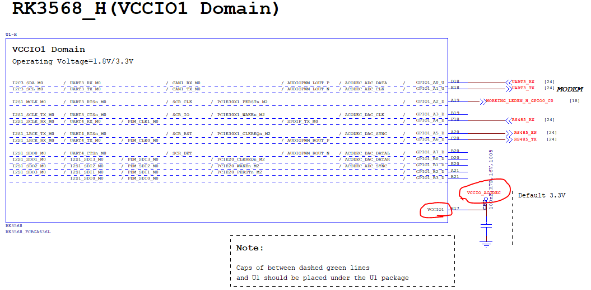

# POWER 

> RK3568 IO Power Domain Configuration Guide


 main control power domain 의 IO level은 연결된 주변 칩의 IO level과 일치해야 하며, 소프트웨어의 voltage 구성은 하드웨어 voltage와 일치해야 합니다. 

 RK3568에는 PMUIO[0:2] 및 VCCIO[1:7] 인 총 10 개의 독립적인 IO power domain이 있습니다. 

 - PMUIO0, PMUIO1 은 fixed-level power domain이며, 변경할 수 없습니다.
 - PMUIO2, VCCIO1, VCCIO[3:7] 은  power domains은 hardware supply voltage 와 맞는 software 구성이 필요합니다. 
	 1) hardware IO level이 1.8V인 경우, software voltage 세팅은 1.8V와 일치해야 합니다.
	 2) hardware IO level이 3.3V인 경우, software voltage 세팅은 3.3V와 일치해야 합니다.
 - VCCIO2 power domain 에 대한 software는 구성할 필요가 없지만 hardware power  supply device voltage은 FLASH_VOL_SEL 상태와 일치해야 합니다.
	 1) VCCIO2의 power supply이 1.8V일 때 FLASH_VOL_SEL 핀은 HIGH값을 유지되어야 합니다.
	 2) VCCIO2의 power supply이 3.3V일 때 FLASH_VOL_SEL 핀은 LOW값을 유지되어야 합니다.


## dts 정보

arch/arm64/boot/dts/rockchip/rk3568-poc.dtsi
```dtb
 /*
  * There are 10 independent IO domains in RK3566/RK3568, including PMUIO[0:2] and VCCIO[1:7].
  * 1/ PMUIO0 and PMUIO1 are fixed-level power domains which cannot be configured;
  * 2/ PMUIO2 and VCCIO1,VCCIO[3:7] domains require that their hardware power supply voltages
  *    must be consistent with the software configuration correspondingly
  *	a/ When the hardware IO level is connected to 1.8V, the software voltage configuration
  *	   should also be configured to 1.8V accordingly;
  *	b/ When the hardware IO level is connected to 3.3V, the software voltage configuration
  *	   should also be configured to 3.3V accordingly;
  * 3/ VCCIO2 voltage control selection (0xFDC20140)
  *	BIT[0]: 0x0: from GPIO_0A7 (default)
  *	BIT[0]: 0x1: from GRF
  *    Default is determined by Pin FLASH_VOL_SEL/GPIO0_A7:
  *	L:VCCIO2 must supply 3.3V
  *	H:VCCIO2 must supply 1.8V
  */
&pmu_io_domains {
	status = "okay";
	pmuio2-supply = <&vcc3v3_pmu>;
	vccio1-supply = <&vccio_acodec>;
	vccio3-supply = <&vccio_sd>;
	vccio4-supply = <&vcc_3v3>;
	vccio5-supply = <&vcc_3v3>;
	vccio6-supply = <&vcc_3v3>;
	vccio7-supply = <&vcc_3v3>;
}
```


 * **VCCIO1(vccio1-supply) 기준(example)**

	

	위 그림에서 VCCIO1의 power supply device는 vccio_acodec입니다.  
	회로도에서 vccio_acodec를 검색하면 다음 모듈을 찾을 수 있습니다.  

	  

	위의 그림에서 vccio_acodec이 RK809의 LDO4에 의해 power를 받는 다는 것을 확인 할 수 있습니다.  
	다음과 같이 software의 dts에서 LDO_REG4(LDO4)의 구성 정보를 찾습니다.  

	```dtb
	&i2c0 {
	(...)
		rk809: pmic@20 {
		(...)
			regulators {
				vccio_acodec: LDO_REG4 {
					regulator-always-on;
					regulator-boot-on;
					regulator-min-microvolt = <3300000>;
					regulator-max-microvolt = <3300000>;
					regulator-name = "vccio_acodec";
					regulator-state-mem {
						regulator-off-in-suspend;
					};
				};
			};
		(...)
		};
	};
	```


	위의 vccio_acodec를 pmu_io_domains 노드에서 vccio1-supply = <&vccio_acodec>으로 구성하여 vccio1의 voltage 를 설정했습니다.


 * **MIPI_CSI_RX_AVDD_0V9 & MIPI_CSI_RX_AVDD_1V8 기준(example)**

	 

	 위의 그림에서 MIPI_CSI_RX의 power supply device는 *VDDA0V9_IMAGE*, *VCCA1V8_IMAGE* 입니다.   
	 회로도에서 *VDDA0V9_IMAGE*, *VCCA1V8_IMAGE* 을 검색하면 다음 모듈을 찾을 수 있습니다.

	 

```dtb
&i2c0 {
	status = "okay";
	(...)

	rk809: pmic@20 {
	(...)
		regulators {
		(...)
			vdda0v9_image: LDO_REG1 {
				regulator-boot-on;
				regulator-always-on;
				regulator-min-microvolt = <900000>;
				regulator-max-microvolt = <900000>;
				regulator-name = "vdda0v9_image";
				regulator-state-mem {
					regulator-off-in-suspend;
				};
			};
		(...)
			vcca1v8_image: LDO_REG9 {
				regulator-always-on;
				regulator-boot-on;
				regulator-min-microvolt = <1800000>;
				regulator-max-microvolt = <1800000>;
				regulator-name = "vcca1v8_image";
				regulator-state-mem {
					regulator-off-in-suspend;
				};
			};
		(...)
		}
	}
```  
      
위의 **vdda0v9_image**, **vcca1v8_image** 를 pmu_io_domains 노드에서 ... 으로 구성하여 vccio1의 voltage 를 설정했습니다.
	  

<pr/>

## power management 관리

 - [ ] TSADC_SHUT_M0 : 기능 확인
 - [ ] PMIC_SLEEP : 기능 확인
 - [ ] VDD_CPU_COM(ARM core power feedback output) : 기능 확인

<pr/>

## register check 
> 부팅 후, 레지스터 값을 체크하여 voltage 디버깅

RK3568 칩은 Datasheet 에 따라서 PMU_GRF_IO_VSEL0 ~ PMU_GRP_IO_VSEL2 레지스터 주소(base addr : 0xFDC20140~0xFDC20148) 메모리를 통해 I/O 가능합니다.


| register         	| address    	| command             	| reset value 	|
|------------------	|------------	|---------------------	|-------------	|
| PMU_GRF_IO_VSEL0 	| 0xFDC20140 	| io -4 -r 0xFDC20140 	| 0x00000000  	|
| PMU_GRF_IO_VSEL1 	| 0xFDC20144 	| io -4 -r 0xFDC20144 	| 0x000000ff  	|
| PMU_GRF_IO_VSEL2 	| 0xFDC20148 	| io -4 -r 0xFDC20148 	| 0x00000030  	|
