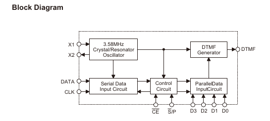
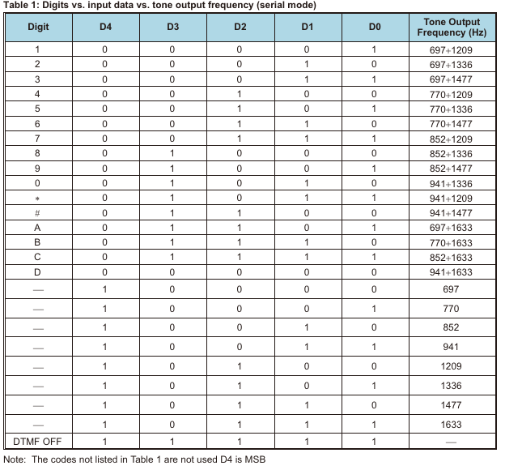
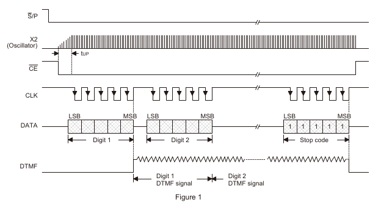

PSTN module


<br/>  
<br/>  
<br/>  
<br/>  

<hr>


- [Reference](#reference)
- [Develop Driver](#develop-driver)
	- [Interface](#interface)
- [Develop API](#develop-api)

	

<br/>  
<br/>  
<br/>  
<br/>  

<hr>

# reference

<br/>  
<br/>  
<br/>  
<br/>  

<hr>

# develop_driver

## interface

```bash
(soc)          (base)
GPIO2_D1       LINE_ON
GPIO3_D1       DTMF_DET 
GPIO3_C2       DTMF_EN      +-----------------+
GPIO3_C1       DTMF_CLK     | DTMF Generators |
GPIO3_A2       DTMF_DATA    +-----------------+

GPIO2_C6       SEL_PSTN_AUD       (talk:high)
GPIO0_A5       SEL_ECHO_PSTN_AUD  (talk:high)

(terminal side)
               TIP
               RING

(codec side)  
ECHO_LINE_OUT  PSTN_TX     +- PSTN_AUD
ECHO_LINE_IN   AUD_RX      +
```

 - GPIO3_C2 : 0xfdc60050
 - GPIO3_C1 : 0xfdc60050
 - GPIO3_A2 : 0xfec60040

```bash
// mux
$ io -4 -r -l 0x4 0xfdc60050
$ io -4 -r -l 0x4 0xfdc60040
$ io -4 -w 0xfdc60050 0x07700000 
$ io -4 -w 0xfdc60040 0x07000000 

// direction
$ io -4 -r -l 0x4 0xfe76000c
fe76000c:  00002020
//gpio3_c1 is input (1bit) 
//gpio3_c2 is input (2bit)
$ io -4 -r -l 0x4 0xfe760008 
fe760008:  00000002 
// gpio3_a2 is output (2bit)

$ io -4 -w 0xfe76000c 0x00060006
$ io -4 -w 0xfe760008 0x00040004

// value
$ io -4 -r -l 0x4 0xfe760004
fe760004:  00000020
//gpio3_c1 is low (1bit) 
//gpio3_c2 is low (2bit)
$ io -4 -r -l 0x4 0xfe760000
fe760000:  00000002
// gpio3_a2 is high (2bit)

$ io -4 -w 0xfe760004 0x00060006
$ io -4 -w 0xfe760000 0x00040004
```

 - TIP, RING 은 PSTN에서 사용되는 2개의 전선. 
   전화선 연결과 음성 통화 기능 담당. 

   * **TIP** : 전화선에서 하나의 전선으로 전화 플러그의 금속 끝 부분에 연결.
   * **RING** : 전화선에서 하나의 전선으로 TIP 뒤에 있는 금속 링에 연결. 
   
   일반적으로 전화선을 꽂을때 플러그의 TIP이 먼저 연결되고, 그 다음에 RING이 연결.  
   TIP과 RING을 A와 B로 표현하기도 함.  
  
  
## HT9200A

 serial mode 동작(parallel mode 미지원)  



```bash
 
 |--HT9200A--|        |----SOC----|
 +VDD      CE+--------+DTMF_EN    | // Chip enable, active low
 +X2      CLK+--------+DTMF_CLK   | // Data sync clock input for the serial mode
 +X1     DATA+--------+DTMF_DATA  | // Data input terminal for the serial mode
 +DTMF    VSS+        |-----------| // DTMF : output terminal of the DTMF signal
 |-----------|

```

 HT9200A는 data input, 5-bit code 및 sync clock을 사용하여 DTMF signal을 전송.
 전송될 전화번호의 모든 숫자는 5-bit data로 구성된 입력에 의해 선택됨.

 - 5-bit data 는 D0(LSB)가 첫번째로 수신받는 bit.
 - HT9200A는 clock(DTMF_CLK)의 falling edge에서 데이터를 latch 한다.
 - digital codes 와 tone output frequency 는 아래 표와 같다. (제어 타이밍 참고)
 - input clock(DTMF_CLK)는 100 kHz






```bash
// note
adb shell "echo 89 > /sys/class/gpio/export ; echo out > /sys/class/gpio/gpio89/direction ; echo 1 > /sys/class/gpio/gpio89/value"

dtmf enable > 56ms dealay > dtmf clock > 56ms dealy > dtmf clock
digit 간 간격 170 ms delay


///////////////
// AT Command

//1. 통화
// ATD <dial string>
>ATD전화번호 // Hook on 후, 전화번호 전달
>ATD // Hook on, 

//2. 통화종료
// ATH
// 통화중 call release.
AT+ATH

//3. 통화응답
// ATA
// 통화 응담
[ring event] -> 
```

### PSTN_DEV TEST

 > CLI 를 통해 시험 :

```bash

 +--------------------(pstn)-----------------------+
 |                                                 |
 |                                                 |
 +-------------------------------------------------+

 +---(dtmf tone generator)---+   +--(audio api)------------------------+
 |                           |   | WAudioManager.ROUTE_PSTN_RING       |
 |                           |   | WAudioManager.ROUTE_PSTN_DIAL	   |
 |      /dev/ttyHT0          |   | WAudioManager.ROUTE_PSTN_CALL	   |
 +---|-----------------------+   | WAudioManager.ROUTE_PSTN_CALL_DIAL  |
     |                           | WAudioManager.ROUTE_SUBP_CALL       |	
     |                           |                                     |
     |                           +-----------------|-------------------+
     |
     + 통화 : ATD<dial string> or ATD + dial character
	 + 종료 : ATH
     + 응답 : ATA


```

<br/>  
<br/>  
<br/>  
<br/>  

<hr>

# develop_api


