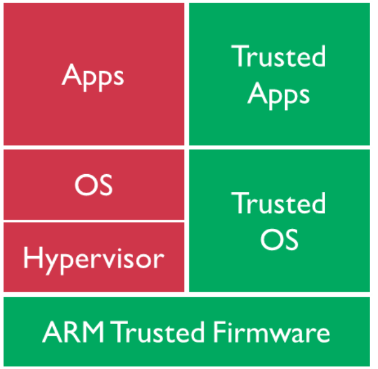
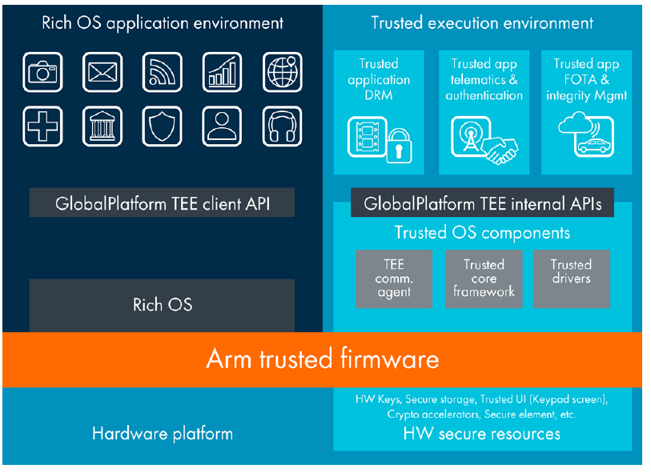
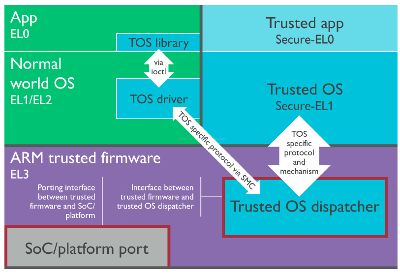
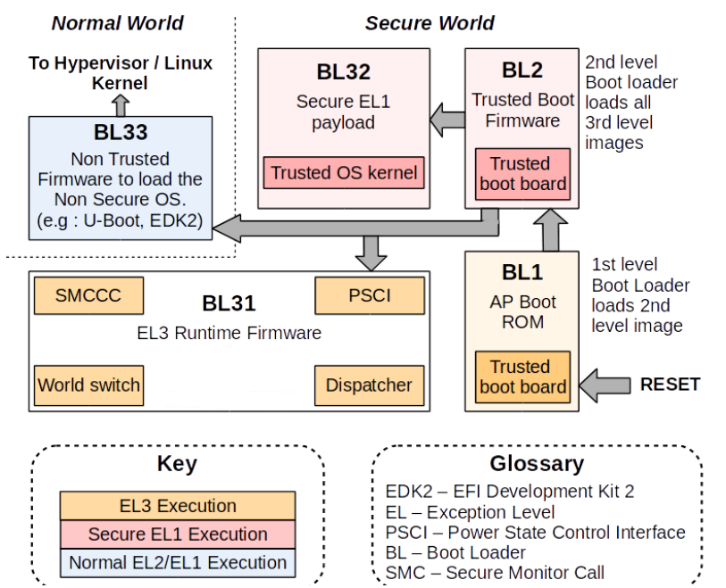

TRUST 
=====

 > ARM아키텍처의 TRUST 이미지는 ARM 아키텍처(Cortex-A class processor) 기반 디바이스의 보안을 강화하기 위해 사용되는 기술(ARM architecture security extension).

[1. ARM TrustZone](#1-arm-trustzone)  
[1.1 System architecture](#11-system-architecture)  
[1.2 CPU privilege level](#12-cpu-privilege-level)  
  
[2. Trust on Rockchip platform](#2-trust-on-rockchip-platform)  
[2.1 Implementation Machanism](#21-implementation-mechanism)  
[2.2 Boot-up process](#22-boot-up-process)  
[2.3 firmware obtain](#23-firmware-obtain)  
  
  
<br/>
<br/>
<br/>
<br/>
<hr>

# 1. ARM TrustZone


 TRUST 이미지는 다음과 같은 기능을 제공.  
  
 - 부팅 프로세서의 보안 강화 : TRUST 이미지는 부팅 프로세스를 보호하여 악성 코드의 침입을 방지.  
 - 하드웨어 암호화 키의 보호 : TRUST 이미지는 하드웨어 암호화 키를 보호하여 데이터의 안전을 보장.  
 - 저장 장치의 보안 강화 : TRUST 이미지는 저장 장치를 보호하여 데이터의 유출을 방지.  
   
 ARM 아키텍처 TRUST 이미지는 다음과 같은 두가지 구성 요소로 구성.  
  
 - TrustZone : TrustZone은 ARM아키텍처에서 제공하는 하드웨어 기반 보안 기능.   
               TrustZone은 디바이스의 일부메모리와 CPU를 보안영역으로 분리하여 악성 코드의 침입을 방지.  
 - TrustFirmware-A(TF-A) : TF-A는 TrustZone에서 실행되는 펌웨어.  
                           TF-A는 부팅 프로세스를 제어하고 하드웨어 암호화 키를 보호하는 등의 역할을 담당.  
   
 ARM 아키텍처 TRUST 이미지는 일반적으로 디바이스의 제조업체에서 제공.   
 디바이스를 부팅할 때 TRUST 이미지가 부팅 프로세스를 제어하여 디바이스의 보안을 강화.  
  
 ARM아키텍처 TRUST이미지는 ARM아키텍처 기반 디바이스의 보안을 강화하기 위한 중요한 요소.  
 디바이스의 보안을 강화하려는 경우 ARM 아키텍처 TRUST이미지를 사용하는 것을 추천.  
  
<br/>
<br/>
<br/>
<hr>
  
## 1.1 System architecture  
  
 시스템 아키텍처 관점에서 다음은 ARM TrustZone 기술이 활성화된 64비트 플랫폼 시스템 아키텍처 다이어그램이다.  
 시스템은 두 개의 영역, 즉 왼쪽의 non-secure 영역과 오른쪽의 secure 영역으로 나누어진다.  
 secure 영역은 두 세계의 모든 리소스에 액세스할 수 있지만, non-secure 영역은 non-secure 세계의 리소스에만 액세스할 수 있다.  
 non-secure 영역에서 secure 영역의 자원에 접근하면 system hardware bus error가 발생하고 자원에 접근할 수 없다.  
  
 이 두 영역간의 상호 작용에는 ARM Trusted Firmware 를 bridge 로 사용해야 한다.  
 CPU가 non-secure 영역에 있는 경우, secure 영역으로 들어가려면 먼저 ARM Trusted Firmware(ARM의 SMC command)가 필요하다.  
 그 후, ARM Trusted Firmware 내의 Secure Monitor code 는 CPU 를 non-secure ID에서 secure ID로 전환한다.  
 전환 후, secure ID를 사용하여 secure 영역으로 들어간다.  
  
 Rockchip Trust는 secure 영역에서 필요한 기능 즉, Secure Monitor의 기능을 구현하는 ARM Trusted Firmware + OP-TEE OS의 기능이 합쳐진 것으로 이해.  
 (두 영역 전환의 핵심 코드)  
  
  
  
  
  
<br/>
<br/>
<br/>
<hr>
  
## 1.2 CPU privilege level  
  
 CPU 관점에서 아래 그림은 ARM TruztZone이 활성화 된 standrd CPU privilege mode level 아키텍처 다이어그램.   
 64 bit CPU 인 경우, privilege level은 EL0, EL1, EL2, EL3으로 나누어지며,   
 이는 CPU가 속한 영역에 따라 secure EL0, secure EL1 또는 non-secure EL0, non-secure EL1 으로 구분된다.  
 32 bit CPU 인 경우, privilege level은 Mon, Hyp, SVC, ABT, IRQ, FIQ, UND, SYS, USER mode로 나뉘며,  
 그 중 SVC, ABT, IRQ, FIQ, AND, SYS, USER도 64비트와 같으며 secure 모드와 non-secure 모드의 차이가 있다.  
  
  
  
<br/>
<br/>
<br/>
<br/>
<hr>
  
# 2. Trust on Rockchip platform  
  
## 2.1 Implementation Mechanism  
  
 ARM Trusted Firmware + OP-TEE OS 의 구성은 Rockchip 플랫폼의 64비트 SoC 플랫폼에서 사용된다.    
 OP-TEE OS는 32비트 SoC 플랫폼에서 사용됩니다.    
  
<br/>
<br/>
<br/>
<hr>

## 2.2 Boot-up process  
  
 ARM Trusted Firmware architecture 는 전체 system을 EL0, EL1, EL2, EL3의 4 가지 secure level으로 구분한다.  
 secure boot의 프로세스 단계는  BL1, Bl2, BL31, BL32, BL33으로 정의되며,  
 BL1, BL2, *BL31*는 ARM Trusted Firmware source code를 제공한다.    
 Rockchip platform은 *BL31* 기능만 사용한다.  
 BL1과 BL2에는 고유한 구현 방법이 있다.   
 Rockchip platform은 일반적으로 ARM Trusted Firmware가 BL31을 참조하고,   
 BL32는 OP-TEE OS를 사용하도록 하는 "default"로 사용 가능하다.  
  
 - Android system boot-up sequence :  
  
```bash
    Maskrom -> Loader -> Trust -> U-Boot -> kernel -> Android
```
  
  
  
<br/>
<br/>
<br/>
<hr>
  
## 2.3 firmware obtain   
  
 binary files 로만 제공(source code 미제공).  
 binary files of Trust파일은 ~~u-boot~~ rkbin project 을 통해 제공.  
  
```bash
rkbin$ tree bin/ -d
bin/
├── rk1x
├── rk30
├── rk31
├── rk32
├── rk33
├── rk35
└── rv11

7 directories
```
  
 플랫폼에서  uboot.img 이미지를 컴파일하면 플랫폼의 "trust.img"도 package되어  
 u-boot의 root directory에 생성된다.  
 binary가 "trust.img"로 패키징되었다면, u-boot project에 있는 ini파일을 통해 인덱싱 된다.

```bash
pack u-boot.itb okay! Input: /home/lchy0113/develop/Rockchip/ROCKCHIP_ANDROID12_DEV/rkbin/RKTRUST/RK3568TRUST.ini
                        
FIT description: FIT Image with ATF/OP-TEE/U-Boot/MCU                                                                                    
Created:         Mon Oct 16 16:02:06 2023                                                                                                
 Image 0 (uboot)        
  Description:  U-Boot  
  Created:      Mon Oct 16 16:02:06 2023                                                                                                 
  Type:         Standalone Program                                                                                                       
  Compression:  uncompressed                                                                                                             
  Data Size:    1253352 Bytes = 1223.98 KiB = 1.20 MiB                                                                                   
  Architecture: AArch64 
  Load Address: 0x00a00000                                                                                                               
  Entry Point:  unavailable                                                                                                              
  Hash algo:    sha256  
  Hash value:   d73fb186f00196d91532b1ddabdd1ca30bdefe794e588f80eeba1fdc2ba3c112                                                         
 Image 1 (atf-1)        
  Description:  ARM Trusted Firmware                                                                                                     
  Created:      Mon Oct 16 16:02:06 2023                                                                                                 
  Type:         Firmware
  Compression:  uncompressed                                                                                                             
  Data Size:    167936 Bytes = 164.00 KiB = 0.16 MiB                                                                                     
  Architecture: AArch64 
  Load Address: 0x00040000                                                                                                               
  Hash algo:    sha256  
  Hash value:   0d5225a4ab6b4c75a70b0ae622aeea91f877babe8a1c2f93da89c887ec27d71f                                                         
 Image 2 (atf-2)        
  Description:  ARM Trusted Firmware                                                                                                     
  Created:      Mon Oct 16 16:02:06 2023                                                  
  Type:         Firmware                                                                  
  Compression:  uncompressed                                                              
  Data Size:    40960 Bytes = 40.00 KiB = 0.04 MiB                  
  Architecture: AArch64                                                                   
  Load Address: 0xfdcc1000                                                                
  Hash algo:    sha256                                                                    
  Hash value:   3e94d16e6ae2494413482e936aadb88d166d80b9c9976bdc4abf19b438711ce1                                                                                                     
 Image 3 (atf-3)                                                                          
  Description:  ARM Trusted Firmware                                                      
  Created:      Mon Oct 16 16:02:06 2023                                                  
  Type:         Firmware                                                                  
  Compression:  uncompressed                                                              
  Data Size:    20291 Bytes = 19.82 KiB = 0.02 MiB                  
  Architecture: AArch64                                                                   
  Load Address: 0x0006b000                                                                
  Hash algo:    sha256                                                                    
  Hash value:   fde0ef262ba317b0883affa12e3dcf182af8d09224a2fd430085f06ab7633808                                                                                                     
 Image 4 (atf-4)                                                                          
  Description:  ARM Trusted Firmware                                                      
  Created:      Mon Oct 16 16:02:06 2023                                                  
  Type:         Firmware                                                                  
  Compression:  uncompressed                                                              
  Data Size:    8192 Bytes = 8.00 KiB = 0.01 MiB                    
  Architecture: AArch64                                                                   
  Load Address: 0xfdcd0000                                                                
  Hash algo:    sha256                                                                    
  Hash value:   befba422b8d2e992908b4594bfbd4e063cfee595a03ff4ff35dc1101ed78c3ce                                                                                                     
 Image 5 (atf-5)                                                                          
  Description:  ARM Trusted Firmware                                                      
  Created:      Mon Oct 16 16:02:06 2023                                                  
  Type:         Firmware                                                                  
  Compression:  uncompressed                                                              
  Data Size:    8192 Bytes = 8.00 KiB = 0.01 MiB                    
  Architecture: AArch64                                                                   
  Load Address: 0xfdcce000                                                                
  Hash algo:    sha256                                                                    
  Hash value:   c9eb312bf29fb4e40a31caf6b9ab3b1e6bb2038b41a2746a44de2e631125887e                                                                                                     
 Image 6 (atf-6)                                                                          
  Description:  ARM Trusted Firmware                                                      
  Created:      Mon Oct 16 16:02:06 2023                                                  
  Type:         Firmware                                                                  
  Compression:  uncompressed                                                              
  Data Size:    7888 Bytes = 7.70 KiB = 0.01 MiB                    
  Architecture: AArch64                                                                   
  Load Address: 0x00069000                                                                
  Hash algo:    sha256                                                                    
  Hash value:   6ede7a3b44ebd03ad102122522e6a25305e56bffdf4bb4a7a0da7bf521aacdc8                                                                                                     
 Image 7 (optee)                                                                          
  Description:  OP-TEE                                                                    
  Created:      Mon Oct 16 16:02:06 2023                                                  
  Type:         Firmware                                                                  
  Compression:  uncompressed                                                              
  Data Size:    461216 Bytes = 450.41 KiB = 0.44 MiB                
  Architecture: AArch64                                                                   
  Load Address: 0x08400000                                                                
  Hash algo:    sha256                                                                    
  Hash value:   4fcbcd38704b593e961cd90910d9ca38fd72d2fb382819a17c77538776adbd53
   Image 8 (fdt)
  Description:  U-Boot dtb
  Created:      Mon Oct 16 16:02:06 2023
  Type:         Flat Device Tree
  Compression:  uncompressed
  Data Size:    14293 Bytes = 13.96 KiB = 0.01 MiB
  Architecture: AArch64
  Hash algo:    sha256
  Hash value:   5f9db6f3b513418c990ca1838aa2481181d75765afd3b41fa37b1740d8b2dfde
 Default Configuration: 'conf'
 Configuration 0 (conf)
  Description:  rk3568-edp-p02
  Kernel:       unavailable
  Firmware:     atf-1
  FDT:          fdt
  Loadables:    uboot
                atf-2
                atf-3
                atf-4
                atf-5
                atf-6
                optee
********boot_merger ver 1.31********
Info:Pack loader ok.
pack loader okay! Input: /home/lchy0113/develop/Rockchip/ROCKCHIP_ANDROID12_DEV/rkbin/RKBOOT/RK3568MINIALL_POCEDPP02.ini
/home/lchy0113/develop/Rockchip/ROCKCHIP_ANDROID12_DEV/u-boot

Image(no-signed, version=0): uboot.img (FIT with uboot, trust...) is ready
Image(no-signed): rk356x_spl_loader_v1.18.112.bin (with spl, ddr...) is ready
pack uboot.img okay! Input: /home/lchy0113/develop/Rockchip/ROCKCHIP_ANDROID12_DEV/rkbin/RKTRUST/RK3568TRUST.ini

Platform RK3568 is build OK, with new .config(make  rk3568_poc_defconfig rk3568-edp-p02.config -j64)
/home/lchy0113/develop/Rockchip/ROCKCHIP_ANDROID12_DEV/prebuilts/gcc/linux-x86/aarch64/gcc-linaro-6.3.1-2017.05-x86_64_aarch64-linux-gnu/bin/aarch64-linux-gnu-
Mon Oct 16 16:02:06 KST 2023
```
  

 Note : uboot project와 함께 배포되지만, rkbin repository를 통해 다운로드 가능하며, rkbin repository을 통해 구현 중.  

<br/>
<br/>
<br/>
<br/>
<hr>

## 2.4 Enable DTS

### 2.4.1 Kernel 3.10

#### 2.4.1.1 32 bit platform

(1)  psci node 추가

```dts
psci: psci {
    compatible = "arm,psci-1.0"; 
    method = "smc";
};
```

(2) chosen node 또는 parameter 추가 : psci=enable 

```dts
chosen { 
    bootargs = "psci=enable vmalloc=496M ... ";
};
```

<br/>
<br/>
<br/>
<hr>

#### 2.4.1.2 64 bit platform

(1) psci node 추가

```dts
psci: psci {
    compatible = "arm,psci-1.0"; 
    method = "smc";
};
```

(2) cpu node 내, enable-method = "psci" 추가

```dts
 cpus {                
  #address-cells = <2>;
  #size-cells = <0>;

  cpu0: cpu@0 {
   device_type = "cpu";
   compatible = "arm,cortex-a55";
   reg = <0x0 0x0>;
   enable-method = "psci";
   clocks = <&scmi_clk 0>;
   operating-points-v2 = <&cpu0_opp_table>;
   cpu-idle-states = <&CPU_SLEEP>;
   #cooling-cells = <2>;
   dynamic-power-coefficient = <187>;
  };

  cpu1: cpu@100 {
   device_type = "cpu";
   compatible = "arm,cortex-a55";
   reg = <0x0 0x100>;
   enable-method = "psci";
   clocks = <&scmi_clk 0>;
   operating-points-v2 = <&cpu0_opp_table>;
   cpu-idle-states = <&CPU_SLEEP>;
  };

  cpu2: cpu@200 {
   device_type = "cpu";
   compatible = "arm,cortex-a55";
   reg = <0x0 0x200>;
   enable-method = "psci";
   clocks = <&scmi_clk 0>;
   operating-points-v2 = <&cpu0_opp_table>;
   cpu-idle-states = <&CPU_SLEEP>;
  };

  cpu3: cpu@300 {
   device_type = "cpu";
   compatible = "arm,cortex-a55";
   reg = <0x0 0x300>;
   enable-method = "psci";
   clocks = <&scmi_clk 0>;
   operating-points-v2 = <&cpu0_opp_table>;
   cpu-idle-states = <&CPU_SLEEP>;
  };

  idle-states {
   entry-method = "psci";
   CPU_SLEEP: cpu-sleep {
    compatible = "arm,idle-state";
    local-timer-stop;
    arm,psci-suspend-param = <0x0010000>;
    entry-latency-us = <100>;
    exit-latency-us = <120>;
    min-residency-us = <1000>;
   };
  };
 };
```

<br/>
<br/>
<br/>
<hr>

## 2.4.2 Kernel 4.4 +

### 2.4.2.1 32 bit platform

 psci node 만 추가.

```dts
psci {
    compatible = "arm,psci-1.0";
    method = "smc";
};
```

<br/>
<br/>
<br/>
<hr>

### 2.4.2.2 64 bit platform

 psci node 추가  

```dts
 cpus {                
  #address-cells = <2>;
  #size-cells = <0>;

  cpu0: cpu@0 {
   device_type = "cpu";
   compatible = "arm,cortex-a55";
   reg = <0x0 0x0>;
   enable-method = "psci";
   clocks = <&scmi_clk 0>;
   operating-points-v2 = <&cpu0_opp_table>;
   cpu-idle-states = <&CPU_SLEEP>;
   #cooling-cells = <2>;
   dynamic-power-coefficient = <187>;
  };

  cpu1: cpu@100 {
   device_type = "cpu";
   compatible = "arm,cortex-a55";
   reg = <0x0 0x100>;
   enable-method = "psci";
   clocks = <&scmi_clk 0>;
   operating-points-v2 = <&cpu0_opp_table>;
   cpu-idle-states = <&CPU_SLEEP>;
  };

  cpu2: cpu@200 {
   device_type = "cpu";
   compatible = "arm,cortex-a55";
   reg = <0x0 0x200>;
   enable-method = "psci";
   clocks = <&scmi_clk 0>;
   operating-points-v2 = <&cpu0_opp_table>;
   cpu-idle-states = <&CPU_SLEEP>;
  };

  cpu3: cpu@300 {
   device_type = "cpu";
   compatible = "arm,cortex-a55";
   reg = <0x0 0x300>;
   enable-method = "psci";
   clocks = <&scmi_clk 0>;
   operating-points-v2 = <&cpu0_opp_table>;
   cpu-idle-states = <&CPU_SLEEP>;
  };

  idle-states {
   entry-method = "psci";
   CPU_SLEEP: cpu-sleep {
    compatible = "arm,idle-state";
    local-timer-stop;
    arm,psci-suspend-param = <0x0010000>;
    entry-latency-us = <100>;
    exit-latency-us = <120>;
    min-residency-us = <1000>;
   };
  };
 };
```

<br/>
<br/>
<br/>
<hr>

## 2.4.3 Kernel Document

```bash
./Documentation/devicetree/bindings/arm/psci.txt
```

<br/>
<br/>
<br/>
<br/>
<hr>

## 2.5 Running memory and life cycle

### 2.5.1 Running memory

 The ARM Trusted Firmware는 DRAM start offset 0M~2M 이고, 프로그램 entry address 0x10000 (64KB) 이 사용되는 공간에서 실행된다.

 OP-TEE OS 는 132M에서 148M의 DRAM start offset(최종 주소는 플랫폼에 따라 다름) 사이에서 entry address 0x08400000 (132M)을 사용하여 실행된다.

<br/>
<br/>
<br/>
<hr>

### 2.5.2 Life cycle

 Trust 는 초기화 이후로 부터 memory에 상주되어 동작한다.

<br/>
<br/>
<br/>
<br/>
<hr>

## 2.6 Security

 ARM TrustZone이 활성화 된 후, 시스템이 secure 영역과 non-secure 영역으로 나누어져 동작합니다.

 Rockchip platform에서 CPU가 secure 영역에서 실행하는 펌웨어와 non-secure 영역에서 실행되는 펌웨어를 구별하는 방법은 아래와 같다.

 **loader**와 **trust**는 secure 영역에서 실행된다. 
 **u-boot**, **kernel**, **Android**는 non-secure 영역에서 실행된다.

    (보안 드라이버 및 앱 제외)


<br/>
<br/>
<br/>
<br/>
<hr>

## 2.7 Functions

### 2.7.1 PSCI (Power State Coordination Interface)

 일반적으로 다양한 SoC 공급업체의 칩은 IC 설계, 특히 CPU의 전원 상태 관리 부분에서 상당한 차이를 보인다.  
 각 SoC 공급업체에는 CPU 전원 상태를 관리하는 자체 소프트웨어 프로세스 세트가 있으므로 커널의 이 코드 부분은 단편화되어 높은 수준의 균일성을 달성하기 어렵다.  
 분명히 커널은 이와 관련하여 조각화 상태를 유지하는 것을 매우 꺼립니다.  
  
 더욱이 개발자는 일반적으로 이 구현 부분에 대해 그다지 관심을 두지 않는다.  
 소프트웨어 구현의 이 부분은 CPU 아키텍처 및 IC 설계와 밀접하게 관련되어 있기 때문에 완전히 이해하거나 구현하기 어렵다.  
  
 위와 같은 이유로 커널은 CPU의 전원 관리를 각 SoC 공급업체의 펌웨어에 맡기는 경향이 더 크다.  
 커널은 커널 코드를 더욱 고도로 통합하기 위해 CPU 제어 전략에만 집중하면 된다.  

 따라서 커널 프레임워크에서는 이러한 목표를 달성하기 위해 PSCI(Power State Coordination Interface)[3] 인터페이스를 추가했다.  
  
 PSCI는 CPU 코어 전원 관리 관련 인터페이스 세트로, 기본적으로 ARM SMC 명령을 통해 Trust로 들어가 위의 관련 작업(CPU 켜기, CPU 끄기, 시스템 일시 중지, 시스템 재설정, 시스템 끄기 등)을 완료한다.  
  
<br/>
<br/>
<br/>
<hr>

### 2.7.2 Secure Monitor

 Secure Monitor는 secure 영역과 non-secure 영역 사이의 상태 전환을 위한 CPU 간의 bridge 이다.  
 Secure Monitor 코드는 TRUST 에서 구현되며, 이 코드 부분이 없으면 CPU는 secure 상태와 non-secure 상태 사이를 전환할 수 없다. 
 즉, ARM TrustZone 기술을 잃게 된다.


 - Security Monitor 모드로 들어가는 방법은?
  SMC instructions로 구현해야 함.(ARM technical manual 참고)

<br/>
<br/>
<br/>
<hr>

### 2.7.3 Secure information configuration

 Cortex-A 프로세서 자체의 긴밀한 통합 외에도 ARM TrustZone 기술은 AMBA AXI 버스 및 특정 TrustZone 시스템 IP 블록을 통해 시스템에서 확장되어야 한다.  
 따라서 일련의 관련 IP 모듈 보안 정보를 구성해야 하며 이는 Trust에서 완료된다.  
 
<br/>
<br/>
<br/>
<hr>
 
### 2.7.4 Security data protection

 Security dataprotection.   
 예를들어, security 결재, Digital Rights Management(DRM), enterprise service, web-based serviced등 관련 보안 정보에 대한 storage 보호.  

<br/>
<br/>
<br/>
<br/>
<hr>

# 3. Trust troubleshooting on the Rockchip platform

## 3.1 boot log example

<br/>
<br/>
<br/>
<hr>

## 3.2 print information indetification

<br/>
<br/>
<br/>
<hr>

## 3.3 firmware version identification

<br/>
<br/>
<br/>
<hr>

## 3.4 PANIC information identification

### 3.4.1 ARM Trusted Firmware panic

<br/>
<br/>
<br/>
<hr>

### 3.4.2 OP-TEE OS panic

 > OP-TEE OS 란, ARM Trust 기능에서 OP-TEE OS는 TrustZone 보안 환경에서 실행되는 운영체제.
 > feature : 부팅 프로세스 제어, 하드웨어 암호화키 보호, 저장장치 보안 강화.

<br/>
<br/>
<br/>
<br/>
<hr>

# 4. TEE 

 Rockchip 플랫롬에서 Android 7.1 이상의 SDK는 기본적으로 TEE 환경을 지원.
 OP-TEE 라는 TEE 솔루션을 사용하며 TEE API는 GlobalPlatform 표준을 준수.

> rk3568 은 OP-TEE V2 

## 4.1 parameter.txt 파일 설명

 parameter.txt 파일은 각 이미지와 파티션의 위치 및 크기 정보를 기록.
 parameter.txt 파일에 보안 관련 파일 시스템이 정의되어 있지 않으면, 사용할 수 없다. 
 보안 파티션을 정의하려면, 
 0x00002000@0x000xxxxx(security)를 parameter.txt 파일에 추가하면 된다.

<br/>
<br/>
<br/>
<hr>

### 4.1.1 parameter.txt 파일 생성

```bash
//device/rockchip/common/build/rockchip/RebuildParameter.mk

(...)
partition_list := security:4M,uboot:4M,trust:4M,misc:4M
(...)
partition_list := $(partition_list),dtbo:$(BOARD_DTBOIMG_PARTITION_SIZE),vbmeta:1M,boot:$(BOARD_BOOTIMAGE_PARTITION_SIZE),recovery:$(BOARD_RECOVERYIMAGE_PARTITION_SIZE)
(...)
partition_list := $(partition_list),backup:384M,cache:$(BOARD_CACHEIMAGE_PARTITION_SIZE),metadata:16M
(...)
partition_list := $(partition_list),super:$(BOARD_SUPER_PARTITION_SIZE)

(...)
```

<br/>
<br/>
<br/>
<hr>

## 4.2 TEE firmware

 TEE Secure OS의 소스코드는 오픈소스가 아니며, 바이너리는 rkbin/bin 경로를 통해 배포

 - ARMv8 플랫폼의 TEE 바이너리는 u-boot/tools/loaderimage 도구를 통해 펌웨어 trust.img로 패키징.

 - rkbin/RKTRUST/(TARGET).ini 의 [BL32_OPTION] 에서 SEC 필드의 값을 1으로 설정해야 trust.img에 보안 OS가 포함.
  즉, TEE 관련 서비스 이용 불가.

<br/>
<br/>
<br/>
<hr>

## 4.3 u-boot의 TEE 드라이버

 u-boot 에서 TRUST zone의 데이터를 제어하려면 OP-TEE을 사용해야한다.
 OP-TEE 클라이언트 코드는 u-boot 에서 구현되어있으며, 인터페이스를 통해 OP-TEE와 통신 가능.
 "lib/optee_clientApi/" 디렉토리에 드라이버는 위치.

 > TEE : Trusted Execution Environment
 > OP-TEE : Open Portable Trusted Execution Environment

<br/>
<br/>
<br/>
<hr>

### 4.3.1 관련 config

 - CONFIG_OPTEE_CLIENT
 - CONFIG_OPTEE_V2
 - CONFIG_OPTEE_ALWAYS_USE_SECURITY_PARTITION : 활성화 시, emmc의  rpmb에 보안 데이터를 저장. 그렇지 않은 경우,  하드웨어에 따라 보안 저장 영역을 선택해야함.

<br/>
<br/>
<br/>
<hr>

### 4.3.2 test

```bash
[2023-10-30 14:08:35.047] => mmc testsecurestorage
[2023-10-30 14:08:48.922] optee api revision: 2.0
[2023-10-30 14:08:48.922] Authentication key not yet programmed
[2023-10-30 14:08:48.943] E/TC:? 0 tee_rpmb_verify_key_sync_counter:1019 Verify key returning 0xffff0008
[2023-10-30 14:08:49.038] test_secure_storage_default success! 1/100
[2023-10-30 14:08:49.070] test_secure_storage_security_partition success! 1/100
[2023-10-30 14:08:49.150] test_secure_storage_default success! 2/100
[2023-10-30 14:08:49.182] test_secure_storage_security_partition success! 2/100
[2023-10-30 14:08:49.262] test_secure_storage_default success! 3/100
(..)
```

<br/>
<br/>
<br/>
<hr>

## 4.4 kernel의 TEE 드라이버

 TEE config

```bash
CONFIG_TEE
CONFIG_OPTEE
```

 TEE devicetree

```dtb
firmware {
    optee: optee {
        compatible = "linaro,optee-tz";
        method = "smc";
    };
};
```

 driver node
```bash
console:/ $ ls -alh /dev/opteearmtz00                     
[2023-10-30 16:37:43.729] crw-rw-rw- 1 root root 10,  62 2023-10-30 16:15 /dev/opteearmtz00

```

<br/>
<br/>
<br/>
<hr>

## 4.5 TEE 라이브러리 파일

### 4.5.1 안드로이드 플랫폼

 hardware/rockchip/optee 경로에 위치함

```bash
ls -alh hardware/rockchip/optee/
total 24K
drwxrwxr-x  4 lchy0113 lchy0113 4.0K  7월 19 18:44 .
drwxrwxr-x 38 lchy0113 lchy0113 4.0K  7월 19 18:44 ..
-rwxrwxr-x  1 lchy0113 lchy0113  413  7월 19 18:44 Android.bp
lrwxrwxrwx  1 lchy0113 lchy0113   51  7월 19 18:44 .git -> ../../../.repo/projects/hardware/rockchip/optee.git
-rw-rw-r--  1 lchy0113 lchy0113  142  7월 19 18:44 init.tee-supplicant.rc
drwxrwxr-x  4 lchy0113 lchy0113 4.0K  7월 19 18:44 v1
drwxrwxr-x  4 lchy0113 lchy0113 4.0K  7월 19 18:44 v2
```

 - lib : 32bit 및 64bit 플랫폼용으로 컴파일된 tee-supplicant, libteec.so, keymaster/gatekeep 관련 라이브러리 파일을 포함.
 - ta : 컴파일된 keymaster/gatekeeper 및 기타 관련 ta 파일을 저장.

<br/>
<br/>
<br/>
<hr>

## 4.6 CA / TA 
 Certification Authority, Trusted Applications 

  CA : TEE의 보안 영역을 인증. TEE에서 실행되는 애플리케이션을 인증.

  TA : TEE의 보안 영역에서 실행되는 애플리케이션을 의미.

<br/>
<br/>
<br/>
<hr>

### 4.6.1 directory (code)

TEE CA/TA 개발환경은 Android 프로젝트 디렉토리 external/rk_tee_user 경로에 존재.

```bash
$ cd external/rk_tee_user/v2
$ ./build.sh ta

// pycryptome 에러 발생 시,
$ pip3 install pycryptodomex  --trusted-host pypi.org --trusted-host pypi.python.org --trusted-host files.pythonhosted.org

$ mm
// Install: out/target/product/$(NAME)/vendor/bin/xtest
```

 - 빌드 후, CA(클라이언트 어플리케이션, normal world)와 TA(트러스트 어플리케이션, secure world) 로 구분된다.
 CA는 컴파일 후, Android 프로젝트의 out 디렉토리에 생성되는 파일이며 xtest.
 TA는 파일이름이 uuid이고, .ta 파일로, out/ta 경로에 생성됨.
 ./out/ta/rk_test/1db57234-dacd-462d-9bb1-ae79de44e2a5.ta 파일은 RK에서 작성된 데모 파일

### 4.6.2 TEST 

<br/>
<br/>
<br/>
<hr>
