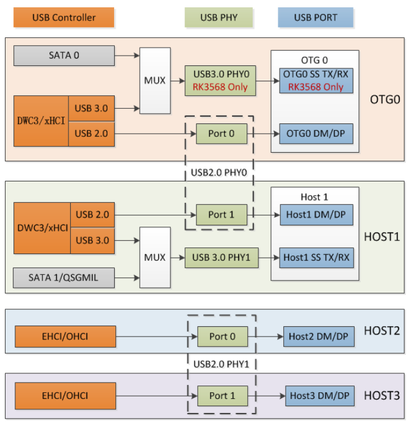

# USB

-----

1. RK3568 USB 컨트롤러 및 PHY 소개
RK3568는 1개의 OTG 인터페이스, 1개의 USB 3.0 호스트 인터페이스 및 2개의 USB2.0 호스트 인터페이스를 포함하여 총 4개의 USB 주변 장치 인터페이스를 지원합니다.
USB 인터페이스 이름과 인터페이스 유형 간의 해당 관계는 다음과 같습니다.

| Chip   	| OTG0       	| HOST1        	| HOST2        	| HOST3        	|
|--------	|------------	|--------------	|--------------	|--------------	|
| RK3568 	| USB3.0 OTG 	| USB 3.0 HOST 	| USB 2.0 HOST 	| USB 2.0 HOST 	|
| RK3566 	| USB2.0 OTG 	| USB 3.0 HOST 	| USB 2.0 HOST 	| USB 2.0 HOST 	|


아래 그림은 RK356x USB controller와 PHY 간 다이어그램입니다.

  

 1. 각 USB2.0 PHY에는 USB2.0 컨트롤러에서 각각 사용하는 2개의 포트가 있습니다. 
 2. OTG 포트의 USB3.0 컨트롤러와 SATA0 컨트롤러는 Combo PHY0을 공유하고,  HOST1포트의 USB3.0 컨트롤러와 SATA1/QSGMII 컨트롤러는  Combo PHY1을 공유합니다. 
   OTG 포트의 SATA0와 USB3.0 기능은 함께 사용할 수 없으므로, 제품 형태에 따라 구성해야 합니다.
 3. **EHCI/OHCI**는 USB 컨트롤러가 EHCI 컨트롤러와 OHCI 컨트롤러를 통합하는 것을 의미합니다. 
   **DWC3/xHCI**는 USB 컨트롤러가 DWC3 컨트롤러와 xHCI 컨트롤러를 통합하는 것을 의미합니다.


-----

2. RK3568 USB 하드웨어 회로 설계

2.1 RK3568 USB 2.0/3.0 PHY power supply controller

RK3568 에는 2개의 USB 2.0 PHY가 포함되어 있으며, 각각에는 3.3V, 1.8V 및 0.9V의 세가지의 power supply 장치가 있습니다. 이 세가지의 power supply 장치의 전압 요구사항은 아래와 같습니다.

| **Supply Voltage** 	| **Min** 	| **Typ** 	| **Max** 	| **Unit** 	|
|--------------------	|---------	|---------	|---------	|----------	|
| USB_AVDD_3V3       	| 3.0     	| 3.3     	| 3.6     	| V        	|
| USB_AVDD_1V8       	| 1.62    	| 1.8     	| 1.98    	| V        	|
| USB_AVDD_0V9       	| 0.81    	| 0.9     	| 0.99    	| V        	|


2.2 RK3568 USB OTG 인터페이스 하드웨어 회로

RK3568 OTG 포트 하드웨어 설계시 고려사항.

1. DP/DM 의 anti-pressure/anti-static capability를 향상 시키려면, 2.2Ω resistors 에 연결해야 합니다.
2. USB device의 동적 플러그 감지 및 충전 유형을 감지를 지원하려면 VBUSDET 핀을 USB 인터페이스에 연결해야 합니다.
3. USB 장치 동적 플러그 감지 및 충전 유형 감지 기능을 사용 하지 않는 경우, VBUSDET 핀을 최대 3.3V로 pull-up하거나 floating 상태로 둘수 있습니다.(3.3V pullup 추천)
  RK3568의 maskrom USB의 경우, VBUSDET 핀이 floating 상태로 남아있어도 정상적으로 작동하고 펌웨어 다운로드가 가능합니다.

 
RK3568의 OTG 는 일반적으로 아래 3가지 타입으로 설계됩니다.

2.2.1. RK3568 OTG 포트 : Micro-B 인터페이스 회로 설계
2.2.2. RK3568 OTG 포트 : Type-A 인터페이스 회로 설계
  - USB2.0 Type-A 인터페이스 
  - USB3.0 Type-A 인터페이스 
2.2.3. RK3568 OTG 포트 : Type-C 인터페이스 회로 설계

2.3 RK3568 USB 3.0 HOST1 인터페이스 하드웨어 회로

RK3568 USB 3.0 HOST Type-A 인터페이스 하드웨어 회로는 OTG 포트 Type-A 인터페이스 회로와 유사하지만 차이점은 Rk3568 USB 3.0 HOST 에는 VBUSDET 핀과  ID 핀이 없습니다.

2.4 RK3568 HOST2/HOST3 인터페이스 하드웨어 회로


-----

3. RK3568 USB DTS configuration 

RK3568 USB 하드웨어 회로는 다양한 특성, 특히 USB OTG 포트의 유연한 하드웨어 회로와 복잡한 USB 3.0/SATA/QSGMII Combo PHY 다중화 관계를 가지고 있습니다. 


3.1 RK3568 OTG configuration
RK3568 OTG 의 DTS node 이름은 다음과 같이 정의되어져 있습니다.

| **usbdrd30**               	| **usbdrd_dwc3**           	| **usb2phy0**                                     	| **u2phy0_otg**         	| **combphy0_us**  	|
|----------------------------	|---------------------------	|--------------------------------------------------	|------------------------	|------------------	|
| usb controller parent node 	| usb controller child node 	| usb 2.0 PHY parent node (shared with HOST1 port) 	| usb 2.0 PHY child node 	| usb 3.0 PHY node 	|

🚩 note : RK3568 OTG 포트는 USB2.0 및 USB3.0 기능을 지원하며 동일한 USB 컨트롤러에 속하며 DTS node 이름은 usbdrd30 및 usbdrd_dwc3 입니다.  


3.1.2. RK3568 OTG 으로 구성된 RK3568 OTG
USB3.0 으로 사용되는 RK3568 OTG의 DTS 구성은 아래와 같습니다.

```dtb
&combphy0_us {				// usb 3.0 phy node
	status = "okay";
};

&u2phy0_otg {				// usb 2.0 phy child node
	vbus-supply = <&vcc5v0_otg>;
	status = "okay";
};

&usb2phy0 {					// usb 2.0 phy parent node 
	status = "okay";
};

&usbdrd_dwc3 {				// usb controller child node
	dr_mode = "otg";
	extcon = <&usb2phy0>;
	status = "okay";
};

&usbdrd30 {					// usb controller parent node
	status = "okay";
};
```

1. u2phy0_otg의 vbus-supply는 OTG 포트의 VBUS configuration 입니다.
2. OTG 포트에 HOST/DEVICE 전환 기능이 필요하지만 기본적으로 호스트 모드에서 작동해야 하는 경우, usbdrd_dwc3에서 dr_mode를 otg 로 구성한다음 전환 명령에 따라 동작을 취합니다.
  (예를 들어, 초기화에서 init.rc의 명령을 사용하여 OTG포트의 USB 모드를 HOST로 전환합니다.)

3.1.3. USB 2.0 으로 configuration
USB2.0 인터페이스로 구성된 RK3568 OTG의 DTS configuration 은 아래와 같습니다.

```dtb
&combphy0_us {				// usb 3.0 phy node
	rockchip,dis-u3otg0-port;
	/* OTG 와 SATA0 에서 combphy0_us을 사용하지 않으면 비활성화 합니다. */
	status = "okay";
};

&u2phy0_otg {				// usb 2.0 phy child node
	vbus-supply = <&vcc5v0_otg>;
	status = "okay";
};

&usb2phy0 {					// usb 2.0 phy parent node
	status = "okay";
};

&usbdrd_dwc3 {				// usb controller child node
	dr_mode = "otg";
	phys = <&u2phy0_otg>;
	phy-names = "usb2-phy";
	extcon = <&usb2phy0>;
	maximum-speed = "high-speed";
	snps,dis_u2_susphy_quirk;
	status = "okay";
};

&usbdrd30 {					// usb controller parent node
	status = "okay";
};
```

-----
🚩 note 

✔ usb interface   

**(OTG0_HS/FS/LS)**
  * USB3_OTG0_DP
  * USB3_OTG0_DM

**(HOST1_HS/FS/LS)**
  * USB3_HOST1_DP
  * USB3_HOST1_DM

**(USB2.0 HOST)**
  * USB2_HOST2_DP
  * USB2_HOST2_DM

  * USB2_HOST3_DP
  * USB2_HOST3_DM

**(USB3.0 OTG0_SS)**
  * USB3_OTG0_SSTXP
  * USB3_OTG0_SSTXN
  * USB3_OTG0_SSRXP
  * USB3_OTG0_SSRXN

**(USB30 HOST1_SS)**
  * USB3_HOST1_SSTXP
  * USB3_HOST1_SSTXN
  * USB3_HOST1_SSRXP
  * USB3_HOST1_SSRXN


-----

✔ 용어 설명

- USB 2.0 : PC의 각종 주변 장치들을 연결하기 위한 인터페이스 규격 중 하나.   
  다양한 버전이 있으며, 버전별로 속도가 다르다.(2.0의 경우, 480Mbit/s 의 데이터 속도)  
- SSUSB : SuperSpeed USB는 버전 3을 일컷는 말이다.  
  버전3은 부르는게 다양한데 3.0=3.1GEN1=3.2GEN1 같은 말이다.   
  (2~20Gbps의 전송속도를 가지고 있다.)  
- Critical Signals  
  * DP : USB 2.0 differential data pair, positive, D+
  * DM : USB 2.0 differential data pair, negative, D-
  * SSTXP : SSUSB differential data pair, TX, positive, D+
  * SSTXN : SSUSB differential data pair, TX, negative, D+
  * SSRXP : SSUSB differential data pair, RX, positive, D-
  * SSRXN : SSUSB differential data pair, RX, negative, D-

	  
-----


✔ 커넥터
- USB 3.0 커넥터

  

- USB 2.0 커넥터

  
