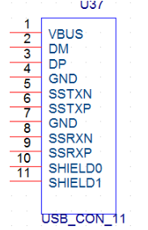
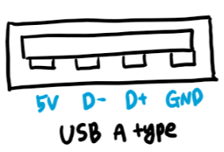

# USB

-----

1. RK3568 USB 컨트롤러 및 PHY 소개
RK3568는 1개의 OTG 인터페이스, 1개의 USB 3.0 호스트 인터페이스 및 2개의 USB2.0 호스트 인터페이스를 포함하여 총 4개의 USB 주변 장치 인터페이스를 지원합니다.
USB 인터페이스 이름과 인터페이스 유형 간의 해당 관계는 다음과 같습니다.

| Chip   	| OTG0       	| HOST1        	| HOST2        	| HOST3        	|
|--------	|------------	|--------------	|--------------	|--------------	|
| RK3568 	| USB3.0 OTG 	| USB 3.0 HOST 	| USB 2.0 HOST 	| USB 2.0 HOST 	|
| RK3566 	| USB2.0 OTG 	| USB 3.0 HOST 	| USB 2.0 HOST 	| USB 2.0 HOST 	|

-----
⚡ note 

✔ usb interface 
(OTG0_HS/FS/LS)
  * USB3_OTG0_DP
  * USB3_OTG0_DM

(HOST1_HS/FS/LS)
  * USB3_HOST1_DP
  * USB3_HOST1_DM

(USB2.0 HOST)
  * USB2_HOST2_DP
  * USB2_HOST2_DM

  * USB2_HOST3_DP
  * USB2_HOST3_DM

(USB3.0 OTG0_SS)
  * USB3_OTG0_SSTXP
  * USB3_OTG0_SSTXN
  * USB3_OTG0_SSRXP
  * USB3_OTG0_SSRXN

(USB30 HOST1_SS)
  * USB3_HOST1_SSTXP
  * USB3_HOST1_SSTXN
  * USB3_HOST1_SSRXP
  * USB3_HOST1_SSRXN

✔ 용어 설명
- USB 2.0 : PC의 각종 주변 장치들을 연결하기 위한 인터페이스 규격 중 하나. 
  다양한 버전이 있으며, 버전별로 속도가 다르다.(2.0의 경우, 480Mbit/s 의 데이터 속도)
- SSUSB : SuperSpeed USB는 버전 3을 일컷는 말이다.
  버전3은 부르는게 다양한데 3.0=3.1GEN1=3.2GEN1 같은 말이다. 
  (2~20Gbps의 전송속도를 가지고 있다.)
- Critical Signals
  * DP : USB 2.0 differential data pair, positive, D+
  * DM : USB 2.0 differential data pair, negative, D-
  * SSTXP : SSUSB differential data pair, TX, positive, D+
  * SSTXN : SSUSB differential data pair, TX, negative, D+
  * SSRXP : SSUSB differential data pair, RX, positive, D-
  * SSRXN : SSUSB differential data pair, RX, negative, D-

✔ 커넥터
- USB 3.0 커넥터

- USB 2.0 커넥터

