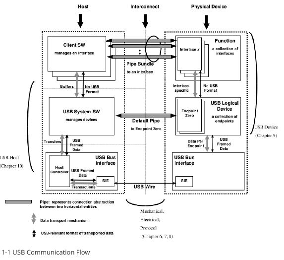

# USB 

-----

 > USB Host 와 USB Device(Peripheral)에 대한 문서 입니다. 
 > USB Host 의 USB Disk, USB Ethernet, USB Camera 에 대해 설명.
 > USB Device(Peripheral) 의 USBMTP, USB MSC(Mass Storage Class), USB Gadget Webcam, USB Rndis, USB Gadget HID에 대해 설명합니다.


<br/>
<br/>
<br/>
<br/>
<hr>

# 1. USB 통신 속도.

<br/>
<br/>
<br/>
<hr>

## 1.1 USB 통신 Flow

USB 통신 Flow 모델은 그림 1-1과 같으며 layer 구조를 채택하고 host와 USB 장치 간의 연결은 여러 layer의 연결로 구성됩니다.

**USB bus interface layer**은 host와 device 사이의 물리적 연결을 제공하여 데이터를 송수신합니다.

**USB device layer**은 USB 시스템 소프트웨어에 표시되며 시스템 소프트웨어는 표시되는 장치 계층을 기반으로 장치에서 일반 USB 작업을 수행합니다.

**USB application layer**은 이와 협력하는 클라이언트 소프트웨어를 통해 호스트 컴퓨터에 몇 가지 추가 기능을 제공할 수 있습니다.

**USB device layer**과 **application layer** 간의 통신은 논리적이며 이러한 논리적 통신에 해당하는 실제 물리적 통신은 **USB bus interface layer**에 의해 완료됩니다.
 
 

<br/>
<br/>
<br/>
<hr>

## 1.2 USB Phy layer 통신 속도

USB Phy layer의 전송 속도는 USB phy bus의 전송 속도를 의미합니다. 
USB bus는 현재 아래 표와 같이 USB1.0, USB1.1, USB2.0, USB3.0(USB3.1 Gen1) 및 USB 3.1 Gen2의 5가지 표준 전송 속도를 지원합니다.

| **USB version**           | **Maximum transfer rate**     | **speed title**     |
|-----------------------    |---------------------------    |-----------------    |
| USB 1.0                   | 1.5 Mbps                      | low-speed           |
| USB 1.1                   | 12 Mbps                       | full-speed          |
| USB 2.0                   | 250 Mbps                      | high-speed          |
| USB 3.0(USB 3.1 Gen1)     | 5 Gbps                        | super-speed         |
| USB 3.1 Gen2              | 10 Gbps                       | Super-speed+        |

<br/>
<br/>
<br/>
<hr>

## 1.3 USB Protocol layer 의 통신 속도

USB 아케텍처는 네 가지 전송 유형을 지원합니다.

 * Control Transfers
     - device가 연결될 때 device를 열거하고, device마다 다른 특정 작업을 열거하는 데 사용됩니다.
     
 * Interrupt Transfers
     - 키보드 및 게임 컨트롤러와 같은 HID 장치와 같이 대기 시간이 엄격한 소량의 데이터를 안정적으로 전송하는데 사용합니다.

 * Bulk Transfers
     - 느슨한 지연 요구사항과 U-disk, USB ethernet 카드 등과 같이 많은 양의 데이터를 안정적으로 전송하는데 사용합니다.

 * Isochronous Transfers
     - USB 카메라, USB 오디오와 같이 높은 신뢰성을 요구하지 않는 실시간 데이터 전송에 사용됩니다.


| **transmission type**     | **USB 2.0**                                                                                                           | **USB 3.0**                                                                                                                      |
|-----------------------    |-------------------------------------------------------------------------------------------------------------------    |------------------------------------------------------------------------------------------------------------------------------    |
| control transfer          | Max Packet: 64Bytes Burst: not supported Only supports flow control for OUT (PING)                                    | Max Packet: 512Bytes Burst: 1 Support flow control (ERDY)                                                                        |
| interrupt transfer        | Max Packet: 0 ~ 1024 × 3 Bytes Max Transfer Speed: 23.44MBps Burst: not supported Does not support flow control       | Max Packet: 0 ~ 1024 × 3 Bytes Max Transfer Speed: 23.44MBps Burst: 1 ~ 3 Support flow control (ERDY)                            |
| bulk transfer             | Max Packet: 512Bytes Max Transfer Speed: 53.25MBps Burst: not supported Only supports flow control for OUT (PING)     | Max Packet: 1024Bytes Max Transfer Speed: 400MBps? Burst: 1 ~ 16 Support flow control (ERDY))                                    |
| isochronous transfer      | Max Packet: 0 ~ 1024 × 3 Bytes Max Transfer Speed: 23.44MBps Burst: not supported Does not support flow control       | Max Packet: 0 ~ 1024 × 16 × 3Bytes Max Transfer Speed: 375.04MBps Burst: 1 ~ 16 Support flow control (PING -> PING_RESPONSE)     |

<br/>
<br/>
<br/>
<hr>

## 1.4 USB 통신 속도에 영향을 주는 요인.

USB의 전송 속도는 주로 아래의 영향을 받습니다.

 * USB 신호 품질
  USB 신호 품질은 USB EYE DIAGRAM을 테스트하여 평가할 수 있습니다. 
  USB 신호 품질이 좋지 않으면 USB 물리적 버스에서 쉽게 패킷 손실 및 재전송으로 이어져 USB 전송 속도에 영향을 미칩니다.

 * USB 컨트롤러의 AHB CLK 및 DMA Burst 길이.
  더 높은 AHB CLK 및 더 큰 DMA Burst 길이는 USB 컨트롤러의 DMA 전송 효율을 향상시킬수 있습니다.

 * CPU operating 주파수의 영향
  CPU operating 주파수는 코드의 실행 효율성과 데이터 복사 memcpy의 효율성에 영향을 미치므로 CPU clock을 높여서 USB 드라이버 및 프로그램 Layer의 실행 효율성을 향상시켜 USB 전송 속도를 높일 수 있습니다. 

 * USB 장치 클래스 드라이버의 URB(USB Requect Block) 의 버퍼 크기.
  USB 장치 클래스 드라이버의 URB 크기는 USB 컨트롤러가 한번에 전송하도록 요청한 데이터 블록의 크기 입니다. 
  USB 디스크 및 USB MTP와 같은 USB MSC(MassStorageClass) 장치의 경우, 데이터 블록 크기가 eMMC 와 같은 스토리지의 read/write에 맞게끔 고려되지 않았다면, 버퍼 사이즈를 증가/증감할수 있습니다.

 * Storage media read/write 성능의 영향
  USB disk와 같은 USB MSC(Mass Storage Class) 장치의 경우 read 및 write 속도는 USB 호스트 측 storage 장치의 read, write 성능과 u-disk 자체의 storeage의 영향을 받습니다.

 * filesystem의 영향
  u-disk의 복사 속도는 파일 시스템에 의해 쉽게 영향을 받으며 일반적인 파일 시스템 형식에는 VFAT, EXT4, NTFS가 포함됩니다. 
  VFAT/EXT4 파일 시스템 형식의 전송 메커니즘을 위해 커널의 block layer은 자동으로 작은 데이터 블록을 120K로 병합한 다음 disk에 기록합니다.
  그러나 NTFS의 경우, 사용자 공간의 disk 작업에 기록하고 데이터 블록은 block layer에 의해 병합되지 않습니다. 
  따라서 매번 application layer에서 요청하는 데이터 블록이 너무 작으면(ex. 4KB) NTFS파일 시스템의 형식의 U-disk 복사 속도는 일반적으로 VFAT/EXT4 파일 시스템 형식보다 훨씬 느립니다. 


<br/>
<br/>
<br/>
<br/>
<hr>

# 2. USB host 전송 성능 분석 

<br/>
<br/>
<br/>
<hr>

## 2.1 USB disk 전송률 분석

 * 시험방법
 usb disk가 usb host 인터페이스에 삽입되었다고 가정하면 열거된 정보는 다음과 같습니다.

```bash
/dev/block/sda1
```
 마운트 경로는 다음과 같습니다.

```bash
/mnt/media_rw/0E64-5F76/
```

USB hsot eMMC 파일 저장 경로. : /sdcard/

 일반적으로 USB disk 전송률 시험에는 2 가지 방법이 있습니다.

   * 방법1: 수동으로 또는 cp 명령을 사용하여 대용량 파일을 복사한 다음 속도를 측정하고 계산합니다. 
   * 방법2 : dd 명령으로 시험.
       ```bash
       # dd if=/dev/zero of=/mnt/media_rw/0E64-5F76/test bs=64k count=16k
       # echo 3 > /proc/sys/vm/drop_caches
       ```

Note : clear cache in linux

```bash
1. Clear PageCache only.

# sync; echo 1 > /proc/sys/vm/drop_caches

2. Clear dentries and inodes.

# sync; echo 2 > /proc/sys/vm/drop_caches

3. Clear PageCache, dentries and inodes.

# sync; echo 3 > /proc/sys/vm/drop_caches

```

 * 시험 결과
   - USB 2.0 host
       dd 명령을 사용하여 테스트하면 usb 2.0 host 인터페이스의 usb disk read/write 속도는 일반적으로  25 Mbps ~ 35 Mbps 입니다.
   - USB 3.0 host
       dd 명령을 사용하여 테스트하면 usb 3.0 host 인터페이스의 usb3 disk(UAS no support) read/write 속도는 일반적으로 60 Mbps ~ 100 Mbps. 
       UAS 지원 시, usb3 disk read/write 속도는 약  350 Mbps 입니다.

       UAS 기능은  UASP(USB 의  SCSI 프로토콜) 를 지원하여 usb disk read/write 를 향상 시킬 수 있습니다. 
       UAS 기능을 사용하려면 커널에서 CONFIG_USB_UAS 를 활성화 해야 하고, (kernel 3.10과 kernel 4.4에서는 기본적으로 활성화) USB3 disk가 UAS기능을 지원해야 합니다.
       아래 로그를 통해 UAS 프로토콜 사용 여부를 확인 할 수 있습니다.
       ```bash
       [80373.513866] usb 4-1: new SuperSpeed USB device number 2 using xhci_hcd
       [80373.534854] usb 4-1: New USB device found, idVendor=174c, idProduct=55aa
       [80373.534871] usb 4-1: New USB device strings: Mfr=2, Product=3, SerialNumber=1
       [80373.534873] usb 4-1: Product: CHIPFANCIER
       [80373.534874] usb 4-1: Manufacturer: WINTOGO
       [80373.534876] usb 4-1: SerialNumber: 000001485761816
       [80373.537036] scsi host6: uas (UAS protocol이 수행됨을 표시)
       [80373.537648] scsi 6:0:0:0: Direct-Access         WINTOGO         CHIPFANCIER          0           PQ:           0 ANSI: 6
       ```
<br/>
<br/>
<br/>
<hr>

## 2.2 USB ethernet 전송률 분석
 iperf 어플리케이션을 사용하여 시험 가능합니다.
 iperf 명령은 네트워크 성능 테스트 도구입니다. iperf는 TCP 및 UDP 대역폭 품질을 테스트할 수 있습니다. iperf는 다양한 매개변수와 UDP 특성으로 최대 TCP 대역폭을 측정할 수 있습니다. iperf는 대역폭, 대기 시간 지터 및 패킷 손실을 보고할 수 있습니다.

<br/>
<br/>
<br/>
<hr>

## 2.3 USB camera 전송률 분석
 2.3 USB 카메라 전송률 분석
 테스트 방법:
 시스템과 함께 제공되는 카메라 APK를 사용하여 이미지를 미리 보고 직렬 포트를 통해 logcat을 실행하여 다음과 같이 인쇄의 실시간 프레임 속도를 확인합니다.
 ```bash
 CameraHal: debugShowFPS(622): Camera 1312 Frames, 30.000 FPS
 ```
 uvc 드라이버 디버깅 방법:
 UVC 추적 정보 출력
 ```bash
 echo 0xffff > /sys/module/uvcvideo/parameters/trace
 echo 8 > /proc/sysrq-trigger
 ```

 uvc 디코드 통계 보기
 ```bash
 cat /d/usb/uvcvideo/*/stats
 ```
