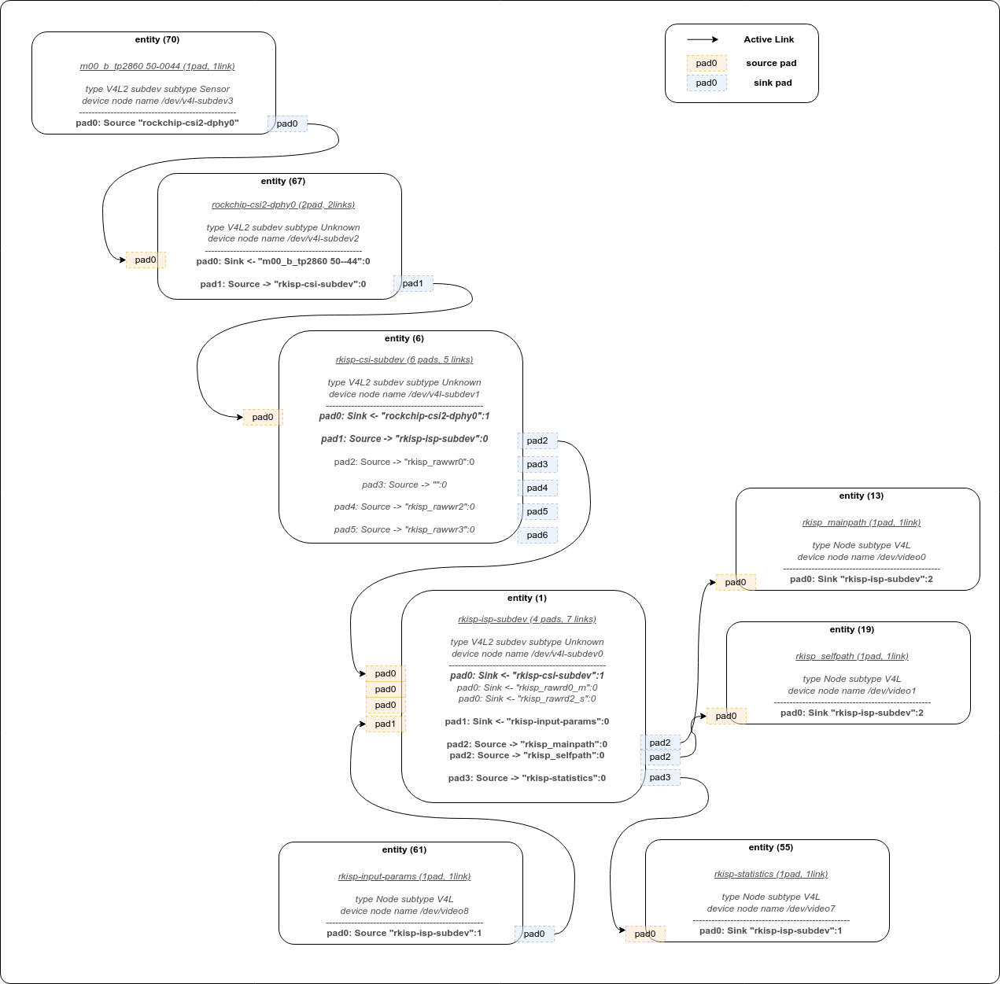

# V4L

## 0. V4L 관련 용어 

	- pad : pad는 entity 와 entity 간 연결 end-point 입니다.
	- link : 2개의 pad간 연결 인터페이스 입니다. data는 source pad에서 sink pad로 이동합니다.
	- media device : include/media/media-device.h 에 정의된 struct media_device 의 인스턴스 입니다. 
	- entities : include/media/media-entity.h 에 정의된 struct media_entity 의 인스턴스 입니다. v4l2_subdev 또는 video_device instances 인스턴스와 같은 구조의 higher-level structure입니다.


 - *media_device*

```c
struct media_device {
	struct device *dev;
	struct media_devnode *devnode;
	char model[32];
	char driver_name[32];
	char serial[40];
	char bus_info[32];
	u32 hw_revision;
	u64 topology_version;
	u32 id;
	struct ida entity_internal_idx;
	int entity_internal_idx_max;
	struct list_head entities;
	struct list_head interfaces;
	struct list_head pads;
	struct list_head links;
	struct list_head entity_notify;
	struct mutex graph_mutex;
	struct media_graph pm_count_walk;
	void *source_priv;
	int (*enable_source)(struct media_entity *entity, struct media_pipeline *pipe);
	void (*disable_source)(struct media_entity *entity);
	const struct media_device_ops *ops;
	struct mutex req_queue_mutex;
	atomic_t request_id;
};
```

 - *v4l2_subdev*

```c
struct v4l2_subdev {
#if defined(CONFIG_MEDIA_CONTROLLER)
	struct media_entity entity;
#endif
	struct list_head list;
	struct module *owner;
	bool owner_v4l2_dev;
	u32 flags;
	struct v4l2_device *v4l2_dev;
	const struct v4l2_subdev_ops *ops;
	const struct v4l2_subdev_internal_ops *internal_ops;
	struct v4l2_ctrl_handler *ctrl_handler;
	char name[V4L2_SUBDEV_NAME_SIZE];
	u32 grp_id;
	void *dev_priv;
	void *host_priv;
	struct video_device *devnode;
	struct device *dev;
	struct fwnode_handle *fwnode;
	struct list_head async_list;
	struct v4l2_async_subdev *asd;
	struct v4l2_async_notifier *notifier;
	struct v4l2_async_notifier *subdev_notifier;
	struct v4l2_subdev_platform_data *pdata;
};
```

 - *v4l2_subdev_ops*

```c
struct v4l2_subdev_ops  : Subdev operations
	|
	+-> struct v4l2_subdev_core_ops // core : defines core ops callbacks for subdevs
	|	+-> .s_power : puts subdevice in power saving mode(on==0) or normal operation mode(on==1)
	|	+-> .ioctl : called at the end of ioctl() syscall handler at the v4l2 core.used to provide support for private ioctls used on the driver
	|	+-> .compat_ioctl32 : called when a 32 bits applications used a 64 bits kernel, in order to fix data passed from/to userspace.in order to fix data passed from/to userspace.
	|
	+-> struct v4l2_subdev_video_ops // video : callbacks used when v4l device was opened in video mode
	|	+-> .s_stream :  used to notify the driver that a video stream will start or has stopped
	|	+-> .g_frame_interval : callback for VIDIOC_SUBDEV_G_FRAME_INTERVAL ioctl handler code
	|	+-> .g_mbus_config : get supported mediabus configurations
	|
	+-> struct v4l2_subdev_pad_ops // pad : v4l2-subdev pad level operations
		+-> .enum_mbus_code : callback for VIDIOC_SUBDEV_ENUM_MBUS_CODE ioctl handler code.
		+-> .enum_frame_size :  callback for VIDIOC_SUBDEV_ENUM_FRAME_SIZE ioctl hndler code.
		+-> .enum_frame_interval : callback for VIDIOC_SUBDIEV_ENUM_FRAME_INTERVAL() ioctl handler code.
		+-> .get_fmt : callback for VIDIOC_SUBDEV_G_FMT ioctl handler code.
		+-> .set_fmt : callback for VIDIOC_SUBDEV_S_FMT ioctl handler code.
```

   * v4l2_subdev_ops 
     + V4L2(Video for Linux 2) 표준에서 정의된 subdev의 작업을 나타내는 구조체.
     + callback function 을 기반으로 하여 sensor 드라이버의 logic을 제어.
	 + v4l2_subdev_ops 구조체에는 여러 개의 함수가 포함되어 있지만, 그중 필수로 구현해야 하는 함수는 아래와 같다.
	   = v4l2_subdev_call : subdev의 작업을 호출하는 함수.
       = v4l2_subdev_poll : subdev의 이벤트를 polling 하는 함수.
	   = v4l2_subdev_g_fmt : subdev의 포맷을 가져오는 함수.
	   = v4l2_subdev_s_fmt : subdev의 포맷을 설정하는 함수.
	   = v4l2_subdev_g_parm : subdev의 매개변수를 가져오는 함수.
	   = v4l2_subdev_s_parm : subdev의 매개변수를 설정하는 함수.

 - *v4l2_subdev_internal_ops*

```c
struct v4l2_subdev_internal_ops : v4l2 subdev internal ops
	|
	+-> .open  : called when the subdev device node is opened by an application.
	+-> .close : called when the subdev device node is closed.

```

 - *v4l2_ctrl_ops*

```c
struct v4l2_ctrl_ops : the control operations that the driver has to provide
	|
	+-> .g_volatile_ctrl : get a new value for this control, generally only relevant for volatile controls.
	+-> .try_ctrl : test whether the control's value is valid.
	+-> .s_ctrl : actually set the new control value.


```

 - *v4l2_ctrl_handler*

```c
struct v4l2_ctrl_handler
```

----- 

## 1. sensor driver development
 - sensor driver는 rockchip 플랫폼의 CIF, RKISP 모듈 독립적인 코드 입니다.
   * remote-endpoint에 의해 async적으로 등록되어 통신 합니다.
 - media controller 구조에서 sensor는 subdev로 사용되며 pad를 통해 cif, isp 또는 mipi_phy에 link 됩니다.
 - sensor driver 를 5 part로 분리하여 설명합니다.
   * power-on sequence (datasheet에 따른 vdd, reset, powerdown, clk, etc).
   * configure sensor register (센서의 resolution, format, etc).
   * v4l2_subdev_ops callback function.
   * v4l2 controller 추가(fps, exposure, gain, test pattern, etc).
   * .probe() function 와 media entity, v4l2 sub device 초기화.

 - sensor driver를 작성할 때, dts 에서 아래 field가 필요합니다.(일반적으로 사용됨)
   * clk, io mux
   * regulator and gpio (power-on sequence에 필요한..) 
   * cif 또는 isp 모듈과 link에 필요한 node
		[Documentation/devicetree/bindings/media/i2c/tp2860.txt](./attachment/V4L/tp2860.txt)  

 **Note** : driver를 작성한 후, documentation을 추가하여 개발 자료를 문서화 합니다.
		 

### 1.1 power-on sequence
 - sensor장치 마다 다른 power-on timing을 요구합니다.
   * mclk, vdd, reset 이후, power status 구성에 따라 i2c 통신과 데이터가 출력 됩니다.
 - datasheet를 통해 정보가 제공됩니다.  
   * ex. tp2860 모듈은 __tp2860_power_on()를 사용하여 sensor power-on 합니다.
     + tp2860 모듈을 특별히 power-on sequence가 없습니다. 
	 + Note : 1.2V -> 1.3V -> RSTB(on) (from Techpoint)

```c
static int __tp2860_power_on(struct tp2860 *tp2860)
{
	DEGMSG();
	int ret;
	u32 delay_us;
	struct device *dev = &tp2860->client->dev;

	if (!IS_ERR(tp2860->reset_gpio)) {
		gpiod_set_value_cansleep(tp2860->reset_gpio, 1);
		usleep_range(10 * 1000, 20 * 1000);
		gpiod_set_value_cansleep(tp2860->reset_gpio, 0);
	}
	usleep_range(10 * 1000, 20 * 1000);

	return 0;
}

static void __tp2860_power_off(struct tp2860 *tp2860)
{
	DEGMSG();

	if (!IS_ERR(tp2860->reset_gpio))
		gpiod_set_value_cansleep(tp2860->reset_gpio, 1);
}
```  
 - power-on 여부 확인하기. 
   * sensor 의 chip id를 read하여 성공적으로 power-up이 되었는지 여부를 확인 할 수 있습니다.

### 1.2 configure sensor register 
 - tp2860 센서를 구성하는 register 데이터를 datasheet를 참고하여 작성합니다.
 - tp2860 driver 코드에서 struct tp2860_mode에는 sensor mode에 따른 초기화 register(**reg_list**)가 정의 되어 있습니다. 
   * resolution, mbus, etc 
```c
/**
 * @brief sensor can support the information of each mode
 * The RKISP driver requires the use of use controls provided by the framework. 
 * The cameras sensor driver must implement the following control functions
 * .bus_fmt : sensor output format, reference MEDIA_BUS_FMT table
 * .width : the effective image width
 * .height : the effective image height
 * .max_fps : Image FPS, denominator/numerator is fps
 * *reg_list : Register list
 */
struct tp2860_mode {
	u32 width;
	u32 height;
	struct v4l2_fract max_fps;
	u32 field;
	u32 bus_fmt;
	const struct regval *reg_list;
};
```
  

### 1.3 v4l2_subdev_ops callback function
 - **v4l2_subdev_ops** callback function을 기반으로 하여 sensor 드라이버의 logic을 제어합니다.
   * callback function : include/media/v4l2-subdev.h 
   * v4l2_subdev_ops의 아래 callback function 을 구현해야 합니다.(최소한으로 필요한 callback function)
      + .open : upper layer에서 /dev/v4l2-subdev에 접근할 때 호출 됩니다. 
	  + .s_stream : stream on 및 stream off 포함하여 stream을 구성하여 이미지를 출력합니다. (일반적으로 여기에서 레지스터를 구성합니다.)
	  + .enum_mbus_code : 지원하는 mbus_code 를 반환 합니다.(ex. media bus format)
	  + .enum_frame_size : 지원하는 resolution 정보를 반환 합니다.  
	  + .get_fmt : 현재 sensor에서 선택된 format/size를 반환 합니다.
	  + .set_fmt : format/size 를 세팅 합니다.

		    
### 1.4 V4l2 controller 추가
 - fps, exposure, gain, test pattern 에 대한 설정은 v4l2 controller을 사용하여 control 합니다.
   * tp2860_initialize_controls() 에서 지원하고자 하는 controls을 등록 합니다.
   * struct v4l2_ctrl_ops 에 포함된  callback function(.s_ctrl)을 통해 control에 대한 기능을 구현합니다.

```c
/** 
 * v4l interface begin  
 */
/** 
 * @brief the control operations that the driver has to provide
 * .s_ctrl : actually set the new control value.
 */
static const struct v4l2_ctrl_ops tp2860_ctrl_ops = {
	.s_ctrl = tp2860_set_ctrl,
};

static int tp2860_initialize_controls(struct tp2860 *tp2860)
{
// ...
	tp2860->test_pattern = v4l2_ctrl_new_std_menu_items(handler, &tp2860_ctrl_ops, V4L2_CID_TEST_PATTERN,
		ARRAY_SIZE(tp2860_test_pattern_menu) - 1, 0, 0, tp2860_test_pattern_menu);
// ...
}

static int tp2860_set_ctrl(struct v4l2_ctrl *ctrl)
{
	DEGMSG();
// ...
	switch (ctrl->id) {
	case V4L2_CID_TEST_PATTERN:
		ret = tp2860_enable_test_pattern(tp2860, ctrl->val);
		break;
	default:
		dev_warn(&client->dev, "%s Unhandled id:0x%x, val:0x%x\n",
			 __func__, ctrl->id, ctrl->val);
		break;
	}
// ...
}
```

 * ref : https://www.kernel.org/doc/html/v4.10/media/kapi/v4l2-controls.html
 
### 1.5 .probe() function 와 media entity, v4l2 sub device 초기화 
 - probe function은 아래 기능을 담당합니다.
   * dts node 파싱. (ex. regulator, gpio, clk, etc) 
   * media entity, v4l2 sub device, v4l2 controller 정보를 등록.
     + v4l2_i2c_subdev_init() : v4l2 subdev를 등록합니다.(callback function 정보 등록)
	 + tp2860_initialize_controls() : v4l2 controls 를 초기화 합니다.
	 + media_entity_pads_init() : media entity를 등록합니다.
	   (ex. tp2860는 1개의 출력 pad가 있습니다.)
	 + v4l2_async_register_subdev_sensor_common() : sensor 를 async 로 등록한다는 정보를 선언(rockchip platform의 rkisp, cif는 sub device(sensor)와 async로 등록되어 동작함.) 


-----


## media-ctl / v4l2-ctl tools


 - **media-ctl**
   * /dev/mediaX와 같은 media 장치를 통해 동작하며, media framework의 fmt, size, link node를 구성하는데 사용합니다.
   * ex. rk3568 platform camera topology
     + [mipi_topology](./attachment/CAMERA/mipi_topology)
	 + sensor(tp2860)은 mipi dphy 모듈에 mipi bus를 통해 연결되어 있습니다.
	 + isp 모듈은 mipi data가 수집되면 isp 처리를 수행 합니다.
	 + mp, sp는 각각 출력되는 data의 format과 size를 처리합니다.
   * tp2860 의 cif, isp topologies에 대해 설명합니다.
   	
 
```bash
130|rk3568_edpp01:/ # media-ctl -p
Opening media device /dev/media0
Enumerating entities
Found 13 entities
Enumerating pads and links
Media controller API version 0.0.255

Media device information
------------------------
driver          rkisp-vir0
model           rkisp0
serial
bus info
hw revision     0x0
driver version  0.0.255

Device topology
- entity 1: rkisp-isp-subdev (4 pads, 7 links)
            type V4L2 subdev subtype Unknown
            device node name /dev/v4l-subdev0
        pad0: Sink
                [fmt:UYVY2X8/1920x1080
                 crop.bounds:(0,0)/1920x1080
                 crop:(0,0)/1920x1080]
                <- "rkisp-csi-subdev":1 [ENABLED]
                <- "rkisp_rawrd0_m":0 []
                <- "rkisp_rawrd2_s":0 []
        pad1: Sink
                <- "rkisp-input-params":0 [ENABLED]
        pad2: Source
                [fmt:YUYV2X8/1920x1080
                 crop.bounds:(0,0)/1920x1080
                 crop:(0,0)/1920x1080]
                -> "rkisp_mainpath":0 [ENABLED]
                -> "rkisp_selfpath":0 [ENABLED]
        pad3: Source
                -> "rkisp-statistics":0 [ENABLED]

- entity 6: rkisp-csi-subdev (6 pads, 5 links)
            type V4L2 subdev subtype Unknown
            device node name /dev/v4l-subdev1
        pad0: Sink
                [fmt:UYVY2X8/1920x1080]
                <- "rockchip-csi2-dphy0":1 [ENABLED]
        pad1: Source
                [fmt:UYVY2X8/1920x1080]
                -> "rkisp-isp-subdev":0 [ENABLED]
        pad2: Source
                [fmt:UYVY2X8/1920x1080]
                -> "rkisp_rawwr0":0 [ENABLED]
        pad3: Source
                [fmt:UYVY2X8/1920x1080]
        pad4: Source
                [fmt:UYVY2X8/1920x1080]
                -> "rkisp_rawwr2":0 [ENABLED]
        pad5: Source
                [fmt:UYVY2X8/1920x1080]
                -> "rkisp_rawwr3":0 [ENABLED]

- entity 13: rkisp_mainpath (1 pad, 1 link)
             type Node subtype V4L
             device node name /dev/video0
        pad0: Sink
                <- "rkisp-isp-subdev":2 [ENABLED]

- entity 19: rkisp_selfpath (1 pad, 1 link)
             type Node subtype V4L
             device node name /dev/video1
        pad0: Sink
                <- "rkisp-isp-subdev":2 [ENABLED]

- entity 25: rkisp_rawwr0 (1 pad, 1 link)
             type Node subtype V4L
             device node name /dev/video2
        pad0: Sink
                <- "rkisp-csi-subdev":2 [ENABLED]

- entity 31: rkisp_rawwr2 (1 pad, 1 link)
             type Node subtype V4L
             device node name /dev/video3
        pad0: Sink
                <- "rkisp-csi-subdev":4 [ENABLED]

- entity 37: rkisp_rawwr3 (1 pad, 1 link)
             type Node subtype V4L
             device node name /dev/video4
        pad0: Sink
                <- "rkisp-csi-subdev":5 [ENABLED]

- entity 43: rkisp_rawrd0_m (1 pad, 1 link)
             type Node subtype V4L
             device node name /dev/video5
        pad0: Source
                -> "rkisp-isp-subdev":0 []

- entity 49: rkisp_rawrd2_s (1 pad, 1 link)
             type Node subtype V4L
             device node name /dev/video6
        pad0: Source
                -> "rkisp-isp-subdev":0 []

- entity 55: rkisp-statistics (1 pad, 1 link)
             type Node subtype V4L
             device node name /dev/video7
        pad0: Sink
                <- "rkisp-isp-subdev":3 [ENABLED]

- entity 61: rkisp-input-params (1 pad, 1 link)
             type Node subtype V4L
             device node name /dev/video8
        pad0: Source
                -> "rkisp-isp-subdev":1 [ENABLED]

- entity 67: rockchip-csi2-dphy0 (2 pads, 2 links)
             type V4L2 subdev subtype Unknown
             device node name /dev/v4l-subdev2
        pad0: Sink
                [fmt:UYVY2X8/1920x1080]
                <- "m00_b_tp2860 5-0044":0 [ENABLED]
        pad1: Source
                [fmt:UYVY2X8/1920x1080]
                -> "rkisp-csi-subdev":0 [ENABLED]

- entity 70: m00_b_tp2860 5-0044 (1 pad, 1 link)
             type V4L2 subdev subtype Sensor
             device node name /dev/v4l-subdev3
        pad0: Source
                [fmt:UYVY2X8/1920x1080]
                -> "rockchip-csi2-dphy0":0 [ENABLED]


```


 - **v4l2-ctl**
   * /dev/videoX와 같은 비디오 장치를 통해 동작하며, set_fmt, reqbuf, qbuf, dqbuf, stream_on, stream_off와 같은 동작을 수행합니다.
   * set control (such as exposure, gain, etc)
   sensor driver에서 v4l control을 구현한 경우, v4l2-ctl을 통해 제어 가능합니다.

```bash

rk3568_poc:/ # v4l2-ctl -V -d /dev/video0
Format Video Capture Multiplanar:
        Width/Height      : 1920/1080
        Pixel Format      : 'NV12'
        Field             : None
        Number of planes  : 1
        Flags             :
        Colorspace        : Default
        Transfer Function : Default
        YCbCr Encoding    : Default
        Quantization      : Full Range
        Plane 0           :
           Bytes per Line : 1920
           Size Image     : 3110400
rk3568_poc:/ #

rk3568_poc:/ # v4l2-ctl -d /dev/video0 -l

Image Processing Controls

                 link_frequency 0x009f0901 (intmenu): min=0 max=0 default=0 value=0 flags=read-only
                     pixel_rate 0x009f0902 (int64)  : min=0 max=74250000 step=1 default=74250000 value=74250000 flags=read-only
                   test_pattern 0x009f0903 (menu)   : min=0 max=1 default=0 value=0
                   
rk3568_poc:/ # v4l2-ctl -d /dev/video0 --set-ctrl 'test_pattern=1'
``` 
	 
-----

## Test 

1. frame capture
```bash
# v4l2-ctl -d /dev/video0 --set-fmt-video=width=720,height=480,pixelformat=NV12 --stream-mmap=3 --stream-to=/data/local/tmp/out.yuv --stream-skip=9 --stream-count=1
## or
# v4l2-ctl --verbose -d /dev/video6 --set-fmt-video=width=720,height=480,pixelformat=NV12 --stream-mmap=3 --stream-to=/data/local/tmp/out.yuv --stream-skip=9 --stream-count=1 
<<<<<<<<<<
```

2. check capture data

```bash
ffplay out.yuv -f rawvideo -pixel_format nv12 -video_size 720x480

```

3. check camera parameter
```bash

1|rk3568_edpp01:/ # v4l2-ctl -d /dev/video6 -l

Image Processing Controls

                 link_frequency 0x009f0901 (intmenu): min=0 max=0 default=0 value=0 flags=read-only
                     pixel_rate 0x009f0902 (int64)  : min=0 max=18562500 step=1 default=18562500 value=18562500 flags=read-only
                   test_pattern 0x009f0903 (menu)   : min=0 max=1 default=0 value=0
rk3568_edpp01:/ # v4l2-ctl -d /dev/video5 -l

Image Processing Controls

                 link_frequency 0x009f0901 (intmenu): min=0 max=0 default=0 value=0 flags=read-only
                     pixel_rate 0x009f0902 (int64)  : min=0 max=18562500 step=1 default=18562500 value=18562500 flags=read-only
                   test_pattern 0x009f0903 (menu)   : min=0 max=1 default=0 value=0
```

4. setting camera parameter
 - exposure 변경.
```bash
v4l2-ctl -d /dev/video6 --set-ctrl exposure=3324
```

 - 이미지 밝기 변경(analogue_gain)
```bash
v4l2_ctl -d /dev/video6 --set-ctrl analogue_gain=240
```

 - test_pattern 변경
```bash
v4l2-ctl -d /dev/video6 --set-ctrl test_pattern=0
```


---- 

🖋 Note 
 * V4L 동작 flow
  1. camera device 를 open
  2. VIDEO_QUERYCAP을 통해 Capture가 가능한지(V4L2_VIDEO_CAPTURE), 스트리밍 방식인지(V4L2_CAP_STREAMING)을 구분
  3. VIDEO_S_FMT를 통해 가지고 올 카메라 데이터의 포맷을 결정.(버퍼 타입, 해상도, 컬러스페이스 등)
  4. VIDEO_REQBUFS를 통해 버퍼를 결정(버퍼의 개수, 버퍼 타입, read, mmap, user pointer 방식 선택)
  5. VIDEO_QUERYBUF를 통해 원하는 버퍼의 인덱스를 넘겨주고 그 버퍼의 오프셋 정보를 가지고 옴. 
    * 이 정보를 이용해 mmap()을 통해 버퍼를 유저공간에 맵핑함. 
	* 버퍼에 할당하는 공간만큼 메모리를 할당받아서(calloc(req.count, sizeof(*buffers)))각각의 버퍼에 대해 따로 mmap()을 통해 공간을 할당함. 
	* 즉 버퍼가 4개라면 0번 버퍼의 정보를 얻기 위해 VIDIOC_QUERYBUF, 인덱스는 0, ioctl을 실행하고 그결과 넘어온 버퍼의 offset값에 따라 mmap을 통해 그 버퍼에 대한 공간을 매핑. 1번, 2번, 3번에 대해서도 똑같은 작업을 반복함. 
	* VIDIOC_QUERYBUF와 mmap()이 각각 4번 씩 실행. 
  6. VIDIOC_QBUF을 통해 프레임을 달라고 요청.
  7. VIDIOC_STREAMMON을 통해 스트림을 켬.
  8. polling을 통해 새 프레임이 들어오기를 기다림.
  9. 새 프레임이 들어오면 DQBUF을 통해 새로 들어온 프레임의 인덱스를 가져옴.
  10. 가져온 인덱스를 통해 mmap된 메모리 공간에서 이미지 데이터를 가져옴.
  11. 다시 QBUF를 통해 프레임을 달라고 요청함. 이 작업을 반복해서 데이터를 계쏙적으로 가지고 감.
  12. VIDIOC_STREAMOFF를 통해 스트림을 끔. munmap을 통해 메모리를 해제.
  13. camera device 를 close

  * query_dv_timings에서 dv 는 *digital video*를 의미함.
    > query_dv_timings는 비디오 카메라의 디지털 비디오 타이밍을 쿼리하는 함수. (비디오 카메라의 이미지 width, height, freq, 등의 정보를 반환함.)
  * v4l2_bt_timings 구조체에서 bt는 "broadcast television*을 의미.
