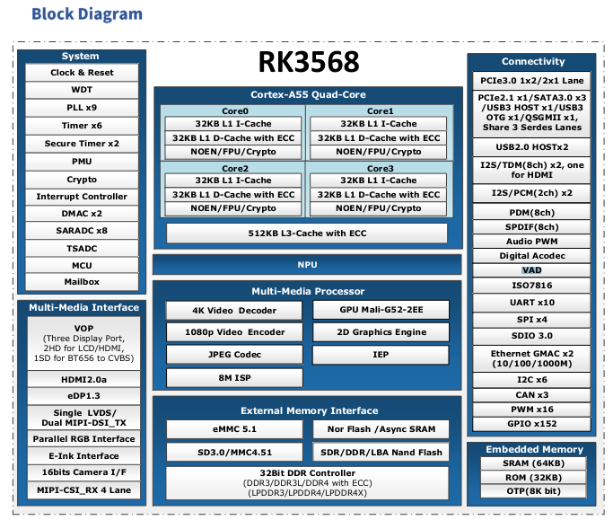
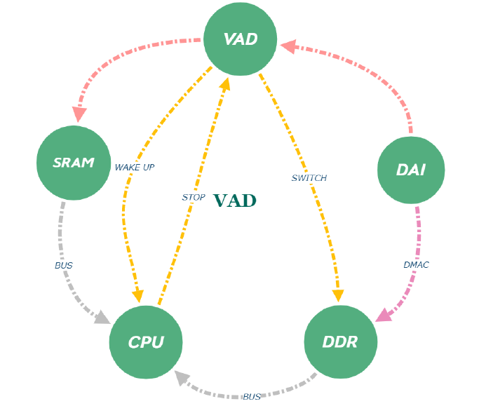

VAD 
=====

> VAD : Voice Activity Detect 
  
  
  
 SoC가 저전력모드일때, 아날로그 마이크 및 i2s 디지털 마이크 또는 pdm 마이크를 통해 입력되는 음성 데이터가   
 설정된 임계값을 초과하는 경우, VAD는 SoC를 깨우고 데이터를 처리 하는 기술.  
  
 
 
 
 

  
[Overview](#overview)
  
## Overview
  
 - VAD data flow  
  
  
  
 1. 1. 시스템이 절전 모드일때, DAI->VAD->SRAM 은 활성화 되어, VAD는 DAI를 통해 데이터, 필터, 노이즈를 수신.  
 2. VAD가 미리 설정된 임계값을 초과하는 오디오 데이터가 감지되면 CPU WAKEUP  
 3. 깨어난 후, 데이터를 분석 및 처리, 키워드 감지 등을 수행.   

